# 🤖 From First AI Idea to Agentic AI: How We Got Here and What's Next

> AI started as a simple idea — machines that can think. Step by step, one limit at a time, that idea grew into Machine Learning, Deep Learning, LLMs, and now **Agentic AI** — systems that plan, act, and finish real work on their own. This guide walks you through that whole journey, and where it's headed next.

---

## 🗺️ What You'll Cover

| # | Topic | Level |
|---|---|---|
| 1 | What is AI and why it was made | Beginner |
| 2 | AI history from the 1950s to 2025 | Beginner |
| 3 | Why each field was born — what problem made the next field necessary | Beginner to Intermediate |
| 4 | Full chain: ML → DL → Transformers → Foundation Models → GenAI → LLMs → RAG → Agents → Agentic AI | Intermediate |
| 5 | Agentic AI complete deep dive | Intermediate to Advanced |
| 6 | AI future, advanced fields, and predictions | Advanced |

---

## 📚 Table of Contents

1. [🧠 What Is Artificial Intelligence?](#-what-is-artificial-intelligence)
2. [🤔 Why Was AI Created?](#-why-was-ai-created)
3. [📜 A Brief History of AI](#-a-brief-history-of-ai)
4. [🔗 The Evolution Chain — How Each Field Led to the Next](#-the-evolution-chain--how-each-field-led-to-the-next)
5. [🗺️ The Full Evolution Diagram](#️-the-full-evolution-diagram)
6. [🌳 Major AI Fields at a Glance](#-major-ai-fields-at-a-glance)
7. [🌍 AI in the Real World](#-ai-in-the-real-world)
8. [📈 Machine Learning](#-machine-learning)
9. [🧬 Deep Learning & Neural Networks](#-deep-learning--neural-networks)
10. [⚡ Transformers](#-transformers)
11. [🏗️ Foundation Models](#️-foundation-models)
12. [✨ Generative AI](#-generative-ai)
13. [💬 Large Language Models](#-large-language-models)
14. [📚 Retrieval-Augmented Generation (RAG)](#-retrieval-augmented-generation-rag)
15. [🤖 AI Agents](#-ai-agents)
16. [🚀 Agentic AI — Complete Deep Dive](#-agentic-ai--complete-deep-dive)
17. [✅ Benefits & ⚠️ Risks of AI](#-benefits--️-risks-of-ai)
18. [📈 Current State of AI (2026)](#-current-state-of-ai-2026)
19. [🔮 Future of AI](#-future-of-ai)
20. [🧠 ANI vs AGI vs ASI](#-ani-vs-agi-vs-asi)
21. [🚀 Advanced & Emerging AI Fields](#-advanced--emerging-ai-fields)
22. [📋 Summary — The AI Story in One Page](#-summary--the-ai-story-in-one-page)
23. [❓ Practice Questions](#-practice-questions)

---

## 🧠 What Is Artificial Intelligence?

### 🟢 Simple Definition
AI is the science of building machines and software that can do things that normally need human thinking — recognizing images, understanding language, making decisions, or learning from experience.

### 🔵 Practical Definition
AI systems take in data — text, images, numbers, sound — find patterns in it, and use those patterns to predict, create, or act. Often without anyone telling them the exact rule for every case.

### 🔬 Technical Definition
📌 Computer science defines AI as the study of building agents that sense their environment and take actions to reach a goal.

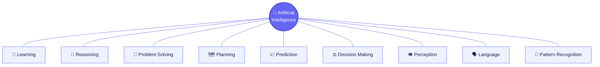

💭 There's no single agreed definition of "intelligence" — so there's no single agreed definition of "AI" either. What counted as AI in the 1960s (simple rule-based programs) is now just called "software." This is called the **AI effect** — once a skill becomes normal, people stop calling it AI.

**📖 Read More:** [Stanford CS221 — Intro to AI](https://stanford-cs221.github.io/) · [Britannica — Artificial Intelligence](https://www.britannica.com/technology/artificial-intelligence)

<a href="#-table-of-contents">⬆ Back to top</a>

---

## 🤔 Why Was AI Created?

### 🎯 Purpose
Old machines automated **physical** work. AI research began because people wanted to automate work that needed **thinking**, not lifting.

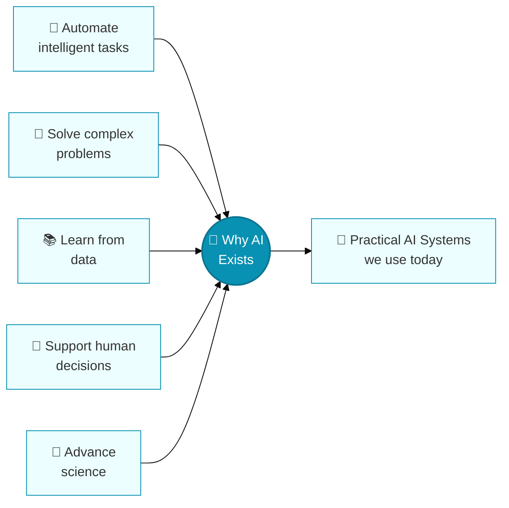

### Human Intelligence vs Artificial Intelligence

| Aspect | Human Intelligence | Artificial Intelligence |
|---|---|---|
| Origin | Evolved over millions of years | Built by engineers, trained on data |
| Learning | Continuous, whole-body, general | Learns from data, still narrower today |
| Consciousness | Present (we experience it) | 💭 Not established |
| Generalization | Wide, transfers across areas | Getting better, but still narrow |
| Energy use | About 20 watts (the brain) | 📊 Large models use a lot of compute |
| Speed at scale | Limited by biology | Can process huge amounts of data fast |

<a href="#-table-of-contents">⬆ Back to top</a>

---

## 📜 A Brief History of AI

📌 AI didn't just appear in 1956. It rests on years of work in logic, math, and computing. What matters most for this guide isn't every date — it's the chain of **problem → new idea → new limit → next idea**.

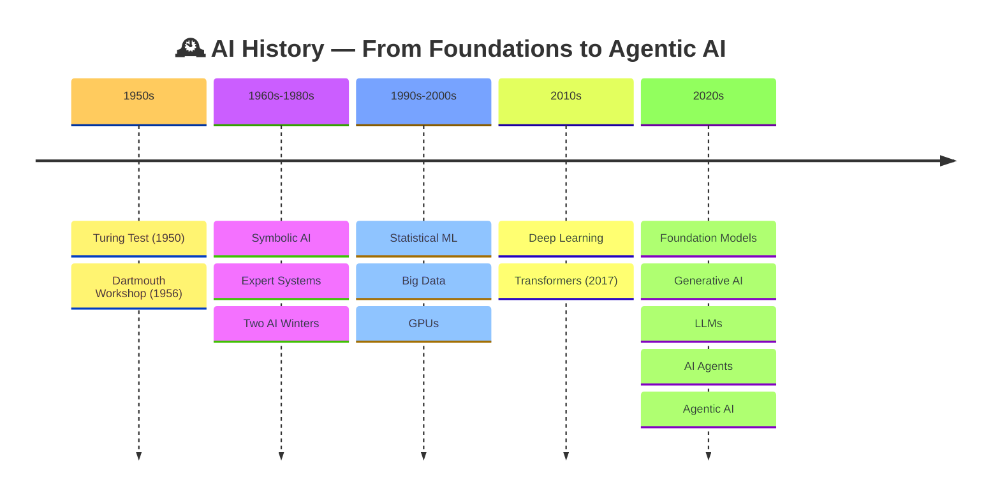

### The story, told through problems solved

| Era | The Problem | The Response |
|---|---|---|
| 1960s | Machines had no way to reason at all | **Symbolic AI** — represent knowledge as logical rules |
| 1970s-80s | Rules didn't scale; hype outran results | Funding cuts → **AI Winters** |
| 1990s | Hand-written rules couldn't cover every case | **Statistical Machine Learning** |
| 2000s | ML needed more data and compute than existed | The internet supplied data; GPUs supplied speed |
| 2010s | ML still needed hand-designed "features" | **Deep Learning** — networks learn features on their own |
| 2017 | Old text models read one word at a time | **Transformers** — attention reads it all at once |
| 2020s | Training a new model per task cost too much | **Foundation Models** — one model, many tasks |
| 2020s | Models could sort things, not create them | **Generative AI**, then **LLMs**, **RAG**, **Agents**, and **Agentic AI** |

📌 **Why the AI Winters happened:** results were oversold compared to what the tech could actually do, compute and data weren't ready yet, and funding dried up once expectations weren't met. It's still a useful lesson when judging AI hype today.

**A few people who shaped this path:** Alan Turing gave AI its theory of computing and its first test for machine intelligence. John McCarthy coined the term "Artificial Intelligence" and helped organize the 1956 Dartmouth workshop that named the field. Geoffrey Hinton, Yann LeCun, and Yoshua Bengio built the backpropagation and neural network methods that power today's deep learning boom. None of them invented AI alone — the field grew from many people solving one limit at a time.

**📖 Read More:** [Dartmouth Proposal, 1955 (PDF)](http://jmc.stanford.edu/articles/dartmouth/dartmouth.pdf) · [AI Winter — Britannica](https://www.britannica.com/technology/artificial-intelligence/AI-winter)

<a href="#-table-of-contents">⬆ Back to top</a>

---

## 🔗 The Evolution Chain — How Each Field Led to the Next

This is the part most guides skip — **why** did AI move from one stage to the next? Every stage exists because the one before it hit a specific wall.

**Machine Learning → Deep Learning**
Early ML needed a human to pick which "features" mattered (like "pointy ears" for a cat). That doesn't work for raw pixels, audio, or text. **Deep Learning** uses many-layered networks that find useful features on their own.

**Deep Learning → Transformers**
Early deep learning for text used RNNs, reading one word at a time — slow, and bad at linking words that are far apart. **Transformers** (2017) fixed this with **self-attention**, letting every word look at every other word at once.

**Transformers → Foundation Models**
Training a brand-new model for every single task cost too much. **Foundation Models** train one large model once, then reuse it for many tasks.

**Foundation Models → Generative AI**
Foundation models mostly answered "what is this?" There was demand for a different question: "can you make one?" **Generative AI** filled that gap.

**Generative AI → LLMs**
Generative AI is broad — images, music, video. There was a specific need for fluent, flexible **language** ability in one system. That focus is the **LLM**.

**LLMs → RAG**
An LLM's knowledge is frozen at its training date and it can't see private data — this causes hallucinations. **RAG** lets a model fetch real, current, or private documents at answer time.

**RAG / LLMs → AI Agents**
Even a fully informed LLM gives only **one** answer per turn. Many real tasks need actual multi-step *action*. **AI Agents** combine an LLM with tools, memory, and a planning loop.

**AI Agents → Agentic AI**
One agent doing one task still needs a human to chain multiple runs together for anything big. **Agentic AI** is the wider paradigm that automates that chaining itself — whole multi-step, sometimes multi-agent, workflows that self-correct as they go.

> 💡 **The pattern to notice:** almost every jump in AI history follows the same shape — *a method hits a specific wall → a new method removes exactly that wall → and usually creates a new wall the next stage solves.*

<a href="#-table-of-contents">⬆ Back to top</a>

---

## 🗺️ The Full Evolution Diagram

```mermaid
%%{init: {'theme':'base', 'themeVariables': {'primaryColor':'#f5f3ff','primaryBorderColor':'#7c3aed','lineColor':'#7c3aed','fontSize':'13px'}}}%%
flowchart TD
    A["🤖 AI<br/><i>Machines that think</i>"]
    A -->|"❓ Can't hand-write<br/>a rule for everything"| B["📈 Machine Learning<br/><i>Learn rules from data</i>"]
    B -->|"❓ Humans must hand-design<br/>features manually"| C["🧬 Deep Learning<br/><i>Learn features automatically</i>"]
    C -->|"❓ RNNs are slow & lose<br/>long-range context"| D["⚡ Transformers<br/><i>Attention sees the whole sequence at once</i>"]
    D -->|"❓ Training one model<br/>per task is too costly"| E["🏗️ Foundation Models<br/><i>One broad model, many tasks</i>"]
    E -->|"❓ Models could classify,<br/>not create"| F["✨ Generative AI<br/><i>Produce new content</i>"]
    F -->|"❓ Needed fluent,<br/>general-purpose language"| G["💬 Large Language Models<br/><i>Language-specialized foundation models</i>"]
    G -->|"❓ Fixed training data,<br/>no live/private knowledge"| H["📚 RAG<br/><i>Ground answers in real, current info</i>"]
    H -->|"❓ One answer isn't enough —<br/>need real action"| I["🤖 AI Agents<br/><i>Model + tools + memory pursue a goal</i>"]
    I -->|"❓ Whole workflows, not single<br/>tasks, need automating"| J(("🚀 Agentic AI<br/><i>Autonomous, goal-directed, iterative systems</i>"))

    style A fill:#7c3aed,color:#fff,stroke:#5b21b6,stroke-width:3px
    style J fill:#f59e0b,color:#111,stroke:#b45309,stroke-width:3px
    style B fill:#ddd6fe,color:#3730a3,stroke:#7c3aed
    style C fill:#ddd6fe,color:#3730a3,stroke:#7c3aed
    style D fill:#ddd6fe,color:#3730a3,stroke:#7c3aed
    style E fill:#ddd6fe,color:#3730a3,stroke:#7c3aed
    style F fill:#ddd6fe,color:#3730a3,stroke:#7c3aed
    style G fill:#ddd6fe,color:#3730a3,stroke:#7c3aed
    style H fill:#ddd6fe,color:#3730a3,stroke:#7c3aed
    style I fill:#ddd6fe,color:#3730a3,stroke:#7c3aed
```

> 💡 If Mermaid doesn't render in your viewer, paste this code into [mermaid.live](https://mermaid.live) for a zoomable, exportable diagram.

<a href="#-table-of-contents">⬆ Back to top</a>

---

## 🌳 Major AI Fields at a Glance

| Field | What It Is | 🎯 Why It Exists |
|---|---|---|
| 📈 Machine Learning | Learns patterns from data | You can't hand-write a rule for every situation |
| 🧬 Deep Learning | Multi-layer neural networks | Lets the model discover features on its own |
| ⚡ Transformers | Attention-based architecture | Reads whole sequences at once, not word-by-word |
| 🏗️ Foundation Models | Huge, reusable, pretrained models | One model, many downstream tasks |
| ✨ Generative AI | Creates new content | The world wanted machines that *make* things, not just sort them |
| 💬 LLMs | Language-specialized foundation models | Fluent, general-purpose language ability |
| 👁️ Computer Vision | Reads and understands images and video | Most real-world information is visual |
| 🗣️ NLP | Understands and generates human language | Language is messy and unstructured |
| 🎙️ Speech & Audio AI | Converts speech to text and text to speech | Voice is the most natural way people communicate |
| 🎮 Reinforcement Learning | Learns through trial, error, and reward | Many problems have no labeled "correct answer" |
| 🦾 Robotics | AI paired with a physical machine | Some tasks need a body, not just software |
| 🌐 Multimodal AI | Understands text, image, audio, and video together | Real understanding rarely comes from one data type alone |
| 📚 RAG | Connects a model to outside knowledge | Fixes the "fixed training cutoff" problem |
| 🤖 AI Agents | Model + tools + memory chasing a goal | Some tasks need real, multi-step action |
| 🚀 Agentic AI | The bigger paradigm of autonomous, goal-driven systems | Whole workflows need automating, not just single answers |
| 🛡️ AI Safety | Keeps systems reliable and aligned | As autonomy grows, mistakes get costlier |
| 🔍 Explainable AI | Makes model decisions understandable | Trust, debugging, and regulation all need to know "why" |

<a href="#-table-of-contents">⬆ Back to top</a>

---

## 🌍 AI in the Real World

| Domain | Use Case | Benefit |
|---|---|---|
| 🏥 Healthcare | Diagnostic support, medical imaging | Faster, more consistent detection |
| 💻 Software Development | Code generation, review, agentic coding | Faster development cycles |
| 💰 Finance | Fraud detection, algorithmic trading | Faster response to fraud |
| 🏭 Manufacturing & Robotics | Predictive maintenance, quality checks | Less downtime, less waste |
| 🎓 Education | Personalized tutoring, automated grading | Learning paced to the student |
| 🚗 Transportation | Driver assistance, route optimization | Improved safety and efficiency |

<a href="#-table-of-contents">⬆ Back to top</a>

---

## 📈 Machine Learning

**What:** Software that gets better at a task by learning from data, instead of following hand-written rules.

**🎯 Purpose:** You can't hand-write a rule for every real-world case — ML lets a system *find* the rules itself from examples.

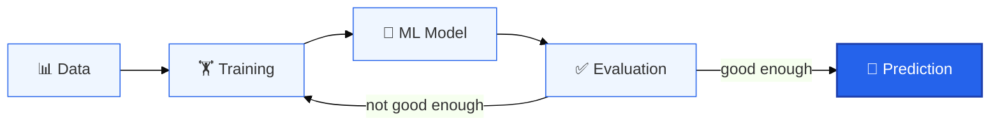

### Types of Machine Learning
- **Supervised Learning** — learns from labeled examples. *E.g., predicting house prices.*
- **Unsupervised Learning** — finds structure in unlabeled data. *E.g., grouping customers into segments.*
- **Self-Supervised Learning** — creates its own training signal from raw data (like guessing a hidden word). This is how most LLMs are pretrained.
- **Reinforcement Learning** — learns from rewards and penalties (see the glance table above).

### Key Vocabulary
`Dataset` · `Model` · `Training` · `Parameters` · `Loss` · `Evaluation` · `Generalization`

**⚠️ The limitation that led to the next field:** ML needed humans to manually pick which features of the data mattered — this doesn't scale to raw pixels, audio, or free-form text. → **Deep Learning**

**📖 Read More:** [Google ML Crash Course](https://developers.google.com/machine-learning/crash-course) · [Scikit-learn Docs](https://scikit-learn.org/stable/tutorial/index.html)

<a href="#-table-of-contents">⬆ Back to top</a>

---

## 🧬 Deep Learning & Neural Networks

**What:** A type of ML that uses neural networks with many layers to automatically learn complex patterns straight from raw data.

**🎯 Purpose:** Deep Learning exists so the model finds useful features **itself**, straight from raw pixels, audio, or text.

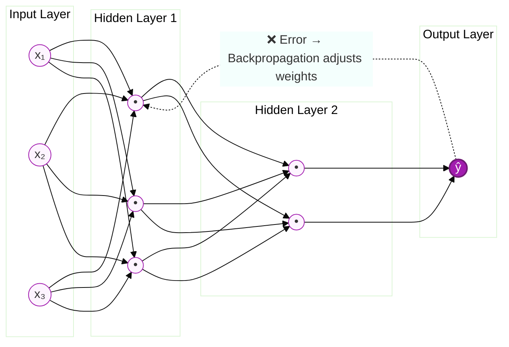

### Key Vocabulary
`Layers` · `Weights` · `Bias` · `Activation Function` · `Backpropagation`

### Major Architectures
- **CNN** — built for grid-like data (images)
- **RNN / LSTM** — built for sequences (text, time series)
- **Transformer** — the architecture behind most modern large models (next section)
- **Diffusion Models** — generate images/audio by reversing a noise-adding process

**⚠️ The limitation that led to the next field:** Early deep learning for text used RNNs, which read one word at a time — slow, and bad at connecting words far apart in a sentence. → **Transformers**

**📖 Read More:** [3Blue1Brown — Neural Networks](https://www.3blue1brown.com/topics/neural-networks) · [MIT 6.S191](http://introtodeeplearning.com/)

<a href="#-table-of-contents">⬆ Back to top</a>

---

## ⚡ Transformers

**What:** A neural network design (from 2017's *"Attention Is All You Need"*) that reads an entire sequence at once using **attention**, instead of one piece at a time.

**🎯 Purpose:** Transformers let a model look at **every word in relation to every other word at the same time** — training gets faster and long-range links get much easier to catch.

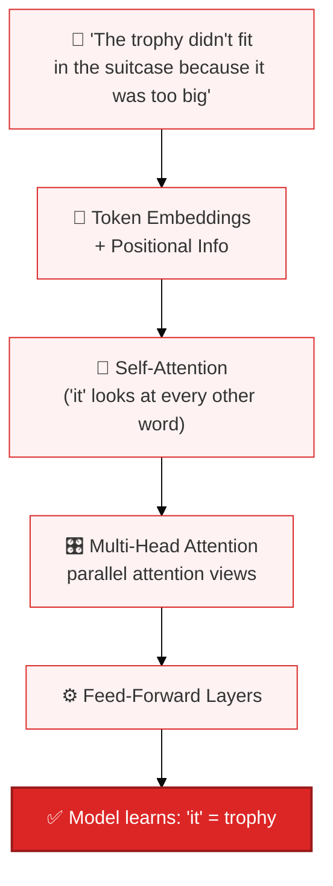

📌 The Transformer became the base for nearly every major modern AI system: LLMs, image and video generators, multimodal models, and the models behind today's AI Agents.

**⚠️ The limitation that led to the next field:** Even with a great architecture, training a brand-new model from scratch for every task was slow and expensive. → **Foundation Models**

**📖 Read More:** [Attention Is All You Need (arXiv)](https://arxiv.org/abs/1706.03762) · [The Illustrated Transformer](https://jalammar.github.io/illustrated-transformer/)

<a href="#-table-of-contents">⬆ Back to top</a>

---

## 🏗️ Foundation Models

**What:** A very large model trained on broad data that can be adapted to many tasks, instead of being built from scratch each time.

**🎯 Purpose:** Training a huge model from zero for every task would cost too much. Foundation Models let one broadly capable model be trained once and reused everywhere.

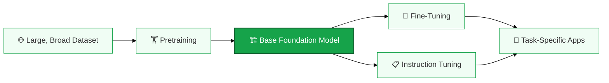

### Key Vocabulary
`Pretraining` · `Transfer Learning` · `Fine-Tuning` · `Instruction Tuning` · `Inference`

**⚠️ The limitation that led to the next field:** Foundation models were mostly used to classify — "what is this?" There was growing demand for models that could answer "can you make one?" → **Generative AI**

**📖 Read More:** [Stanford CRFM — On Foundation Models](https://crfm.stanford.edu/report.html) · [Hugging Face — What Is a Foundation Model?](https://huggingface.co/blog/some-datasets-are-more-equal-than-others)

<a href="#-table-of-contents">⬆ Back to top</a>

---

## ✨ Generative AI

**What:** AI that **creates new content** — text, images, audio, video, or code — instead of just sorting or predicting a label.

**🎯 Purpose:** Fills the gap between analyzing existing content and producing brand-new content.

### Two Main Families
- **Autoregressive models** generate step by step, guessing the next piece based on everything made so far — the base for most text and code generation.
- **Diffusion models** generate content by starting from random noise and slowly refining it into something clear.

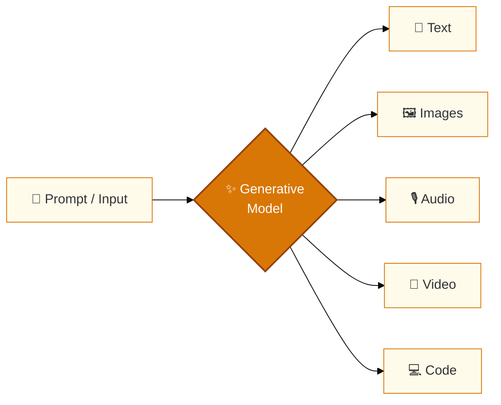

**⚠️ The limitation that led to the next field:** Generative AI is broad — images, music, video. There was a specific need for a system that's fluent and flexible in **language** — one system instead of many narrow ones. → **LLMs**

**📖 Read More:** [Google Research — Generative AI Overview](https://research.google/research-areas/generative-ai/) · [Hugging Face Diffusion Course](https://huggingface.co/learn/diffusion-course/unit0/1)

<a href="#-table-of-contents">⬆ Back to top</a>

---

## 💬 Large Language Models

**What:** A foundation model built to understand and generate human language, trained on huge amounts of text.

**🎯 Purpose:** Gives machines **fluent, general-purpose** language skill instead of many narrow single-task models.

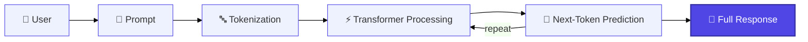

### Key Vocabulary
- **Tokens / Tokenization** — text broken into small chunks before processing
- **Embeddings** — tokens turned into numbers that carry meaning
- **Context Window** — the max amount of text the model can look at once
- **Hallucinations** — 📌 a known limitation where a model states something false but confident

**⚠️ The limitation that led to the next field:** An LLM's knowledge is frozen at its training cutoff and can't see private or live data — this causes hallucinations. → **RAG**

**📖 Read More:** [Hugging Face NLP Course](https://huggingface.co/learn/nlp-course) · [Andrej Karpathy — "Let's build GPT"](https://www.youtube.com/watch?v=kCc8FmEb1nY)

<a href="#-table-of-contents">⬆ Back to top</a>

---

## 📚 Retrieval-Augmented Generation (RAG)

**What:** Connects a language model to an **outside knowledge source** at question time, so the answer is grounded in retrieved facts instead of only memorized training data.

**🎯 Purpose:** LLMs have a fixed training cutoff — RAG lets a system pull in **current, specific, or private information** on demand, cutting down hallucinations.

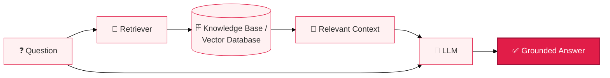

### Key Vocabulary
`Embeddings` · `Vector Database` · `Semantic Search` · `Retrieval` · `Context`

**⚠️ The limitation that led to the next field:** Even a perfectly informed LLM still gives only **one** answer per turn. Many real tasks need actual multi-step *action* — searching, comparing, calling an API, confirming. → **AI Agents**

**📖 Read More:** [RAG — original paper (arXiv)](https://arxiv.org/abs/2005.11401) · [Pinecone — RAG Learning Center](https://www.pinecone.io/learn/retrieval-augmented-generation/)

<a href="#-table-of-contents">⬆ Back to top</a>

---

## 🤖 AI Agents

**What:** A system that pairs a model (usually an LLM) with **tools, memory, and planning** to chase a goal across multiple steps — instead of answering one prompt once.

**🎯 Purpose:** Some tasks can't be solved with a single answer — they need real action. AI Agents carry a goal all the way to done, instead of just describing how someone else might do it.

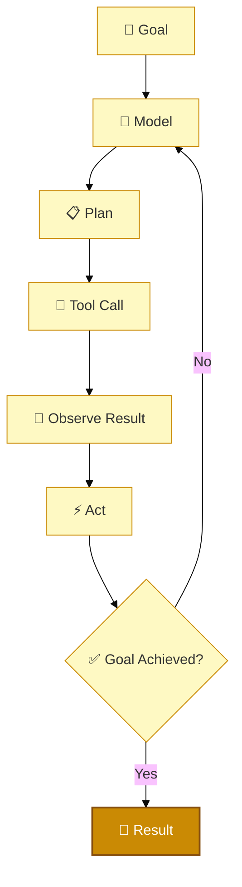

### Key Vocabulary
`Goal` · `Tools` · `Tool Calling` · `Memory` · `Planning` · `Observation` · `Feedback Loop`

### 🌍 Real-World Example
Instead of just answering "What's the weather this weekend?", an agent asked to "plan my outdoor event" might check the weather, check a calendar, search for venues, and propose a schedule — using several tools across several steps.

**⚠️ The limitation that led to the next field:** One agent handling one task alone still needs a human to manually chain multiple agent runs together for anything complex. → **Agentic AI**

**📖 Read More:** [Anthropic — Building Effective Agents](https://www.anthropic.com/research/building-effective-agents) · [LangChain — Agents Docs](https://python.langchain.com/docs/concepts/agents/)

<a href="#-table-of-contents">⬆ Back to top</a>

---

## 🚀 Agentic AI — Complete Deep Dive

> This is the **most important section** of this guide. Everything above — AI, ML, Deep Learning, Transformers, Foundation Models, Generative AI, LLMs, RAG, and AI Agents — builds up to this point.

### 19.1 What Is Agentic AI?

**Agentic AI** is the broad name for AI systems built to chase goals through **autonomous or semi-autonomous planning, decision-making, tool use, environment interaction, and repeated action** — instead of giving one single-shot answer.

💭 **Honesty note:** "Agentic AI" doesn't have one single, precise, industry-wide definition yet. What follows is how the term is most commonly used.

- 🟢 **Simple definition:** AI that doesn't just answer once — it takes a goal, breaks it into steps, uses tools, checks its own progress, and keeps working until the goal is done (often with a human able to step in along the way).
- 🔵 **Practical definition:** Built from an LLM (or several) that keeps reasoning about a goal, decides the next action, calls tools, watches the result, and adjusts its plan — looping across many steps, sometimes with several cooperating agents.
- 🔬 **Technical definition:** 📌 Combines a reasoning model, a goal, a planning method, memory, tool-calling, an environment to act in, a way to check results, and guardrails or human oversight.

### 19.2 🎯 Why Agentic AI Exists

See [Section 5](#-the-evolution-chain--how-each-field-led-to-the-next) for the full chain — in short, RAG made LLMs *informed*, AI Agents made them *capable of action*, but one agent doing one task still means a human has to manually string runs together. **Agentic AI automates that chaining itself** — long, changing, multi-step goals with less hand-holding, while still allowing human oversight where it matters.

### 19.3 AI Agent vs Agentic AI — Don't Mix These Up

This is the single most confused pair of terms in this whole space. Here's the simple way to remember it:

- **AI Agent = one thing.** It's a single system: one LLM, its tools, its memory, working through one goal.
- **Agentic AI = the bigger idea.** It's the design pattern or philosophy behind building systems that plan, act, and self-correct — whether that's one agent or ten agents working together.

Think of it like this: a **single car** is like an AI Agent. **Traffic engineering** — the whole discipline of how vehicles move, coordinate, and reach destinations — is like Agentic AI. One is a thing. The other is the system of ideas behind many things like it.

| System | Input | Behavior | Autonomy | Tools | Example |
|---|---|---|---|---|---|
| Traditional AI (classifier) | Fixed input | One fixed-format output | None | No | Spam filter |
| Generative AI (single-turn) | A prompt | Makes one piece of content | None | Usually no | "Write me a poem" |
| **AI Agent** | A goal/task | Plans + calls tools across steps | Low–Medium | Yes | An assistant that books a reservation |
| **Agentic AI** | A complex, long-running goal | Plans, acts, watches, adjusts — maybe with several agents | Medium–High, kept in check by guardrails | Yes, heavily | A system that researches, drafts, and revises a report |

> Is every AI Agent "Agentic AI"? Not really — a very simple, single-tool agent with barely any independent decisions is only mildly agentic. The term describes a **spectrum**, not a strict box.

### 19.4 🏗️ Agentic AI Architecture

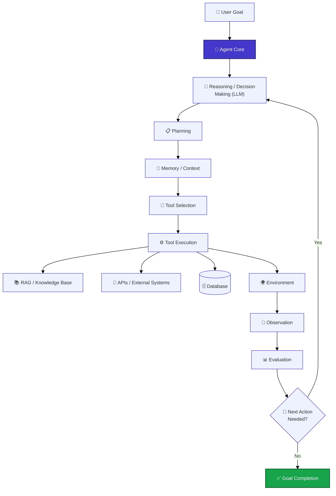

**🧩 Core parts:** Model (reasoning engine) · Goal · Planning · Tools · Memory · RAG · Observation · Feedback Loop · Environment · Guardrails.

📌 **Important:** the LLM itself does **not** run tools directly — a surrounding agent framework runs the tool and hands the result back to the model for its next reasoning step.

### 19.5 🔄 The Agentic Loop

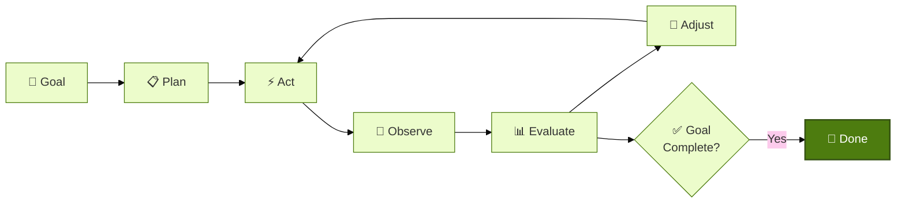

📌 This loop is what separates Agentic AI from a single-turn chatbot: the system keeps checking its own work against the goal and correcting course, instead of producing one final, irreversible output.

### 🌍 Real Example: Agentic AI Step by Step

Let's make this real. Goal: **"Research the top 5 AI agent frameworks and write a comparison report."**

1. Agent reads the goal and plans what to do first
2. Agent calls a web search tool to find frameworks
3. Agent gets results and picks the most useful ones
4. Agent starts writing the comparison
5. Agent notices some info is missing or outdated
6. Agent searches again for the missing info
7. Agent updates the report with the new info
8. Agent does a final check and delivers the report

This is the whole idea of Agentic AI in one small example: a goal goes in, and the system plans, acts, checks itself, and adjusts — without a human doing each step by hand.

### 19.6 Planning & Reasoning

- **Reasoning** — the model thinking through a problem, often working out steps before it commits to an action.
- **Planning** — turning a goal into an ordered list of steps, which can change as new information shows up.

### 19.7 🔧 Tool Calling & Function Calling

**Tool calling** lets a model ask for a specific outside function to run, with specific inputs, and get the result back as text it can reason over.

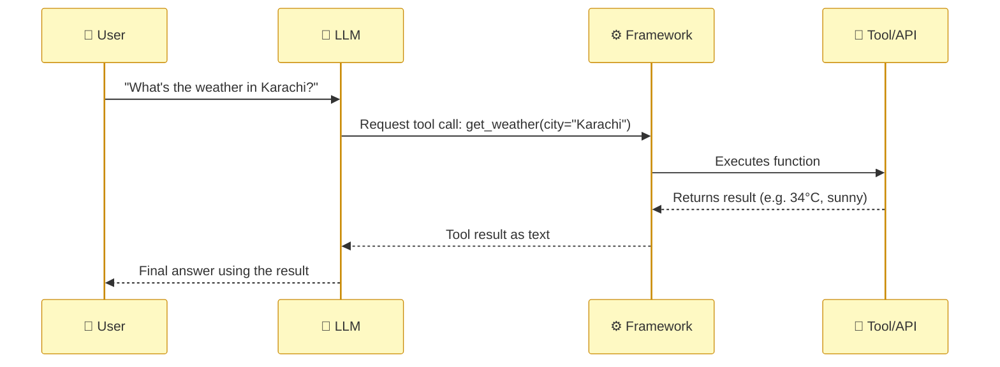

Agents commonly use search engines, APIs, databases, calculators, code execution, file systems, and business software.

### 19.8 🧠 Memory & Context

| Type | What It Holds | Lifespan |
|---|---|---|
| Short-term memory | The current task | Within the active context window |
| Long-term memory | Facts, preferences, history | Persists across sessions |
| External memory | Structured storage (databases) | Queried on demand |
| Retrieval-based memory | Past info found via RAG-style search | On demand, by relevance |

**Context** is everything the model sees at generation time — the system prompt, conversation history, retrieved documents, tool results. The **context window** is the hard cap on how much fits at once, which is exactly why memory systems exist: to decide what's worth keeping.

> 💡 **Prompt engineering vs Context engineering:** Prompt engineering is about *how you ask*. Context engineering is about *what information* — memory, documents, tool results — actually gets loaded into the model at each step. As agents run longer, context engineering matters more than prompt wording alone.

### 19.9 📚 RAG Inside Agents

Inside an agent, RAG is usually just **one of the tools** on the shelf — the agent decides *when* it's actually needed, instead of always running it on every question.

### 19.10 👥 Single Agent vs Multi-Agent Systems

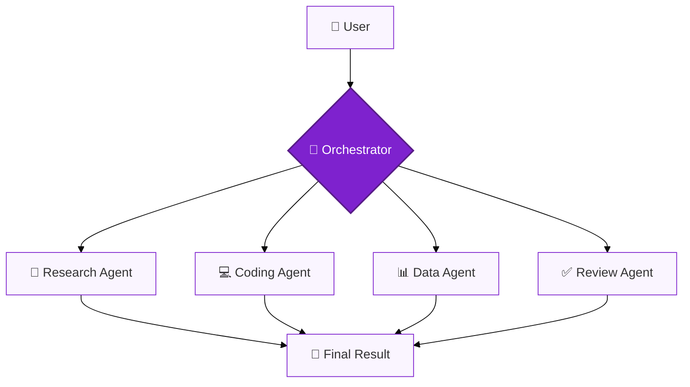

**Why use several agents instead of one big one?** Splitting the work makes each agent's job simpler, makes debugging easier, and lets work happen in parallel — at the cost of extra coordination and cost.

### 19.11 🔌 Agent Communication: MCP & A2A

| Protocol | What It Standardizes | Analogy |
|---|---|---|
| **MCP (Model Context Protocol)** | How an agent connects to *tools and data* | A universal "USB port" between models and tools |
| **A2A (Agent-to-Agent)** | How separate *agents* find and talk to each other | A shared language between agents from different vendors |

### 19.12 🛡️ Guardrails, Human-in-the-Loop & Safety

- **Human-in-the-loop (HITL)** — a human must approve high-stakes or irreversible actions.
- **Guardrails** — rules and limits on what an agent is allowed to do, no matter what the model "wants" to do.

📌 Safe agent use usually combines: **permission limits, HITL approval for big actions, tool restrictions, sandboxing, monitoring, approval steps,** and slow, tested rollout.

### 19.13 🧰 Frameworks & Tools Compared

| Framework/Tool | What It Is | Best For |
|---|---|---|
| **OpenAI Agents SDK** | Lightweight SDK for tool-using agents | Small to mid-size agent apps |
| **LangChain** | General LLM app framework | Fast prototyping of LLM + tools + memory |
| **LangGraph** | Graph-based orchestration | Complex, branching agent workflows |
| **Google ADK** | Agent Development Kit on Google's stack | Teams already on Google Cloud/Gemini |
| **CrewAI** | Role-based multi-agent "crews" | Coordinating specialized agents with clear roles |
| **AutoGen** | Multi-agent conversation framework | Research and multi-agent experiments |
| **MCP** | Open protocol for tool/data connections | Any agent needing standard tool access |
| **A2A** | Open protocol for agent-to-agent talk | Multi-agent systems across vendors |
| **n8n** | Visual, low-code automation with agent nodes | Agentic automation without heavy coding |

> 💡 **Rule of thumb:** start with the simplest option that solves your problem. A fixed workflow tool is often enough — reach for a full agent framework only when you truly need dynamic, model-driven decisions across many steps.

### 19.14 ✅ Benefits & ⚠️ Limitations of Agentic AI

**✅ Benefits**
- Automates multi-step tasks that used to need constant human effort
- Reliable use of outside tools and systems
- Goal-driven work instead of one-off answers
- Handles tasks that span several systems
- Adapts its workflow as it learns more

**⚠️ Limitations**
- Small errors can pile up across many steps
- Planning mistakes and tool misuse happen
- Agents can get stuck or wander off-track
- Tool access brings security risk (like prompt injection)
- Costs more and takes longer than a single-turn answer
- Long autonomous chains are harder to audit
- Still needs human oversight for big decisions

**📖 Read More:** [Anthropic — Building Effective Agents](https://www.anthropic.com/research/building-effective-agents) · [Model Context Protocol Docs](https://modelcontextprotocol.io/)

<a href="#-table-of-contents">⬆ Back to top</a>

---

## ✅ Benefits & ⚠️ Risks of AI

### ✅ Benefits
Automating repetitive or dangerous tasks · Productivity gains · Faster scientific discovery · Healthcare improvements · Personalized education · Accessibility tools · Creative support · Faster software development · Business efficiency

### ⚠️ Risks & Limitations

| Risk | Status |
|---|---|
| Hallucinations (confident but false answers) | 📌 Current |
| Bias inherited from training data | 📌 Current |
| Misinformation and deepfakes | 📌 Current |
| Privacy concerns | 📌 Current |
| Security risks (prompt injection, misuse) | 📌 Current |
| Copyright and IP disputes | 📌 Current |
| Over-reliance and skill loss | 📌 Current |
| Energy and environmental cost | 📌 Current, 📊 growing |
| Job displacement in some roles | 📌 Current, 🔮 likely to continue |
| Less human oversight as systems get more autonomous | 🔬 Emerging as Agentic AI scales |
| Existential-scale risk from future systems | 💭 Debated, not settled |

<a href="#-table-of-contents">⬆ Back to top</a>

---

## 📈 Current State of AI (2026)

📊 According to the **Stanford HAI AI Index 2026**, a few trends define where AI stands today:

- <cite index="4-1">Performance on the SWE-bench Verified coding benchmark rose from roughly 60% to nearly 100% within a single year, and organizational adoption of AI reached about 88%, with roughly four in five university students reporting they use generative AI for coursework.</cite>
- <cite index="2-1">Frontier models now meet or beat human baselines on PhD-level science questions, multimodal reasoning tasks, and competition-level math.</cite>
- <cite index="2-1">Generative AI reportedly reached roughly 53% population-level adoption within about three years of its emergence — faster than the personal computer or the internet.</cite>
- <cite index="9-1">Model performance leadership between the United States and China has traded back and forth multiple times since early 2025, with the gap narrowing substantially by March 2026.</cite>
- <cite index="6-1">Performance on very difficult expert-level tests like "Humanity's Last Exam" climbed from single-digit accuracy in 2025 to well over one-third by the 2026 report, with the best models later passing 50%.</cite>
- <cite index="3-1">The 2026 Index added "Agentic AI" as a newly tracked job-skill cluster, showing fast growth in employer demand for agentic-AI skills.</cite>
- 📊 The report also shows a **widening gap between how fast capability is growing and how ready safety and governance are**.

⚠️ *Note: these numbers come from one annual report. AI stats change fast — always check the latest edition.*

**📖 Read More:** [Stanford HAI — AI Index Report](https://hai.stanford.edu/ai-index) · [arXiv.org — cs.AI (latest papers)](https://arxiv.org/list/cs.AI/recent)

<a href="#-table-of-contents">⬆ Back to top</a>

---

## 🔮 Future of AI

### Time-Based Predictions

| Timeline | Prediction | Confidence |
|---|---|---|
| 2025-2026 | Agentic AI becomes common in business | 🟢 High |
| 2025-2026 | Multi-agent systems become normal | 🟢 High |
| 2027-2028 | AI agents start working with physical robots | 🟡 Medium |
| 2028-2030 | Personal AI assistants become part of daily life | 🟡 Medium |
| 2030-2035 | AGI might become possible, but not guaranteed | 🔴 Low |
| 2035+ | ASI — still only a theory right now | 🔴 Very Low |

AI is moving from single answers toward whole workflows that run themselves, with people checking in at the important moments instead of every step. Expect agents to get better at using tools, working with other agents, and eventually touching the physical world through robotics. None of this is locked in — long-range AI predictions have a poor track record, in both directions, so treat these as informed guesses, not promises.

**📖 Read more about AI's future:** [OpenAI Research](https://openai.com/research) · [Google DeepMind Research](https://deepmind.google/research/) · [Stanford HAI — AI Index Report](https://hai.stanford.edu/ai-index)

<a href="#-table-of-contents">⬆ Back to top</a>

---

## 🧠 ANI vs AGI vs ASI

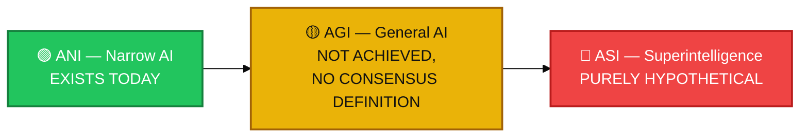

- **ANI (Artificial Narrow Intelligence):** AI that can do one specific task well, but nothing outside it. All AI that exists today is ANI — including every LLM and every agent in this guide.
- **AGI (Artificial General Intelligence):** AI that can think and learn like a human across any task. Does not exist yet, and there's no agreed date for it.
- **ASI (Artificial Superintelligence):** AI that's smarter than every human at everything. Purely theoretical — nobody has built anything close.

### Comparison Table

| Type | What It Means | Does It Exist? | Example |
|---|---|---|---|
| **ANI** | Good at one task, doesn't generalize | ✅ Yes | Chatbots, image recognizers, today's AI agents |
| **AGI** | Human-level thinking across any task | ❌ Not yet | None — still a research goal |
| **ASI** | Smarter than all humans at everything | ❌ Purely theoretical | None — exists only in theory and fiction |

📌 It's important not to treat AGI as already here, or ASI as just around the corner — both are still open, debated topics among AI researchers.

**📖 Read more about ANI, AGI, and ASI:** [Stanford HAI — AI Index Report](https://hai.stanford.edu/ai-index) · [OECD.AI Policy Observatory](https://oecd.ai/)

<a href="#-table-of-contents">⬆ Back to top</a>

---

## 🚀 Advanced & Emerging AI Fields

As AI moves from single models into full **Agentic AI systems** running in the real world, a new set of specialized fields has grown up around *building, running, securing, and governing* AI. Demand for these fields is rising because capability is scaling faster than the safety, infrastructure, and operational practices around it — someone has to close that gap.

**🦾 Embodied AI**
AI that's connected to a physical body — a robot, drone, or machine — so it can sense and act in the real world, not just process text. It matters because many real tasks (cleaning, delivery, manufacturing) need a body, not just a brain.
📖 Learn more: [Embodied Agent — Wikipedia](https://en.wikipedia.org/wiki/Embodied_agent) · [Google DeepMind Research](https://deepmind.google/research/)

**🚨 AI Safety & Alignment**
Research and engineering that keeps AI systems reliable, aligned with what people actually want, and unlikely to cause harm — especially as they get more autonomous. This matters more every year because the gap between capability and safety readiness keeps widening.
📖 Learn more: [AI Safety — Wikipedia](https://en.wikipedia.org/wiki/AI_safety) · [Anthropic Research](https://www.anthropic.com/research)

**🔍 Explainable AI (XAI)**
Methods that make AI decisions understandable to humans — showing *why* a model made a certain prediction or took a certain action. Trust, debugging, and regulation all depend on knowing the "why," not just the "what."
📖 Learn more: [Explainable AI — Wikipedia](https://en.wikipedia.org/wiki/Explainable_artificial_intelligence) · [arXiv.org — cs.AI](https://arxiv.org/list/cs.AI/recent)

**📱 Edge AI / On-Device AI**
Running AI models directly on a phone, camera, or small device instead of a remote server. It matters because it's faster, works offline, and keeps data more private.
📖 Learn more: [Edge Computing — Wikipedia](https://en.wikipedia.org/wiki/Edge_computing) · [TinyML — Wikipedia](https://en.wikipedia.org/wiki/TinyML)

**🔒 Federated Learning**
A way to train one shared model across many devices without moving anyone's raw data off their device. It matters for privacy — useful in healthcare, banking, and anywhere data can't be centralized.
📖 Learn more: [Federated Learning — Wikipedia](https://en.wikipedia.org/wiki/Federated_learning) · [Google Research Blog](https://research.google/blog/)

**🧠 Neuromorphic Computing**
Computer chips designed to work more like a biological brain, using much less power than normal processors. It matters because it could make AI far more energy-efficient, especially for edge devices.
📖 Learn more: [Neuromorphic Engineering — Wikipedia](https://en.wikipedia.org/wiki/Neuromorphic_engineering) · [IBM Research — Neuromorphic Computing](https://research.ibm.com/topics/neuromorphic-computing)

**⚛️ Quantum AI**
Combining quantum computing with machine learning to try to solve problems that are too hard for normal computers. It's still early-stage research, but it could eventually speed up certain kinds of model training.
📖 Learn more: [Quantum Machine Learning — Wikipedia](https://en.wikipedia.org/wiki/Quantum_machine_learning) · [Google Quantum AI](https://quantumai.google/)

**🧪 Synthetic Data Generation**
Using AI to create fake-but-realistic data for training other models, when real data is scarce, private, or expensive to collect. It matters because it helps fill data gaps without exposing real people's information.
📖 Learn more: [Synthetic Data — Wikipedia](https://en.wikipedia.org/wiki/Synthetic_data) · [NVIDIA — Synthetic Data Glossary](https://www.nvidia.com/en-us/glossary/synthetic-data/)

> 💡 **The common thread:** every field here exists because capability outran the discipline needed to use it safely, efficiently, and at scale. As Agentic AI becomes the normal way software gets built, these fields become just as important as building the models themselves.

<a href="#-table-of-contents">⬆ Back to top</a>

---

## 📋 Summary — The AI Story in One Page

- AI is the science of building machines that can do tasks that normally need human thinking.
- AI didn't appear in one moment — it grew step by step, with each new field solving a specific wall the last one hit.
- Machine Learning let systems learn rules from data instead of needing every rule hand-written.
- Deep Learning let models find their own features, instead of humans picking them by hand.
- Transformers let models read a whole sequence at once, solving the slowness of older text models.
- Foundation Models let one big model be trained once and reused for many tasks.
- Generative AI, then LLMs, gave machines the ability to create content and use language fluently.
- RAG connected LLMs to live, current, and private knowledge, cutting down hallucinations.
- AI Agents added tools, memory, and planning, so models could take real multi-step action.
- Agentic AI is the bigger idea behind all of this — whole workflows that plan, act, and self-correct, sometimes using many agents together.
- Today's AI is all Narrow AI (ANI); AGI and ASI remain unproven and debated.
- The future points toward more agentic workflows, more automation, and a growing need for safety, security, and governance to keep up.

<a href="#-table-of-contents">⬆ Back to top</a>

---

## ❓ Practice Questions

1. Why did Deep Learning replace the older way of doing Machine Learning? What problem did it actually solve?
2. Why couldn't RNNs keep up once Transformers arrived — what specific weakness did attention fix?
3. Foundation Models solved a cost problem. What was that problem, and how did reusing one model solve it?
4. RAG already gives LLMs live data. So why were AI Agents still needed on top of that?
5. Why does a single, perfectly informed LLM still fall short of what an AI Agent can do?
6. What is the real difference between one AI Agent and the broader idea of Agentic AI?
7. Why can't a single chatbot answer replace a full agentic workflow?
8. In the agentic loop, why does the "observe and adjust" step matter more than just "act"?
9. Why does context engineering start to matter more than prompt wording as an agent runs longer?
10. Why would a company choose a multi-agent system over one large, generalist agent?
11. Why does more autonomy in an agent also mean more security risk?
12. Why is AI Safety becoming more urgent as Agentic AI scales up, instead of less?
13. Why is it important to remember that all of today's AI is still ANI, not AGI?
14. Why does each field in AI's evolution tend to create a brand-new limitation, instead of solving everything at once?
15. If capability is growing faster than safety and governance, what risks does that gap create for Agentic AI specifically?

<a href="#-table-of-contents">⬆ Back to top</a>
