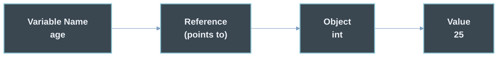
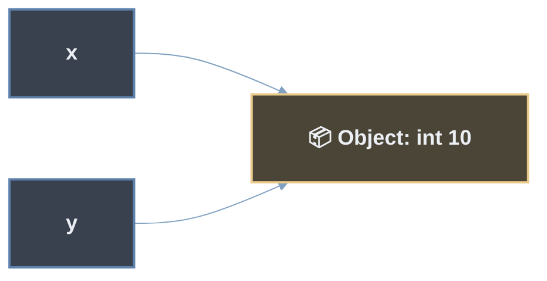
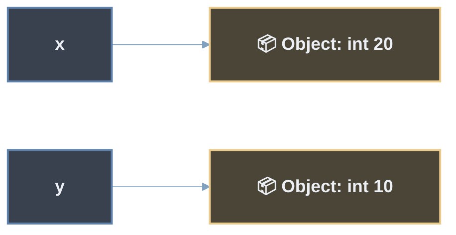
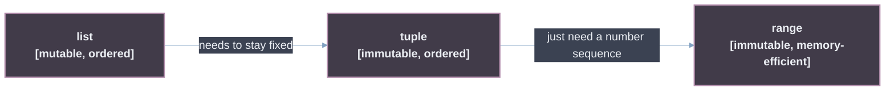
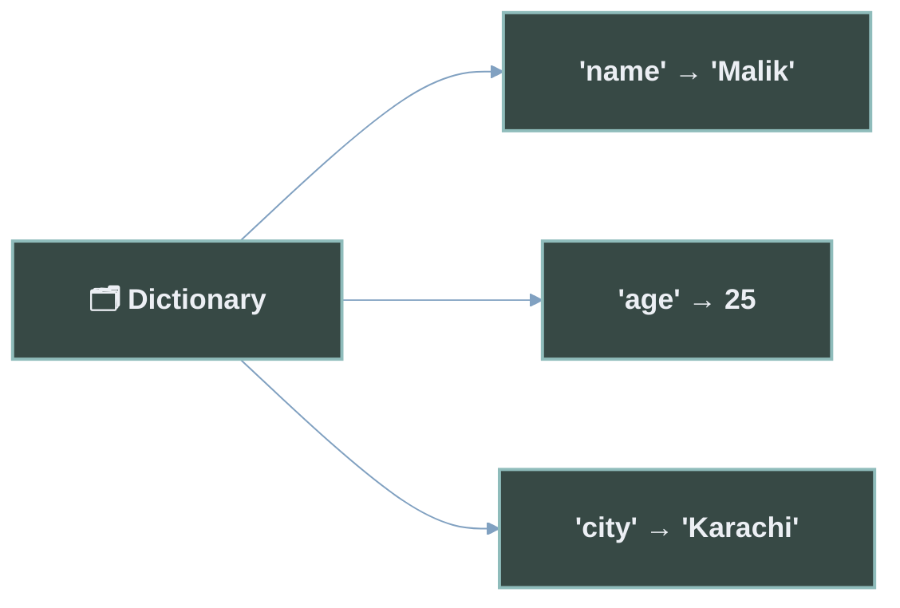
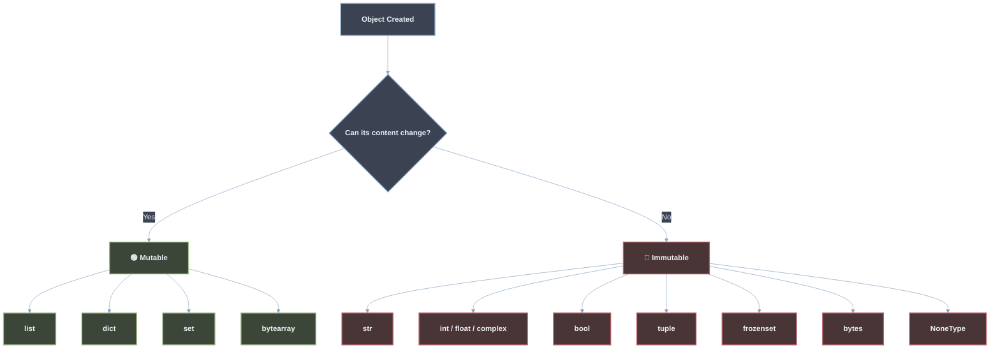
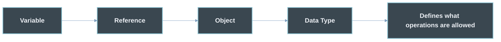

<div align="center">

# 🐍 Python Data Types

### Understand Python Data Types from the Ground Up

*A complete, beginner-friendly guide to variables, objects, and every built-in Python data type — the "what," the "why," and the "how."*


</div>

---

## 🗺️ The Python Data Types Map

Before anything else, here is the big picture. Every data type in Python belongs to one of these families. Keep this diagram in mind — you will keep coming back to it.

```mermaid
%%{init: {'theme': 'base', 'themeVariables': {'background': '#2E3440', 'primaryColor': '#3B4252', 'primaryTextColor': '#ECEFF4', 'primaryBorderColor': '#5E81AC', 'secondaryColor': '#434C5E', 'tertiaryColor': '#3B4252', 'lineColor': '#81A1C1', 'edgeLabelBackground': '#3B4252', 'fontSize': '18px', 'fontFamily': 'Segoe UI, Arial, sans-serif'}, 'flowchart': {'useMaxWidth': true, 'htmlLabels': true, 'nodeSpacing': 65, 'rankSpacing': 90, 'curve': 'basis', 'padding': 24}} }%%
flowchart TD
    ROOT["🐍 Python Data Types"]

    ROOT --> TEXT["📝 Text"]
    ROOT --> NUM["🔢 Numeric"]
    ROOT --> BOOL["✅ Boolean"]
    ROOT --> SEQ["📦 Sequence"]
    ROOT --> SET["🔹 Set"]
    ROOT --> MAP["🗂️ Mapping"]
    ROOT --> BIN["💾 Binary"]
    ROOT --> SPEC["🚫 Special"]

    TEXT --> str["str"]

    NUM --> int["int"]
    NUM --> float["float"]
    NUM --> complex["complex"]

    BOOL --> bool["bool"]

    SEQ --> list["list"]
    SEQ --> tuple["tuple"]
    SEQ --> range["range"]

    SET --> set1["set"]
    SET --> frozenset["frozenset"]

    MAP --> dict["dict"]

    BIN --> bytes["bytes"]
    BIN --> bytearray["bytearray"]
    BIN --> memoryview["memoryview"]

    SPEC --> NoneType["NoneType"]

    classDef root fill:#3B4252,color:#ECEFF4,stroke:#5E81AC,stroke-width:3px,font-weight:bold,font-size:18px
    classDef text fill:#3A4750,color:#ECEFF4,stroke:#88C0D0,stroke-width:2px,font-weight:600
    classDef num fill:#4A4536,color:#ECEFF4,stroke:#EBCB8B,stroke-width:2px,font-weight:600
    classDef booly fill:#3C4638,color:#ECEFF4,stroke:#A3BE8C,stroke-width:2px,font-weight:600
    classDef seq fill:#413B49,color:#ECEFF4,stroke:#B48EAD,stroke-width:2px,font-weight:600
    classDef sett fill:#493C38,color:#ECEFF4,stroke:#D08770,stroke-width:2px,font-weight:600
    classDef mapp fill:#374945,color:#ECEFF4,stroke:#8FBCBB,stroke-width:2px,font-weight:600
    classDef bin fill:#3E4451,color:#ECEFF4,stroke:#7B88A1,stroke-width:2px,font-weight:600
    classDef spec fill:#493536,color:#ECEFF4,stroke:#BF616A,stroke-width:2px,font-weight:600

    class ROOT root
    class TEXT,str text
    class NUM,int,float,complex num
    class BOOL,bool booly
    class SEQ,list,tuple,range seq
    class SET,set1,frozenset sett
    class MAP,dict mapp
    class BIN,bytes,bytearray,memoryview bin
    class SPEC,NoneType spec
```



> 💡 **How to read this diagram:** The colors are not decoration — each color is a *family*. Blue = text, amber = numbers, green = true/false, purple = ordered collections, pink = unique collections, teal = key-value pairs, gray = raw binary data, red = "nothing" values. If you forget everything else, remember the colors and the families.

> ⚠️ **Note on `str`:** Technically, strings behave like sequences in Python (you can index and loop over them). But for a beginner's mental model, it's clearer to think of `str` as its own **Text** category first. We'll revisit its sequence-like nature later in this guide.

### 🔗 Learn More
> **You can learn more about this topic here >>>>>**
- [Python Official Docs — Built-in Types](https://docs.python.org/3/library/stdtypes.html)
- [Real Python — Basic Data Types](https://realpython.com/python-data-types/)
- [Programiz — Python Data Types](https://www.programiz.com/python-programming/variables-datatypes)

---

## 📖 Introduction

If you're brand new to Python, this guide is for you. It doesn't just list data types and their definitions — it builds your understanding **step by step**, starting from the very first question every beginner should ask: *what is a variable?*

By the end, you won't just know the *names* of Python's data types. You'll understand **what they are, why they exist, how they relate to variables and objects, and when to use each one.**

---

## 📚 Table of Contents

1. [What Is a Variable?](#1-what-is-a-variable)
2. [How Variables Work Internally](#2-how-variables-work-internally)
3. [Variable Naming Rules](#3-variable-naming-rules)
4. [What Are Data Types?](#4-what-are-data-types)
5. [Why Different Data Types Exist](#5-why-different-data-types-exist)
6. [Text — `str`](#6-text--str)
7. [Numeric Types — `int`, `float`, `complex`](#7-numeric-types--int-float-complex)
8. [Boolean — `bool`](#8-boolean--bool)
9. [Sequence Types — `list`, `tuple`, `range`](#9-sequence-types--list-tuple-range)
10. [Set Types — `set`, `frozenset`](#10-set-types--set-frozenset)
11. [Mapping — `dict`](#11-mapping--dict)
12. [Binary Types — `bytes`, `bytearray`, `memoryview`](#12-binary-types--bytes-bytearray-memoryview)
13. [Special — `None` / `NoneType`](#13-special--none--nonetype)
14. [Mutable vs Immutable](#14-mutable-vs-immutable)
15. [Dynamic Typing](#15-dynamic-typing)
16. [Checking Types with `type()`](#16-checking-types-with-type)
17. [Things Beginners Often Don't Know](#17-things-beginners-often-dont-know)
18. [Comparison Table — All Data Types](#18-comparison-table--all-data-types)
19. [Collection Comparisons](#19-collection-comparisons)
20. [Quick Revision](#20-quick-revision)
21. [Further Learning](#21-further-learning)

---

## 1. What Is a Variable?

A **variable** is a name that points to a piece of data (a value) stored somewhere in your computer's memory.

Programs need to store, reuse, and update data all the time — user input, scores, names, results of a calculation. Instead of remembering raw memory addresses, we give data a **friendly name**.

```python
age = 25
```

In plain English, this line means: *"Create a name called `age`, and make it point to the value `25`."*



> 💡 **Key idea:** A Python variable is best understood as a **name (a label / reference) attached to an object** — not as a box that physically contains a value. This distinction matters a lot, and we'll unpack it next.

### 🔗 Learn More
> **You can learn more about this topic here >>>>>**
- [Python Official Docs — Introduction to Python](https://docs.python.org/3/tutorial/introduction.html)
- [Real Python — Variables in Python](https://realpython.com/python-variables/)
- [W3Schools — Python Variables](https://www.w3schools.com/python/python_variables.asp)

---

## 2. How Variables Work Internally

Most beginners picture a variable like a **labeled box** that holds a value directly. Python doesn't quite work that way.

In Python, **everything is an object** (numbers, text, lists — all of it). A variable is simply a **name that refers to** one of these objects. Think of it like a **sticky note with a name on it, attached to a box** — the box is the object, and the name can be moved to a different box at any time.

```python
x = 10
y = x
```

Here, `y` doesn't get its own separate copy of `10`. Both `x` and `y` are names that **point to the same object** — the integer `10`.



Now watch what happens on reassignment:

```python
x = 20
```

`x` does **not** change the object `10` into `20`. Instead, `x` is simply **pointed at a brand-new object**, `20`. The object `10` still exists, and `y` still points to it.



This is the core mental model you need for the rest of this guide: **variables are references (names), not containers.**

### 🔗 Learn More
> **You can learn more about this topic here >>>>>**
- [Python Official Docs — Data Model](https://docs.python.org/3/reference/datamodel.html)
- [Real Python — Variables, References, and Objects](https://realpython.com/pointers-in-python/)
- [GeeksforGeeks — Variables as References](https://www.geeksforgeeks.org/python-variables/)

---

## 3. Variable Naming Rules

Python has two kinds of naming rules: **hard rules** that Python enforces, and **soft rules** that are simply good practice.

> **Hard Rule = Python enforces it (breaking it causes an error).**
> **Soft Rule = Python recommends it (breaking it still runs, but it's bad practice).**

### 🔒 Hard Rules (enforced by Python)

| Rule | Valid Example | Invalid Example |
|---|---|---|
| Cannot start with a number | `age1` | `1age` ❌ |
| Only letters, digits, underscores allowed | `user_name` | `user-name` ❌ |
| Case-sensitive | `Age` ≠ `age` | — |
| Cannot use reserved keywords | `total` | `class` ❌ (reserved) |
| No spaces allowed | `first_name` | `first name` ❌ |

```python
# ✅ Valid
user_name = "Malik"
_score = 100
total2 = 50

# ❌ Invalid (would cause a SyntaxError)
# 2total = 50
# user-name = "Malik"
```

### 🎨 Soft Rules (Python conventions — PEP 8)

| Convention | Example | Used For |
|---|---|---|
| `snake_case` | `first_name` | Regular variables |
| `UPPER_CASE` | `MAX_LIMIT` | Constants |
| Descriptive names | `total_price` not `tp` | Readability |
| Leading underscore | `_internal_value` | "Internal use" hint |

These aren't enforced by Python — your code will still run if you ignore them — but following them makes your code far easier for humans (including future you) to read.

### 🔗 Learn More
> **You can learn more about this topic here >>>>>**
- [Python Official Docs — Keywords](https://docs.python.org/3/reference/lexical_analysis.html#keywords)
- [PEP 8 — Style Guide for Python Code](https://peps.python.org/pep-0008/)
- [Programiz — Python Variables & Naming](https://www.programiz.com/python-programming/variables-datatypes)

---

## 4. What Are Data Types?

A **data type** tells Python two things about a piece of data:

1. **What kind of value it is** (text, number, true/false, collection, etc.)
2. **What operations are valid on it** (can you add it? loop over it? change it?)

Real-life analogy: you handle a *letter*, a *coin*, and a *photograph* differently — even though all three are physical objects. Data types exist for the same reason: **different kinds of data need to be stored and processed differently.**

```text
Value            → What it represents
Object           → How Python stores that value in memory
Data Type        → The category/rules that object follows
Variable         → The name we use to refer to that object
```

Without data types, Python wouldn't know whether `5 + "5"` should give `10`, `"55"`, or an error (it actually gives an error — because mixing incompatible types is not allowed).

### 🔗 Learn More
> **You can learn more about this topic here >>>>>**
- [Python Official Docs — Built-in Types](https://docs.python.org/3/library/stdtypes.html)
- [Real Python — Basic Data Types](https://realpython.com/python-data-types/)
- [W3Schools — Python Data Types](https://www.w3schools.com/python/python_datatypes.asp)

---

## 5. Why Different Data Types Exist

Every data type was created to solve a **specific problem** that earlier tools couldn't solve well.

```mermaid
%%{init: {'theme': 'base', 'themeVariables': {'background': '#2E3440', 'primaryColor': '#3B4252', 'primaryTextColor': '#ECEFF4', 'primaryBorderColor': '#D08770', 'lineColor': '#81A1C1', 'edgeLabelBackground': '#3B4252', 'fontSize': '17px', 'fontFamily': 'Segoe UI, Arial, sans-serif'}, 'flowchart': {'useMaxWidth': true, 'htmlLabels': true, 'nodeSpacing': 55, 'rankSpacing': 85, 'curve': 'basis', 'padding': 24}} }%%
flowchart TD
    P1["Need to store text"] --> S1["str"]
    P2["Need to do math"] --> S2["int / float / complex"]
    P3["Need true/false logic"] --> S3["bool"]
    P4["Need to store many values in order"] --> S4["list"]
    P5["That order shouldn't be changed"] --> S5["tuple"]
    P6["Need to generate a number sequence efficiently"] --> S6["range"]
    P7["Need only unique values"] --> S7["set"]
    P8["That uniqueness shouldn't change"] --> S8["frozenset"]
    P9["Need to link labels to values"] --> S9["dict"]
    P10["Need to handle raw binary data"] --> S10["bytes / bytearray / memoryview"]
    P11["Need to represent 'nothing'"] --> S11["None"]

    classDef prob fill:#493C38,color:#ECEFF4,stroke:#D08770,stroke-width:2px,font-weight:600
    classDef sol fill:#374945,color:#ECEFF4,stroke:#8FBCBB,stroke-width:2px,font-weight:600
    class P1,P2,P3,P4,P5,P6,P7,P8,P9,P10,P11 prob
    class S1,S2,S3,S4,S5,S6,S7,S8,S9,S10,S11 sol
```



This "problem → data type" thinking is the theme of every section below — for each type, ask **"what problem does this solve?"**

---

## 6. Text — `str`

### 📌 Definition
> A `str` (string) is Python's data type for representing **text** — letters, words, sentences, or any sequence of characters.

**Why it exists:** Programs constantly deal with text — names, messages, file paths, labels. `str` gives Python a dedicated way to store and work with that text safely.

**Characteristics:**
- Written using single `'...'`, double `"..."`, or triple quotes `'''...'''`
- Immutable (once created, a string's content cannot be changed in place)
- Technically behaves like a sequence of characters (more on this in [Mutable vs Immutable](#14-mutable-vs-immutable))

```python
name = "Malik"
message = 'Hello, world!'
paragraph = """This is
a multi-line string."""

print(name)
print(message)
```

```text
Malik
Hello, world!
```

### 🔗 Learn More
> **You can learn more about this topic here >>>>>**
- [Python Official Docs — Text Sequence Type `str`](https://docs.python.org/3/library/stdtypes.html#text-sequence-type-str)
- [Real Python — Strings and Character Data](https://realpython.com/python-strings/)
- [W3Schools — Python Strings](https://www.w3schools.com/python/python_strings.asp)

---

## 7. Numeric Types — `int`, `float`, `complex`

### 📌 Definitions

> `int` — a whole number, positive or negative, with no decimal point.
> `float` — a number that includes a decimal point (a "floating-point" number).
> `complex` — a number with a real part and an imaginary part, used in advanced math/engineering.

**Why they exist:** Not all numbers behave the same way in computing. Whole counts (like "3 apples") don't need decimals, but measurements (like "3.75 kg") do. Separating `int` and `float` lets Python store and calculate each efficiently and accurately.

```python
apples = 3            # int
price = 3.75           # float
signal = 2 + 3j        # complex

print(type(apples))
print(type(price))
print(type(signal))
```

```text
<class 'int'>
<class 'float'>
<class 'complex'>
```

**When to use which:**
- `int` → counting things, indexes, whole quantities
- `float` → measurements, prices, scientific data, anything needing decimals
- `complex` → rarely needed unless doing engineering/scientific/mathematical work

### 🔗 Learn More
> **You can learn more about this topic here >>>>>**
- [Python Official Docs — Numeric Types](https://docs.python.org/3/library/stdtypes.html#numeric-types-int-float-complex)
- [Real Python — Numbers in Python](https://realpython.com/python-numbers/)
- [GeeksforGeeks — Numbers in Python](https://www.geeksforgeeks.org/python-numbers/)

---

## 8. Boolean — `bool`

### 📌 Definition
> A `bool` represents one of exactly two values: `True` or `False`.

**Why it exists:** Programs constantly need to make decisions — "Is the user logged in?", "Is the cart empty?". Boolean values give Python a clean way to represent and test these yes/no conditions.

```python
is_student = True
is_raining = False

print(is_student)
print(5 > 3)     # comparisons produce booleans too
```

```text
True
True
```

> 💡 **Fun fact:** In Python, `bool` is technically a subtype of `int` — `True` behaves like `1` and `False` behaves like `0`. We'll explore this more in [Things Beginners Often Don't Know](#17-things-beginners-often-dont-know).

### 🔗 Learn More
> **You can learn more about this topic here >>>>>**
- [Python Official Docs — Boolean Type `bool`](https://docs.python.org/3/library/stdtypes.html#boolean-type-bool)
- [Real Python — Booleans in Python](https://realpython.com/python-boolean/)
- [Programiz — Python Booleans](https://www.programiz.com/python-programming/variables-datatypes)

---

## 9. Sequence Types — `list`, `tuple`, `range`

### 📌 Definitions

> `list` — an **ordered, changeable** collection of items.
> `tuple` — an **ordered, unchangeable** collection of items.
> `range` — an efficient, memory-friendly sequence of numbers.

**Why they exist:** Often you need to store *many* related values together (e.g., a list of student names), not just one. `list` was created for this. But sometimes that collection should never change once created (like coordinates or fixed settings) — that's what `tuple` is for. And when you just need a sequence of numbers (like "0 to 100") without storing every number in memory, `range` solves that efficiently.

```python
fruits = ["apple", "banana", "cherry"]     # list — can change
coordinates = (10, 20)                     # tuple — cannot change
numbers = range(1, 6)                      # range — 1 to 5

print(fruits)
print(coordinates)
print(list(numbers))
```

```text
['apple', 'banana', 'cherry']
(10, 20)
[1, 2, 3, 4, 5]
```



### 🔗 Learn More
> **You can learn more about this topic here >>>>>**
- [Python Official Docs — Sequence Types](https://docs.python.org/3/library/stdtypes.html#sequence-types-list-tuple-range)
- [Real Python — Lists and Tuples](https://realpython.com/python-lists-tuples/)
- [W3Schools — Python Lists](https://www.w3schools.com/python/python_lists.asp)

---

## 10. Set Types — `set`, `frozenset`

### 📌 Definitions

> `set` — an **unordered collection of unique** items (no duplicates allowed).
> `frozenset` — an **immutable version** of a set.

**Why they exist:** Sometimes you don't care about order, but you *do* care that every item is unique — like a list of unique visitor IDs. `set` automatically removes duplicates. `frozenset` exists for cases where that uniqueness must never be changed later (e.g., using it as a fixed constant).

```python
tags = {"python", "coding", "python", "beginner"}
print(tags)

fixed_tags = frozenset(["python", "coding"])
print(fixed_tags)
```

```text
{'python', 'coding', 'beginner'}
frozenset({'python', 'coding'})
```

> 💡 Notice the duplicate `"python"` in the first example was automatically removed.

### 🔗 Learn More
> **You can learn more about this topic here >>>>>**
- [Python Official Docs — Set Types](https://docs.python.org/3/library/stdtypes.html#set-types-set-frozenset)
- [Real Python — Sets in Python](https://realpython.com/python-sets/)
- [GeeksforGeeks — Python Sets](https://www.geeksforgeeks.org/python-sets/)

---

## 11. Mapping — `dict`

### 📌 Definition
> A `dict` (dictionary) stores data as **key–value pairs** — each value is accessed using a unique key instead of a numeric position.

**Why it exists:** Some data is naturally *labeled* rather than *ordered by position* — like a real-world dictionary where you look up a word (key) to find its meaning (value). `dict` lets you look up data instantly by a meaningful name instead of remembering its position.

```python
student = {
    "name": "Malik",
    "age": 25,
    "city": "Karachi"
}

print(student["name"])
print(student["city"])
```

```text
Malik
Karachi
```



### 🔗 Learn More
> **You can learn more about this topic here >>>>>**
- [Python Official Docs — Mapping Type `dict`](https://docs.python.org/3/library/stdtypes.html#mapping-types-dict)
- [Real Python — Dictionaries in Python](https://realpython.com/python-dicts/)
- [W3Schools — Python Dictionaries](https://www.w3schools.com/python/python_dictionaries.asp)

---

## 12. Binary Types — `bytes`, `bytearray`, `memoryview`

### 📌 Definitions

> `bytes` — an **immutable** sequence of raw byte values (0–255).
> `bytearray` — a **mutable** sequence of raw byte values.
> `memoryview` — a way to look at (and edit) the memory of another binary object **without copying it**.

**Why they exist:** Not all data is text or numbers — images, audio, network packets, and files are stored as raw **binary data**. Python needs dedicated types to safely handle this low-level data without treating it like normal text.

```python
data = bytes([65, 66, 67])
print(data)

mutable_data = bytearray([65, 66, 67])
mutable_data[0] = 90
print(mutable_data)
```

```text
b'ABC'
bytearray(b'ZBC')
```

> 💡 You won't need these often as a beginner — but knowing they exist helps you recognize them when working with files, networking, or images later on.

### 🔗 Learn More
> **You can learn more about this topic here >>>>>**
- [Python Official Docs — Binary Sequence Types](https://docs.python.org/3/library/stdtypes.html#binary-sequence-types-bytes-bytearray-memoryview)
- [Real Python — Working With Binary Data](https://realpython.com/python-bytes/)
- [GeeksforGeeks — Python Bytes](https://www.geeksforgeeks.org/python-bytes-array/)

---

## 13. Special — `None` / `NoneType`

### 📌 Definition
> `None` is a special built-in value that represents **"no value"** or **"nothing here."** Its data type is `NoneType`.

**Why it exists:** Sometimes a variable needs to exist before you know its final value — like a result that hasn't been computed yet. `None` gives Python a clear, deliberate way to say "this is intentionally empty," instead of using a misleading placeholder like `0` or `""`.

```python
result = None
print(result)
print(type(result))
```

```text
None
<class 'NoneType'>
```

**`None` is not the same as:**

| Value | Meaning |
|---|---|
| `None` | Deliberately "no value" |
| `0` | The number zero |
| `False` | The boolean false |
| `""` | An empty string |

### 🔗 Learn More
> **You can learn more about this topic here >>>>>**
- [Python Official Docs — The `None` Object](https://docs.python.org/3/library/constants.html#None)
- [Real Python — Null in Python: Understanding None](https://realpython.com/null-in-python/)
- [Programiz — Python None Keyword](https://www.programiz.com/python-programming/keyword-list)

---

## 14. Mutable vs Immutable

This is one of the most important ideas in Python.

> **Mutable** = the object's content **can** be changed after creation.
> **Immutable** = the object's content **cannot** be changed after creation — any "change" actually creates a brand-new object.



```python
# Mutable example — the SAME list object is changed
fruits = ["apple", "banana"]
fruits.append("cherry")
print(fruits)

# Immutable example — a NEW string object is created
name = "Malik"
name = name + " Khan"
print(name)
```

```text
['apple', 'banana', 'cherry']
Malik Khan
```

Why this matters: if two variables reference the same **mutable** object, changing it through one variable affects the other too. This is a common source of beginner bugs — and it directly follows from the "names point to objects" model from [Section 2](#2-how-variables-work-internally).

### 🔗 Learn More
> **You can learn more about this topic here >>>>>**
- [Python Official Docs — Data Model, Mutability](https://docs.python.org/3/reference/datamodel.html#objects-values-and-types)
- [Real Python — Mutable vs Immutable Objects](https://realpython.com/courses/immutability-python/)
- [GeeksforGeeks — Mutable and Immutable in Python](https://www.geeksforgeeks.org/mutable-vs-immutable-objects-in-python/)

---

## 15. Dynamic Typing

Python is **dynamically typed**, meaning you never have to declare a variable's type in advance — Python figures it out automatically, and a variable can be reassigned to a **different type** at any time.

```python
value = 10          # int
print(type(value))

value = "ten"        # now a str — totally allowed
print(type(value))

value = [10]          # now a list
print(type(value))
```

```text
<class 'int'>
<class 'str'>
<class 'list'>
```

> ⚠️ **Common beginner misconception:** This does **not** mean the object `10` "turned into" a string. It means the name `value` was **pointed at a new object** each time — exactly like we saw in [Section 2](#2-how-variables-work-internally).

**Why this is useful:** it makes Python fast to write and flexible, especially for beginners, scripting, and prototyping — though it also means you should be a little more careful about what type a variable currently holds.

### 🔗 Learn More
> **You can learn more about this topic here >>>>>**
- [Python Official Docs — Dynamic Typing Discussion](https://docs.python.org/3/faq/programming.html)
- [Real Python — Python's Dynamic Typing](https://realpython.com/python-type-checking/)
- [W3Schools — Python Variables](https://www.w3schools.com/python/python_variables.asp)

---

## 16. Checking Types with `type()`

You can always ask Python what type a variable currently refers to using the built-in `type()` function.

```python
age = 25
name = "Malik"
active = True

print(type(age))
print(type(name))
print(type(active))
```

```text
<class 'int'>
<class 'str'>
<class 'bool'>
```

Each result tells you which **class** (data type) the object belongs to — this is simply Python confirming, in its own words, what kind of object your variable currently points to.

### 🔗 Learn More
> **You can learn more about this topic here >>>>>**
- [Python Official Docs — `type()`](https://docs.python.org/3/library/functions.html#type)
- [Real Python — Checking Types in Python](https://realpython.com/python-type-checking/)
- [Programiz — Python type()](https://www.programiz.com/python-programming/methods/built-in/type)

---

## 17. 💡 Things Beginners Often Don't Know

- **Everything in Python is an object** — even numbers, functions, and `None` itself.
- **Variables are names/references**, not boxes — they point to objects, they don't contain them.
- **`bool` is a subtype of `int`** — `True == 1` and `False == 0` both evaluate to `True`.
- **Python is dynamically typed** — a variable can point to different types over its lifetime.
- **Collections can mix types** — a single `list` can hold a `str`, an `int`, and a `dict` at once.
- **`None` is a real object** — it has its own type, `NoneType`, and lives in memory like anything else.
- **Modern Python dictionaries preserve insertion order** — since Python 3.7, the order you add keys is the order you get back when iterating.
- **Strings are technically sequences** — you can loop over and index into a string just like a list, even though we group it under "Text" for clarity.
- **Small integers are cached** — Python secretly reuses the same object for small integers (typically -5 to 256) for performance.

```python
print(True == 1)          # True
print(False == 0)          # True
print(type(None))          # <class 'NoneType'>
```

```text
True
True
<class 'NoneType'>
```

### 🔗 Learn More
> **You can learn more about this topic here >>>>>**
- [Python Official Docs — Built-in Constants](https://docs.python.org/3/library/constants.html)
- [Real Python — Python Facts and Quirks](https://realpython.com/python-quirks/)
- [GeeksforGeeks — Interesting Facts About Python](https://www.geeksforgeeks.org/interesting-facts-python/)

---

## 18. 📊 Comparison Table — All Data Types

| Type | Stores | Ordered? | Mutable? | Duplicates? | Main Purpose |
|---|---|---|---|---|---|
| `str` | Text | ✅ Yes | ❌ No | ✅ Yes | Represent text |
| `int` | Whole numbers | — | ❌ No | — | Counting, whole values |
| `float` | Decimal numbers | — | ❌ No | — | Measurements, precision |
| `complex` | Real + imaginary numbers | — | ❌ No | — | Scientific/engineering math |
| `bool` | True / False | — | ❌ No | — | Logic & conditions |
| `list` | Any values | ✅ Yes | ✅ Yes | ✅ Yes | Ordered, changeable collection |
| `tuple` | Any values | ✅ Yes | ❌ No | ✅ Yes | Ordered, fixed collection |
| `range` | Number sequence | ✅ Yes | ❌ No | ✅ Yes | Efficient number generation |
| `set` | Any values | ❌ No | ✅ Yes | ❌ No | Unique, unordered items |
| `frozenset` | Any values | ❌ No | ❌ No | ❌ No | Fixed, unique items |
| `dict` | Key–value pairs | ✅ Yes* | ✅ Yes | Keys: ❌ No | Fast lookup by key |
| `bytes` | Raw byte data | ✅ Yes | ❌ No | ✅ Yes | Immutable binary data |
| `bytearray` | Raw byte data | ✅ Yes | ✅ Yes | ✅ Yes | Editable binary data |
| `memoryview` | View of binary data | ✅ Yes | Depends | — | Access memory without copying |
| `NoneType` | Nothing / no value | — | ❌ No | — | Represent absence of a value |

*\*`dict` preserves insertion order since Python 3.7, though it's not "ordered" in the sortable/indexable sequence sense.*

---

## 19. ⚖️ Collection Comparisons

### List vs Tuple

| | `list` | `tuple` |
|---|---|---|
| Changeable? | ✅ Yes | ❌ No |
| Syntax | `[1, 2, 3]` | `(1, 2, 3)` |
| Best for | Data that will change | Data that must stay fixed |

### List vs Set

| | `list` | `set` |
|---|---|---|
| Order preserved? | ✅ Yes | ❌ No |
| Duplicates allowed? | ✅ Yes | ❌ No |
| Best for | Ordered collections | Unique-value collections |

### List vs Dictionary

| | `list` | `dict` |
|---|---|---|
| Access by | Position (index) | Key (label) |
| Syntax | `["a", "b"]` | `{"key": "value"}` |
| Best for | Sequences of items | Labeled/related data |

### Set vs Frozenset

| | `set` | `frozenset` |
|---|---|---|
| Mutable? | ✅ Yes | ❌ No |
| Can be a dict key? | ❌ No | ✅ Yes |
| Best for | Changing unique collections | Fixed unique collections |

### Tuple vs Dictionary

| | `tuple` | `dict` |
|---|---|---|
| Structure | Ordered values | Key–value pairs |
| Access by | Position | Key |
| Best for | Fixed grouped values (e.g., coordinates) | Labeled data (e.g., a profile) |

### 🔗 Learn More
> **You can learn more about this topic here >>>>>**
- [Python Official Docs — Data Structures](https://docs.python.org/3/tutorial/datastructures.html)
- [Real Python — Choosing the Right Python Data Structure](https://realpython.com/python-data-structures/)
- [GeeksforGeeks — Python Data Structures](https://www.geeksforgeeks.org/python-data-structures/)

---

## 20. 🧭 Quick Revision



- A **variable** is a name pointing to an **object**.
- Every object has a **data type**, which defines what you can do with it.
- Python groups data types into families: **Text, Numeric, Boolean, Sequence, Set, Mapping, Binary, Special.**
- Types are either **mutable** (can change) or **immutable** (cannot change).
- Python is **dynamically typed** — a variable's type can change simply by reassigning it.
- Use `type()` any time you want to confirm what type you're working with.

---

## 21. 🔗 Further Learning

| Resource | Best For |
|---|---|
| [Python Official Documentation](https://docs.python.org/3/library/stdtypes.html) | Authoritative, precise reference |
| [Real Python](https://realpython.com/python-data-types/) | In-depth tutorials with examples |
| [Programiz](https://www.programiz.com/python-programming/variables-datatypes) | Simple, beginner-first explanations |
| [W3Schools](https://www.w3schools.com/python/python_datatypes.asp) | Quick reference and try-it-yourself examples |
| [GeeksforGeeks](https://www.geeksforgeeks.org/python-data-types/) | Practice problems and deeper dives |

---

<div align="center">

### 🎉 You made it!

You now understand not just the *names* of Python's data types, but **why they exist, how they connect to variables and objects, and when to use each one.**

**Next step:** open a Python file and try every example in this guide yourself. 🐍

</div>