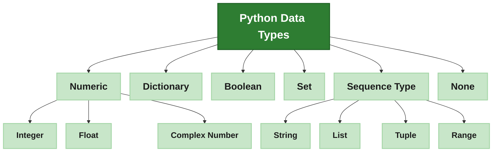
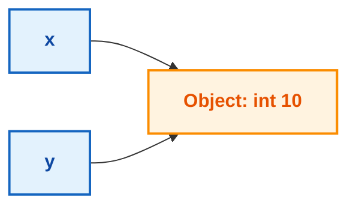
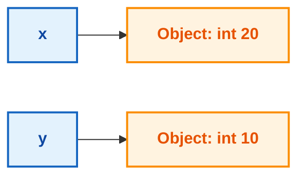
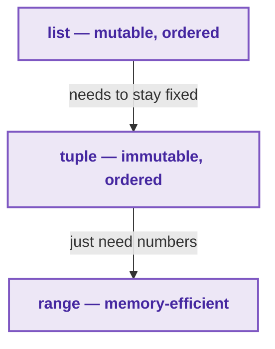
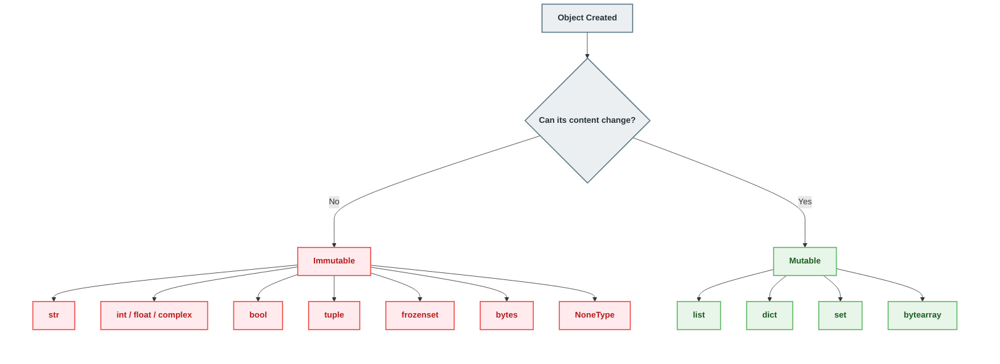
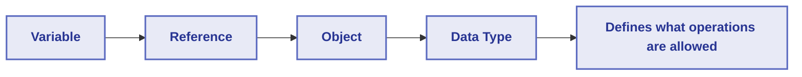

<div align="center">

# 🐍 Data Types

### The Complete Python Data Types Guide

*Everything you need to know about variables, memory, and every built-in data type in Python — explained in simple English, with copy-paste-ready code examples. Written for beginners, useful for advanced developers too.*


</div>

---

## 📖 About This Guide

This README covers **everything about Python data types** in one place:

- What data actually is, and what a data type is
- What a variable is, and how it really works inside Python's memory
- Every one of Python's **15 built-in data types**, explained one by one with real code
- **Type casting** — converting one type into another
- How Python's memory model works under the hood — `id()`, object identity, and integer caching
- Truthy/falsy values, `type()`, and `isinstance()`
- A full comparison table and quick revision section at the end

Every topic has runnable code examples in a code box, so you can copy them straight into your own `.py` file and try them yourself.

---

## 📚 Table of Contents

1. [The Python Data Types Map](#1-the-python-data-types-map)
2. [What Is Data?](#2-what-is-data)
3. [What Is a Data Type?](#3-what-is-a-data-type)
4. [What Is a Variable?](#4-what-is-a-variable)
5. [How Variables Work Inside Memory](#5-how-variables-work-inside-memory)
6. [Variable Naming Rules](#6-variable-naming-rules)
7. [Text — `str`](#7-text--str)
8. [Numeric Types — `int`, `float`, `complex`](#8-numeric-types--int-float-complex)
9. [Boolean — `bool`](#9-boolean--bool)
10. [Sequence Types — `list`, `tuple`, `range`](#10-sequence-types--list-tuple-range)
11. [Set Types — `set`, `frozenset`](#11-set-types--set-frozenset)
12. [Mapping — `dict`](#12-mapping--dict)
13. [Special Type — `None` / `NoneType`](#13-special-type--none--nonetype)
14. [Mutable vs Immutable](#14-mutable-vs-immutable)
15. [Dynamic Typing](#15-dynamic-typing)
16. [Type Casting](#16-type-casting)
17. [Truthy and Falsy Values](#17-truthy-and-falsy-values)
18. [Checking Types — `type()` and `isinstance()`](#18-checking-types--type-and-isinstance)
19. [The `id()` Function and Memory Sharing](#19-the-id-function-and-memory-sharing)
20. [Advanced Data Types — `bytes`, `bytearray`, `memoryview`](#20-advanced-data-types--bytes-bytearray-memoryview)
21. [Comparison Table — All Data Types](#21-comparison-table--all-data-types)
22. [Collection Comparisons](#22-collection-comparisons)
23. [Quick Revision](#23-quick-revision)
24. [📚 Further Reading](#24--further-reading)

---

## 1. The Python Data Types Map

This map shows the most common data types, grouped under the family they belong to.



> 💡 **How to read this map:** The dark green box is the main idea — Python Data Types. The light green boxes below it are the individual types you'll use in your code. `Numeric` breaks down into `Integer`, `Float`, and `Complex Number`. `Sequence Type` breaks down into `String`, `List`, `Tuple`, and `Range`. `Dictionary`, `Boolean`, `Set`, and `None` are complete types on their own.

> 🧩 **Not shown here:** `frozenset` (the fixed version of `set`) and three advanced binary types — `bytes`, `bytearray`, `memoryview` — are covered later in [Section 11](#11-set-types--set-frozenset) and [Section 20](#20-advanced-data-types--bytes-bytearray-memoryview). Counting everything, Python has **15 built-in data types** in total.

### 🔗 Learn More
- [Python Official Docs — Built-in Types](https://docs.python.org/3/library/stdtypes.html)
- [Real Python — Basic Data Types](https://realpython.com/python-data-types/)
- [Programiz — Python Data Types](https://www.programiz.com/python-programming/variables-datatypes)

---

## 2. What Is Data?

**Data** is any piece of information a computer can store or process — a number, a name, a photo, a sound, a yes/no answer. On its own, data is just raw bits (0s and 1s) sitting in memory. It doesn't mean anything until the computer knows **how to interpret it**.

For example, the bits `01000001` could mean the number `65`, or the letter `A`, or a tiny piece of an image — the computer only knows which one because something tells it what **type** that data is.

This is exactly the problem data types solve.

---

## 3. What Is a Data Type?

A **data type** tells Python two simple things about a piece of data:

1. **What kind of value it is** — text, a whole number, a decimal, true/false, a group of items, and so on.
2. **What you're allowed to do with it** — can you add it to another value? Loop over it? Change it after creating it?

Data types control the **format, structure, size, and range** of data — this is what makes sure your program uses data correctly and efficiently.

```python
print(5 + "5")
```

```text
TypeError: unsupported operand type(s) for +: 'int' and 'str'
```

Python refuses to run this because it doesn't know if you want `10` (adding numbers) or `"55"` (joining text). Data types force you to be clear about what you mean.

### 🔗 Learn More
- [Python Official Docs — Built-in Types](https://docs.python.org/3/library/stdtypes.html)
- [Real Python — Basic Data Types](https://realpython.com/python-data-types/)
- [W3Schools — Python Data Types](https://www.w3schools.com/python/python_datatypes.asp)

---

## 4. What Is a Variable?

A **variable** is a name. It points to a piece of data stored somewhere in memory.

Programs need to store and reuse data constantly — user input, scores, calculation results. Instead of remembering exact memory addresses, we give data a **simple, human-readable name**.

```python
age = 25
print(age)
```

```text
25
```

This line means: *"create a name called `age`, and point it at the value `25`."*

### 🔗 Learn More
- [Python Official Docs — Introduction to Python](https://docs.python.org/3/tutorial/introduction.html)
- [Real Python — Variables in Python](https://realpython.com/python-variables/)
- [W3Schools — Python Variables](https://www.w3schools.com/python/python_variables.asp)

---

## 5. How Variables Work Inside Memory

This is one of the most important ideas for a Python beginner to get right, so let's go slowly.

Most people imagine a variable as a **labeled box** that holds a value inside it. In Python, that mental picture is wrong. In Python, **everything is an object** — every number, every string, every list. A variable is just a **name that points to** one of these objects, like a **sticky note stuck onto a box**.

```python
x = 10
y = x
```

Here, `y` does **not** get its own copy of `10`. Both `x` and `y` are names pointing to the **same object** — the number `10`, sitting once in memory.



Now watch what happens when we reassign `x`:

```python
x = 20
print(x)
print(y)
```

```text
20
10
```

`x` does **not** change the object `10` into `20`. Instead, `x` simply **starts pointing at a new object**, `20`. The old object `10` still exists in memory, and `y` still points to it.



**Remember this idea for the rest of the guide: a variable is a name, not a container.** In [Section 19](#19-the-id-function-and-memory-sharing) you'll use Python's own `id()` function to prove this yourself.

### 🔗 Learn More
- [Python Official Docs — Data Model](https://docs.python.org/3/reference/datamodel.html)
- [Real Python — Variables, References, and Objects](https://realpython.com/pointers-in-python/)
- [GeeksforGeeks — Variables as References](https://www.geeksforgeeks.org/python-variables/)

---

## 6. Variable Naming Rules

Python has **hard rules** (break these and your code won't run) and **soft rules** (just good habits).

### 🔒 Hard Rules

| Rule | Valid Example | Invalid Example |
|---|---|---|
| Cannot start with a number | `age1` | `1age` ❌ |
| Only letters, digits, underscores allowed | `user_name` | `user-name` ❌ |
| Case-sensitive | `Age` ≠ `age` | — |
| Cannot use reserved keywords | `total` | `class` ❌ |
| No spaces allowed | `first_name` | `first name` ❌ |

```python
# ✅ Valid
user_name = "Malik"
_score = 100
total2 = 50

# ❌ Invalid (SyntaxError)
# 2total = 50
# user-name = "Malik"
```

### 🎨 Soft Rules (PEP 8 style guide)

| Convention | Example | Used For |
|---|---|---|
| `snake_case` | `first_name` | Regular variables |
| `UPPER_CASE` | `MAX_LIMIT` | Constants |
| Descriptive names | `total_price` not `tp` | Readability |
| Leading underscore | `_internal_value` | "Internal use" hint |

### 🔗 Learn More
- [Python Official Docs — Keywords](https://docs.python.org/3/reference/lexical_analysis.html#keywords)
- [PEP 8 — Style Guide for Python Code](https://peps.python.org/pep-0008/)
- [Programiz — Python Variables & Naming](https://www.programiz.com/python-programming/variables-datatypes)

---

## 7. Text — `str`

> A `str` (string) is how Python stores **text** — letters, words, sentences, or any group of characters.

**Why it exists:** programs deal with text constantly — names, messages, file paths. `str` gives Python a safe way to store it.

```python
text_double = "Hello, Python!"   # double quotes
text_single = 'Hello, Python!'   # single quotes
text_multi = """Hello,
Python!"""                       # triple quotes — multi-line text

print(type(text_double), text_double)
print(type(text_multi), text_multi)
```

```text
<class 'str'> Hello, Python!
<class 'str'> Hello,
Python!
```

**Which quotes to use:**
- **Double quotes** `"..."` — if your text already contains a single quote
- **Single quotes** `'...'` — if your text already contains a double quote
- **Triple quotes** `'''...'''` or `"""..."""` — for text spanning multiple lines

A string is **immutable** — once created, it can't be changed in place (more on this in [Section 14](#14-mutable-vs-immutable)), and it also behaves like a sequence — you can loop over it or index into individual characters.

### 🔗 Learn More
- [Python Official Docs — Text Sequence Type `str`](https://docs.python.org/3/library/stdtypes.html#text-sequence-type-str)
- [Real Python — Strings and Character Data](https://realpython.com/python-strings/)
- [W3Schools — Python Strings](https://www.w3schools.com/python/python_strings.asp)

---

## 8. Numeric Types — `int`, `float`, `complex`

> `int` — a whole number, positive or negative, no decimal point.
> `float` — a number with a decimal point.
> `complex` — a number with a real part and an imaginary part, used in advanced math.

**Why they exist:** a count ("3 apples") doesn't need decimals; a measurement ("3.75 kg") does. Splitting numbers into `int` and `float` lets Python handle each correctly and efficiently.

```python
num_int = 42
num_float = 3.14
num_complex = 2 + 3j

print(type(num_int), num_int)
print(type(num_float), num_float)
print(type(num_complex), num_complex)
```

```text
<class 'int'> 42
<class 'float'> 3.14
<class 'complex'> (2+3j)
```

### Pulling apart a complex number

A `complex` number has two pieces — a real part and an imaginary part. Python gives you `.real` and `.imag` so you never have to calculate them yourself.

```python
z = 3 + 4j

print("Real Part:", z.real)
print("Imaginary Part:", z.imag)
```

```text
Real Part: 3.0
Imaginary Part: 4.0
```

**When to use which:**
- `int` → counting, positions, whole quantities
- `float` → measurements, prices, decimals
- `complex` → engineering / scientific math, rarely needed as a beginner

### 🔗 Learn More
- [Python Official Docs — Numeric Types](https://docs.python.org/3/library/stdtypes.html#numeric-types-int-float-complex)
- [Real Python — Numbers in Python](https://realpython.com/python-numbers/)
- [GeeksforGeeks — Numbers in Python](https://www.geeksforgeeks.org/python-numbers/)

---

## 9. Boolean — `bool`

> A `bool` can only be one of two values: `True` or `False`.

**Why it exists:** programs constantly need to make decisions — "is the user logged in?", "is the cart empty?" Booleans give Python a clean way to answer yes/no questions.

```python
is_python_fun = True

print(type(is_python_fun), is_python_fun)
print(5 > 3)   # comparisons produce booleans too
```

```text
<class 'bool'> True
True
```

> 💡 **Fun fact:** `bool` is actually a special type of `int` in Python — `True` behaves like `1`, and `False` behaves like `0`.

```python
print(True == 1)
print(False == 0)
print(True + True)
```

```text
True
True
2
```

### 🔗 Learn More
- [Python Official Docs — Boolean Type `bool`](https://docs.python.org/3/library/stdtypes.html#boolean-type-bool)
- [Real Python — Booleans in Python](https://realpython.com/python-boolean/)
- [Programiz — Python Booleans](https://www.programiz.com/python-programming/variables-datatypes)

---

## 10. Sequence Types — `list`, `tuple`, `range`

> `list` — an **ordered group you can change**.
> `tuple` — an **ordered group you cannot change**.
> `range` — a fast, memory-saving way to represent a sequence of numbers.

**Why they exist:** you often need to store many values together, not just one. `list` handles this and can even mix types. But sometimes a group must never change once created — that's `tuple`. And when you only need a run of numbers, `range` avoids storing every number in memory.

```python
my_list = [1, 2, 3, "Python", 3.14, 3 + 2j]
my_tuple = (1, 2, 3, "AI", 2.71, False)
num_range = range(1, 10, 2)   # range(start, stop, step)

print(type(my_list), my_list)
print(type(my_tuple), my_tuple)
print(type(num_range), list(num_range))
```

```text
<class 'list'> [1, 2, 3, 'Python', 3.14, (3+2j)]
<class 'tuple'> (1, 2, 3, 'AI', 2.71, False)
<class 'range'> [1, 3, 5, 7, 9]
```

`range(1, 10, 2)` means: start at `1`, stop before `10`, jump by `2` each time. It's most often used in loops:

```python
for i in range(1, 10, 2):
    print(i)
```

```text
1
3
5
7
9
```

### `list` vs `tuple` vs `range`



### 🔗 Learn More
- [Python Official Docs — Sequence Types](https://docs.python.org/3/library/stdtypes.html#sequence-types-list-tuple-range)
- [Real Python — Lists and Tuples](https://realpython.com/python-lists-tuples/)
- [W3Schools — Python Lists](https://www.w3schools.com/python/python_lists.asp)

---

## 11. Set Types — `set`, `frozenset`

> `set` — an **unordered group of unique** items (no duplicates).
> `frozenset` — the **fixed, unchangeable version** of a set.

**Why they exist:** sometimes order doesn't matter, but every item must be unique — like a list of visitor IDs. `set` removes duplicates automatically. `frozenset` exists for when that uniqueness must never change again — for example, using it as a fixed constant, or as a key inside a dictionary.

```python
my_set = {1, 2, 33, 4, 4, 5}
frozen_set = frozenset([11, 2, 3, 4, 4, 5])

print(type(my_set), my_set)
print(type(frozen_set), frozen_set)
```

```text
<class 'set'> {1, 2, 33, 4, 5}
<class 'frozenset'> frozenset({1, 2, 33, 4, 5})
```

> 💡 Notice the duplicate `4` disappeared automatically in both, and the printed order isn't guaranteed to match what you typed.

### 🔗 Learn More
- [Python Official Docs — Set Types](https://docs.python.org/3/library/stdtypes.html#set-types-set-frozenset)
- [Real Python — Sets in Python](https://realpython.com/python-sets/)
- [GeeksforGeeks — Python Sets](https://www.geeksforgeeks.org/python-sets/)

---

## 12. Mapping — `dict`

> A `dict` (dictionary) stores data as **key–value pairs**. You use a key to instantly look up its value, instead of a number position.

**Why it exists:** some data is naturally labeled rather than ordered by position — like a real dictionary, where you look up a word to find its meaning. `dict` lets you find data instantly by name.

```python
my_dict = {"name": "Alice", "age": 25, "language": "Python"}

print(type(my_dict), my_dict)
print(my_dict["name"])
```

```text
<class 'dict'> {'name': 'Alice', 'age': 25, 'language': 'Python'}
Alice
```

### 🔗 Learn More
- [Python Official Docs — Mapping Type `dict`](https://docs.python.org/3/library/stdtypes.html#mapping-types-dict)
- [Real Python — Dictionaries in Python](https://realpython.com/python-dicts/)
- [W3Schools — Python Dictionaries](https://www.w3schools.com/python/python_dictionaries.asp)

---

## 13. Special Type — `None` / `NoneType`

> `None` is a special value meaning **"no value"** or **"nothing here."** Its data type is `NoneType`.

**Why it exists:** sometimes a variable needs to exist before you know its final value — like a result you haven't calculated yet. `None` lets you say "this is empty on purpose," instead of using a confusing placeholder like `0` or `""`.

```python
result = None
print(result)
print(type(result))
```

```text
None
<class 'NoneType'>
```

**`None` is not the same as:**

| Value | Meaning |
|---|---|
| `None` | On purpose, "no value" |
| `0` | The number zero |
| `False` | The boolean false |
| `""` | An empty string |

### `None` is a singleton — there's only ever one

Python creates exactly **one** `None` object when it starts. Every variable holding `None` points to that same single object:

```python
x = None
y = None
z = x

print(x == y)          # True — same value
print(x is y)           # True — same object in memory
print(id(x) == id(y))   # True — same memory address
```

```text
True
True
True
```

`None` is also treated as `False` inside an `if` statement — see [Section 17](#17-truthy-and-falsy-values) for the full list of falsy values.

### 🔗 Learn More
- [Python Official Docs — The `None` Object](https://docs.python.org/3/library/constants.html#None)
- [Real Python — Null in Python: Understanding None](https://realpython.com/null-in-python/)
- [Programiz — Python None Keyword](https://www.programiz.com/python-programming/keyword-list)

---

## 14. Mutable vs Immutable

> **Mutable** = you **can** change the content after creation.
> **Immutable** = you **cannot** change the content — any "change" makes a brand-new object.



```python
# Mutable — the SAME list object is changed
fruits = ["apple", "banana"]
fruits.append("cherry")
print(fruits)

# Immutable — a NEW string object is created
name = "Malik"
name = name + " Khan"
print(name)
```

```text
['apple', 'banana', 'cherry']
Malik Khan
```

**Why this matters:** if two variables point to the same **mutable** object, changing it through one variable also changes it for the other. This follows directly from the "variables are names, not containers" idea in [Section 5](#5-how-variables-work-inside-memory).

### 🔗 Learn More
- [Python Official Docs — Data Model, Mutability](https://docs.python.org/3/reference/datamodel.html#objects-values-and-types)
- [Real Python — Mutable vs Immutable Objects](https://realpython.com/courses/immutability-python/)
- [GeeksforGeeks — Mutable and Immutable in Python](https://www.geeksforgeeks.org/mutable-vs-immutable-objects-in-python/)

---

## 15. Dynamic Typing

Python is **dynamically typed** — you never declare a variable's type in advance. Python figures it out on its own, and a variable can be given a **different type** at any time.

```python
value = 10
print(type(value))

value = "ten"
print(type(value))

value = [10]
print(type(value))
```

```text
<class 'int'>
<class 'str'>
<class 'list'>
```

> ⚠️ This does **not** mean the number `10` "turned into" text. It means the name `value` was **pointed at a new object** each time — same idea as [Section 5](#5-how-variables-work-inside-memory).

### 🔗 Learn More
- [Python Official Docs — Dynamic Typing Discussion](https://docs.python.org/3/faq/programming.html)
- [Real Python — Python's Dynamic Typing](https://realpython.com/python-type-checking/)
- [W3Schools — Python Variables](https://www.w3schools.com/python/python_variables.asp)

---

## 16. Type Casting

**Type casting** means converting a value from one data type to another. Python does this two ways.

### Implicit Type Casting (Python does it automatically)

When you mix compatible numeric types, Python converts the "smaller" type into the "bigger" one for you.

```python
i = 10        # int
j = 20.6      # float

f = i + j     # Python quietly converts i to a float before adding
print(f, type(f))
```

```text
30.6 <class 'float'>
```

### Explicit Type Casting (you do it on purpose)

Use built-in functions like `int()`, `float()`, `str()`, or `bool()` to convert a value yourself.

```python
f1 = 66.89
i1 = int(f1)          # float -> int: this TRUNCATES, it does not round
print(i1, type(i1))

s = "25.8"
f2 = float(s)          # numeric string -> float
print(f2, type(f2))
```

```text
66 <class 'int'>
25.8 <class 'float'>
```

> ⚠️ **Watch out:** `int()` on a float always **cuts off** the decimal — `int(66.89)` gives `66`, never rounds up.

> ⚠️ **Watch out:** converting a non-numeric string with `int()` crashes your program:
> ```python
> int("hello")   # ValueError: invalid literal for int() with base 10: 'hello'
> ```

### 🔗 Learn More
- [Python Official Docs — Built-in Functions](https://docs.python.org/3/library/functions.html)
- [Real Python — Type Conversion in Python](https://realpython.com/python-data-types/#type-conversion)
- [GeeksforGeeks — Type Casting in Python](https://www.geeksforgeeks.org/type-casting-in-python/)

---

## 17. Truthy and Falsy Values

Every value in Python can be tested as `True` or `False` in an `if` statement, even if it isn't a `bool`. Values that act like `True` are **truthy**; values that act like `False` are **falsy**.

**Falsy values (memorize this short list — there's nothing else):**
- `0` and `0.0`
- `""` (empty string)
- `[]`, `{}`, `()`, `set()` (any empty collection)
- `None`

**Everything else is truthy**, including negative numbers and any collection with at least one item.

```python
print(bool(0))
print(bool(""))
print(bool([]))
print(bool("55"))
print(bool([1, 2, 3]))
print(bool(-9))
```

```text
False
False
False
True
True
True
```

This is why you'll often see `if my_list:` instead of `if len(my_list) > 0:` — Python already treats an empty list as falsy.

### 🔗 Learn More
- [Python Official Docs — Truth Value Testing](https://docs.python.org/3/library/stdtypes.html#truth-value-testing)
- [Real Python — Truthy and Falsy Values](https://realpython.com/python-boolean/#truth-value-testing)
- [GeeksforGeeks — Truthy and Falsy Values in Python](https://www.geeksforgeeks.org/python-boolean-values/)

---

## 18. Checking Types — `type()` and `isinstance()`

### `type()`

Tells you exactly what type a variable currently points to.

```python
age = 25
name = "Malik"
active = True

print(type(age))
print(type(name))
print(type(active))
```

```text
<class 'int'>
<class 'str'>
<class 'bool'>
```

### `isinstance()`

Asks a yes/no question: *"is this object an instance of this type?"* It's usually the better choice inside `if` statements.

```python
age = 25
weight = 63.5

print(isinstance(age, int))
print(isinstance(weight, int))
print(isinstance(weight, float))
print(isinstance(age, (int, float)))   # check against multiple types at once
```

```text
True
False
True
True
```

### 🔗 Learn More
- [Python Official Docs — `type()`](https://docs.python.org/3/library/functions.html#type)
- [Python Official Docs — `isinstance()`](https://docs.python.org/3/library/functions.html#isinstance)
- [Real Python — Checking Types in Python](https://realpython.com/python-type-checking/)

---

## 19. The `id()` Function and Memory Sharing

Every object in Python lives somewhere in memory, and `id()` gives you that object's unique identifier — like its home address.

```python
x = None
y = None
z = x

print("id(x) =", id(x))
print("id(y) =", id(y))
print("id(z) =", id(z))
print("x is y =", x is y)
```

```text
id(x) = 9691392
id(y) = 9691392
id(z) = 9691392
x is y = True
```

All three point to the exact same object — because there's only ever **one** `None` in your whole program.

### `==` vs `is` — don't mix them up

- `==` asks: *"do these two objects have the **same value**?"*
- `is` asks: *"are these two objects **literally the same object** in memory?"*

```python
a = [1, 2, 3]
b = [1, 2, 3]

print(a == b)   # True — same values
print(a is b)   # False — two separate objects
```

```text
True
False
```

### Small integers are secretly cached

CPython (the standard Python) keeps a ready-made pool of small integers, **-5 to 256**. Any time your code uses one of these, Python reuses the same object instead of making a new one — purely for speed.

```python
x = 100
y = 100
print(x is y)   # True — both reuse the cached object

a = 500
b = 500
print(a is b)   # Usually False — 500 is outside the cached range
```

```text
True
False
```

> ⚠️ This caching is an internal detail of CPython, not a language rule — never rely on `is` to compare numbers in real code. Use `==` for values, and save `is` for checking `None` (`if x is None:`) or confirming two variables point to the exact same object on purpose.

### 🔗 Learn More
- [Python Official Docs — `id()`](https://docs.python.org/3/library/functions.html#id)
- [Python Official Docs — `is` operator](https://docs.python.org/3/reference/expressions.html#is)
- [Real Python — Identity vs Equality in Python](https://realpython.com/python-is-identity-vs-equality/)

---

## 20. Advanced Data Types — `bytes`, `bytearray`, `memoryview`

These three types don't come up in everyday beginner code, but every Python developer eventually needs them — for reading files, sending data over a network, or working with images.

> `bytes` — a **fixed** sequence of raw byte values (0–255).
> `bytearray` — a **changeable** sequence of raw byte values.
> `memoryview` — lets you look at (and edit) another object's memory **without copying it**.

**Why they exist:** not everything is text or numbers. Images, audio, and network data are stored as raw **binary data**. Python needs dedicated types to handle this safely, without mistaking it for normal text.

```python
byte_data = b"Hello"
print(type(byte_data), byte_data)
```

```text
<class 'bytes'> b'Hello'
```

`bytearray` works the same way, but you can change it after creating it:

```python
byte_array = bytearray([72, 101, 108, 108, 111])
print(type(byte_array), byte_array)

byte_array[0] = 74   # change the first byte
print(byte_array)
```

```text
<class 'bytearray'> bytearray(b'Hello')
bytearray(b'Jello')
```

**Where do those numbers come from?** Computers store text as numbers using an encoding. **ASCII** is the simplest one — it maps 128 characters to numbers 0–127. **UTF-8** is a more modern encoding that can represent every character in every language. Python converts between raw bytes and readable text with `.decode()`:

```python
data = bytearray([72, 101, 108, 108, 111])
print(data.decode('utf-8'))
```

```text
Hello
```

`memoryview` lets you peek at binary data without copying it:

```python
mem_view = memoryview(b"Operation Data")
print(type(mem_view))
print(bytes(mem_view[0:5]))
```

```text
<class 'memoryview'>
b'Opera'
```

### 🔗 Learn More
- [Python Official Docs — Binary Sequence Types](https://docs.python.org/3/library/stdtypes.html#binary-sequence-types-bytes-bytearray-memoryview)
- [Real Python — Working With Binary Data](https://realpython.com/python-bytes/)
- [GeeksforGeeks — Python Bytes](https://www.geeksforgeeks.org/python-bytes-array/)

---

## 21. Comparison Table — All Data Types

| Type | Stores | Ordered? | Mutable? | Duplicates? | Main Purpose |
|---|---|---|---|---|---|
| `str` | Text | ✅ Yes | ❌ No | ✅ Yes | Represent text |
| `int` | Whole numbers | — | ❌ No | — | Counting, whole values |
| `float` | Decimal numbers | — | ❌ No | — | Measurements, precision |
| `complex` | Real + imaginary numbers | — | ❌ No | — | Scientific/engineering math |
| `bool` | True / False | — | ❌ No | — | Logic & conditions |
| `list` | Any values | ✅ Yes | ✅ Yes | ✅ Yes | Ordered, changeable group |
| `tuple` | Any values | ✅ Yes | ❌ No | ✅ Yes | Ordered, fixed group |
| `range` | Number sequence | ✅ Yes | ❌ No | ✅ Yes | Efficient number generation |
| `set` | Any values | ❌ No | ✅ Yes | ❌ No | Unique, unordered items |
| `frozenset` | Any values | ❌ No | ❌ No | ❌ No | Fixed, unique items |
| `dict` | Key–value pairs | ✅ Yes* | ✅ Yes | Keys: ❌ No | Fast lookup by key |
| `bytes` | Raw byte data | ✅ Yes | ❌ No | ✅ Yes | Fixed binary data |
| `bytearray` | Raw byte data | ✅ Yes | ✅ Yes | ✅ Yes | Editable binary data |
| `memoryview` | View of binary data | ✅ Yes | Depends | — | Access memory without copying |
| `NoneType` | Nothing / no value | — | ❌ No | — | Represent absence of a value |

*\*`dict` keeps insertion order since Python 3.7, but it's not "ordered" the same way a list is.*

---

## 22. Collection Comparisons

### List vs Tuple

| | `list` | `tuple` |
|---|---|---|
| Changeable? | ✅ Yes | ❌ No |
| Syntax | `[1, 2, 3]` | `(1, 2, 3)` |
| Best for | Data that will change | Data that must stay fixed |

### List vs Set

| | `list` | `set` |
|---|---|---|
| Order kept? | ✅ Yes | ❌ No |
| Duplicates allowed? | ✅ Yes | ❌ No |
| Best for | Ordered groups | Unique-value groups |

### List vs Dictionary

| | `list` | `dict` |
|---|---|---|
| Access by | Position (index) | Key (label) |
| Syntax | `["a", "b"]` | `{"key": "value"}` |
| Best for | Sequences of items | Labeled, related data |

### Set vs Frozenset

| | `set` | `frozenset` |
|---|---|---|
| Mutable? | ✅ Yes | ❌ No |
| Can be a dict key? | ❌ No | ✅ Yes |
| Best for | Changing unique groups | Fixed unique groups |

### Tuple vs Dictionary

| | `tuple` | `dict` |
|---|---|---|
| Structure | Ordered values | Key–value pairs |
| Access by | Position | Key |
| Best for | Fixed grouped values | Labeled data |

### 🔗 Learn More
- [Python Official Docs — Data Structures](https://docs.python.org/3/tutorial/datastructures.html)
- [Real Python — Choosing the Right Python Data Structure](https://realpython.com/python-data-structures/)
- [GeeksforGeeks — Python Data Structures](https://www.geeksforgeeks.org/python-data-structures/)

---

## 23. Quick Revision



- A **variable** is a name that points to an **object** — it does not contain the value itself.
- Every object has a **data type**, which decides what you can do with it.
- Python has **15 built-in data types**, grouped into families: Text, Numeric, Boolean, Sequence, Set, Mapping, Binary, Special.
- Types are either **mutable** (can change) or **immutable** (cannot change).
- Python is **dynamically typed** — a variable's type can change just by reassigning it.
- **Type casting** converts one type into another, either automatically (implicit) or on purpose (explicit).
- `type()` and `isinstance()` check what type you're working with; `id()` shows exactly where an object lives in memory.
- CPython caches small integers (-5 to 256) — this is why `is` should never be used to compare numeric values.

---

## 24. 📚 Further Reading

> Want to go deeper on any topic in this guide? Start here.

| Topic | Resource |
|---|---|
| Official reference | [Python Docs — Built-in Types](https://docs.python.org/3/library/stdtypes.html) |
| Deep tutorials | [Real Python — Python Data Types](https://realpython.com/python-data-types/) |
| Beginner-first explanations | [Programiz — Python Data Types](https://www.programiz.com/python-programming/variables-datatypes) |
| Quick reference | [W3Schools — Python Data Types](https://www.w3schools.com/python/python_datatypes.asp) |
| Practice problems | [GeeksforGeeks — Python Data Types](https://www.geeksforgeeks.org/python-data-types/) |
| Style guide | [PEP 8 — Style Guide for Python Code](https://peps.python.org/pep-0008/) |
| Memory & identity | [Python Docs — `is` and object identity](https://docs.python.org/3/reference/expressions.html#is) |
| Built-in functions reference | [Python Docs — Built-in Functions](https://docs.python.org/3/library/functions.html) |
| Data structures | [Python Docs — Data Structures Tutorial](https://docs.python.org/3/tutorial/datastructures.html) |

---

<div align="center">

### 🎉 You made it!

You now understand what data and data types are, how variables really work in memory, every built-in Python data type, and how to convert between them.

**Next step:** open a Python file and try every example in this guide yourself. 🐍

</div>