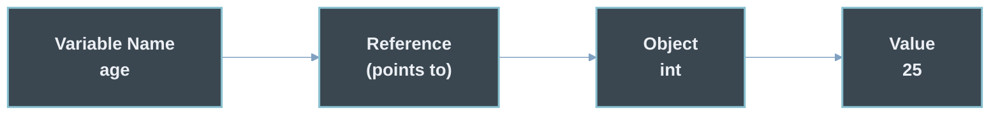
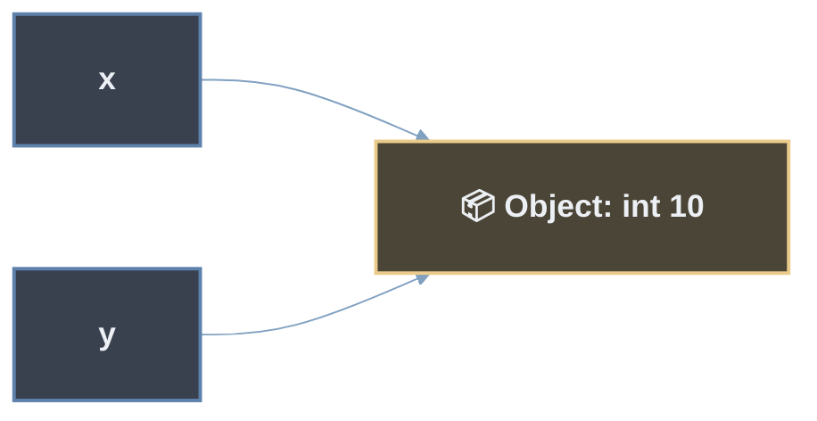
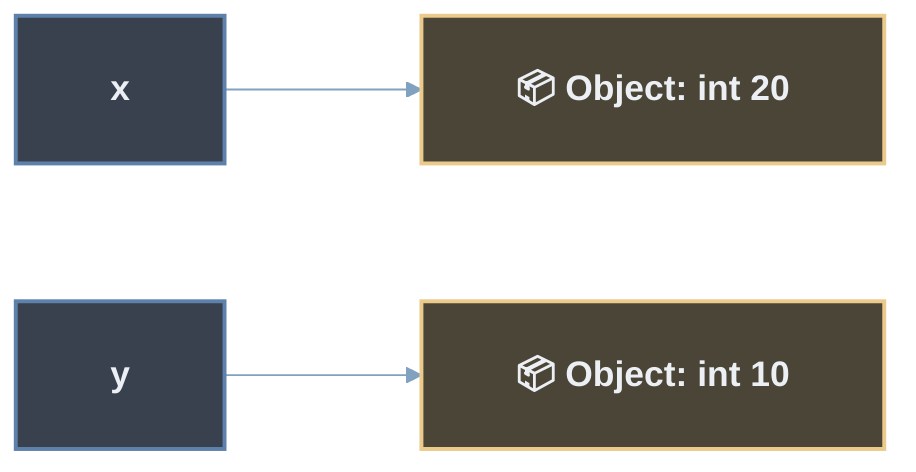
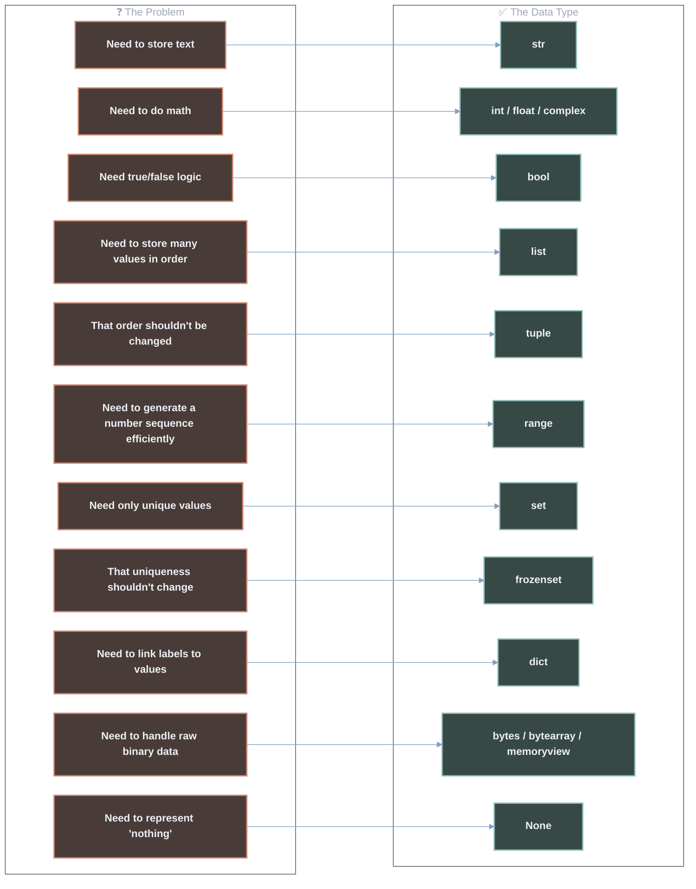
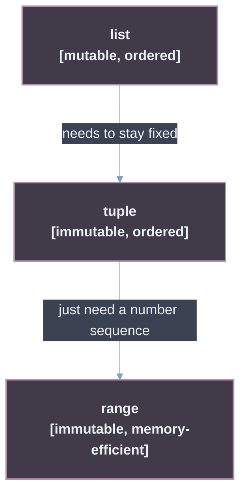
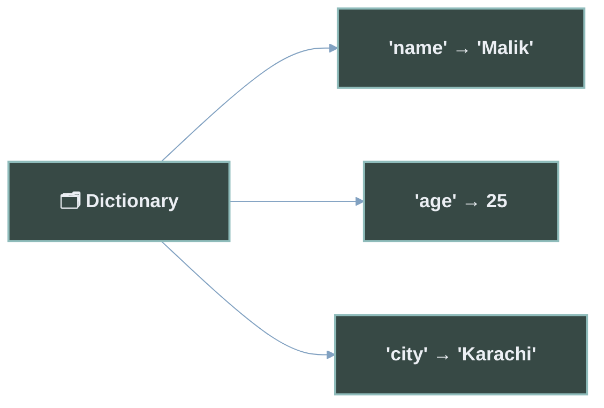
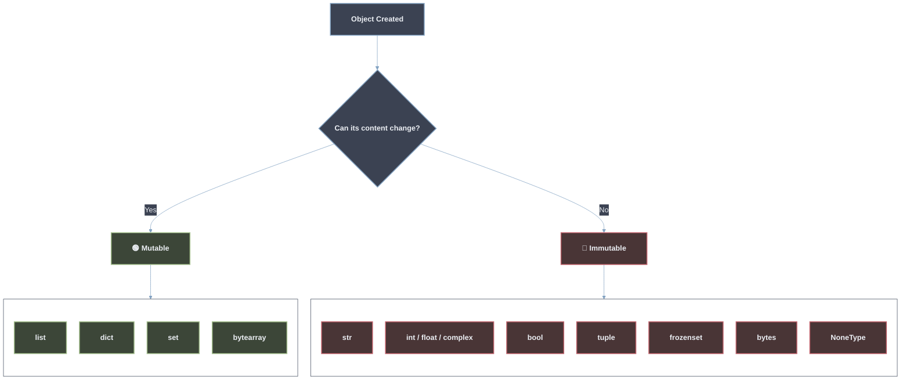
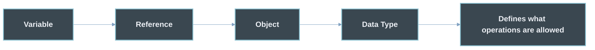

<div align="center">

# 🐍 Python Data Types

### Learn Python Data Types the Easy Way

*A simple, beginner-friendly guide to variables, objects, and every built-in Python data type — explained in plain words.*


</div>

---

## 🗺️ The Python Data Types Map

Here is the big picture first. Every data type in Python belongs to one of these groups. Look at this map before you read anything else — you will come back to it many times.

```mermaid
%%{init: {'theme': 'base', 'themeVariables': {'background': '#F2F2F2', 'primaryColor': '#C8E6C9', 'primaryTextColor': '#1B1B1B', 'primaryBorderColor': '#A5D6A7', 'lineColor': '#333333', 'fontSize': '22px', 'fontFamily': 'Segoe UI, Arial, sans-serif'}, 'flowchart': {'useMaxWidth': true, 'htmlLabels': true, 'nodeSpacing': 60, 'rankSpacing': 110, 'curve': 'basis', 'padding': 24} } }%%
flowchart TB
    ROOT{{"🐍 Python Data Types"}}

    ROOT --> TEXT(["📝 Text"])
    ROOT --> NUM(["🔢 Numeric"])
    ROOT --> BOOL(["✅ Boolean"])
    ROOT --> SEQ(["📦 Sequence"])
    ROOT --> SET(["🔹 Set"])
    ROOT --> MAP(["🗂️ Dictionary"])
    ROOT --> BIN(["💾 Binary"])
    ROOT --> SPEC(["🚫 Special"])

    TEXT --> str["String"]

    NUM --> int["Integer"]
    NUM --> float["Float"]
    NUM --> complexn["Complex Number"]

    BOOL --> booln["True / False"]

    SEQ --> list["List"]
    SEQ --> tuple["Tuple"]
    SEQ --> range["Range"]

    SET --> set1["Set"]
    SET --> frozenset["Frozenset"]

    MAP --> dict["Dict"]

    BIN --> bytes["Bytes"]
    BIN --> bytearray["Bytearray"]
    BIN --> memoryview["Memoryview"]

    SPEC --> none["None"]

    classDef root fill:#2E7D32,color:#FFFFFF,stroke:#1B5E20,stroke-width:3px,font-weight:bold,font-size:26px
    classDef category fill:#66BB6A,color:#FFFFFF,stroke:#1B5E20,stroke-width:2px,font-weight:bold,font-size:22px
    classDef leaf fill:#C8E6C9,color:#1B1B1B,stroke:#A5D6A7,stroke-width:2px,font-weight:bold,font-size:20px

    class ROOT root
    class TEXT,NUM,BOOL,SEQ,SET,MAP,BIN,SPEC category
    class str,int,float,complexn,booln,list,tuple,range,set1,frozenset,dict,bytes,bytearray,memoryview,none leaf
```



> 💡 **How to read this map:** The dark green box at the top is the main idea. The medium green boxes are the 8 groups (families) of data types. The light green boxes are the actual data types you will use in your code.

> ⚠️ **Note on `str`:** A string acts a bit like a list (you can loop over it and pick letters from it). But for now, it's easier to just think of `str` as **Text**. We explain this more later in the guide.

### 🔗 Learn More
> **You can learn more about this topic here >>>>>**
- [Python Official Docs — Built-in Types](https://docs.python.org/3/library/stdtypes.html)
- [Real Python — Basic Data Types](https://realpython.com/python-data-types/)
- [Programiz — Python Data Types](https://www.programiz.com/python-programming/variables-datatypes)

---

## 📖 Introduction

If you are new to Python, this guide is made for you. It does not just give you a list of data types. It explains everything **step by step**, starting with the first question every beginner should ask: *what is a variable?*

By the end of this guide, you will know **what each data type is, why it exists, and when to use it.**

---

## 📚 Table of Contents

1. [What Is a Variable?](#1-what-is-a-variable)
2. [How Variables Work Internally](#2-how-variables-work-internally)
3. [Variable Naming Rules](#3-variable-naming-rules)
4. [What Are Data Types?](#4-what-are-data-types)
5. [Why Different Data Types Exist](#5-why-different-data-types-exist)
6. [Text — `str`](#6-text--str)
7. [Numeric Types — `int`, `float`, `complex`](#7-numeric-types--int-float-complex)
8. [Boolean — `bool`](#8-boolean--bool)
9. [Sequence Types — `list`, `tuple`, `range`](#9-sequence-types--list-tuple-range)
10. [Set Types — `set`, `frozenset`](#10-set-types--set-frozenset)
11. [Mapping — `dict`](#11-mapping--dict)
12. [Binary Types — `bytes`, `bytearray`, `memoryview`](#12-binary-types--bytes-bytearray-memoryview)
13. [Special — `None` / `NoneType`](#13-special--none--nonetype)
14. [Mutable vs Immutable](#14-mutable-vs-immutable)
15. [Dynamic Typing](#15-dynamic-typing)
16. [Checking Types with `type()`](#16-checking-types-with-type)
17. [Things Beginners Often Don't Know](#17-things-beginners-often-dont-know)
18. [Comparison Table — All Data Types](#18-comparison-table--all-data-types)
19. [Collection Comparisons](#19-collection-comparisons)
20. [Quick Revision](#20-quick-revision)
21. [Further Learning](#21-further-learning)

---

## 1. What Is a Variable?

A **variable** is just a name. It points to a piece of data that is stored in your computer's memory.

Programs need to store and reuse data all the time — like names, scores, or the result of a calculation. Instead of remembering complex memory locations, we give the data a **simple, easy-to-remember name**.

```python
age = 25
```

This line means: *"Create a name called `age`, and let it point to the value `25`."*



> 💡 **Key idea:** Think of a Python variable as a **name tag stuck on an object** — not as a box that holds the value inside it. This small difference matters a lot, and we explain it more in the next section.

### 🔗 Learn More
> **You can learn more about this topic here >>>>>**
- [Python Official Docs — Introduction to Python](https://docs.python.org/3/tutorial/introduction.html)
- [Real Python — Variables in Python](https://realpython.com/python-variables/)
- [W3Schools — Python Variables](https://www.w3schools.com/python/python_variables.asp)

---

## 2. How Variables Work Internally

Most beginners think of a variable like a **box** that holds a value inside it. In Python, that's not really true.

In Python, **everything is an object** — numbers, text, lists, everything. A variable is just a **name that points to** one of these objects. Think of it like a **sticky note with a name written on it, stuck on a box**. The box is the object. You can peel the sticky note off and stick it on a different box any time.

```python
x = 10
y = x
```

Here, `y` does not get its own copy of `10`. Both `x` and `y` are just names **pointing to the same object** — the number `10`.



Now watch what happens when we reassign `x`:

```python
x = 20
```

`x` does **not** turn the object `10` into `20`. Instead, `x` simply **starts pointing to a new object**, `20`. The old object `10` still exists, and `y` still points to it.



Remember this idea for the whole guide: **a variable is a name, not a container.**

### 🔗 Learn More
> **You can learn more about this topic here >>>>>**
- [Python Official Docs — Data Model](https://docs.python.org/3/reference/datamodel.html)
- [Real Python — Variables, References, and Objects](https://realpython.com/pointers-in-python/)
- [GeeksforGeeks — Variables as References](https://www.geeksforgeeks.org/python-variables/)

---

## 3. Variable Naming Rules

Python has two kinds of naming rules: **hard rules** that Python forces you to follow, and **soft rules** that are just good habits.

> **Hard Rule = Python will not run your code if you break it.**
> **Soft Rule = Your code still runs, but it's better if you follow it.**

### 🔒 Hard Rules (Python forces these)

| Rule | Valid Example | Invalid Example |
|---|---|---|
| Cannot start with a number | `age1` | `1age` ❌ |
| Only letters, digits, underscores allowed | `user_name` | `user-name` ❌ |
| Case-sensitive | `Age` ≠ `age` | — |
| Cannot use reserved keywords | `total` | `class` ❌ (reserved) |
| No spaces allowed | `first_name` | `first name` ❌ |

```python
# ✅ Valid
user_name = "Malik"
_score = 100
total2 = 50

# ❌ Invalid (would cause a SyntaxError)
# 2total = 50
# user-name = "Malik"
```

### 🎨 Soft Rules (good habits — PEP 8)

| Convention | Example | Used For |
|---|---|---|
| `snake_case` | `first_name` | Regular variables |
| `UPPER_CASE` | `MAX_LIMIT` | Constants |
| Descriptive names | `total_price` not `tp` | Easy to read |
| Leading underscore | `_internal_value` | Shows "internal use" |

Python doesn't force these rules — your code will still work if you ignore them. But following them makes your code much easier to read, both for you and for other people.

### 🔗 Learn More
> **You can learn more about this topic here >>>>>**
- [Python Official Docs — Keywords](https://docs.python.org/3/reference/lexical_analysis.html#keywords)
- [PEP 8 — Style Guide for Python Code](https://peps.python.org/pep-0008/)
- [Programiz — Python Variables & Naming](https://www.programiz.com/python-programming/variables-datatypes)

---

## 4. What Are Data Types?

A **data type** tells Python two simple things:

1. **What kind of value it is** (text, number, true/false, a group of items, etc.)
2. **What you are allowed to do with it** (can you add it? loop over it? change it?)

Simple example: you handle a *letter*, a *coin*, and a *photo* in different ways, even though all three are physical things. Data types work the same way — **different kinds of data need different rules.**

```text
Value            → The actual piece of data
Object           → How Python stores that value in memory
Data Type        → The rules that object must follow
Variable         → The name we use to point to that object
```

Without data types, Python would not know if `5 + "5"` should give `10`, or `"55"`, or an error. (It actually gives an error, because mixing a number and text like this is not allowed.)

### 🔗 Learn More
> **You can learn more about this topic here >>>>>**
- [Python Official Docs — Built-in Types](https://docs.python.org/3/library/stdtypes.html)
- [Real Python — Basic Data Types](https://realpython.com/python-data-types/)
- [W3Schools — Python Data Types](https://www.w3schools.com/python/python_datatypes.asp)

---

## 5. Why Different Data Types Exist

Every data type was made to solve **one specific problem**.



Keep asking this question in every section below: **"what problem does this data type solve?"**

---

## 6. Text — `str`

### 📌 Definition
> A `str` (string) is how Python stores **text** — letters, words, sentences, or any group of characters.

**Why it exists:** Programs deal with text all the time — names, messages, file paths, labels. `str` gives Python a safe way to store and work with that text.

**Key points:**
- Written with single quotes `'...'`, double quotes `"..."`, or triple quotes `'''...'''`
- Cannot be changed after it's created (more on this in [Mutable vs Immutable](#14-mutable-vs-immutable))
- Behaves a bit like a list of characters (more on this later too)

```python
name = "Malik"
message = 'Hello, world!'
paragraph = """This is
a multi-line string."""

print(name)
print(message)
```

```text
Malik
Hello, world!
```

### 🔗 Learn More
> **You can learn more about this topic here >>>>>**
- [Python Official Docs — Text Sequence Type `str`](https://docs.python.org/3/library/stdtypes.html#text-sequence-type-str)
- [Real Python — Strings and Character Data](https://realpython.com/python-strings/)
- [W3Schools — Python Strings](https://www.w3schools.com/python/python_strings.asp)

---

## 7. Numeric Types — `int`, `float`, `complex`

### 📌 Definitions

> `int` — a whole number, positive or negative, with no decimal point.
> `float` — a number that has a decimal point.
> `complex` — a number used in advanced math, made of a real part and an imaginary part.

**Why they exist:** Numbers are not all the same. A count (like "3 apples") doesn't need decimals. A measurement (like "3.75 kg") does. Splitting numbers into `int` and `float` lets Python handle each one the right way.

```python
apples = 3            # int
price = 3.75           # float
signal = 2 + 3j        # complex

print(type(apples))
print(type(price))
print(type(signal))
```

```text
<class 'int'>
<class 'float'>
<class 'complex'>
```

**When to use which:**
- `int` → counting things, positions, whole quantities
- `float` → measurements, prices, science data, anything with decimals
- `complex` → mostly used in engineering and scientific math, rarely needed as a beginner

### 🔗 Learn More
> **You can learn more about this topic here >>>>>**
- [Python Official Docs — Numeric Types](https://docs.python.org/3/library/stdtypes.html#numeric-types-int-float-complex)
- [Real Python — Numbers in Python](https://realpython.com/python-numbers/)
- [GeeksforGeeks — Numbers in Python](https://www.geeksforgeeks.org/python-numbers/)

---

## 8. Boolean — `bool`

### 📌 Definition
> A `bool` can only be one of two values: `True` or `False`.

**Why it exists:** Programs need to make decisions all the time — "Is the user logged in?", "Is the cart empty?". Booleans give Python a simple way to answer yes/no questions.

```python
is_student = True
is_raining = False

print(is_student)
print(5 > 3)     # comparisons give booleans too
```

```text
True
True
```

> 💡 **Fun fact:** In Python, `bool` is actually a special type of `int`. `True` acts like `1`, and `False` acts like `0`. More about this in [Things Beginners Often Don't Know](#17-things-beginners-often-dont-know).

### 🔗 Learn More
> **You can learn more about this topic here >>>>>**
- [Python Official Docs — Boolean Type `bool`](https://docs.python.org/3/library/stdtypes.html#boolean-type-bool)
- [Real Python — Booleans in Python](https://realpython.com/python-boolean/)
- [Programiz — Python Booleans](https://www.programiz.com/python-programming/variables-datatypes)

---

## 9. Sequence Types — `list`, `tuple`, `range`

### 📌 Definitions

> `list` — an **ordered group of items that you can change**.
> `tuple` — an **ordered group of items that cannot be changed**.
> `range` — a fast, memory-saving way to make a sequence of numbers.

**Why they exist:** You often need to store *many* values together (like a list of student names), not just one. `list` does this. But sometimes you need a group that should never change (like a fixed set of coordinates) — that's what `tuple` is for. And when you just need a run of numbers (like "0 to 100"), `range` does this without storing every single number in memory.

```python
fruits = ["apple", "banana", "cherry"]     # list — can change
coordinates = (10, 20)                     # tuple — cannot change
numbers = range(1, 6)                      # range — 1 to 5

print(fruits)
print(coordinates)
print(list(numbers))
```

```text
['apple', 'banana', 'cherry']
(10, 20)
[1, 2, 3, 4, 5]
```



### 🔗 Learn More
> **You can learn more about this topic here >>>>>**
- [Python Official Docs — Sequence Types](https://docs.python.org/3/library/stdtypes.html#sequence-types-list-tuple-range)
- [Real Python — Lists and Tuples](https://realpython.com/python-lists-tuples/)
- [W3Schools — Python Lists](https://www.w3schools.com/python/python_lists.asp)

---

## 10. Set Types — `set`, `frozenset`

### 📌 Definitions

> `set` — an **unordered group of unique** items (no duplicates allowed).
> `frozenset` — a **fixed, unchangeable version** of a set.

**Why they exist:** Sometimes order doesn't matter, but every item must be **unique** — like a list of visitor IDs. `set` removes duplicates on its own. `frozenset` exists for the times when this uniqueness must never change (for example, using it as a fixed value).

```python
tags = {"python", "coding", "python", "beginner"}
print(tags)

fixed_tags = frozenset(["python", "coding"])
print(fixed_tags)
```

```text
{'python', 'coding', 'beginner'}
frozenset({'python', 'coding'})
```

> 💡 Notice the duplicate `"python"` in the first example got removed automatically.

### 🔗 Learn More
> **You can learn more about this topic here >>>>>**
- [Python Official Docs — Set Types](https://docs.python.org/3/library/stdtypes.html#set-types-set-frozenset)
- [Real Python — Sets in Python](https://realpython.com/python-sets/)
- [GeeksforGeeks — Python Sets](https://www.geeksforgeeks.org/python-sets/)

---

## 11. Mapping — `dict`

### 📌 Definition
> A `dict` (dictionary) stores data as **key–value pairs**. You use a key to look up its value, instead of a number position.

**Why it exists:** Some data is *labeled* rather than *ordered by position* — like a real dictionary, where you look up a word (key) to find its meaning (value). `dict` lets you find data instantly using a name, instead of remembering its position.

```python
student = {
    "name": "Malik",
    "age": 25,
    "city": "Karachi"
}

print(student["name"])
print(student["city"])
```

```text
Malik
Karachi
```



### 🔗 Learn More
> **You can learn more about this topic here >>>>>**
- [Python Official Docs — Mapping Type `dict`](https://docs.python.org/3/library/stdtypes.html#mapping-types-dict)
- [Real Python — Dictionaries in Python](https://realpython.com/python-dicts/)
- [W3Schools — Python Dictionaries](https://www.w3schools.com/python/python_dictionaries.asp)

---

## 12. Binary Types — `bytes`, `bytearray`, `memoryview`

### 📌 Definitions

> `bytes` — a **fixed** sequence of raw byte values (0–255).
> `bytearray` — a **changeable** sequence of raw byte values.
> `memoryview` — a way to look at (and edit) another binary object's memory **without copying it**.

**Why they exist:** Not everything is text or numbers — images, audio, network data, and files are stored as raw **binary data**. Python needs special types to handle this low-level data safely, without treating it like normal text.

```python
data = bytes([65, 66, 67])
print(data)

mutable_data = bytearray([65, 66, 67])
mutable_data[0] = 90
print(mutable_data)
```

```text
b'ABC'
bytearray(b'ZBC')
```

> 💡 You won't use these much as a beginner — but it's good to know they exist. You'll meet them later when working with files, networking, or images.

### 🔗 Learn More
> **You can learn more about this topic here >>>>>**
- [Python Official Docs — Binary Sequence Types](https://docs.python.org/3/library/stdtypes.html#binary-sequence-types-bytes-bytearray-memoryview)
- [Real Python — Working With Binary Data](https://realpython.com/python-bytes/)
- [GeeksforGeeks — Python Bytes](https://www.geeksforgeeks.org/python-bytes-array/)

---

## 13. Special — `None` / `NoneType`

### 📌 Definition
> `None` is a special value that means **"no value"** or **"nothing here."** Its data type is `NoneType`.

**Why it exists:** Sometimes a variable needs to exist before you know its final value — like a result you haven't calculated yet. `None` gives Python a clear way to say "this is empty on purpose," instead of using a confusing placeholder like `0` or `""`.

```python
result = None
print(result)
print(type(result))
```

```text
None
<class 'NoneType'>
```

**`None` is not the same as:**

| Value | Meaning |
|---|---|
| `None` | On purpose, "no value" |
| `0` | The number zero |
| `False` | The boolean false |
| `""` | An empty string |

### 🔗 Learn More
> **You can learn more about this topic here >>>>>**
- [Python Official Docs — The `None` Object](https://docs.python.org/3/library/constants.html#None)
- [Real Python — Null in Python: Understanding None](https://realpython.com/null-in-python/)
- [Programiz — Python None Keyword](https://www.programiz.com/python-programming/keyword-list)

---

## 14. Mutable vs Immutable

This is one of the most important ideas in Python.

> **Mutable** = you **can** change the content after it's created.
> **Immutable** = you **cannot** change the content after it's created — any "change" actually makes a brand-new object.



```python
# Mutable example — the SAME list object is changed
fruits = ["apple", "banana"]
fruits.append("cherry")
print(fruits)

# Immutable example — a NEW string object is created
name = "Malik"
name = name + " Khan"
print(name)
```

```text
['apple', 'banana', 'cherry']
Malik Khan
```

Why this matters: if two variables point to the same **mutable** object, changing it through one variable also changes it for the other. This is a common beginner mistake — and it comes straight from the "names point to objects" idea from [Section 2](#2-how-variables-work-internally).

### 🔗 Learn More
> **You can learn more about this topic here >>>>>**
- [Python Official Docs — Data Model, Mutability](https://docs.python.org/3/reference/datamodel.html#objects-values-and-types)
- [Real Python — Mutable vs Immutable Objects](https://realpython.com/courses/immutability-python/)
- [GeeksforGeeks — Mutable and Immutable in Python](https://www.geeksforgeeks.org/mutable-vs-immutable-objects-in-python/)

---

## 15. Dynamic Typing

Python is **dynamically typed**. This means you never have to say in advance what type a variable will be — Python figures it out on its own. A variable can also be given a **different type** at any time.

```python
value = 10          # int
print(type(value))

value = "ten"        # now a str — totally allowed
print(type(value))

value = [10]          # now a list
print(type(value))
```

```text
<class 'int'>
<class 'str'>
<class 'list'>
```

> ⚠️ **Common beginner mistake:** This does **not** mean the object `10` "turned into" text. It means the name `value` was simply **pointed at a new object** each time — just like we saw in [Section 2](#2-how-variables-work-internally).

**Why this is useful:** it makes Python quick to write and flexible, especially for beginners and for quick scripts — but you also need to stay careful about what type a variable currently holds.

### 🔗 Learn More
> **You can learn more about this topic here >>>>>**
- [Python Official Docs — Dynamic Typing Discussion](https://docs.python.org/3/faq/programming.html)
- [Real Python — Python's Dynamic Typing](https://realpython.com/python-type-checking/)
- [W3Schools — Python Variables](https://www.w3schools.com/python/python_variables.asp)

---

## 16. Checking Types with `type()`

You can always ask Python what type a variable currently points to, using the built-in `type()` function.

```python
age = 25
name = "Malik"
active = True

print(type(age))
print(type(name))
print(type(active))
```

```text
<class 'int'>
<class 'str'>
<class 'bool'>
```

Each answer tells you the **class** (data type) that object belongs to — this is Python simply confirming what kind of object your variable is pointing to right now.

### 🔗 Learn More
> **You can learn more about this topic here >>>>>**
- [Python Official Docs — `type()`](https://docs.python.org/3/library/functions.html#type)
- [Real Python — Checking Types in Python](https://realpython.com/python-type-checking/)
- [Programiz — Python type()](https://www.programiz.com/python-programming/methods/built-in/type)

---

## 17. 💡 Things Beginners Often Don't Know

- **Everything in Python is an object** — even numbers, functions, and `None` itself.
- **Variables are just names**, not boxes — they point to objects, they don't hold them.
- **`bool` is a type of `int`** — `True == 1` and `False == 0` are both `True`.
- **Python is dynamically typed** — a variable can point to different types over time.
- **Collections can mix types** — one `list` can hold a `str`, an `int`, and a `dict` together.
- **`None` is a real object** — it has its own type, `NoneType`, and lives in memory like anything else.
- **Modern dictionaries remember order** — since Python 3.7, the order you add keys is the order you get back.
- **Strings act like sequences** — you can loop over and index into a string just like a list, even though we group it under "Text" here.
- **Small numbers are cached** — Python quietly reuses the same object for small numbers (usually -5 to 256) to save time.

```python
print(True == 1)          # True
print(False == 0)          # True
print(type(None))          # <class 'NoneType'>
```

```text
True
True
<class 'NoneType'>
```

### 🔗 Learn More
> **You can learn more about this topic here >>>>>**
- [Python Official Docs — Built-in Constants](https://docs.python.org/3/library/constants.html)
- [Real Python — Python Facts and Quirks](https://realpython.com/python-quirks/)
- [GeeksforGeeks — Interesting Facts About Python](https://www.geeksforgeeks.org/interesting-facts-python/)

---

## 18. 📊 Comparison Table — All Data Types

| Type | Stores | Ordered? | Mutable? | Duplicates? | Main Purpose |
|---|---|---|---|---|---|
| `str` | Text | ✅ Yes | ❌ No | ✅ Yes | Represent text |
| `int` | Whole numbers | — | ❌ No | — | Counting, whole values |
| `float` | Decimal numbers | — | ❌ No | — | Measurements, precision |
| `complex` | Real + imaginary numbers | — | ❌ No | — | Scientific/engineering math |
| `bool` | True / False | — | ❌ No | — | Logic & conditions |
| `list` | Any values | ✅ Yes | ✅ Yes | ✅ Yes | Ordered, changeable group |
| `tuple` | Any values | ✅ Yes | ❌ No | ✅ Yes | Ordered, fixed group |
| `range` | Number sequence | ✅ Yes | ❌ No | ✅ Yes | Efficient number generation |
| `set` | Any values | ❌ No | ✅ Yes | ❌ No | Unique, unordered items |
| `frozenset` | Any values | ❌ No | ❌ No | ❌ No | Fixed, unique items |
| `dict` | Key–value pairs | ✅ Yes* | ✅ Yes | Keys: ❌ No | Fast lookup by key |
| `bytes` | Raw byte data | ✅ Yes | ❌ No | ✅ Yes | Fixed binary data |
| `bytearray` | Raw byte data | ✅ Yes | ✅ Yes | ✅ Yes | Editable binary data |
| `memoryview` | View of binary data | ✅ Yes | Depends | — | Access memory without copying |
| `NoneType` | Nothing / no value | — | ❌ No | — | Represent absence of a value |

*\*`dict` keeps insertion order since Python 3.7, but it's not "ordered" the same way a list is (you can't sort it by position).*

---

## 19. ⚖️ Collection Comparisons

### List vs Tuple

| | `list` | `tuple` |
|---|---|---|
| Changeable? | ✅ Yes | ❌ No |
| Syntax | `[1, 2, 3]` | `(1, 2, 3)` |
| Best for | Data that will change | Data that must stay fixed |

### List vs Set

| | `list` | `set` |
|---|---|---|
| Order kept? | ✅ Yes | ❌ No |
| Duplicates allowed? | ✅ Yes | ❌ No |
| Best for | Ordered groups | Unique-value groups |

### List vs Dictionary

| | `list` | `dict` |
|---|---|---|
| Access by | Position (index) | Key (label) |
| Syntax | `["a", "b"]` | `{"key": "value"}` |
| Best for | A sequence of items | Labeled, related data |

### Set vs Frozenset

| | `set` | `frozenset` |
|---|---|---|
| Mutable? | ✅ Yes | ❌ No |
| Can be a dict key? | ❌ No | ✅ Yes |
| Best for | Changing unique groups | Fixed unique groups |

### Tuple vs Dictionary

| | `tuple` | `dict` |
|---|---|---|
| Structure | Ordered values | Key–value pairs |
| Access by | Position | Key |
| Best for | Fixed grouped values (e.g., coordinates) | Labeled data (e.g., a profile) |

### 🔗 Learn More
> **You can learn more about this topic here >>>>>**
- [Python Official Docs — Data Structures](https://docs.python.org/3/tutorial/datastructures.html)
- [Real Python — Choosing the Right Python Data Structure](https://realpython.com/python-data-structures/)
- [GeeksforGeeks — Python Data Structures](https://www.geeksforgeeks.org/python-data-structures/)

---

## 20. 🧭 Quick Revision



- A **variable** is a name that points to an **object**.
- Every object has a **data type**, which decides what you can do with it.
- Python groups data types into families: **Text, Numeric, Boolean, Sequence, Set, Mapping, Binary, Special.**
- Types are either **mutable** (can change) or **immutable** (cannot change).
- Python is **dynamically typed** — a variable's type can change just by reassigning it.
- Use `type()` any time you want to check what type you're working with.

---

## 21. 🔗 Further Learning

| Resource | Best For |
|---|---|
| [Python Official Documentation](https://docs.python.org/3/library/stdtypes.html) | The most accurate, official reference |
| [Real Python](https://realpython.com/python-data-types/) | Deep tutorials with examples |
| [Programiz](https://www.programiz.com/python-programming/variables-datatypes) | Simple, beginner-first explanations |
| [W3Schools](https://www.w3schools.com/python/python_datatypes.asp) | Quick reference and try-it-yourself examples |
| [GeeksforGeeks](https://www.geeksforgeeks.org/python-data-types/) | Practice problems and deeper dives |

---

<div align="center">

### 🎉 You made it!

You now know not just the *names* of Python's data types, but **why they exist, how they connect to variables and objects, and when to use each one.**

**Next step:** open a Python file and try every example in this guide yourself. 🐍

</div>