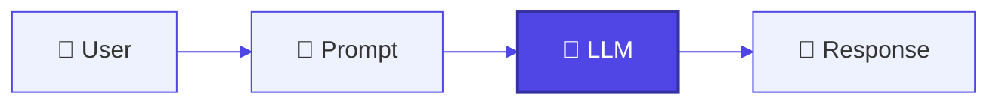
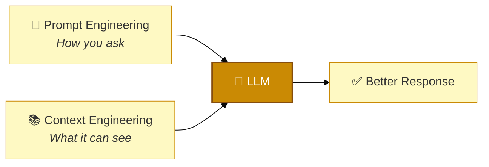
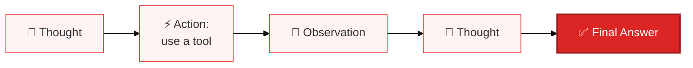
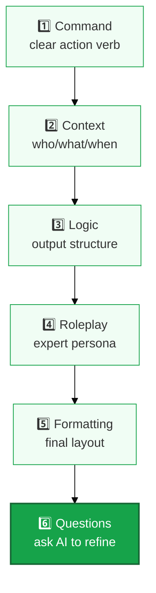
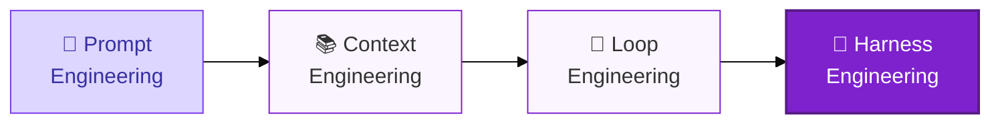

# 🧠 Prompt Engineering — A Complete Learning Guide

> Learn how to talk to AI models the right way. This guide takes you from "what is an LLM" all the way to advanced prompting techniques, and shows how Prompt Engineering connects to Context, Loop, and Harness Engineering.

---

## 📚 Table of Contents

1. [🧠 LLM Basics — Before You Start](#-llm-basics--before-you-start)
2. [🎯 Prompt Engineering vs Context Engineering](#-prompt-engineering-vs-context-engineering)
3. [🧩 Anatomy of a Prompt](#-anatomy-of-a-prompt)
4. [🟢 Basic Prompting Techniques](#-basic-prompting-techniques)
5. [🟡 Intermediate Prompting Techniques](#-intermediate-prompting-techniques)
6. [🔴 Advanced Prompting Techniques](#-advanced-prompting-techniques)
7. [✨ More Advanced Techniques Worth Knowing](#-more-advanced-techniques-worth-knowing)
8. [🧬 Prompting for Mixture-of-Experts (MoE) Models](#-prompting-for-mixture-of-experts-moe-models)
9. [🏗️ The 6-Part Prompting Framework](#️-the-6-part-prompting-framework)
10. [🎨 Specialized Prompting (Image & Video)](#-specialized-prompting-image--video)
11. [🔄 Prompt vs Context vs Loop vs Harness Engineering](#-prompt-vs-context-vs-loop-vs-harness-engineering)
12. [📖 Resources](#-resources)

---

## 🧠 LLM Basics — Before You Start

### What is an LLM?

An **LLM (Large Language Model)** is an AI system trained on huge amounts of text. It reads your input and generates a response by predicting what text should come next.

### How does it work, at a high level?



An LLM doesn't "understand" text the way a human does. It's a very advanced **autocomplete system**: it breaks your text into small pieces called **tokens**, and predicts the most likely next token, over and over, until it forms a full response.

### Why learn this before Prompt Engineering?

If you know that the model is predicting text based on patterns, you'll understand *why* vague prompts give vague answers, and why clear, structured prompts give clear, structured answers. Prompting isn't magic — it's about giving the model the right pattern to continue.

### How do LLM costs relate to tokens?

Most LLM providers charge based on **tokens**, not words or characters. A token is roughly a small chunk of a word (about 4 characters in English on average).

- **Input tokens** — everything in your prompt (instructions, context, examples)
- **Output tokens** — everything the model generates in its response

📌 Longer prompts and longer responses cost more. This is one more reason to write **clear, focused prompts** instead of vague, overly long ones.

### Key LLM Settings

You can also control *how* the model generates its response using these settings:

| Setting | What It Does | Use a Low Value For | Use a High Value For |
|---|---|---|---|
| **Temperature** | Controls randomness | Facts, math, precise answers | Creative writing, brainstorming |
| **Top P** | Controls how many word choices the model considers | Focused, safe answers | Diverse, creative answers |
| **Max Length** | Limits how many tokens the response can have | Short, controlled answers | Long, detailed answers |
| **Stop Sequence** | Tells the model where to stop generating | Structured, limited output | — |
| **Frequency Penalty** | Reduces repeated words | — | Less repetitive text |
| **Presence Penalty** | Reduces repeated topics/phrases | Focused output | More varied, creative topics |

💡 General rule: adjust **either** Temperature **or** Top P — not both at the same time.

<p align="right"><a href="#-table-of-contents">⬆ Back to top</a></p>

---

## 🎯 Prompt Engineering vs Context Engineering

These two terms get confused a lot, so let's separate them clearly from the start.

- **Prompt Engineering** = *how you instruct the model.* The wording, structure, and format of your request.
- **Context Engineering** = *what information you give the model.* The facts, documents, and data it can rely on.



| Aspect | 💬 Prompt Engineering | 📚 Context Engineering |
|---|---|---|
| Goal | Tell the model how to behave and what to produce | Give the model the facts it should rely on |
| Main Tools | Wording, structure, roles, examples, output format | Retrieval (RAG), documents, memory, tool results |
| Typical Fix | "Be concise. Return JSON with fields X, Y, Z." | "Attach the latest policy document for this query." |
| Common Failure | Vague instructions → messy output | Missing info → hallucinations or outdated answers |

You almost always need **both**: the prompt guides *behavior*, the context supplies *knowledge*.

📖 **Go deeper on Context Engineering:**
- [Context Engineering Tutorial](https://github.com/panaversity/learn-low-code-agentic-ai/blob/main/00_prompt_engineering/context_engineering_tutorial.md)
- [`03_context_engineering` Guide](../03_context_engineering/Readme.md) 

<p align="right"><a href="#-table-of-contents">⬆ Back to top</a></p>

---

## 🧩 Anatomy of a Prompt

A good prompt is usually made of up to four building blocks. You don't need all four every time — use what the task requires.

| Element | What It Means | Example |
|---|---|---|
| **Instruction** | The task you want done | "Classify the text below." |
| **Context** | Background info that helps the model | "This is a customer support review." |
| **Input Data** | The actual content to work on | "The delivery was late." |
| **Output Indicator** | The format you want back | "Sentiment:" |

```
Classify the text into neutral, negative, or positive.
Text: I think the food was okay.
Sentiment:
```

<p align="right"><a href="#-table-of-contents">⬆ Back to top</a></p>

---

## 🟢 Basic Prompting Techniques

Start here if you're new to prompting.

### 1. Zero-Shot Prompting

**Definition:** Ask the model directly, with no examples.
**Why use it:** Great for simple, well-known tasks the model already understands.

```
Classify this movie review as positive, negative, or neutral:
"The film was visually stunning but the plot felt rushed."
```

### 2. One-Shot Prompting

**Definition:** Give exactly one example before asking your real question.
**Why use it:** Helps the model match a specific format when zero-shot isn't precise enough.

```
Translate English to French:

English: "Hello, how are you?"
French: "Bonjour, comment allez-vous?"

English: "Where is the library?"
French:
```

### 3. Few-Shot Prompting

**Definition:** Give several examples (usually 3-5) to establish a clear pattern.
**Why use it:** Best when you need a consistent output format or style.

```
Convert customer feedback to structured data:

Feedback: "Great service, but food was cold"
JSON: {"service": "positive", "food": "negative"}

Feedback: "Amazing experience, will definitely return"
JSON: {"service": "positive", "food": "positive"}

Feedback: "Terrible food and rude staff"
JSON:
```

### 4. Clear Instructions (Command-First Prompting)

**Definition:** Start your prompt with a direct action verb instead of a vague ask.
**Why use it:** Vague prompts get vague answers. A clear command sets the tone immediately.

```
❌ Weak: Give me some investing tips.
✅ Strong: Recommend a diversified investment strategy for a moderate-risk investor.
```

### 📊 Zero-Shot vs One-Shot vs Few-Shot

| Technique | Examples Given | Best For |
|---|---|---|
| Zero-Shot | 0 | Simple, common tasks |
| One-Shot | 1 | Showing a specific output format |
| Few-Shot | 3-5 | Consistent formatting, classification, style-matching |

<p align="right"><a href="#-table-of-contents">⬆ Back to top</a></p>

---

## 🟡 Intermediate Prompting Techniques

Once you're comfortable with the basics, add these to get more reliable, structured results.

### 1. System Prompting

**Definition:** Set the overall behavior and rules for the AI before the conversation starts.
**Why use it:** Keeps the model consistent across an entire conversation.

```
You are a helpful travel guide. Always include:
- Key attractions
- Local customs
- Budget considerations
- Best time to visit

User: Tell me about visiting Tokyo.
```

### 2. Role Prompting (Persona)

**Definition:** Assign the AI a specific role or expertise.
**Why use it:** Sharpens the tone, vocabulary, and depth of the response.

```
Act as an experienced software architect. I need help designing a
web application for 1 million users. What architecture should I consider?
```

### 3. Contextual Prompting

**Definition:** Add background information relevant to the task.
**Why use it:** Helps the model tailor its answer to your actual situation, not a generic one.

```
Context: You're writing for a beginner tech blog.
Write a 200-word explanation of what an API is, using simple language.
```

### 4. Output Format Control

**Definition:** Tell the model exactly how to structure its response.
**Why use it:** Prevents messy, unpredictable output — especially important when your app needs to parse the result.

```
Return your answer as JSON:
{
  "main_idea": "string",
  "supporting_points": ["string", "string"],
  "confidence": "high/medium/low"
}
```

### 5. Say What TO Do, Not What NOT to Do

**Definition:** Focus instructions on the desired behavior instead of a list of restrictions.
**Why use it:** Negative instructions ("don't ask this, don't say that") often confuse the model more than they help.

```
❌ Weak: DO NOT ask for personal information.
✅ Strong: Recommend a movie from the current top trending list.
   If unsure, respond: "Sorry, couldn't find a recommendation today."
```

<p align="right"><a href="#-table-of-contents">⬆ Back to top</a></p>

---

## 🔴 Advanced Prompting Techniques

These techniques help with reasoning, multi-step problems, and complex tasks.

### 1. Chain-of-Thought (CoT) Prompting

**Definition:** Ask the model to reason step by step before giving a final answer.
**Why use it:** Big improvement for math, logic, and multi-step problems.

```
Solve this step by step:
If I was 6 when my sister was half my age, how old is my sister when I'm 40?

Let's think through this step by step:
```

### 2. Self-Consistency

**Definition:** Generate multiple reasoning paths for the same question, then pick the most common answer.
**Why use it:** Reduces the chance that one flawed reasoning path leads to a wrong final answer.

```
Question: A store offers 20% off a $50 item. What's the final price?
Generate 3 different reasoning paths, then tell me the most consistent answer.
```

### 3. Step-Back Prompting

**Definition:** Ask a broader question first, then use that answer to tackle the specific task.
**Why use it:** Grounds the model in general principles before it solves your specific problem.

```
Step 1: What are the key factors that affect website loading speed?
Step 2: Using those factors, suggest ways to speed up an e-commerce
site with heavy product images.
```

### 4. ReAct (Reasoning + Acting)

**Definition:** The model alternates between **Thought** (reasoning), **Action** (using a tool, like a search), and **Observation** (reading the result) — repeating until it has an answer.
**Why use it:** Needed for tasks requiring real-time data or multi-step lookups.



```
Question: What is the population of Tokyo vs New York City?

Thought: I need Tokyo's population first.
Action: web_search("current population of Tokyo")
Observation: ~37.4 million
Thought: Now I need New York City's population.
Action: web_search("current population of New York City")
Observation: ~23.6 million
Final Answer: Tokyo is larger by about 13.8 million people.
```

### 5. Tree of Thoughts (ToT)

**Definition:** Explore several different solution paths ("branches"), evaluate each, then combine or pick the best one.
**Why use it:** Ideal for open-ended problems like strategy or creative planning, where more than one approach is worth comparing.

```
Question: What's the best marketing strategy for a new eco-friendly
clothing brand targeting young adults?

Explore 3 different strategic approaches, evaluate the pros and cons
of each, score them, and recommend the best combination.
```

### 6. Prompt Chaining

**Definition:** Break a big task into smaller steps, where each step's output feeds into the next prompt.
**Why use it:** Complex tasks get better results when broken down instead of attempted in one giant prompt.

```
Step 1: Research the topic and list 5 key facts.
Step 2: Create an outline based on those facts.
Step 3: Write the full article based on the outline.
```

### 📊 Comparing the Reasoning Techniques

| Technique | What It Adds | Best For |
|---|---|---|
| Chain-of-Thought | One step-by-step reasoning path | Math, logic, single-answer problems |
| Self-Consistency | Multiple reasoning paths, pick the most common | Reducing errors on tricky questions |
| Tree of Thoughts | Multiple *branches*, each evaluated and compared | Open-ended, strategic, creative decisions |
| ReAct | Reasoning combined with real tool actions | Tasks needing live data or lookups |

<p align="right"><a href="#-table-of-contents">⬆ Back to top</a></p>

---

## ✨ More Advanced Techniques Worth Knowing

These aren't always covered in beginner guides, but they're genuinely useful and belong in a complete Prompt Engineering toolkit.

### Meta Prompting

**Definition:** Ask the model to help you write or improve your prompt, instead of writing the perfect prompt yourself on the first try.
**Why use it:** The model is often good at spotting missing details in its own instructions.

```
Here is my rough prompt: "Write about marketing."
Rewrite this into a clear, specific, well-structured prompt,
and suggest 2 alternative versions.
```

### Generated Knowledge Prompting

**Definition:** Ask the model to first generate relevant background facts, then use those facts to answer the real question.
**Why use it:** Improves accuracy on questions that need background knowledge the model might not surface on its own.

```
Step 1: List 5 relevant facts about how solar panels work.
Step 2: Using those facts, explain why solar panel efficiency
drops on cloudy days.
```

### Automatic Prompt Engineer (APE)

**Definition:** Instead of manually testing prompt variations, ask the model to generate and score several candidate prompts for a task, then pick the best one.
**Why use it:** Speeds up the trial-and-error part of prompt design.

```
Generate 5 different prompt variations for asking an AI to summarize
a news article in 2 sentences. Rate each for clarity and specificity.
```

### Reflexion

**Definition:** After the model answers, ask it to review and critique its own answer, then produce an improved version.
**Why use it:** Catches mistakes the model made on its first pass, without needing a human to point them out.

```
Here is your previous answer: [paste answer]
Review it for errors or missing points, then give an improved version.
```

### Program-Aided Language Models (PAL)

**Definition:** Instead of asking the model to do math or logic in plain text, ask it to write and "run" code to get an exact answer.
**Why use it:** LLMs are more reliable at generating correct code than doing complex arithmetic in their head.

```
Write Python code to calculate the compound interest on $5,000
at 6% annual interest over 10 years, then show the result.
```

<p align="right"><a href="#-table-of-contents">⬆ Back to top</a></p>

---

## 🧬 Prompting for Mixture-of-Experts (MoE) Models

Many modern frontier models (like Gemini, Grok, and DeepSeek) use a **Mixture-of-Experts** design — instead of using the whole model for every request, a "router" picks a smaller set of specialized internal experts to handle your prompt.

📌 This doesn't change the fundamentals of prompting, but it does mean **clear, early, domain-specific wording matters even more** — it helps the router activate the right specialist.

**Practical tips:**
- Put your role and task clearly in the first few lines: `Role: Financial analyst. Task: variance analysis.`
- Use plain, on-topic vocabulary instead of clever wording
- Don't mix unrelated tasks (e.g., code + poetry) in one prompt — split them
- Lower the temperature if you need more consistent answers

```
Role: Financial analyst
Task: Analyze quarterly revenue variance
Output: Table + 3 bullet-point risks
```

<p align="right"><a href="#-table-of-contents">⬆ Back to top</a></p>

---

## 🏗️ The 6-Part Prompting Framework

Once you know the individual techniques, this framework helps you combine them into one strong prompt.



| Part | What It Does |
|---|---|
| **1. Command** | Start with a strong action verb — analyze, create, recommend, evaluate |
| **2. Context** | Add the who/what/when — the more specific, the better |
| **3. Logic** | Define exactly what the output should contain |
| **4. Roleplay** | Give the AI a specific expert persona |
| **5. Formatting** | Specify the exact layout (table, list, JSON, etc.) |
| **6. Questions** | End with: *"Ask me questions that would help you improve this."* |

**Full example:**

```
COMMAND: Recommend a comprehensive investment strategy

CONTEXT: for a 32-year-old software engineer, moderate risk tolerance,
earning $90,000/year, saving to buy a home in 5 years

LOGIC: List asset categories, allocation percentages, and reasoning
for each

ROLEPLAY: You are a certified financial advisor with 15 years of
experience in personal finance

FORMATTING: Present as: 1) Summary  2) Allocation Table  3) Risks

QUESTIONS: Ask me 5 questions that would help you tailor this further
```

<p align="right"><a href="#-table-of-contents">⬆ Back to top</a></p>

---

## 🎨 Specialized Prompting (Image & Video)

Prompting isn't only for text. Writing prompts for image and video generation models follows similar principles (clarity, specificity, structure) but has its own techniques — describing style, composition, lighting, camera angle, and motion.

📖 **Learn image and video prompting here:**
[Prompt Engineering Resources — Image & Video Generation](https://github.com/panaversity/learn-low-code-agentic-ai/tree/main/00_prompt_engineering)

<p align="right"><a href="#-table-of-contents">⬆ Back to top</a></p>

---

## 🔄 Prompt vs Context vs Loop vs Harness Engineering

As AI systems grow from single prompts into full agents, four related disciplines come into play. Here's how they connect:



| Engineering | Main Focus | Simple Meaning | Example |
|---|---|---|---|
| 💬 **Prompt Engineering** | The instruction | How you ask the model to behave | Writing a clear, structured request |
| 📚 **Context Engineering** | The information | What facts/data the model can see | Feeding it a retrieved document via RAG |
| 🔁 **Loop Engineering** | The repetition | How the model plans, acts, and checks itself over multiple steps | An agent that retries a failed step until it succeeds |
| 🧰 **Harness Engineering** | The surrounding system | The tools, guardrails, and environment the model operates inside | The framework that runs tool calls, manages memory, and enforces limits |

📖 **Go deeper:**
- [Loop Engineering Crash Course](https://agentfactory.panaversity.org/docs/loop-engineering-crash-course)
- [Harness Engineering Crash Course](https://agentfactory.panaversity.org/docs/harness-engineering-crash-course)

<p align="right"><a href="#-table-of-contents">⬆ Back to top</a></p>

---

## 📖 Resources

### Prompt Engineering Practice Tools
- [OpenAI Playground](https://platform.openai.com/chat/)
- [Google AI Studio](https://aistudio.google.com/)
- [Anthropic Console](https://console.anthropic.com/)

### Prompt Engineering & Advanced Techniques
- [Prompt Engineering Course — Panaversity](https://github.com/panaversity/learn-low-code-agentic-ai/tree/main/00_prompt_engineering)

### Context Engineering
- [Context Engineering Tutorial](https://github.com/panaversity/learn-low-code-agentic-ai/blob/main/00_prompt_engineering/context_engineering_tutorial.md)
- [`03 Context engineering` Guide ](../03_Context_engineering/Readme.md)

### Loop & Harness Engineering
- [Loop Engineering Crash Course](https://agentfactory.panaversity.org/docs/loop-engineering-crash-course)
- [Harness Engineering Crash Course](https://agentfactory.panaversity.org/docs/harness-engineering-crash-course)

### Image / Video Prompting
- [Image & Video Generation Prompting Resources](https://github.com/panaversity/learn-low-code-agentic-ai/tree/main/00_prompt_engineering)

### AI Prompting in 2026
- [AI Prompting in 2026: A Crash Course](https://agentfactory.panaversity.org/docs/ai-prompting-2026)

<p align="center"><strong>💬 How you ask shapes what you get. Master the prompt, and the model becomes a real tool.</strong></p>