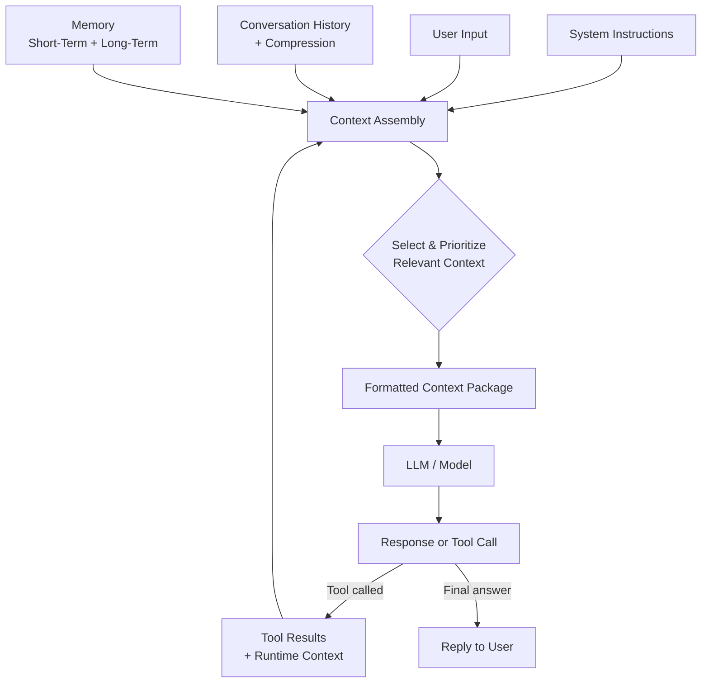

# 🧠 Context Engineering for Beginners

### From "writing good prompts" ➜ to "building smart AI agents"

> **Prompt Engineering** =  Asking a good question, but with clear instructions on how you want the answer..

> **Context Engineering** = making sure the AI has everything it needs to answer that question well.

This guide is for people who already know Prompt Engineering. Now we go one step further and learn how real AI agents are built — using very simple English, everyday examples, and easy diagrams.

---

## 📚 Table of Contents

| # | Topic |
|---|---|
| 1 | [What is Context Engineering?](#1--what-is-context-engineering) |
| 2 | [Context Engineering vs Prompt Engineering](#2--context-engineering-vs-prompt-engineering) |
| 3 | [When to Use Context Engineering](#3--when-to-use-context-engineering) |
| 4 | [Context Window & Tokens](#4--context-window--tokens) |
| 5 | [Context as a Limited Resource](#5--context-as-a-limited-resource) |
| 6 | [Context Components](#6--context-components) |
| 7 | [Static Context vs Dynamic Context](#7--static-context-vs-dynamic-context) |
| 8 | [Relevant vs Irrelevant Context](#8--relevant-vs-irrelevant-context) |
| 9 | [Knowledge vs Memory](#9--knowledge-vs-memory) |
| 10 | [Short-Term vs Long-Term Memory](#10--short-term-vs-long-term-memory) |
| 11 | [Memory vs Context](#11--memory-vs-context) |
| 12 | [System Prompt Architecture](#12--system-prompt-architecture) |
| 13 | [Writing Context](#13--writing-context) |
| 14 | [Formatting Context](#14--formatting-context) |
| 15 | [Selecting Context](#15--selecting-context) |
| 16 | [Prioritizing Context](#16--prioritizing-context) |
| 17 | [Conversation History Management](#17--conversation-history-management) |
| 18 | [Context Compression](#18--context-compression) |
| 19 | [Tools & Context](#19--tools--context) |
| 20 | [Tool Output Management](#20--tool-output-management) |
| 21 | [Runtime / Local Context](#21--runtime--local-context) |
| 22 | [Context Assembly](#22--context-assembly) |
| 23 | [Context Optimization](#23--context-optimization) |
| 24 | [The 6 Components of AI Agents](#24--the-6-components-of-ai-agents) |

**Extras:** [🎯 One-Picture Summary](#-context-engineering-in-one-picture) · [📝 Key Takeaways](#-key-takeaways) · [📋 Quick Summary](#-quick-summary) · [❓ FAQ](#-frequently-asked-questions-faq) · [📖 Learn More](#-want-to-learn-more)

---
<br>

## 1. 💡 What is Context Engineering?

**What it is**
Context Engineering means choosing what information the AI sees before it replies — like instructions, past chat, files, and tool results.

**Why it matters**
An AI only knows what is in front of it right now. If you don't give it the right information, it will guess — and guessing often means wrong answers.

**How it works**
Every time you send a message, the system quietly builds a package behind the scenes: instructions + your message + past chat + any extra data. Context Engineering means you control what goes into that package on purpose.

**Example**
You ask a coding assistant: *"Fix the bug in my login function."* Without context, it only sees one sentence and has to guess. With good context, it also sees the actual code, the error message, and your coding style — so the fix is much better.

**Analogy**
Think of a new employee's first day. If you just say "go do the job," they will struggle. But give them a handbook, task list, and background info — and they'll do great. That handbook is the "context" you're choosing to give them.

> **🔑 Key Takeaway:** Context Engineering means choosing exactly what the AI sees — because a good answer needs good information.

---
<br>

## 2. ⚖️ Context Engineering vs Prompt Engineering

**What it is**
Prompt Engineering = writing one good instruction. Context Engineering = designing everything the AI can see, across a whole task — not just one message.

**Why it matters**
A perfect prompt is not enough for real AI agents. Agents run for many steps, use tools, and need memory. Even the best prompt fails if the AI is missing background info or is buried in useless text.

**How it works**
Prompt Engineering improves *wording*. Context Engineering improves the *whole system* — what data comes in, how much history is kept, what gets shortened, and how it's all arranged.

**Example**
Prompt Engineering: "You are a helpful support agent. Be polite." Context Engineering: deciding if the agent should also see the customer's order history, past tickets, and refund policy.

**Analogy**
Prompt Engineering is writing one good interview question. Context Engineering is designing the whole interview — who's in the room, what papers are shared, how it all flows.

| | Prompt Engineering | Context Engineering |
|---|---|---|
| **Focus** | Wording of one message | The full information setup |
| **Scope** | One message | Whole task or chat |
| **Goal** | One good answer | Stay accurate over time |
| **Used for** | Simple chatbots | AI agents |

> **🔑 Key Takeaway:** Prompt Engineering writes the question. Context Engineering builds everything around it. Agents need both.

---
<br>

## 3. ⏱️ When to Use Context Engineering

**What it is**
Context Engineering is needed when a task is too big, too long, or too changeable for one simple prompt to handle well.

**Why it matters**
Not every task needs heavy context work. Knowing *when* to use it saves you time.

**How it works**
Use more Context Engineering when: the task has many steps, the AI uses tools, the AI must remember things, there are big documents involved, or accuracy really matters (banking, health, legal).

**Example**
"Translate this sentence" needs barely any context work — a good prompt is enough. But a personal finance assistant that tracks your spending every month absolutely needs context engineering to work well.

**Analogy**
You don't need a plan to make coffee. You do need one to build a house. Small tasks need small prompts. Big, ongoing tasks need engineered context.

> **🔑 Key Takeaway:** Use Context Engineering for multi-step, tool-using, memory-needing tasks — not for simple one-off questions.

---
<br>

## 4. 🪟 Context Window & Tokens

**What it is**
The **context window** is the maximum text an AI can see at once. It's measured in **tokens** — small pieces of text, roughly ¾ of a word each.

**Why it matters**
If your total text is bigger than the window, older or less-important information gets cut off. The AI can literally "forget" what you said earlier.

**How it works**
Every word and symbol you send becomes tokens before the model reads it. Models have a fixed token limit (like 128,000 or 200,000). Instructions, chat history, files, and tool results all share this same space.

**Example**
A research assistant asked to summarize a 300-page report may find the report alone is too big for the window. So it must break the document into smaller parts and process them one at a time.

**Analogy**
Think of a whiteboard in a meeting room. It only has so much space. Keep writing without erasing, and the oldest notes get wiped to make room for new ones.

**Diagram**
```
[ Small context window ]        [ Larger context window ]
  ┌───────────┐                    ┌────────────────────┐
  │ few notes │                    │   lots of room      │
  │ fit here  │                    │   for more info      │
  └───────────┘                    └────────────────────┘
```

> **🔑 Key Takeaway:** The context window is the AI's limited workspace. Once it's full, something has to be trimmed.

---
<br>

## 5. 💰 Context as a Limited Resource

**What it is**
Context is not just limited — it costs something, like time and money. Every piece of information you add has a price.

**Why it matters**
Beginners often think "more context = better answers." Actually, too much useless information can *hurt* accuracy, slow things down, and cost more.

**How it works**
Every token takes processing time and money, and takes up space that could hold something more useful. Always ask: "Does the AI really need this right now?"

**Example**
A banking assistant checking your balance doesn't need your entire 5-year transaction history — just the current balance. Adding everything else just wastes space.

**Analogy**
Packing for a trip. You can't bring your whole closet. You choose only what you'll actually wear, or your bag becomes heavy and messy.

> **🔑 Key Takeaway:** Context is limited and costly. The goal is to include exactly what's needed — not everything.

---
<br>

## 6. 🧱 Context Components

**What it is**
Context is made of a few building blocks: system instructions, user input, chat history, memory, knowledge, and tool results.

**Why it matters**
Knowing these blocks helps you fix problems fast. If an agent acts strange, you can check: was it a bad instruction? Missing memory? A bad tool result?

**How it works**
Each block comes from a different place — instructions are written by developers, chat history comes from the conversation, memory comes from storage, and tool results come from live systems (like an API).

**Example**
A travel-booking agent's context combines: instructions ("You are a travel assistant"), the user's message ("Book me a flight to Tokyo"), memory ("User likes window seats"), and live flight prices from a tool.

**Analogy**
Think of a recipe. It combines ingredients, method, and kitchen tools into one dish. Context components are the "ingredients list" for an AI's answer.

```
System Instructions
        +
   User Input
        +
Conversation History
        +
      Memory
        +
   Tool Results
        ↓
 Context Assembly
        ↓
       LLM
        ↓
     Response
```

> **🔑 Key Takeaway:** Context is built from clear building blocks — instructions, input, history, memory, and tool results — each with its own job.

---
<br>

## 7. 🔄 Static Context vs Dynamic Context

**What it is**
**Static context** stays the same every time (like core rules). **Dynamic context** changes depending on the situation (like live data).

**Why it matters**
Mixing these up causes problems. Treat live data as "fixed," and your agent gives outdated answers. Rebuild fixed content every time, and you waste effort.

**How it works**
Static context is written once and reused (system prompt). Dynamic context is fetched fresh each time — from the user's message, a database, or a live API.

**Example**
An online shop assistant's static rule: "Never recommend out-of-stock items." Its dynamic info: the customer's current cart and today's live stock levels.

**Analogy**
Static context is the store's permanent signboard. Dynamic context is the daily specials board — rewritten fresh each day.

| | Static Context | Dynamic Context |
|---|---|---|
| **Changes?** | Rarely | Every time |
| **Example** | System prompt, brand voice | User message, live data |
| **Made by** | Developers | Fetched at the moment |

> **🔑 Key Takeaway:** Static context keeps the AI consistent. Dynamic context keeps the AI accurate and up to date.

---
<br>

## 8. 🎯 Relevant vs Irrelevant Context

**What it is**
Relevant context directly helps the AI do its current task. Irrelevant context doesn't help — it can even confuse the AI.

**Why it matters**
Extra, useless information can lower the AI's accuracy — just like noise in a room makes it harder for a person to focus.

**How it works**
Before adding info to context, ask: "Does this help the AI do this exact task?" If not, leave it out — even if it's true or interesting.

**Example**
Customer asks: *"Where's my order #4521?"*
- ✅ **Relevant:** order #4521's shipping status, delivery address, tracking number
- ❌ **Irrelevant:** browsing history from 6 months ago, an old promotional email

**Analogy**
You ask a librarian for a book on volcanoes. They hand you 50 random books "just in case." More books, but harder to find what you need.

> **🔑 Key Takeaway:** More context isn't always better — only relevant context helps. Irrelevant context adds noise and risk.

---
<br>

## 9. 📖 Knowledge vs Memory

**What it is**
**Knowledge** = general facts and info that apply to everyone. **Memory** = specific info about one user, saved and recalled over time.

**Why it matters**
Mixing these up causes bad design. Knowledge should apply to all users. Memory is personal. Getting it backwards makes the AI feel broken.

**How it works**
Knowledge usually comes from documents or manuals placed in context. Memory is saved from past chats and brought back into context in later sessions.

**Example**
A bank chatbot's *knowledge*: interest rate rules, how to open a savings account (same for everyone). Its *memory*: "This customer opened a savings account last month and prefers email over SMS."

**Analogy**
Knowledge is a textbook — same for every student. Memory is a teacher who personally remembers one student needs extra help with fractions.

> **🔑 Key Takeaway:** Knowledge is general and shared. Memory is personal and specific to one user.

---
<br>

## 10. 🕰️ Short-Term vs Long-Term Memory

**What it is**
**Short-term memory** lasts only for the current chat. **Long-term memory** stays across many chats, even days or months later.

**Why it matters**
Users expect the AI to feel consistent over time — remembering their name or preferences. This doesn't happen by itself; it must be built.

**How it works**
Short-term memory usually just lives in the current chat history. Long-term memory is saved somewhere outside the chat (like a database) and pulled back in when needed.

**Example**
During one chat, the assistant remembers you just said your meeting is at 3 PM (short-term). Weeks later, in a new chat, it still remembers you prefer morning meetings — because that was saved (long-term).

**Analogy**
Short-term memory is remembering what someone just said. Long-term memory is remembering a friend's birthday every year, because you wrote it down.

> **🔑 Key Takeaway:** Short-term memory lasts one session. Long-term memory is saved on purpose so it lasts across sessions.

---
<br>

## 11. 🗂️ Memory vs Context

**What it is**
Memory is *where* info is stored. Context is *what the AI actually reads* right now. Memory only matters once it's pulled into context.

**Why it matters**
A common mistake: thinking that once something is "saved to memory," the AI automatically knows it. It doesn't — not until it's brought into context.

**How it works**
Memory systems store data (in a database or file). At the start of a new chat, the system picks relevant saved info and adds it into context for that reply.

**Example**
A shopping assistant "remembers" your shoe size from a past order. It sits quietly in storage until your next shopping session — then it's pulled back into context to help recommend shoes.

**Analogy**
Memory is a filing cabinet full of notes. Context is your desk. Notes in the cabinet don't help until you pull the right folder and put it on your desk.

> **🔑 Key Takeaway:** Memory is stored info. Context is what the AI reads. Memory only helps once it's brought into context.

---
<br>

## 12. 🏗️ System Prompt Architecture

**What it is**
This means organizing an AI agent's instructions clearly — in sections — instead of one big messy block of text.

**Why it matters**
A messy system prompt causes inconsistent behavior. A well-organized one makes the agent predictable and easy to fix.

**How it works**
Good system prompts are split into clear parts: role, goals, rules, tone, tool instructions, and output format. Each part has one clear job.

**Example**
A coding assistant's prompt:
1. **Role** — "You are a senior Python reviewer."
2. **Rules** — "Never suggest old, deprecated libraries."
3. **Tone** — "Be direct but encouraging."
4. **Format** — "Reply with a bullet list of issues."

**Analogy**
A well-organized employee handbook with clear chapters (Overview, Rules, Dress Code) vs. one giant unformatted wall of text. The organized one is far easier to follow.

> **🔑 Key Takeaway:** A clearly structured system prompt — with separate role, rules, and format sections — leads to much more consistent AI behavior.

---
<br>

## 13. ✍️ Writing Context

**What it is**
Writing Context means phrasing information clearly and exactly, with no room for confusion.

**Why it matters**
Vague context is one of the biggest causes of AI mistakes. The AI can only work with what's written.

**How it works**
Good context writing uses specific, concrete words, explains any confusing terms, and avoids contradicting itself.

**Example**
❌ Vague: "Be helpful with refunds."
✅ Clear: "Approve refunds automatically for orders under $50 placed in the last 30 days. Send everything else to a human."

**Analogy**
Vague context is telling a new worker to "handle complaints appropriately" — sounds fine but gives no real direction. Clear context is giving them an actual step-by-step guide.

> **🔑 Key Takeaway:** Clear, specific writing in context reduces guesswork and mistakes. Vague instructions lead to vague results.

---
<br>

## 14. 🎨 Formatting Context

**What it is**
Formatting is about *how* information looks — headings, bullet points, tables — instead of one big unformatted paragraph.

**Why it matters**
AI models read structured, labeled text more reliably than dense paragraphs. Good formatting reduces confusion.

**How it works**
Use clear headers, bullet points for facts, tables for comparisons, and consistent labels to separate different kinds of info.

**Example**
Instead of one long paragraph, use:
```
## Customer Info
- Name: Ayesha Khan
- Membership: Gold Tier
- Last Order: #4521 (Delivered)

## Current Question
"Where is my order #4521?"
```
This makes it instantly clear what's background and what's the real question.

**Analogy**
It's the difference between a messy pile of loose papers and a neat folder with labeled tabs. Same information, but one is far easier to use.

> **🔑 Key Takeaway:** Clear formatting — headings, bullets, labels — helps the AI tell different types of info apart quickly.

---
<br>

## 15. 🔍 Selecting Context

**What it is**
Context Selection means choosing *which* available information actually goes into the context window — and leaving the rest out.

**Why it matters**
Agents often have way more data available than fits, or is useful, in one context window. Picking the right pieces matters a lot.

**How it works**
Filter available info against the task's needs. Drop anything outdated, repeated, or unrelated. Keep only what truly helps the AI answer correctly.

**Example**
A support agent has: (1) customer info, (2) order history, (3) current chat, (4) refund policy, (5) old, unrelated tickets from a year ago. For a question about a *current* order, it picks 1–4 and skips the old tickets — they'd only add noise.

**Analogy**
Packing for a business trip. You check the weather and your schedule, then pack accordingly — you don't bring your whole wardrobe just because it's available.

> **🔑 Key Takeaway:** Selecting context means actively choosing what's relevant — having data doesn't mean you should include it.

---
<br>

## 16. 📊 Prioritizing Context

**What it is**
Prioritizing means ranking selected info by importance, so if space runs out, the most important stuff stays and the rest is cut first.

**Why it matters**
Even after selecting relevant info, it often still doesn't all fit. Prioritizing makes sure that if something is cut, it's the least important thing.

**How it works**
Rank context in tiers: **Must-have** (core rules, current request), **Important** (recent history, key facts), **Nice-to-have** (small talk, older details). Cut the bottom tier first.

**Example**
In a banking assistant: **Must-have** = identity check, current request. **Important** = recent transactions. **Nice-to-have** = small talk. If the chat runs long, small talk is dropped first — never the identity check.

**Analogy**
Packing an emergency bag: water and ID come first. A favorite book comes last — and gets left behind first if there's no room.

> **🔑 Key Takeaway:** Ranking context by importance means only the least critical info gets cut when space runs out.

---
<br>

## 17. 💬 Conversation History Management

**What it is**
This means deciding how much of a past chat to keep, shorten, or remove as the conversation gets longer.

**Why it matters**
Left alone, chat history keeps growing until it overflows the context window — pushing out important info or slowing the agent down.

**How it works**
Common methods: keep only the last few messages, summarize older parts into shorter form, or mix both — full detail for recent turns, summaries for older ones.

**Example**
In a long support chat, keep the last 10 messages in full, but compress everything before that into: *"Customer confirmed address, asked about a delayed order — not resolved yet."*

**Analogy**
Taking meeting notes. You don't write every word from a two-hour meeting — you summarize key points and keep the latest discussion fresh.

> **🔑 Key Takeaway:** Chat history must be trimmed or summarized as it grows, or it will overwhelm the context window.

---
<br>

## 18. 🗜️ Context Compression

**What it is**
Compression means shrinking large information into a shorter form while keeping the important meaning.

**Why it matters**
It lets an agent "remember" a lot without keeping every raw detail — balancing being informed with staying within the token limit.

**How it works**
This can be done by summarizing (turning many messages into a short paragraph), extracting key facts ("order number: 4521"), or keeping short notes instead of full text.

**Example**
A research assistant with 20 pages of notes compresses them into 5 bullet points of key findings — keeping the important parts, dropping the extra wording.

**Analogy**
Turning a two-hour lecture into a one-page study sheet. You lose some detail but keep everything you actually need.

> **🔑 Key Takeaway:** Compression keeps the important meaning of large info while making it much smaller.

---
<br>

## 19. 🛠️ Tools & Context

**What it is**
Tools are outside functions an AI can use — like web search, checking a database, or sending an email. This topic is about how tool info gets added to context.

**Why it matters**
An AI can only use a tool correctly if its context clearly explains what the tool does, what input it needs, and when to use it.

**How it works**
Tool details (name, description, needed inputs) go into context, so the model can decide if and how to use it. The model doesn't run the tool itself — it asks for it, the system runs it, and the result comes back into context.

**Example**
A travel agent has a tool `check_flight_prices`, described as: "Get real-time flight prices. Needs: origin, destination, date." When asked about flight cost, the agent knows to call this tool instead of guessing.

**Analogy**
Giving an AI a tool with no description is like handing someone an unlabeled kitchen gadget — they may never use it, or use it wrong. A clear label means it gets used correctly.

> **🔑 Key Takeaway:** AI agents can only use tools well when clear descriptions of those tools are included in context.

---
<br>

## 20. 📦 Tool Output Management

**What it is**
This means controlling how a tool's results (like a search result) get added back into context — since raw results can be huge or messy.

**Why it matters**
Tool results are often much bigger than what's actually needed. Dumping raw data into context wastes space and confuses the AI.

**How it works**
Filter the raw result down to what matters, summarize big results, and format them clearly before adding them back into context.

**Example**
A weather tool returns dozens of fields (humidity, wind, 10-day forecast). If the user only asked "will it rain today," pull out just: *"Rain expected today, 70% chance, afternoon."*

**Analogy**
Asking an assistant about the weather — you want "yes, bring an umbrella," not the entire weather report read out loud.

> **🔑 Key Takeaway:** Raw tool results should be filtered and shortened before entering context — not dumped in as-is.

---
<br>

## 21. 📍 Runtime / Local Context

**What it is**
Runtime (or local) context is information only available right now — like today's date, the user's location, or what's on their screen.

**Why it matters**
Some information doesn't exist ahead of time — it only appears "in the moment." Agents need to pull this in live to act correctly.

**How it works**
Runtime context is gathered fresh, right before or during an action — from the device, an app's current state, or a live system.

**Example**
A coding assistant inside an editor uses runtime context: which file is open, where the cursor is, what code is selected — so its suggestion matches exactly what you're looking at.

**Analogy**
A GPS app needs your *current* location and live traffic right now — not just general map data — to give useful directions.

> **🔑 Key Takeaway:** Runtime context captures the current, real-time situation — gathered fresh each time.

---
<br>

## 22. 🧩 Context Assembly

**What it is**
The final step: combining all the pieces — instructions, memory, history, tool results, runtime data — into one organized package sent to the AI.

**Why it matters**
Even great individual pieces can confuse the model if badly arranged or ordered. Assembly is where mistakes become visible.

**How it works**
The system arranges selected, prioritized, formatted pieces in a logical order — usually: instructions first, then memory/knowledge, then chat history, then the current request and live tool results.

**Example**
A support agent's final context: (1) role instructions, (2) refund policy, (3) customer profile, (4) chat summary, (5) recent messages, (6) the current question — all combined into one clean package.

**Analogy**
Plating a meal in a restaurant. Great ingredients (context pieces) still need good arrangement on the plate to come together well.

> **🔑 Key Takeaway:** Context Assembly combines all the pieces into one clear, ordered package — the final step before the AI sees anything.

---
<br>

## 23. 📈 Context Optimization

**What it is**
The ongoing process of improving what goes into context — testing and adjusting over time for better accuracy, speed, and cost.

**Why it matters**
Context Engineering isn't a one-time setup. Real-world use shows you what helps and what doesn't. Optimization is how you keep improving.

**How it works**
Watch how the agent performs, spot patterns in mistakes (e.g., "it keeps giving old info"), then adjust what's included or how it's arranged — and test again.

**Example**
A team notices their agent gives outdated shipping times. They find its policy info was old, update it, and re-test. That's optimization in action.

**Analogy**
A chef refining a recipe over many tries — tasting, adjusting, removing what doesn't help — instead of assuming the first version was perfect.

> **🔑 Key Takeaway:** Context Optimization is a never-ending cycle of watching, adjusting, and improving what the AI sees.

---
<br>

## 24. 🤖 The 6 Components of AI Agents

**What it is**
AI agents are built from six core parts: **Model, Tools, Knowledge & Memory, Audio & Speech, Guardrails, and Orchestration.** Context Engineering is the "glue" connecting all of them.

**Why it matters**
Knowing these six parts gives you a clear map of how a full AI agent is built — and shows exactly where Context Engineering fits in.

**The 6 parts, explained simply:**

| Part | Simple Meaning |
|---|---|
| 🧩 **Model** | The AI "brain" that reads context and creates a reply |
| 🛠️ **Tools** | Outside functions the agent can use, like checking a database |
| 📚 **Knowledge & Memory** | General facts + personal remembered details |
| 🎙️ **Audio & Speech** | Lets the agent hear and talk (for voice assistants) |
| 🛡️ **Guardrails** | Safety rules that keep the agent's behavior safe |
| 🎼 **Orchestration** | The logic deciding what happens next |

**Example**
A voice banking assistant: **Model** understands the request, **Audio & Speech** hears and replies by voice, **Tools** check the real balance, **Knowledge & Memory** recall your preferences, **Guardrails** block risky actions, and **Orchestration** manages the whole flow.

**Analogy**
A busy restaurant: **Model** = head chef, **Tools** = kitchen equipment, **Knowledge & Memory** = recipe book + notes on regulars, **Audio & Speech** = the waiter, **Guardrails** = food safety rules, **Orchestration** = the process running the whole kitchen.

**How Context Engineering connects them**
None of these six parts work alone — they all need Context Engineering to share info between them. The Model only knows what's in context. Tools only get used right if their description is in context. Memory only matters once it's pulled into context. Context Engineering is the thread tying everything together.

> **🔑 Key Takeaway:** AI agents are built from 6 parts — Model, Tools, Knowledge & Memory, Audio & Speech, Guardrails, Orchestration — and Context Engineering connects them all.

---
<br>

## 🎯 Context Engineering in One Picture



Every source of information — instructions, input, history, memory, and tool results — flows into one selection step, gets packed neatly, and is only then given to the model. If the model needs more data, it calls a tool, and that result flows right back in.

> **🔑 Key Takeaway:** A good AI reply comes from a repeating cycle — gather, select, prioritize, assemble, and respond.

---
<br>

## 📝 Key Takeaways

- **Context Engineering** designs everything the AI sees. **Prompt Engineering** only writes one instruction.
- The **context window** is limited and measured in tokens — once full, something must be cut.
- Treat context as a **limited, costly resource** — more isn't always better.
- **Static context** stays the same; **dynamic context** changes each time.
- Only include **relevant** context — irrelevant info adds noise.
- **Knowledge** is general and shared; **memory** is personal.
- **Short-term memory** lasts one session; **long-term memory** is saved and reused across sessions.
- Memory only matters once it's **pulled into context** — saving it alone isn't enough.
- A clear, well-structured **system prompt** leads to more predictable behavior.
- Context should be **written clearly**, **formatted well**, **selected carefully**, and **prioritized**.
- **Chat history** and **tool outputs** must be managed and compressed, or they'll overwhelm the window.
- **Tools** need clear descriptions to be used right. **Runtime context** captures real-time info.
- **Context assembly** is the final packaging step. **Context optimization** never really ends.
- AI agents have **6 parts** — Model, Tools, Knowledge & Memory, Audio & Speech, Guardrails, Orchestration — tied together by Context Engineering.

---
<br>

## 📋 Quick Summary

You've now moved from just *"writing prompts"* to *"building context."* Prompt Engineering taught you how to phrase one good instruction. Context Engineering teaches something bigger — how to design everything an AI agent sees: what it knows, what it remembers, what it can act on, and what it should never see at all.

This matters because real AI agents don't live in one message. They run across long chats, use tools, keep memory, and make decisions over time. By learning about context windows, memory, selection, prioritizing, compression, and assembly, you're no longer just asking good questions — you're building the systems that make AI agents reliable and genuinely useful.

---
<br>

## ❓ Frequently Asked Questions (FAQ)

<details>
<summary><strong>1. What happens if I go over the context window?</strong></summary>
<br>
The system has to make room — usually by dropping the oldest or least important information (often old chat history). The AI can "forget" earlier details unless that info was saved or summarized first.
</details>

<details>
<summary><strong>2. Can an AI remember things forever without long-term memory?</strong></summary>
<br>
No. Without a proper long-term memory system that saves and later brings back information, the AI forgets everything once the session or context window resets.
</details>

<details>
<summary><strong>3. Is Context Engineering only for AI agents, or for simple chatbots too?</strong></summary>
<br>
It matters most for AI agents and multi-step or tool-using systems. Simple, one-time chatbot questions can usually get by with just good Prompt Engineering.
</details>

<details>
<summary><strong>4. Does more context always mean better answers?</strong></summary>
<br>
No. Too much irrelevant context can actually reduce accuracy by distracting the model or pushing out more important info. The goal is relevant, well-ranked context — not maximum volume.
</details>

<details>
<summary><strong>5. What's the difference between compressing and just deleting context?</strong></summary>
<br>
Deleting removes information completely. Compression keeps the important meaning in a shorter form (like a summary), so the AI keeps the gist without all the original detail.
</details>

<details>
<summary><strong>6. How does an AI agent know when to use a tool?</strong></summary>
<br>
It decides based on the tool's description in its context and the current task. If a tool clearly matches what's needed, the model can choose to call it — but only if that tool's info was included in context.
</details>

<details>
<summary><strong>7. Is Context Engineering the same as fine-tuning a model?</strong></summary>
<br>
No. Fine-tuning changes the model itself through extra training. Context Engineering doesn't touch the model at all — it only changes what the model sees at the moment it replies.
</details>

<details>
<summary><strong>8. Why not just put all company documents into context every time?</strong></summary>
<br>
It usually won't even fit, and even if it did, it would waste resources and could hide the truly relevant info among mostly useless material. Selecting and prioritizing works better than including everything.
</details>

<details>
<summary><strong>9. Why does formatting matter if the information is correct?</strong></summary>
<br>
Poorly formatted context — no labels, dense unbroken text — makes it harder for the model to tell where one piece of info ends and another begins. This can cause confused answers, even with correct facts.
</details>

<details>
<summary><strong>10. Do I need to learn RAG or vector databases to start with Context Engineering?</strong></summary>
<br>
No. This guide covers the basics without those advanced topics on purpose. RAG, embeddings, and vector databases are powerful, but they build on these fundamentals — a great next step after this guide.
</details>

---
<br>

## 📖 Want to Learn More?

> ### 🔗 Continue Your Context Engineering Journey
>
> **📘 Panaversity Context Engineering Guide**
> A deeper community guide on context engineering.
> 🔗 https://github.com/panaversity/learn-low-code-agentic-ai/blob/main/00_prompt_engineering/context_engineering_tutorial.md
>
> **📗 GitHub Context Engineering Guide**
> Another open-source reference on context engineering practices.
> 🔗 https://github.com/mlnjsh/context-engineering
>
> **🚀 Learn Context Engineering: Basic to Advanced**
> Ready for more? Explore RAG, embeddings, advanced memory, and more.
> 🔗 [../13_Advance_context_engineering/README.md](../13_Advance_context_engineering/README.md)