

# 🔁 Learning Loop Engineering
### From Zero to Production-Grade AI Agent Loops

*How AI systems think, act, observe, and keep going until the job is really done.*

---

## Before You Start

A few words you will see again and again in this guide. You don't need to memorize them — just skim once, then come back if you forget one.

* **LLM** — a model that understands and generates text.
* **Agent** — an AI system that can decide what actions to take, not just answer once.
* **Tool** — an external capability such as an API, database, search engine, or Python function.
* **Context** — the information given to the model to help it decide what to do.
* **State** — information the system remembers while a task is running.
* **Iteration** — one full cycle of a loop (think → act → observe).
* **Observation** — the result the system gets back after taking an action.

### 🧭 The Four Examples We Will Follow Throughout This Guide

To keep things practical, we will keep coming back to the **same four agents** in every section. Each one shows a different flavor of Loop Engineering:

| Agent | What it does |
|---|---|
| 💻 **Coding Agent** | Writes code, runs tests, reads errors, fixes the code, runs tests again |
| 🔎 **Research Agent** | Searches for information, checks sources, spots missing gaps, searches again, writes a report |
| 🎧 **Support Agent** | Understands a customer problem, checks account data, searches help articles, takes an action, verifies it worked, replies |
| 📊 **Data-Analysis Agent** | Analyzes data, checks the result for problems, re-analyzes if something looks wrong, produces a final report |

Keep these four in mind — every major idea in this guide will be explained using at least one of them.

### 🎨 How to Read the Diagrams in This Guide

Every diagram in this guide uses the **same colors and shapes** for the same kind of thing. Learn this legend once, and every diagram below becomes instantly readable — even before you read the text next to it.

```mermaid
flowchart LR
    A["🎯 Goal / Start\n— where the loop begins"]:::goalStyle
    B["🧠 Think / Decide\n— the model reasoning"]:::thinkStyle
    C["⚙️ Action\n— something the agent does"]:::actionStyle
    D["🔧 Tool\n— an API, DB, or function"]:::toolStyle
    E["👀 Observation / Result\n— what comes back"]:::obsStyle
    F{"❓ Check / Decision\n— a yes/no branch point"}:::decisionStyle
    G["✅ Success / Finish\n— goal reached, loop ends well"]:::successStyle
    H["🔁 Retry / Loop Back\n— try again, smarter"]:::retryStyle
    I["🛑 Stop\n— safety limit or hard stop"]:::stopStyle

    A --> B --> C --> D --> E --> F
    F -->|yes| G
    F -->|no| H
    H -.-> I

    classDef goalStyle fill:#EDE9FE,stroke:#7C3AED,stroke-width:2px,color:#3B0764
    classDef thinkStyle fill:#DBEAFE,stroke:#2563EB,stroke-width:2px,color:#1E3A8A
    classDef actionStyle fill:#FFEDD5,stroke:#EA580C,stroke-width:2px,color:#7C2D12
    classDef toolStyle fill:#CCFBF1,stroke:#0D9488,stroke-width:2px,color:#134E4A
    classDef obsStyle fill:#FEF3C7,stroke:#D97706,stroke-width:2px,color:#78350F
    classDef decisionStyle fill:#F3F4F6,stroke:#6B7280,stroke-width:2px,color:#111827
    classDef successStyle fill:#DCFCE7,stroke:#16A34A,stroke-width:2px,color:#14532D
    classDef retryStyle fill:#FCE7F3,stroke:#DB2777,stroke-width:2px,color:#831843
    classDef stopStyle fill:#FEE2E2,stroke:#DC2626,stroke-width:2px,color:#7F1D1D
```

| Color | Shape | Always Means |
|---|---|---|
| 🟣 Purple | Rounded box | **Goal** — the starting point or target |
| 🔵 Blue | Rounded box | **Thinking / Deciding** — the model reasoning about what to do |
| 🟠 Orange | Rounded box | **Action** — a real step the agent takes |
| 🟢 Teal | Rounded box | **Tool** — an external system the agent calls |
| 🟡 Amber | Rounded box | **Observation / Result** — data coming back into the loop |
| ⚪ Gray | Diamond | **Check / Decision** — a yes-or-no branch point |
| 🟢 Green | Rounded box | **Success** — the loop finished well |
| 🌸 Pink | Rounded box | **Retry** — the loop is looping back to try again |
| 🔴 Red | Rounded box | **Stop** — a hard limit or safety stop |

Arrow labels always tell you **what is moving** — a request, a result, feedback, or a decision — so you can follow the data, not just the boxes.

---

## 1. Introduction: What Is Loop Engineering?

Imagine you ask a friend to fix a leaking tap. A bad helper looks at the tap once, guesses a fix, and walks away — whether or not it actually worked. A good helper does this instead:

1. Looks at the tap.
2. Tries something.
3. Checks if it stopped leaking.
4. If not, tries something else.
5. Repeats until it is really fixed.

That repeating pattern — **try something, check the result, adjust, repeat** — is called a **loop**. Loop Engineering is the skill of designing that repeating pattern carefully, so an AI system does not just guess once and stop. Instead, it keeps working, checking, and adjusting until the goal is actually reached — or until it knows it should stop trying.

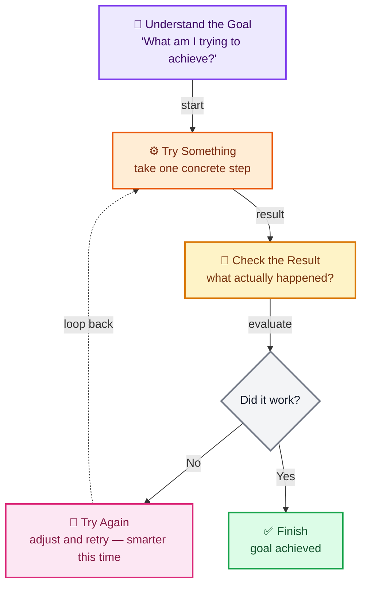

*Read this diagram like a story: the agent tries something (orange), checks what happened (amber), and if it did not work, it loops back (pink) and tries again — a little smarter each time — until it reaches success (green).*

### Why do AI systems need loops?

Early AI chat tools worked like this: you ask a question, the model answers once, and that's it. This is fine for a simple question like "What is the capital of France?" But it breaks down for real work, such as:

* "Fix the failing test in this code."
* "Research this topic and write me a short report."
* "Check my account and refund my last order if it's eligible."

These tasks need **several steps**, **using tools**, **checking whether something actually worked**, and sometimes **trying again after something fails**. A single LLM reply cannot do all of that — it only produces one answer, once. An **agent loop** puts the LLM inside a repeating cycle, so it can act, look at the result, and decide the next step — again and again — until the task is really finished.

### What problem does Loop Engineering solve, in plain words?

As AI moved from "answer one question" to "complete a real task," a new question showed up: *how should the system behave over time, across many steps — not just in one reply?* Loop Engineering answers that question. In simple terms, it solves problems like:

* The first attempt is wrong — how do we let the agent try again?
* A tool call fails — how do we recover instead of crashing?
* The task needs 10 steps — how do we keep track of progress?
* The agent could, in theory, keep going forever — how do we make sure it stops?

### Why does this matter for Agentic AI?

An "agent" is, by definition, something that **keeps acting toward a goal**, not something that answers once. Without a well-designed loop, an "agent" is really just a script that runs once and hopes for the best. Loop Engineering is what turns a plain LLM call into something that can genuinely act like an agent — adapting, retrying, and finishing real tasks.

---

## 2. The Four Engineering Layers

Building a good AI agent is not one skill — it is four related skills working together. This guide focuses on the third one, but it helps to see where it fits.

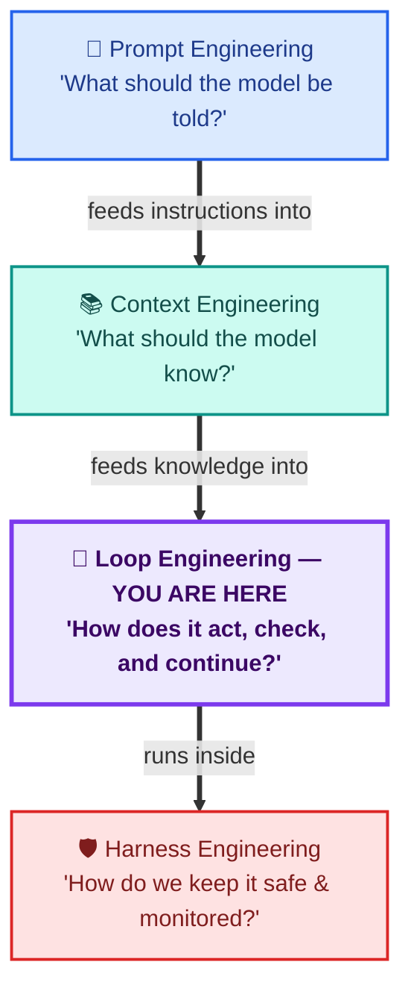

| Engineering | Main Focus | Main Question | Simple Example |
|---|---|---|---|
| **Prompt Engineering** | Instructions given to the model | "What should I tell the model to do?" | Writing a clear system prompt for a support bot |
| **Context Engineering** | Information given to the model | "What does the model need to know right now?" | Giving the research agent the right documents before it answers |
| **Loop Engineering** | The repeating decide → act → check cycle | "How does the system keep working until the goal is met?" | The coding agent keeps fixing code and re-running tests until they pass |
| **Harness Engineering** | The safety system around the agent | "How do we keep this agent safe, bounded, and observable?" | Limiting which tools the agent can call, and logging every action |

These four layers do **not replace each other** — they are different jobs that work together. A perfect prompt with a badly designed loop still fails. A great loop with no context still fails. Real agents need all four working as a team.

### Related Learning Guides

* [Learn about Prompt Engineering](../02_Prompt_engineering/README.md)
* [Learn about Context Engineering](../03_Context_engineering/README.md)
* [Learn about Harness Engineering](../09_Harness_engineering/README.md)

---

## 3. Why Loop Engineering Became Important

Before agent loops became common, most AI systems relied on:

* **One-shot LLM calls** — ask once, get one answer, no chance to fix mistakes.
* **Static prompts** — the same instructions every time, no matter what happens.
* **Static workflows** — a fixed list of steps that cannot adapt.
* **Manual iteration** — a human had to re-run the model by hand if the first answer was wrong.

This breaks down fast once tasks get more real:

* **Complex multi-step tasks** need many actions, not just one.
* **Tool failures happen** — an API times out, a search returns nothing useful.
* **Missing feedback** means the agent never learns that its first attempt was wrong.
* **No verification** means a wrong action can slip through unnoticed.
* **Incorrect actions** happen, and someone (or something) needs to fix them.
* **Stale information** can make a plan outdated halfway through a task.
* **Agents get stuck**, repeating the same mistake over and over.
* **Infinite loops** — the system never knows when to stop.
* **Uncontrolled tool usage** — calling tools with no limits or checks.

**Example — Coding Agent:** without a loop, the agent writes code once and stops, even if the tests fail. With a loop, it writes code, runs the tests, reads the error message, fixes the code, and runs the tests again — until they pass.

As AI systems became able to do multi-step tasks, engineers had to design more than just the instructions and information given to the model. They also had to design **how the system acts, checks results, deals with failures, judges its own progress, and decides when to keep going or stop.** That design work is Loop Engineering. It does not replace Prompt Engineering or Context Engineering — it works next to them, handling the part they cannot: *behavior over time.*

---

## 4. Basic Loop Engineering

Let's build this up from the very beginning, one simple idea at a time. For every idea: **what it is → why we need it → a real example → a picture.**

### What is a loop?

A loop is something that repeats until a condition is met. In daily life: refreshing a webpage until it loads, or stirring a pot until the sauce thickens. In programming, a loop repeats a block of instructions until told to stop.

**Why we need it:** many tasks cannot be finished in a single step. Repeating lets a system make progress bit by bit, and fix mistakes along the way.

### What is an AI loop?

An AI loop is a repeating cycle where an AI model is involved in every round — usually to decide what happens next, based on the latest information.

**Example — Data-Analysis Agent:** it looks at a dataset, spots an issue (like missing values), fixes that one issue, checks the data again, and repeats until the data is clean.

### What is an agent loop?

An agent loop is a special kind of AI loop where the AI **chooses its own next action** instead of following a fixed script. The system understands the goal, makes a plan, acts, looks at the result, and decides whether to keep going, adjust, or stop.

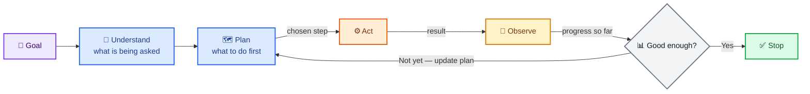

**Example — Research Agent:** goal = "write a report on renewable energy." It plans a search, searches, reads results, checks if it has enough information, and if not, goes back and searches again with a better query.

### What is an iteration?

**Iteration:** one full cycle of a loop — one round of think, act, and check.

> Example: the research agent searches once, reads the results, and decides what to search next. That whole round is one iteration.

### What is state?

**State:** the information the system remembers while a task is running.

> Example: the research agent remembers which sources it already read, so it does not read the same page twice.

### What is an action?

**Action:** something the agent does — calling a tool, writing code, sending a message, running a search.

> Example — Coding Agent: writing a new version of a function is one action.

### What is an observation?

**Observation:** the result the agent gets back after taking an action.

> Example — Coding Agent: after running the tests, the observation is the test report — which tests passed and which failed.

### What is feedback?

**Feedback:** information that tells the agent whether its last action actually helped.

> Example — Coding Agent: "2 tests failed because `total` was calculated with the wrong tax rate" is useful feedback. It tells the agent exactly what to fix next.

### What is verification?

**Verification:** checking that an action really worked, instead of just assuming it did.

> Example — Support Agent: after issuing a refund, the agent checks the payment system's response to confirm the refund actually went through, instead of just assuming the API call succeeded.

### What is a stop condition?

**Stop condition:** a clear rule that tells the loop exactly when to stop — either because the goal is done, or because it should give up safely.

> Example — Data-Analysis Agent: "stop once the report is generated and no data-quality warnings remain" — or "stop after 5 analysis attempts and flag the dataset for a human to review."

---

## 5. Simple LLM Call vs. Agent Loop

It helps to place these two side by side.

```mermaid
flowchart TD
    subgraph S1 ["🔹 Simple LLM Call — one shot, no checking, no retry"]
        direction LR
        U1["🙋 User"]:::goalStyle -->|"prompt"| L1["🧠 LLM"]:::thinkStyle -->|"one answer"| A1["✅ Done\n(right or wrong — no way to know)"]:::obsStyle
    end

    subgraph S2 [" "]
        direction LR
        Z[" "]
    end

    subgraph S3 ["🔁 Agent Loop — keeps checking and adjusting until the goal is really met"]
        direction LR
        G2["🎯 Goal"]:::goalStyle --> Pl2["🗺️ Plan"]:::thinkStyle
        Pl2 -->|"step"| Ac2["⚙️ Act"]:::actionStyle
        Ac2 -->|"result"| Ob2["👀 Observe"]:::obsStyle
        Ob2 --> Ev2{"Good enough?"}:::decisionStyle
        Ev2 -->|"No — try again"| Pl2
        Ev2 -->|"Yes"| Done2["✅ Stop"]:::successStyle
    end

    style S2 fill:transparent,stroke:transparent
    style Z fill:transparent,stroke:transparent

    classDef goalStyle fill:#EDE9FE,stroke:#7C3AED,stroke-width:2px,color:#3B0764
    classDef thinkStyle fill:#DBEAFE,stroke:#2563EB,stroke-width:2px,color:#1E3A8A
    classDef actionStyle fill:#FFEDD5,stroke:#EA580C,stroke-width:2px,color:#7C2D12
    classDef obsStyle fill:#FEF3C7,stroke:#D97706,stroke-width:2px,color:#78350F
    classDef decisionStyle fill:#F3F4F6,stroke:#6B7280,stroke-width:2px,color:#111827
    classDef successStyle fill:#DCFCE7,stroke:#16A34A,stroke-width:2px,color:#14532D
```

*One glance tells the story: the top path is a straight line — one pass, no checking. The bottom path has a loop-back arrow — it keeps checking and adjusting until it's actually good enough.*

A simple LLM call is great for direct questions where a single good answer is enough — for example, "What does HTTP 404 mean?" There is no room for the model to check its own work or try again.

An agent loop earns its extra complexity when the task is:

* **Complex** — many steps are needed (like the Coding Agent's write → test → fix cycle).
* **Uncertain** — the right answer is not obvious from the start (like the Research Agent not knowing in advance which search will find the best sources).
* **Tool-dependent** — real-world results must be checked, not just generated (like the Support Agent confirming a refund actually processed).

---

## 6. Core Loop Components

Every well-designed agent loop is built from the same core pieces. Think of this as the loop's skeleton — every example in this guide is a variation of this same shape.

* **Goal** — what the agent is trying to achieve.
* **State** — what the agent currently knows and remembers.
* **Context** — the relevant information given to the model this round.
* **Decision** — what the model chooses to do next.
* **Action** — the actual step taken (a tool call, a message, a code edit).
* **Tool** — the external capability used to carry out the action.
* **Observation** — what comes back after the action.
* **Feedback** — the signal telling the agent whether the action helped.
* **Verification** — an explicit check that the result is actually correct.
* **Retry** — trying again after a failure or a bad result.
* **Replanning** — updating the plan when the situation changes.
* **Termination** — the point where the loop stops.

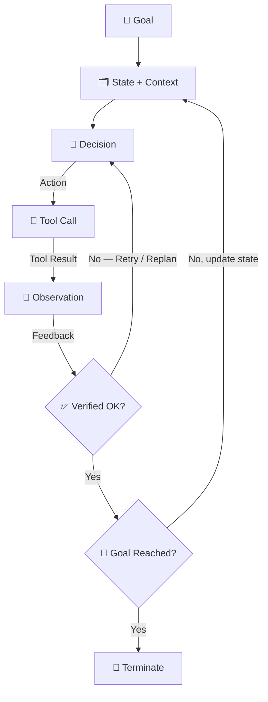

**Walking through it with the Support Agent:**
Goal = "resolve the customer's refund request." State/Context = the customer's order history. Decision = "check if this order is refund-eligible." Tool = the billing API. Observation = "order is eligible." Feedback + Verification = confirming the refund API actually returned success. Since the goal is now reached, the loop terminates and the agent replies to the customer.

---

## 7. Practical Examples: The Loop in Action

Here are our four agents again — this time showing exactly **what moves between each step**, not just the shape of the loop.

### 💻 Coding Agent — Write, Test, Fix, Repeat

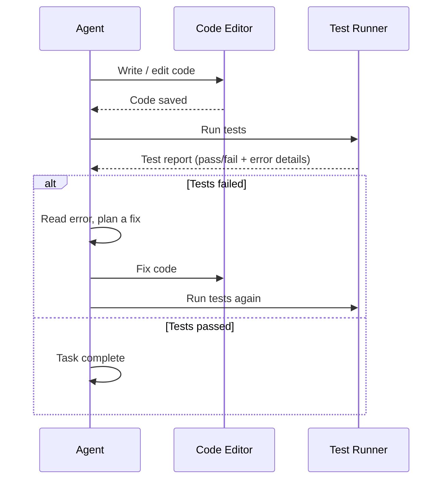

*What's happening:* the agent writes code, and the **observation** it gets back is the test report. If tests fail, that report is the **feedback** telling it exactly what went wrong. The agent uses that feedback to fix the code — this is a **retry** — and runs the tests again. The loop only stops once verification (all tests passing) is true.

### 🔎 Research Agent — Search, Evaluate, Fill Gaps, Report

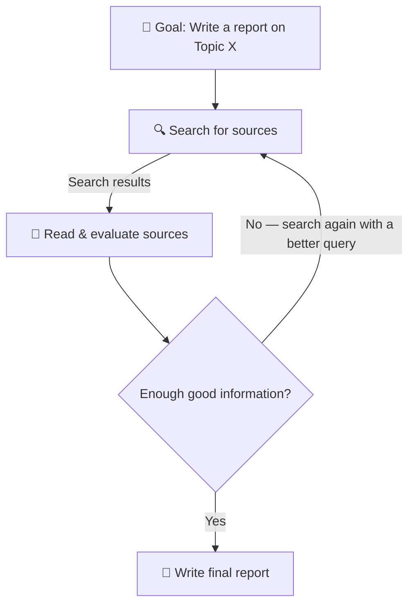

*What's happening:* each **search** is an action, and the **search results** are the observation. "Evaluate sources" is verification — the agent checks whether the sources are actually relevant and trustworthy, not just present. If something important is missing, the agent does not give up — it **replans** its next search query and tries again.

### 🎧 Support Agent — Understand, Check, Act, Verify, Reply

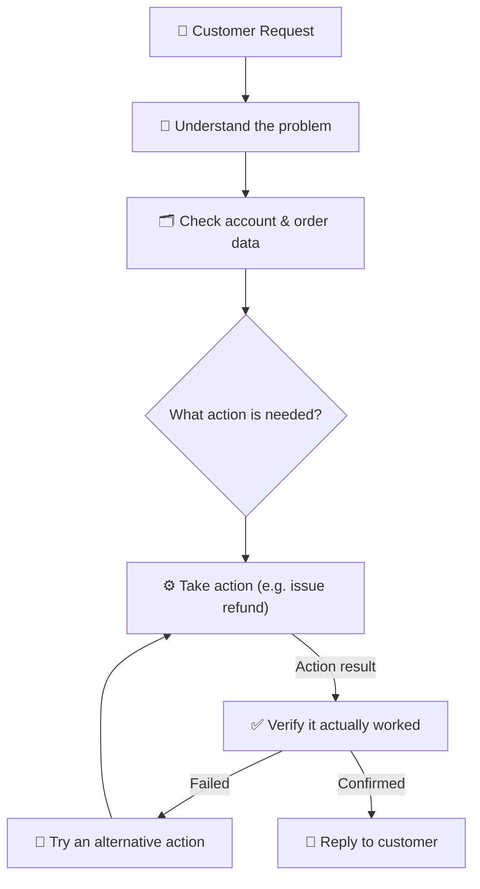

*What's happening:* "Check account & order data" is the context the agent needs before deciding anything. The action (like issuing a refund) is only considered done after **verification** — checking the billing system's real response, not just assuming the request worked. If verification fails, the agent does not just say sorry and stop — it retries with an alternative action.

### 📊 Data-Analysis Agent — Analyze, Check, Re-Analyze, Report

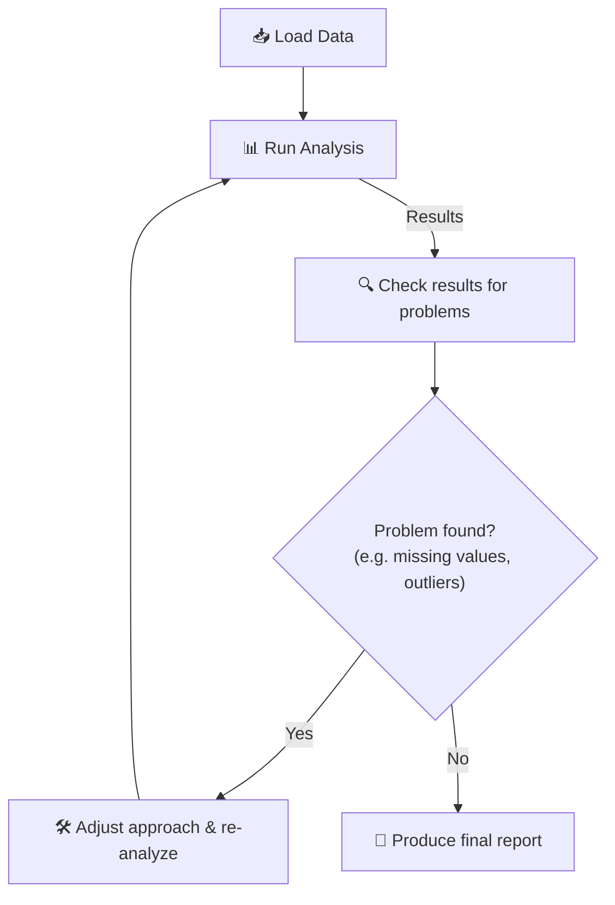

*What's happening:* the "Check results for problems" step is verification applied to *data*, not just to actions. If the agent spots something wrong — like an outlier skewing an average — it does not blindly report bad numbers. It adjusts its approach (maybe removing outliers, or using a different statistic) and re-runs the analysis.

### 🪞 Bonus: Self-Correcting Pattern (used inside all four agents above)

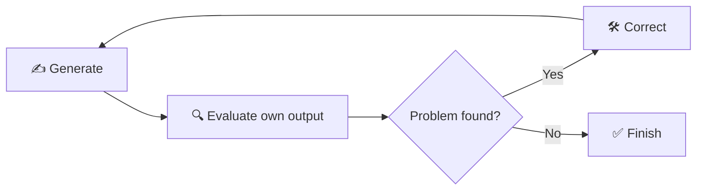

Notice this is the same basic shape as the Coding Agent's test loop and the Data-Analysis Agent's check loop — self-correction is really just verification pointed at the agent's *own* output instead of an external result.

---

## 8. Intermediate Loop Engineering

Once the basics feel natural, it's time to learn common loop **patterns** — reusable designs that solve specific, recurring problems. For each pattern: what it is, why it helps, and which of our four agents uses it.

### Stateful Loops

**What:** a loop that remembers information across rounds instead of starting fresh every time.
**Why:** without memory, an agent may repeat the same work or lose track of progress.
**Example:** the Research Agent keeps a running list of sources it already checked, so it never reads the same page twice.
**Risk if missing:** wasted time and repeated tool calls.

### Multi-Step Loops

**What:** a loop built around several distinct stages, not just one repeated action.
**Why:** real tasks naturally break into phases.
**Example:** the Support Agent moves through clear stages — understand → check → act → verify → reply — only looping *within* a stage if needed (like retrying the action step).

### Tool-Driven Loops

**What:** a loop where most rounds involve calling an external tool.
**Why:** many tasks need real data or real actions the LLM cannot produce by itself.
**Example:** the Data-Analysis Agent repeatedly calls a code-execution tool to run calculations and check the results.

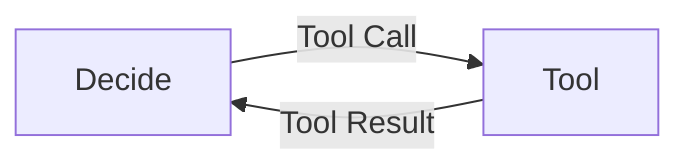

### Conditional Loops

**What:** a loop that branches based on a condition, not a fixed number of repeats.
**Why:** different situations call for different next steps.
**Example:** "If the billing API returns an error, retry after a short wait. If it returns success, move on to replying to the customer."

### Retry Loops

**What:** a loop that repeats a failed action, usually with an improved approach.
**Why:** tools and networks fail sometimes — one failure should not end the whole task.
**Example:** the Coding Agent's test-runner tool times out, so the agent waits briefly and runs the tests again.
**Important:** always pair this with a maximum retry limit (see Rule 2 below) so it cannot retry forever.

### Feedback Loops

**What:** a loop where each result clearly shapes the next decision.
**Why:** without feedback, the agent repeats the same action blindly.
**Example:** "Test failed: `total` is off by the tax amount" tells the Coding Agent exactly what to fix — much more useful than just "test failed."

### Verification Loops

**What:** a loop with a dedicated checking step before moving forward.
**Why:** assuming success is risky — many failures are silent.
**Example:** the Support Agent reads the billing system's actual response instead of assuming the refund worked just because the request was sent.

### Reflection Loops

**What:** a loop where the agent reviews its own reasoning or output before finalizing it.
**Why:** this catches mistakes that the first attempt might miss.
**Example:** before sending the final report, the Research Agent re-reads it and checks: "Does this actually answer the original question?"

### Planning Loops

**What:** a loop that creates and updates a plan before and during the work.
**Why:** complex tasks benefit from a clear roadmap instead of pure reaction.
**Example:** the Research Agent first breaks the topic into 3 sub-questions, then answers each one in turn.

### Replanning

**What:** updating the plan mid-task when new information changes the picture.
**Why:** plans made with limited information often need revising.
**Example:** the Data-Analysis Agent planned to use the average, but discovers extreme outliers — it replans and switches to the median instead.

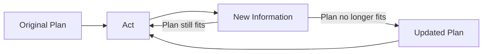

### Dynamic State Updates

**What:** keeping "what the agent knows" fresh as new observations arrive, instead of relying on outdated information.
**Why:** old data can lead to wrong decisions.
**Example:** once a sub-question is answered, the Research Agent removes it from its "still to research" list.

### Error Recovery

**What:** specific strategies for handling failures gracefully instead of the whole loop crashing.
**Why:** failures are normal in real systems, not rare exceptions.
**Example:** if the primary search tool is down, the Research Agent falls back to a secondary search tool instead of stopping entirely.

### Sequential vs. Parallel Execution

**Sequential:** steps run one after another — simpler to follow and debug.
**Parallel:** independent steps run at the same time — faster, but harder to coordinate and verify.
**Example:** the Research Agent might search three sub-topics in parallel, then combine the results sequentially into one report.

---

## 9. Advanced Loop Engineering

These are the patterns used in serious, real-world agent systems. Only reach for these when a task genuinely needs them.

### Adaptive Loops
A loop that changes its own strategy as the task unfolds — for example, the Research Agent starts with broad searches, then switches to narrow, specific searches once it has enough general context.

### Self-Correcting Loops
The agent checks its own output against clear criteria (correctness, completeness) and fixes problems before finishing — like the self-correction pattern shown in Section 7.

### Planner–Executor Pattern

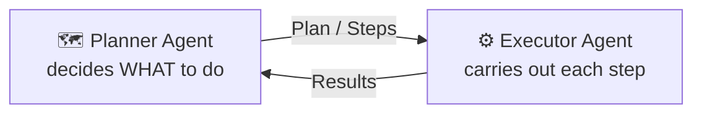

**Why it helps:** separating "thinking" (the plan) from "doing" (the execution) makes each part easier to build, test, and improve on its own. For example, in the Data-Analysis Agent, a Planner might decide *which* analyses are needed, while an Executor actually runs them.

### Critic / Evaluator Loops
A separate step (sometimes a second model call) reviews and scores the output, instead of the same generation pass judging itself. Example: a "Reviewer" step checks the Research Agent's report for accuracy before it is shown to the user.

### ReAct-Style Loops
The model alternates between **Reasoning** ("what should I do next, and why?") and **Acting** (actually taking that action), writing its reasoning out loud before each tool call. This makes the agent's decisions much easier to inspect and debug — you can literally read why it chose each action.

### Dynamic Tool Selection
Instead of always using the same tool, the agent picks the most useful tool for the current situation. Example: the Data-Analysis Agent chooses between a statistics tool and a plotting tool depending on what the user asked for.

### Nested Loops
A loop inside another loop. Example: the Coding Agent has an outer loop tracking overall task progress, and an inner loop that just handles retries for one specific failing test.

### Multi-Agent Loops
Several agents share one larger loop — covered in full detail in Section 11.

### Long-Running Agents
Agents that work over hours or days need state that survives restarts, plus careful limits so they don't quietly run away with time or cost.

### Human-in-the-Loop
The agent pauses at key moments to ask a human for approval or input, instead of acting fully on its own. Example: the Support Agent asks a human to approve any refund over $500.

### Approval Loops
A specific human-in-the-loop pattern: certain sensitive actions (sending money, deleting data) always require a human's "yes" before continuing.

### Fault-Tolerant Loops & Idempotency
**Fault tolerance** means the loop survives partial failures without corrupting its state. **Idempotency** means that if an action accidentally runs twice (say, because of a retry), it does not cause duplicate effects — for example, the Support Agent's refund tool should never issue two refunds if the "confirm refund" step is accidentally retried.

### Persistent State
Saving state to a database or file, not just memory, so a long or interrupted loop can pick up exactly where it left off.

### Loop-Level Evaluation & Observability
Measuring how the *loop itself* is performing, not just the final answer. Covered fully in Section 12.

> Advanced does not mean better — it means "available when the task genuinely calls for it."

---

## 10. Loop Engineering Rules & Principles ⭐

### Rule 1 — Always Define a Stop Condition
The agent should know exactly when its task is complete.
*Example — Coding Agent:* "stop when all tests pass," not "stop when it feels done."

### Rule 2 — Set Maximum Iterations
Protect the system from repeating forever.
*Example — Research Agent:* cap it at 8 search rounds, then force it to write a summary using what it already found.

### Rule 3 — Give the Agent Useful Feedback
A loop without meaningful feedback can repeat the same mistake forever.
*Example — Coding Agent:* return "failed because `total` used the wrong tax rate," not just "it failed."

### Rule 4 — Verify Important Actions
Never assume a tool or action succeeded — check it.
*Example — Support Agent:* confirm the billing API's response code, don't just assume the refund request worked.

### Rule 5 — Control Tool Usage
Avoid calling tools more than necessary.
*Example — Research Agent:* cache a search result instead of searching the exact same query twice in one task.

### Rule 6 — Manage Context Carefully
Don't pass irrelevant information into every round.
*Example — Data-Analysis Agent:* summarize earlier findings instead of re-sending the entire raw dataset every iteration.

### Rule 7 — Track State Explicitly
Important information should survive across iterations, not be forgotten.
*Example — Coding Agent:* remember which files were already edited, so it doesn't accidentally edit the same file twice.

### Rule 8 — Handle Failures
APIs, tools, networks, and models can all fail — plan for it.
*Example:* wrap every tool call in error handling with a clear fallback.

### Rule 9 — Control Cost and Latency
More iterations usually means more tokens, more time, and more money.
*Example:* log token usage per iteration and raise an alert if one task goes over budget.

### Rule 10 — Prefer the Smallest Effective Loop
Don't build a complex, highly autonomous system when a simple workflow will do the job.
*Example:* a one-step lookup does not need a five-agent planning system.

### Rule 11 — Make Termination Deterministic Where Possible
Prefer a clear, checkable stop condition ("all tests pass") over a vague one ("the model thinks it's done").

### Rule 12 — Design for Observability From Day One
If you can't see what the loop did and why, you can't debug it, trust it, or improve it later.

---

## 11. Loop Control, Reliability & Safety

Autonomous systems need boundaries — the same way a car needs brakes, not just an engine. Without limits, a loop can run forever, spend unlimited money, or take unsafe actions.

Key controls:

* **Maximum iterations** — a hard cap on how many cycles can run.
* **Time limits** — stop if the task takes too long.
* **Token budgets** — cap how many tokens a task may use.
* **Cost limits** — cap real-world spending (paid APIs, paid tools).
* **Tool limits** — restrict how often, or which, tools can be called.
* **Retry limits** — cap how many times one failed action can be retried.
* **Timeouts** — stop waiting on a slow tool response.
* **Error handling** — a defined plan for when something breaks.
* **Infinite-loop prevention** — detect the agent repeating the same state, and break out.
* **Stop conditions** — clear rules for both success and giving up.
* **Human approval** — pause for sensitive actions.
* **Guardrails** — rules the agent must never break, no matter what.
* **Tool permissions** — only allow the tools a task actually needs.
* **Safety checks** — validate outputs before they cause real-world effects.

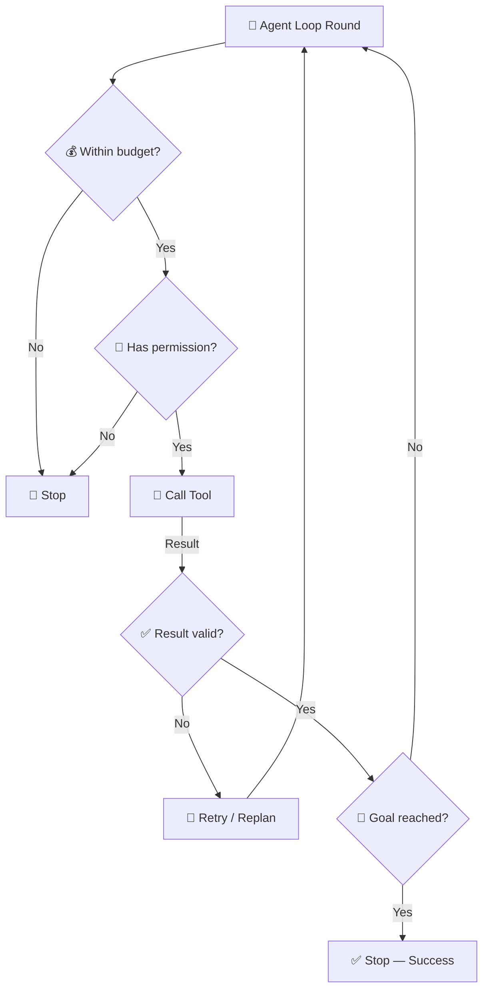

This "check before you act" pattern is one of the most important habits in production Loop Engineering. Every autonomous action should pass through a budget check, a permission check, and a result check — not just fire off freely and hope for the best.

**Example — Support Agent:** before issuing a refund, it checks: is this within the agent's allowed refund amount (budget)? Is refund an allowed action for this account type (permission)? Only then does it call the refund tool — and afterward it verifies the result before replying.

---

## 12. Evaluation & Observability

How do you know if a loop is actually working *well*, not just working at all? You measure it.

Common metrics:

* **Task success rate** — how often the loop actually reaches its goal.
* **Iteration count** — how many rounds it took.
* **Tool-call success rate** — how often tool calls succeed vs. fail.
* **Error rate** — how often something goes wrong.
* **Retry frequency** — how often the loop needs a second attempt.
* **Token usage** — total tokens used.
* **Cost** — real money spent.
* **Latency** — how long the task takes.
* **Completion rate** — tasks fully finished vs. abandoned.
* **Failure rate** — tasks that end without success.
* **Termination rate** — how often the loop stops for the *right* reason, versus hitting a limit.
* **Output quality** — how good the final result actually is.
* **Logging, tracing, monitoring** — a full record of what happened, step by step, for debugging.

### A practical comparison

**Loop A (Coding Agent, version 1):** fixes the bug after 12 iterations, with many failed test runs along the way.
**Loop B (Coding Agent, version 2):** fixes the same bug in 5 iterations, with far fewer failed test runs.

Even though both eventually pass all the tests, **Loop B is the better design.** It is faster, cheaper, and its low retry count suggests the agent understood the problem more clearly each round — instead of guessing repeatedly. A high iteration count with many retries often means the agent's plan, feedback, or context wasn't guiding it well, even if the final answer looks fine. Evaluation is what lets you notice this, instead of only asking "did it work at all?"

---

## 13. Multi-Agent Loop Engineering

Sometimes one agent is not the best design. A task can be split across several specialized agents, each with a clear job, working inside one shared loop.

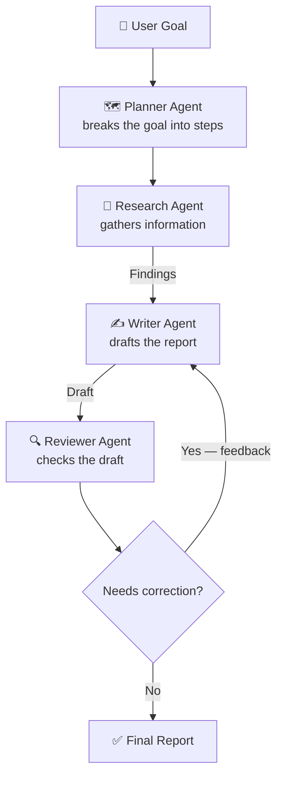

**Why multiple agents can help:** each agent specializes in one job (planning, researching, writing, reviewing), which can improve quality and make each part easier to build and debug on its own. This is really the Research Agent's loop from Section 7, split across four specialists instead of handled by one agent alone.

**How agents communicate:** usually through structured messages or shared state — the Planner writes a plan the Research agent reads, the Research agent writes findings the Writer reads, and so on.

**How control flows:** typically a controller (or the Planner itself) decides which agent acts next, based on the current state and what's still missing.

**How the loop continues between agents:** the same "continue / correct / stop" logic from a single-agent loop still applies — it's just that a *different agent* might be the one acting each round, like the Reviewer sending work back to the Writer above.

**When multi-agent systems are unnecessary:** for simple, single-skill tasks, splitting into multiple agents just adds coordination overhead, cost, and extra places things can fail — with no real benefit. **More agents does not automatically mean a better system.** Start with one agent. Split into several only when a task genuinely needs distinct, specialized roles.

---

## 14. Production Loop Engineering

Moving a loop from a demo to production changes what actually matters. A demo just needs to work once, in front of you. Production needs to work reliably, for many users, over a long time, safely.

Production concerns include:

* **Reliability** — consistent behavior across many runs, not just the happy path.
* **Error handling & retries** — every external call can fail; production loops expect this.
* **Timeouts** — nothing waits forever.
* **State persistence** — state survives crashes and restarts.
* **Idempotency** — repeated actions never cause duplicate side effects.
* **Observability** — every step is logged and can be traced back.
* **Security** — tools and data access are tightly scoped.
* **Cost control** — spending is capped and monitored.
* **Rate limiting** — protects your system and the APIs you rely on.
* **Human approval** — sensitive actions still get a human check.
* **Tool permissions** — least-privilege access, only what's needed.
* **Monitoring & evaluation** — ongoing measurement, not a one-time test.
* **Recovery** — the system can resume or fail gracefully, instead of silently breaking.

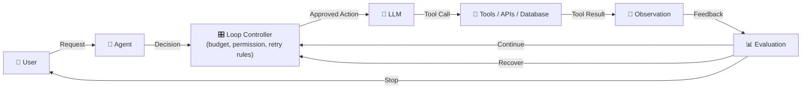

The **Loop Controller** is the key production addition — a dedicated layer that enforces budgets, permissions, retries, and stop conditions around the raw LLM ↔ tool cycle, instead of just trusting the model to regulate itself.

A successful production agent loop should be:

**Reliable + Controlled + Observable + Efficient + Safe**

---

## 15. Practice Projects

### 🟢 Beginner
* **Simple AI loop** — build a loop that keeps asking a model to shorten a sentence until it's under 20 words.
* **Question-answer loop** — a loop that asks clarifying questions until it has enough information to answer well.

*Practices: iterations, state, stop conditions.*

### 🟡 Intermediate
* **Tool-using agent** — an agent that calls a calculator or weather API and verifies the result before replying (like the Support Agent's verify step).
* **Research agent** — searches, checks sources, and searches again if information is missing (Section 7's Research Agent).
* **RAG agent** — retrieves documents, checks relevance, and re-retrieves with a better query if needed.
* **Coding/test loop** — writes code, runs tests, fixes failures, repeats until tests pass (Section 7's Coding Agent).

*Practices: tool-driven loops, feedback, retry, verification.*

### 🔴 Advanced
* **Self-correcting coding agent** — adds a reflection step that reviews its own code for bugs before even running the tests.
* **Multi-agent research system** — a Planner, Researcher, Writer, and Reviewer working together (Section 13).
* **Production-grade autonomous agent** — adds budgets, timeouts, logging, and human-approval checkpoints to any of the above (Section 14).

*Practices: planning, replanning, multi-agent coordination, production controls.*

---

## 16. Common Mistakes

| Mistake | Why It Hurts | Fix |
|---|---|---|
| No termination condition | Agent runs forever or stops randomly | Define a clear, checkable stop condition |
| Infinite loops | Wastes time, tokens, and money | Add maximum iteration and time limits |
| Too many iterations | Slower and more costly than needed | Track iteration count as a metric, and tune the loop |
| Unnecessary tool calls | Increases cost and risk of failure | Cache results, only call tools when truly needed |
| Too much context per step | Confuses the model, wastes tokens | Summarize or trim context each round |
| Poor state management | Agent forgets progress or repeats work | Track state explicitly and update it every step |
| No verification | Silent failures go unnoticed | Add a dedicated check step after every important action |
| No error handling | One failure crashes the whole task | Wrap actions in retries and fallback logic |
| No cost control | Bills can spiral unexpectedly | Set token and cost budgets per task |
| No observability | Impossible to debug or trust the system | Log every decision, action, and result |
| Unnecessary multi-agent systems | Adds coordination cost with no real benefit | Start with one agent, split only when justified |
| Assuming more iterations = better results | Not always true — can signal a badly guided loop | Evaluate quality per iteration, not just the final output |

---

## 17. Quick Summary

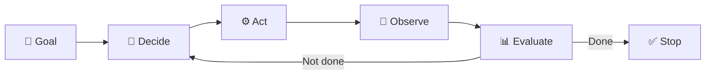

Loop Engineering is the skill of designing how an AI system repeatedly decides, acts, checks the result, and judges its own progress — until a task is genuinely finished, not just attempted once. It works alongside Prompt Engineering (what to say) and Context Engineering (what to know), adding the missing piece: **how to behave over time.** A well-engineered loop, like our Coding, Research, Support, and Data-Analysis agents, knows when to keep going, when to retry, when to ask for help, and — just as importantly — when to stop.

---

## 18. 10 Important Questions

<strong>1. What is Loop Engineering?</strong>

The skill of designing how an AI system repeatedly decides, acts, observes, verifies, and continues (or stops) while working toward a goal, instead of relying on a single one-shot response.

<strong>2. Why do AI systems need loops instead of a single LLM call?</strong>

Real tasks need several steps, tool use, and checking results — a single LLM call can only give one answer, with no chance to verify or correct it. The Coding Agent, for example, needs to write code, test it, and fix it — not just write it once.

<strong>3. What is an agent loop?</strong>

A repeating cycle where the AI understands a goal, plans, acts, observes the result, evaluates progress, and decides whether to continue, correct, or stop.

<strong>4. What is "state" and why does it matter?</strong>

State is information the system remembers while a task runs — like the Research Agent remembering which sources it already checked. Without it, an agent may repeat work or lose track of progress.

<strong>5. What is tool-calling in a loop, and why is it useful?</strong>

Tool-calling lets an agent take real actions (search, run code, call an API) instead of only generating text, and then use the tool's result to decide its next step — like the Data-Analysis Agent running a calculation tool.

<strong>6. What is feedback, and why does a loop need it?</strong>

Feedback tells the agent whether its last action actually helped. Without it, a loop may repeat the same mistake, like a Coding Agent re-submitting the exact same broken code.

<strong>7. What is a retry, and when should it be limited?</strong>

A retry is trying an action again after failure, usually with an improved approach. It should always have a maximum limit (Rule 2) to avoid infinite or wasteful repetition.

<strong>8. Why is verification important in a loop?</strong>

Verification checks that an action actually succeeded instead of assuming it did — like the Support Agent confirming a refund really went through, not just that the request was sent. Many failures are silent, and skipping verification lets them slip by.

<strong>9. What is a termination/stop condition?</strong>

A clear rule that tells the loop exactly when to stop — either because the goal was achieved (all tests pass), or because it should give up safely (after a maximum number of attempts).

<strong>10. What changes when moving a loop from a demo to production?</strong>

Production loops add reliability, error handling, timeouts, persistent state, idempotency, observability, security, cost control, rate limiting, human approval, and recovery — not just "does it work once."

---

## 19. Further Learning

* [Loop Engineering Crash Course](https://agentfactory.panaversity.org/docs/loop-engineering-crash-course)
* [The Four Layers: Prompt, Context, Harness, Loop](https://agentfactory.panaversity.org/docs/four-layers-crash-course)

---

> ### 🚀 Want to understand Loop Engineering even further?
>
> Continue learning with the **[Loop Engineering Crash Course](https://agentfactory.panaversity.org/docs/loop-engineering-crash-course)**.