# 🤖 OpenAI Agents SDK — The Complete Guide

### From "What is an agent?" to "Which framework should I actually use?" — a guide for total beginners and experienced engineers alike


> 💡 **How to read this guide:** Every important concept has three layers — a **one-line simple explanation**, a **real-world analogy**, and a **technical diagram**. Beginners can stop at layer one or two. Engineers can go straight to the diagrams and tables. Nobody gets left behind.

---

## 📚 Table of Contents

- [0. TL;DR — 60-Second Overview](#0-tldr--60-second-overview)
- [1. What Is an AI Agent?](#1-what-is-an-ai-agent)
- [2. What Is Agentic AI? (The Architecture)](#2-what-is-agentic-ai-the-architecture)
- [3. LLM vs. Chatbot vs. AI Application vs. Agent](#3-llm-vs-chatbot-vs-ai-application-vs-agent)
- [4. What Is the OpenAI Agents SDK? (The Toolkit)](#4-what-is-the-openai-agents-sdk-the-toolkit)
- [5. Why Was It Created?](#5-why-was-it-created)
- [6. Where Does It Fit in the AI Stack?](#6-where-does-it-fit-in-the-ai-stack)
- [7. Core Concepts (Explained Simply)](#7-core-concepts-explained-simply)
- [8. The Agent Lifecycle](#8-the-agent-lifecycle)
- [9. Single-Agent vs. Multi-Agent Design](#9-single-agent-vs-multi-agent-design)
- [10. Production & Safety: Guardrails, Tracing, HITL](#10-production--safety-guardrails-tracing-hitl)
- [11. Limitations & Disadvantages](#11-limitations--disadvantages)
- [12. Real-World Use Cases](#12-real-world-use-cases)
- [13. MCP & External Systems](#13-mcp--external-systems)
- [14. Other Agent Frameworks — Explained Simply](#14-other-agent-frameworks--explained-simply)
- [15. The Framework Comparison Matrix](#15-the-framework-comparison-matrix)
- [16. Which Framework Should You Choose?](#16-which-framework-should-you-choose)
- [17. Recommended Learning Path](#17-recommended-learning-path)
- [18. Key Takeaways](#18-key-takeaways)
- [19. Further Reading](#19-further-reading)

---

## 0. TL;DR — 60-Second Overview

> 🟢 **If you read nothing else, read this.**

Imagine you hire a **smart new employee** (the AI model). By itself, this employee can only talk — answer questions, write text. That's a plain LLM.

Now give that employee:
- A **job description** → *Instructions*
- **Access to tools** (phone, calculator, computer) → *Tools*
- **Coworkers to pass tricky cases to** → *Handoffs*
- **A supervisor who double-checks risky decisions** → *Guardrails / Human-in-the-loop*
- **A notebook to remember the conversation** → *Sessions*
- **A CCTV camera recording everything they did** → *Tracing*

That employee is now an **Agent**. The **OpenAI Agents SDK** is simply the toolkit that gives an AI model all of these things, so you don't have to build them yourself from scratch.

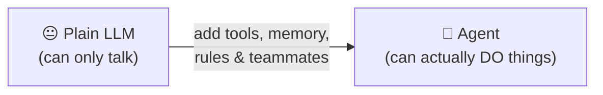

---

## 1. What Is an AI Agent?

### 🟢 In Simple Words
An **AI Agent** is an AI system that can **decide what to do next**, not just answer a single question. Given a goal, it can think, choose an action, use a tool, check its own work, and keep going until the goal is met — without a human manually deciding every single step.

### 🧠 Real-World Analogy
A plain chatbot is like a **vending machine** — you press a button, it gives you exactly one thing back. An agent is like a **personal assistant** — you say "book me a flight to Lahore next Friday," and they figure out the steps themselves: check your calendar, compare prices, confirm with you, and complete the booking.

### 📖 Technical Definition
An agent is a system built around a **model** (the reasoning engine) that operates in a loop: it observes the current state, decides on an action (respond, call a tool, delegate to another agent), executes that action, observes the result, and repeats until the task is complete or a stopping condition is hit.

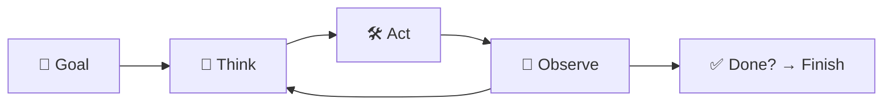

> **The defining trait of an agent is not intelligence — it's autonomy over a sequence of steps.** A very smart model that only answers one question at a time is still "just" an LLM call, not an agent.

---

## 2. What Is Agentic AI? (The Architecture)

### 🟢 In Simple Words
**Agentic AI** is the general *style of architecture* — the concepts and design patterns — used to build agents. It is not tied to any one company or product.

### 🧠 Real-World Analogy
"Agentic AI" is like the concept of "a restaurant kitchen" — chefs, stations, tickets, a pass. Any restaurant can be built this way. The **OpenAI Agents SDK** is one specific brand of kitchen equipment you could buy to build that kitchen. You could also buy equipment from a different brand (LangGraph, CrewAI, Google ADK) and build the same kind of kitchen.

### ⚠️ The Distinction That Trips Up Beginners

This is the single most important mental model to get right before going further:

| Layer | What It Is | Examples |
|---|---|---|
| **Agentic AI Concepts** | General ideas, architecture patterns — framework-agnostic | Tool calling, Memory, RAG, Multi-agent delegation, Planning, Guardrails, Observability |
| **A Specific Framework** | One company's *implementation* of those concepts, with its own APIs and naming | **OpenAI Agents SDK**, LangGraph, CrewAI, Google ADK, AutoGen |

> 🔑 **Key takeaway:** "Tool calling," "memory," "RAG," and "multi-agent orchestration" are **not** OpenAI Agents SDK features — they are **general Agentic AI concepts** that *every* framework in this guide implements in its own way. The OpenAI Agents SDK simply gives Python developers a specific, opinionated set of classes (`Agent`, `Runner`, `Tool`, `Handoff`...) to implement those same underlying ideas. Learn the concept once; the framework syntax is just a dialect.

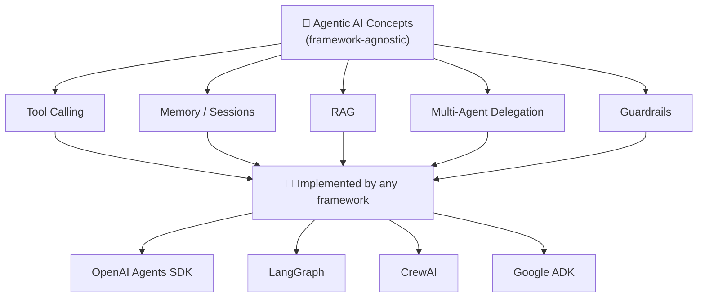

---

## 3. LLM vs. Chatbot vs. AI Application vs. Agent

### 🟢 In Simple Words
These four terms get used interchangeably in casual conversation, but they describe increasingly capable layers built on top of each other.

| Term | What It Actually Is | Can It Act on Its Own? | Has Memory? | Has Tools? |
|---|---|:---:|:---:|:---:|
| **LLM** | The raw model — text in, text out | ❌ | ❌ | ❌ |
| **Chatbot** | An LLM wrapped in a chat UI with conversation history | ❌ | ✅ | ❌ (usually) |
| **AI Application** | Software that calls an LLM as one component (e.g., a summarizer feature) | ❌ (fixed logic) | Depends | Sometimes |
| **Agent** | A system where the LLM itself decides the next action in a loop | ✅ | ✅ | ✅ |

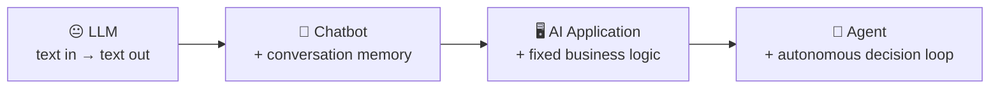

> **The line that matters:** in a normal AI Application, *your code* decides what happens next (`if/else`, fixed pipeline). In an **Agent**, *the model* decides what happens next. That shift — from "developer decides the flow" to "model decides the flow" — is the entire reason agent frameworks exist.

---

## 4. What Is the OpenAI Agents SDK? (The Toolkit)

### 🟢 In Simple Words
It's a **free, open-source toolbox (in Python)** that helps developers build the "Agentic AI" architecture described above — without hand-rolling tool calling, memory, safety checks, and multi-agent routing themselves.

### 🧠 Real-World Analogy
Think of building an AI agent like building a **call-center employee from scratch**. Without a framework, you'd have to personally design their training manual, their phone system, their escalation process, their supervisor-approval process, and their performance-review logs — all from zero. The Agents SDK hands you all of this **pre-built**, so you just plug in the specifics.

### 📖 Technical Definition
The **OpenAI Agents SDK** is an open-source Python framework for building **agentic AI applications** and **multi-agent workflows**. It exposes a small, composable set of primitives that let an AI model:

| Capability | Plain-English Meaning |
|---|---|
| 🧭 Follow instructions | It knows its job and stays in its lane |
| 🛠️ Use tools | It can call real functions, APIs, databases |
| 📦 Produce structured results | Its answers come back in a predictable format (not random text) |
| 🤝 Delegate work | It can pass a task to a more specialized agent |
| 🛡️ Validate input/output | It checks things before/after acting, to avoid mistakes |
| 💬 Maintain state | It remembers the conversation so far |
| 🔍 Be observed | Every step it takes is logged, so you can debug it |
| 🧑‍⚖️ Loop in humans | It pauses and asks a human before doing something risky |

OpenAI calls it a **lightweight, production-ready** framework — the official upgrade to its earlier experimental project, **Swarm**. It's built to work great with OpenAI models, but it isn't locked to them — other providers are supported too.

### 🧠 The Core Shift — Chatbot vs. Agent

A normal chatbot is a **straight line**: you ask, it answers, done.

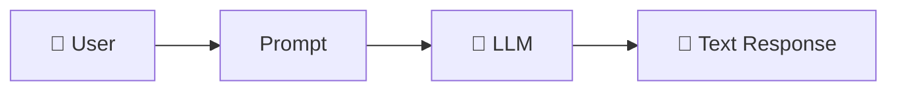

An **agent** is a **decision-making loop** — it can stop, think, use a tool, ask a friend (another agent), check a rule, and only then respond:

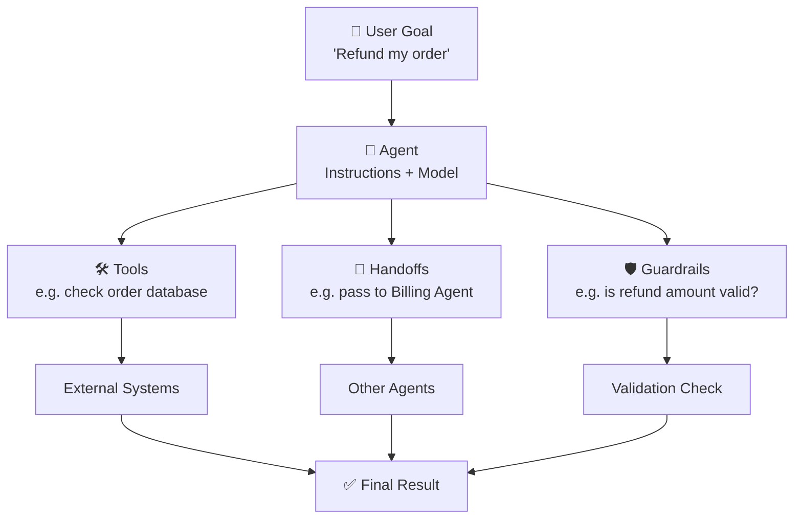

> **The key idea:** the AI model is no longer *just* generating text. It's now the "brain" inside a bigger software system that decides *when* to act and *how* the work should flow — just like a smart employee deciding when to escalate a customer complaint.

---

## 5. Why Was It Created?

### 🟢 In Simple Words
**OpenAI** built it, and released it for free, because developers kept building the *same boring plumbing* (tool-calling, memory, safety checks) over and over again for every single agent project. OpenAI decided to build that plumbing once, properly, so everyone could reuse it.

| | |
|---|---|
| **Creator / Organization** | OpenAI |
| **Project Name** | OpenAI Agents SDK |
| **Public Launch Date** | March 11, 2025 |
| **Earlier Version** | OpenAI Swarm (an experimental, "just for learning" project) |
| **Launched Together With** | The Responses API + built-in agent tools |

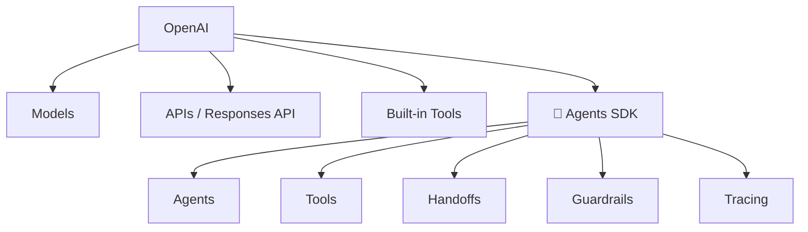

**Why did they build it?** Because developers trying to build real, production agents were stuck: too much manual prompt-tweaking, too much custom orchestration code, and almost no visibility into *what the agent was actually doing* when something went wrong.

### 🔧 A Quick Technical Note: `responses` API vs. `chat.completions` API

The Agents SDK was launched alongside a new API — the **Responses API** — which is worth understanding because it's what the SDK uses under the hood.

| | `chat.completions` (the older API) | `responses` (the newer API) |
|---|---|---|
| **Mental model** | Stateless — you resend the *entire* message history on every call | Can be **stateful** — the API can track conversation/run state for you |
| **Built for** | Simple text-in, text-out chat | Agentic workflows: tool use, multi-step reasoning, built-in tools |
| **Tool use** | You bolt tool-calling on manually, turn by turn | Native support for chaining tool calls, reasoning steps, and built-in tools (web search, file search, code interpreter) in a single request lifecycle |
| **Output shape** | One flat `message` object | A structured list of typed "items" (message, tool call, tool result, reasoning step) — closer to a trace |
| **Relationship to Agents SDK** | Still supported, and the SDK *can* run on it | This is the **default, recommended** transport the Agents SDK is built around |

> 🟢 **In one sentence:** `chat.completions` gives you back a message; `responses` gives you back a *sequence of steps* — which maps naturally onto how an agent actually behaves. This is a big part of why the SDK feels so lightweight: it isn't fighting the API, it's built directly on top of an API shaped like an agent loop.

---

## 6. Where Does It Fit in the AI Stack?

### 🟢 In Simple Words
The SDK is **not** the AI itself. It's the "management layer" that sits *above* the AI model and *organizes* how it's used — like a project manager coordinating a talented but unsupervised employee.

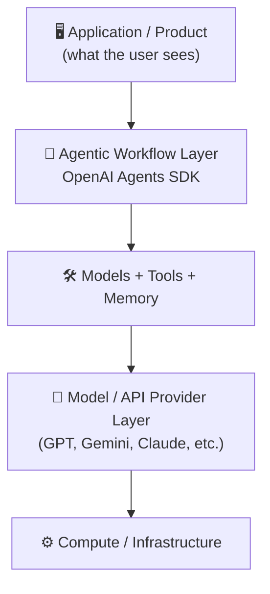

### The Problem It Solves

**Without the SDK — everything is your responsibility:**

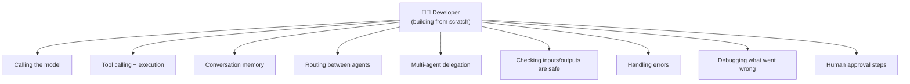

**With the SDK — it's already built, you just configure it:**

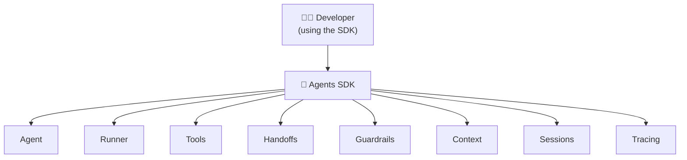

**Bottom line:** less time reinventing plumbing, more time making your agent actually good at its job.

---

## 7. Core Concepts (Explained Simply)

### 🗺️ The Big Picture First

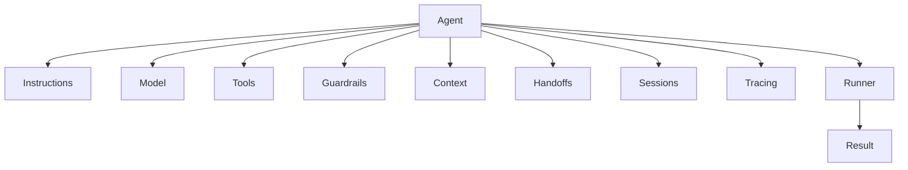

Now let's go through each piece — one at a time, in plain English first.

---

### 🧩 Agent
> 🟢 **Simple:** An Agent is "a configured AI employee" — a model + a job description + permissions.

**Analogy:** Same AI model (say GPT), but two different agents: one configured as a "friendly support rep," another as a "strict fraud reviewer." Same brain, different job.

**Formula:** `Agent = Model + Instructions + Tools + Rules + Behavior`

---

### ▶️ Runner
> 🟢 **Simple:** The Runner is the "engine" that actually drives the agent — it takes your input, runs the agent, and keeps going (calling tools, doing handoffs) until there's a final answer.

**Analogy:** If the Agent is the employee, the Runner is the **office** — it's what actually puts the employee to work, hands them tasks, and keeps the workday running until the task is done.

> `Agent` = the *job description*. `Runner` = the *workday that actually happens*.

### 💻 Minimal Code Example

Here's the smallest possible working example — one Agent, one tool, run to completion:

```python
from agents import Agent, Runner, function_tool

# 1. Define a tool — just a normal Python function
@function_tool
def get_weather(city: str) -> str:
    """Returns the current weather for a given city."""
    return f"It's sunny and 30°C in {city}."

# 2. Define the Agent — model + instructions + tools
agent = Agent(
    name="Weather Assistant",
    instructions="You help users check the weather. Be concise and friendly.",
    tools=[get_weather],
)

# 3. Run it — the Runner drives the loop:
#    model decides → calls tool → gets result → responds
result = Runner.run_sync(agent, "What's the weather like in Karachi?")

print(result.final_output)
# → "It's sunny and 30°C in Karachi!"
```

> Notice what you *didn't* have to write: no manual tool-call parsing, no retry logic, no message-history bookkeeping. `Runner.run_sync()` (or the async `Runner.run()`) handles the entire decide → act → observe loop for you.

---

### 📝 Instructions
> 🟢 **Simple:** Plain-language rules that tell the agent how to behave — its "personality + job rules."

```text
You are a Python tutor.
Explain programming concepts clearly.
Use simple examples.
Do not assume the student already understands advanced terminology.
```

> ⚠️ **Common beginner mix-up:** Instructions ≠ Tools. Instructions shape *how* the agent behaves. Tools give it *the actual ability to act*. A very polite agent with no tools still can't check a database — it can only talk politely about not being able to.

---

### 🛠️ Tools
> 🟢 **Simple:** Tools are how an agent moves from "just talking" to "actually doing." A calculator, a search engine, a database, a custom Python function — anything real it's allowed to use.

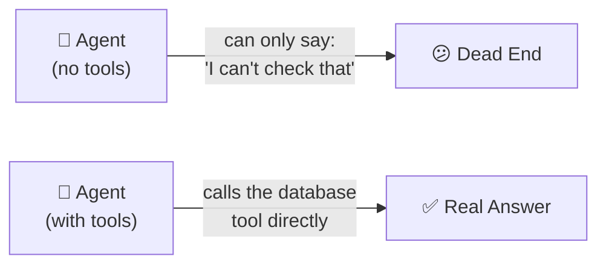

---

### ⚙️ Function Tools
> 🟢 **Simple:** A Function Tool is just your own normal Python function, wrapped up so the agent is *allowed to call it*.

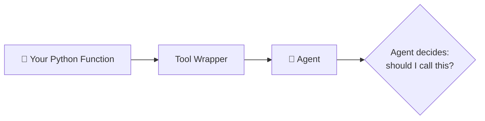

> ⚠️ **Important clarification for beginners:** the AI model does **not** magically run code on its own computer. It just *requests* a function call. **Your application** is the one that actually executes the function and sends the result back. Think of the model as saying "please press this button for me" — it can't press the button itself.

---

### 🔀 Handoffs
> 🟢 **Simple:** One agent says "this isn't my job" and **fully passes** the task to a more specialized agent — like a call-center rep transferring your call to a specialist.

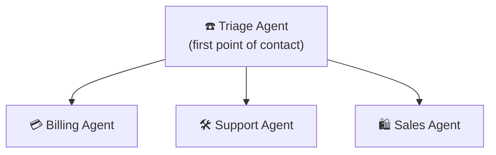

**Example flow:**
`User: "I was charged twice"` → Triage Agent hears "charged" → hands off completely to → Billing Agent → investigates → replies.

---

### 🧰 Agents as Tools
> 🟢 **Simple:** Instead of *fully transferring* the task (like a Handoff), the main agent stays in charge and just **asks another agent for help**, like a manager asking a specialist for a quick opinion, then continuing the meeting themselves.

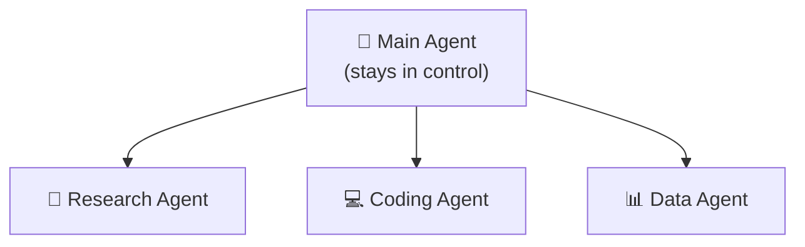

| | Handoff | Agent as Tool |
|---|---|---|
| Who's in charge after? | The *new* agent | The *original* agent |
| Analogy | Transferring a phone call | Asking a colleague a quick question |

---

### 🌐 Context
> 🟢 **Simple:** Extra background information the agent (or your app) has access to during a run — like a customer's account details sitting on the desk while the agent works.

| Type | What It Means |
|---|---|
| **Model Context** | Information actually *shown to the AI model* |
| **Application Context** | Data your app/tools can see — but is **not automatically** shown to the model |

> ⚠️ Just because data is "in context" for your app doesn't mean the AI model sees it. You choose what actually gets sent to the model.

---

### 💾 Sessions & Conversation History
> 🟢 **Simple:** Sessions are the agent's "short-term memory" for a conversation — it remembers what you said 3 messages ago.

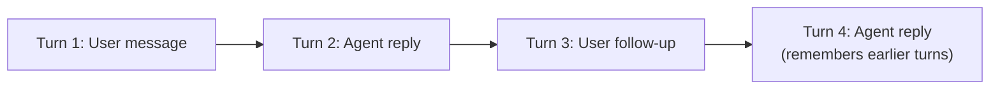

> This is just **stored conversation data** — not a claim that the AI has real, human-like memory or consciousness.

---

### 📦 Structured Outputs
> 🟢 **Simple:** Instead of a messy paragraph, the agent returns **clean, predictable data** your code can actually use.

```json
{
  "customer": "Ali",
  "priority": "high",
  "category": "billing"
}
```

**Why it matters:** if your app expects `"priority": "high"` and instead gets a paragraph of text, your code breaks. Structured output guarantees the shape stays consistent.

---

### 🔌 Models & Providers
> 🟢 **Simple:** The SDK is not "married" to one AI model. You can swap the model powering your agent without rebuilding your whole app.

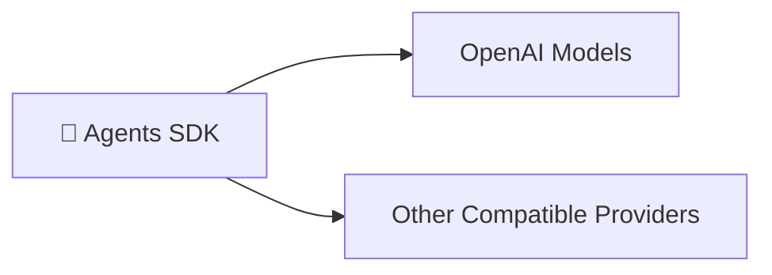

---

## 8. The Agent Lifecycle

### 🟢 In Simple Words
This is "what actually happens, step by step" from the moment a user makes a request to the moment they get an answer.

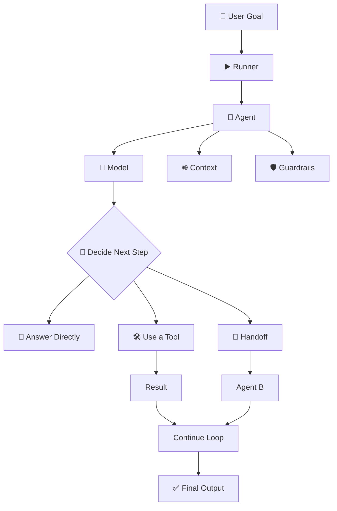

### The Agentic Loop — "How an agent actually thinks"

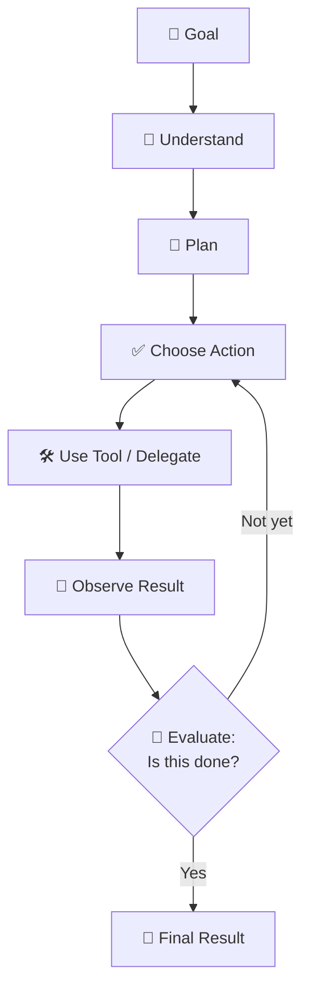

---

## 9. Single-Agent vs. Multi-Agent Design

### 🟢 In Simple Words
Sometimes one smart employee is enough. Sometimes you need a whole team. More agents = more capability, but also more cost, more delay, and more places things can break.

### Single Agent — "One employee, many tools"
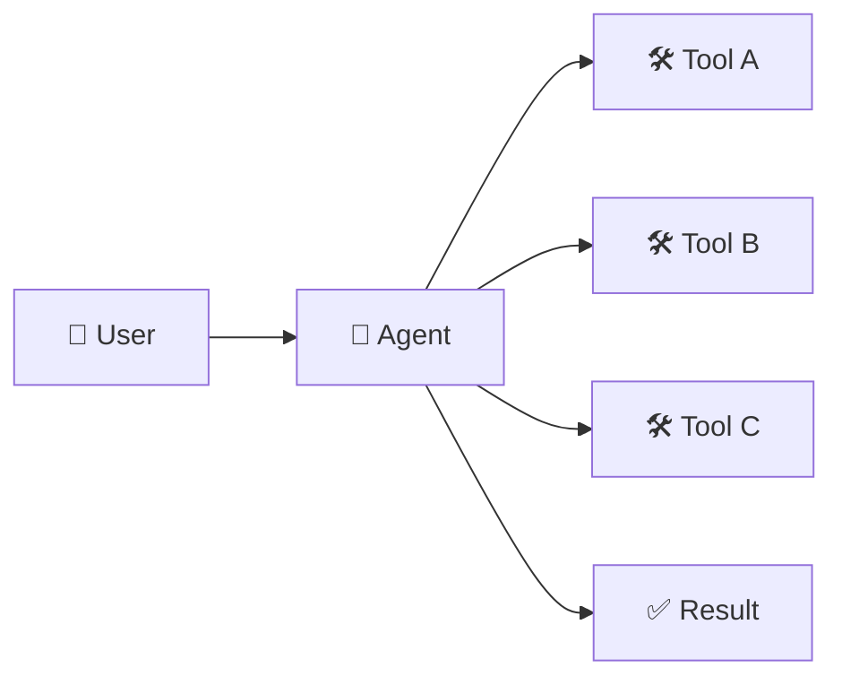
Good for most well-defined tasks. **Start here by default.**

### Multi-Agent — "A team with a manager"
```mermaid
flowchart TD
    U["👤 User"] --> O["👔 Orchestrator"]
    O --> R1["🔬 Research Agent"]
    O --> C1["💻 Coding Agent"]
    O --> Rv["🔍 Review Agent"]
    R1 --> Res["✅ Result"]
    C1 --> Res
    Rv --> Res
```

⚠️ **Golden rule:** More agents is not automatically better. Each new agent adds delay, cost (more model calls), and more places where things can go wrong. Only split into multiple agents when specialization genuinely earns its cost — e.g., a legal-review agent that needs very different instructions than a customer-chat agent.

---

## 10. Production & Safety: Guardrails, Tracing, HITL

> 🟢 **In Simple Words:** A working agent demo is easy. A *trustworthy* agent in production requires three extra layers: checks on what goes in/out, visibility into what happened, and a human safety net for risky moves.

### 🛡️ Guardrails
> 🟢 **Simple:** Safety checks that run *before* the agent acts and *after* it responds — like a spell-checker plus a security guard combined.

```mermaid
flowchart LR
    UI["📥 User Input"] --> IG["🛡️ Input Guardrail<br/>(is this request OK?)"] --> Ag["🤖 Agent"] --> OG["🛡️ Output Guardrail<br/>(is this answer OK?)"] --> F["📤 Final Output"]
```

> ⚠️ Guardrails are **one safety layer**, not a magic shield. A well-designed agent uses guardrails *together with* human review, good instructions, and limited tool permissions.

### 🔍 Tracing & Observability
> 🟢 **Simple:** A step-by-step recording of everything the agent did — like a flight recorder ("black box") for your AI system.

**Without tracing, you only see:**
```
Final Answer ✅ (but no idea how it got there)
```

**With tracing, you see the whole journey:**

```mermaid
flowchart TD
    Run[▶️ Run Started] --> A1[Agent started]
    A1 --> A2[Model call]
    A2 --> A3[Tool selected]
    A3 --> A4[Tool executed]
    A4 --> A5[Tool result returned]
    A5 --> A6[Another model call]
    A6 --> A7[Handoff to another agent]
    A7 --> A8["✅ Final output"]
```

> This matters a lot because agents usually fail **in the middle** of a task, not at the very end — tracing is how you find *where* it went wrong.

### 🧑‍⚖️ Human in the Loop (HITL)
> 🟢 **Simple:** For risky actions, the agent **pauses and asks a human** before doing anything — like an intern who must get manager sign-off before issuing a refund.

```mermaid
flowchart TD
    A["🤖 Agent proposes:<br/>'Refund $500'"] --> H{"🧑 Human Review"}
    H -->|✅ Approve| E["Execute the refund"]
    H -->|❌ Reject| S["Stop — do nothing"]
```

---

## 11. Limitations & Disadvantages

> 🟢 **In Simple Words:** The SDK makes building agents *easier* — it doesn't make the underlying AI *perfect*. All the usual AI weaknesses still apply.

| # | Limitation | In Plain Words |
|---|---|---|
| 1 | 🧠 **Model dependency** | A weak model = a weak agent, no matter how good the framework is |
| 2 | 🎭 **Hallucination risk** | The agent can confidently act on a wrong assumption |
| 3 | 🎯 **Tool misuse** | It might pick the wrong tool or use it incorrectly |
| 4 | 💰 **Cost** | Every extra step = another paid model call |
| 5 | 🐢 **Latency** | Tools, retries, and handoffs all add waiting time |
| 6 | 🐞 **Harder to debug** | AI behavior isn't 100% predictable like normal code |
| 7 | 🔓 **Security exposure** | Giving an agent tool access means giving it real-world power — that's risky if misused |
| 8 | 🧩 **Context complexity** | Long conversations need careful memory management |
| 9 | ❓ **Sometimes unnecessary** | A simple script often beats a fancy "autonomous agent" |

> **Rule of thumb:** Don't build an agent just because it's trendy. Build one when the task genuinely needs adaptive, tool-using, multi-step decision-making.

> 💡 **Pro Tip — Cut Cost & Latency with Model Tiering:** Not every agent in a multi-agent system needs your most powerful (and most expensive) model. A **Triage Agent** typically just needs to classify intent and route the request — a small, cheap, fast model like **`gpt-4o-mini`** is usually more than capable of that job. Reserve your top-tier model (e.g., `gpt-4o` or `gpt-5`) for the agent that actually does the hard reasoning — the Billing Agent resolving a dispute, the Coding Agent writing logic, etc. This "cheap router, expensive specialist" pattern can cut overall token cost and end-to-end latency significantly, since the triage step runs on almost every single request.

```mermaid
flowchart LR
    U["👤 User Request"] --> T["☎️ Triage Agent<br/>gpt-4o-mini (cheap & fast)"]
    T -->|billing| B["💳 Billing Agent<br/>gpt-4o (strong reasoning)"]
    T -->|simple FAQ| F["✅ Answer directly<br/>(mini handles it)"]
```

---

## 12. Real-World Use Cases

> 🟢 **In Simple Words:** Here's where teams are actually deploying agentic architectures like the one this SDK enables, beyond the toy examples.

| Use Case | What the Agent(s) Do |
|---|---|
| 🎧 **Customer Support Triage** | A triage agent classifies intent, then hands off to Billing / Technical / Returns agents, each with narrow tools and instructions |
| 💻 **Coding Assistants** | An agent plans a change, edits files via tools, runs tests, and iterates until tests pass |
| 🔬 **Research & Report Generation** | A research agent searches the web/internal docs, a writer agent drafts, a reviewer agent checks facts and tone |
| 🛒 **E-commerce Shopping Assistants** | An agent checks inventory tools, applies discount-code guardrails, and hands off to a human for anything above a spend threshold |
| 📊 **Data / Analytics Copilots** | An agent writes and executes queries against a database tool, then summarizes results in structured output |
| ⚖️ **Compliance / Document Review** | An agent extracts clauses via tools, flags risky terms, and requires human sign-off (HITL) before finalizing |
| 📞 **Internal IT Helpdesk Bots** | A triage agent resolves common issues directly (password resets) and escalates complex ones to a specialist agent or human |

> Notice the pattern across almost all of these: **a cheap triage/router step, narrow specialized agents, guardrails on anything irreversible, and a human checkpoint for high-stakes actions.** That combination — not any single clever prompt — is what makes these production-safe.

---

## 13. MCP & External Systems

> 🟢 **Simple:** MCP (**Model Context Protocol**) is like a **universal power socket** — instead of building a custom wire for every tool, tools that "speak MCP" plug into any agent that also "speaks MCP."

```mermaid
flowchart LR
    Agent["🤖 Agent"] --> MC["🔌 MCP Client"] --> MS["🔌 MCP Server"]
    MS --> DB[("🗄️ Database")]
    MS --> API["🌐 API"]
    MS --> Files["📁 Files"]
    MS --> Ext["🧩 External Service"]
```

> `Agents SDK` = the framework that builds the agent. `MCP` = the plug standard that connects the agent to outside tools. They **work together**, not against each other. In practice, MCP means you can write one tool server (say, for your company's internal ticketing system) once, and *any* MCP-compatible agent framework — not just the OpenAI Agents SDK — can use it without custom integration code.

---

## 14. Other Agent Frameworks — Explained Simply

> 🟢 **Quick mental model before we start:** think of these frameworks as different **toolkits for building a "team of AI workers."** They all solve a similar problem but were built by different companies, with different philosophies, for different comfort levels.

| Framework | Built By | One-Line Simple Explanation |
|---|---|---|
| **OpenAI Agents SDK** | OpenAI | The "starter kit" — simple, clean, gets you moving fast |
| **Google ADK** | Google | The "enterprise kit" — built for serious deployment, especially on Google Cloud |
| **AutoGen** | Microsoft Research | The "research kit" — pioneered multi-agent chat, now in maintenance mode |
| **CrewAI** | CrewAI | The "team-roleplay kit" — agents act like a team with job titles |
| **LangChain** | LangChain | The "mega toolbox" — huge library of integrations, not agent-only |
| **LangGraph** | LangChain | The "engineer's kit" — full manual control over every step |

---

### 14.1 🔵 Google ADK

> 🟢 **Simple:** If OpenAI's SDK is a starter kit, Google ADK is the **professional construction kit** — more structure, strong evaluation tools, and deep integration with Google Cloud.

**Definition:** An open-source, **code-first** framework for building, evaluating, and deploying agents and multi-agent systems. Announced **April 9, 2025** at Google Cloud Next. Optimized for Gemini and Vertex AI, but designed to stay model-agnostic.

```mermaid
flowchart TD
    Dev["👨‍💻 Developer"] --> ADK["🔵 Google ADK"]
    ADK --> Agents
    ADK --> Tools
    ADK --> Workflows
    ADK --> MultiAgent["Multi-Agent"]
    ADK --> Eval["📊 Evaluation"]
    ADK --> Deploy["🚀 Deployment"]
```

**Best for:** Teams already using Google Cloud / Gemini / Vertex AI who want strong built-in evaluation and a clear deployment path.

---

### 14.2 🟣 AutoGen

> 🟢 **Simple:** AutoGen was one of the **first popular frameworks where multiple AI agents literally "chat" with each other** to solve a task. It's now in maintenance mode — think of it as a respected pioneer that's since retired.

**Definition:** Microsoft's open-source multi-agent framework, released **September 2023**. Known for conversational multi-agent patterns and research into agent-to-agent and agent-to-human collaboration.

⚠️ **Current status:** repository is now **community-maintained**. Microsoft points new projects toward its newer **Agent Framework**.

**Best for:** Existing AutoGen projects, or academic/research settings exploring multi-agent conversation patterns.

---

### 14.3 🟢 CrewAI

> 🟢 **Simple:** CrewAI makes AI agents behave like **a real office team** — a Researcher, a Writer, a Reviewer — each with a defined role, working together on one goal.

**Definition:** A framework built around **"crews"** of specialized, role-based agents collaborating on shared tasks.

```mermaid
flowchart TD
    Crew["👥 Crew"] --> Researcher["🔬 Researcher"]
    Crew --> Writer["✍️ Writer"]
    Crew --> Reviewer["🔍 Reviewer"]
    Researcher --> Output["📄 Output"]
    Writer --> Output
    Reviewer --> Output
```

**Core building blocks:** Agents, Tasks, Crews, Processes, Flows, Memory, Knowledge, Guardrails, HITL.

**Best for:** Business-style workflows that map naturally to "job roles" — content pipelines, research-to-report generation, structured team simulations.

---

### 14.4 🟡 LangChain

> 🟢 **Simple:** LangChain is less "an agent framework" and more "a giant Lego set" for anything LLM-related — prompts, memory, retrieval, integrations, and yes, agents too.

**Definition:** A broad framework/ecosystem (started **October 2022**) for building LLM-powered applications — models, prompts, tools, retrieval, agents, and a massive integration catalog.

```mermaid
flowchart TD
    LC["🟡 LangChain"] --> Models
    LC --> Prompts
    LC --> Tools2["Tools"]
    LC --> Retrieval
    LC --> AgentsLC["Agents"]
    LC --> Integrations["🔌 Huge Integration Library"]
```

**Best for:** Apps that need deep integration coverage (vector databases, document loaders, retrievers) more than they need pure agent orchestration.

---

### 14.5 🔴 LangGraph

> 🟢 **Simple:** LangGraph is for when you want **total control** — you draw the exact flowchart of what your agent can do, step by step, like wiring an electrical circuit by hand.

**Definition:** A **low-level orchestration runtime** for building long-running, stateful agent applications using explicit state and graph-based control flow. Works independently of LangChain.

```mermaid
flowchart TD
    S["▶️ START"] --> Ag["🤖 Agent"]
    Ag --> TA["🛠️ Tool A"]
    Ag --> TB["🛠️ Tool B"]
    TA --> Ev{"Evaluate"}
    TB --> Ev
    Ev -->|Continue| Ag
    Ev -->|Done| E["🏁 END"]
```

**Best for:** Complex, long-running, stateful workflows needing precise control over every single transition — durable execution, deep human-in-the-loop, exact graph modeling.

---

## 15. The Framework Comparison Matrix

> 🟢 **Purpose of this section:** No "vibes." Each dimension below is a real, technical axis you'd actually evaluate before choosing a framework for a production system.

| Dimension | OpenAI Agents SDK | Google ADK | AutoGen | CrewAI | LangChain | LangGraph |
|---|---|---|---|---|---|---|
| **Philosophy** | Minimal primitives, opinionated defaults, fast to production | Code-first, enterprise deployment & evaluation | Agents-as-conversational-participants (research-driven) | Agents-as-team-roles (business process metaphor) | Broad ecosystem/integration hub; agents are one module among many | Explicit state machine; you own the control flow |
| **Abstraction Level** | Medium — a few core classes (`Agent`, `Runner`, `Tool`) | Medium-High — structured project scaffolding | Medium — conversational agent objects | High — roles, tasks, crews, processes | Low-to-High — mix of raw chains and high-level agents | Low — explicit nodes/edges, minimal hidden magic |
| **Learning Curve** | 🟢 Low | 🟡 Medium | 🟡 Medium | 🟢 Low-Medium | 🟡 Medium | 🔴 High |
| **Multi-Agent Support** | ✅ Native (Handoffs + Agents-as-Tools) | ✅ Native, with orchestration patterns | ✅ Core original use case (agent conversations) | ✅ Native (Crews of role-based agents) | ✅ Via LangGraph/agent modules, not core | ✅ Native, fully explicit graph-based routing |
| **State Management** | 🟡 Managed via Sessions (framework-handled) | ✅ Structured session/state services | 🟡 Conversation-history based | 🟡 Managed via Crew/Flow memory | 🟡 Varies by module (memory classes) | ✅✅ Explicit, developer-defined state schema — most granular control |
| **Tool Integration** | ✅ Function tools + hosted tools + MCP support | ✅ Native tools + MCP + Google ecosystem tools | ✅ Function/skill registration | ✅ Native tools + MCP support | ✅✅ Massive pre-built integration catalog | ✅ Any tool, but you wire it manually into the graph |
| **Human-in-the-loop (HITL)** | ✅ Built-in approval hooks | ✅ Built-in review/approval steps | 🟡 Possible via human-proxy agent pattern | ✅ Built-in HITL support | 🟡 Possible, not a first-class primitive | ✅✅ First-class — designed for durable interrupt/resume HITL |
| **Observability/Tracing** | ✅ Built-in tracing dashboard | ✅✅ Strong built-in evaluation + tracing | 🟡 Logging-based, less structured | 🟡 Basic built-in tracing | 🟡 Via LangSmith (separate product) | ✅✅ Deep tracing via LangSmith, step-level granularity |
| **Deployment Readiness** | 🟡 Production-ready, lightweight — you own hosting | ✅✅ Strong — built for Vertex AI/Cloud Run deployment | 🟡 Research-grade; maintenance mode | 🟡 Production-capable, growing tooling | 🟡 Varies — depends which module you deploy | ✅ Production-grade for complex durable workflows |
| **Best Use Case** | Fast, clean agent orchestration for teams that want to ship quickly | Enterprise deployment on Google Cloud with strong evaluation needs | Legacy projects / academic multi-agent conversation research | Business workflows that map naturally to job roles | Apps needing deep retrieval/integration coverage alongside agents | Complex, long-running, stateful workflows needing exact control |
| **When NOT to Use It** | You need very deep, explicit control over every state transition | You're not on Google Cloud and don't need its evaluation suite | Starting a new project — Microsoft recommends its newer Agent Framework instead | Your workflow doesn't map cleanly to fixed "roles" | You only need simple agent orchestration, not a whole ecosystem | Your task is simple — the explicit graph overhead isn't worth it |

> Legend: ✅ Strong/native support · 🟡 Present but requires more setup or is less mature · ✅✅ Best-in-class on this specific dimension

### Quick "Which One Fits My Personality?" Table

| If you want... | Pick this |
|---|---|
| 🚀 The fastest way to get started, simple and clean | **OpenAI Agents SDK** |
| 🏢 Enterprise-grade deployment on Google Cloud | **Google ADK** |
| 👥 Agents that feel like a role-based office team | **CrewAI** |
| 🔬 Academic/research multi-agent chat experiments | **AutoGen** (maintenance mode) |
| 🧰 A massive toolbox of integrations, not just agents | **LangChain** |
| 🎛️ Full manual control over every step of a complex flow | **LangGraph** |

### Four Key Match-Ups (Side by Side)

**OpenAI Agents SDK vs. Google ADK**
| | OpenAI Agents SDK | Google ADK |
|---|---|---|
| Feels like | A clean starter kit | A professional deployment platform |
| Best ecosystem fit | OpenAI | Google Cloud / Gemini |
| Evaluation tools | Basic, via ecosystem | Strong, built-in |
| **Pick this if...** | You want to move fast and stay simple | You're already deep in Google Cloud |

**OpenAI Agents SDK vs. CrewAI**
| | OpenAI Agents SDK | CrewAI |
|---|---|---|
| Feels like | Flexible building blocks | A pre-defined office team |
| Handoff style | Explicit, code-level | Role/task-driven collaboration |
| **Pick this if...** | You want custom control | Your task naturally maps to "job roles" |

**OpenAI Agents SDK vs. LangChain**
| | OpenAI Agents SDK | LangChain |
|---|---|---|
| Scope | Narrow — just agent orchestration | Broad — the whole LLM-app ecosystem |
| **Pick this if...** | You only need to build agents | You also need heavy retrieval/integrations |

**OpenAI Agents SDK vs. LangGraph** *(the most important comparison)*
| | OpenAI Agents SDK | LangGraph |
|---|---|---|
| Feels like | "Here are simple building blocks" | "Here is full manual control of the state machine" |
| Learning curve | 🟢 Easier | 🔴 Steeper |
| Control level | High | Very high |
| **Pick this if...** | You want to ship something *quickly* | You need to control *every single detail* of a complex flow |

---

## 16. Which Framework Should You Choose?

```mermaid
flowchart TD
    Start{"🤔 What matters<br/>most to you?"}
    Start -->|"Simplicity, fast start"| SDK["✅ OpenAI Agents SDK"]
    Start -->|"Google Cloud / Gemini"| ADK["✅ Google ADK"]
    Start -->|"Role-based team simulation"| Crew["✅ CrewAI"]
    Start -->|"Legacy research code"| AG["✅ AutoGen"]
    Start -->|"Huge integration coverage"| LC["✅ LangChain"]
    Start -->|"Total control, complex flows"| LG["✅ LangGraph"]
```

> **There is no single "best" framework** — only the one that best matches your project's complexity, your team's comfort level, and your deployment target.

### 🟢 When to Use an Agent at All (vs. a Normal Script)

```mermaid
flowchart TD
    Q{"🤔 Is the task simple<br/>and predictable, or<br/>complex and adaptive?"}
    Q -->|"Simple / always<br/>the same steps"| S["✅ Just write a normal function<br/>(no agent needed)"]
    Q -->|"Complex / needs<br/>judgment & flexibility"| A["✅ Use the Agentic Architecture<br/>(OpenAI Agents SDK)"]
```

| ✅ Good Fits | 🚫 Poor Fits |
|---|---|
| Customer support with varied queries | A task that's always the exact same steps |
| Research assistants | You only need one single LLM call |
| Coding agents | The workflow never changes |
| Multi-step business automation | No external tools are needed at all |
| Anything needing tracing/guardrails/structured output | Orchestration overhead outweighs the benefit |

---

## 17. Recommended Learning Path

```mermaid
flowchart TD
    P["🐍 Python"] --> AP["Async Python"]
    AP --> API["REST APIs"]
    API --> LLM["LLM Fundamentals"]
    LLM --> OA["OpenAI API / Responses concepts"]
    OA --> TC["Tool Calling"]
    TC --> SDK["🧰 OpenAI Agents SDK"]
    SDK --> AR["Agent + Runner"]
    AR --> FT["Function Tools"]
    FT --> HO["Handoffs"]
    HO --> AT["Agents as Tools"]
    AT --> CS["Context + Sessions"]
    CS --> GR["Guardrails"]
    GR --> TR["Tracing"]
    TR --> MCP["MCP"]
    MCP --> MA["Multi-Agent Systems"]
    MA --> Prod["🚀 Production Agentic AI"]
```

| Level | What to Learn |
|---|---|
| 🟢 **Beginner** | Agent · Instructions · Models · Runner · Basic tool calling · Function tools · Environment variables · Basic outputs |
| 🟡 **Intermediate** | Handoffs · Agents as tools · Context · Structured outputs · Guardrails · Sessions · Error handling · Tracing |
| 🔴 **Advanced** | Multi-agent architectures · Human-in-the-loop · MCP · Complex tool ecosystems · Stateful workflows · Evaluation · Observability · Security · Deployment |

---

## 18. Key Takeaways

```mermaid
flowchart BT
    L["🧠 LLMs"] --> TC["🛠️ Tool Calling"] --> AG["🤖 Agents"] --> MA["👥 Multi-Agent Systems"] --> AAI["🚀 Agentic AI"]
```

1. 🧠 An LLM generates text; an **agentic application** wraps that model with real capabilities and decision-making logic.
2. 🧩 **Agentic AI concepts** (tool calling, memory, RAG, multi-agent delegation) are framework-agnostic — the **OpenAI Agents SDK** is just one Python implementation of them.
3. 🛠️ **Tools** are what let an agent actually *do things*, not just describe them.
4. 🤝 **Handoffs** and **agent-as-tool** patterns are the building blocks of true multi-agent teamwork.
5. 🛡️ **Guardrails, human approval, and observability** aren't optional extras — they're what makes an agent trustworthy in production.
6. 💰 **Model tiering** (cheap models for triage, strong models for specialists) is a practical, easy lever for cost and latency.
7. 📚 **Frameworks come and go; concepts stay.** Learn agents, tools, state, delegation, and validation — the APIs will keep changing around them.

### 🏁 Final Word

The OpenAI Agents SDK is **not** an LLM, not a replacement for Python, not a database, not RAG, and not MCP. It's an **orchestration framework** — a way to combine models, instructions, tools, handoffs, guardrails, context, sessions, and observability into one working agentic application.

```text
Agent + Instructions + Model + Tools + Handoffs + Guardrails + Context + Runner + Observability
= 🚀 A Real Agentic Application
```

---

## 19. Further Reading

**OpenAI Agents SDK**
- [Official Documentation](https://openai.github.io/openai-agents-python/)
- [Quickstart Guide](https://openai.github.io/openai-agents-python/quickstart/)
- [GitHub Repository](https://github.com/openai/openai-agents-python)
- [Original Announcement (Mar 11, 2025)](https://openai.com/index/new-tools-for-building-agents/)
- [Panaversity — OpenAI Agents SDK Repo](https://github.com/panaversity/learn-agentic-ai/tree/main/01_ai_agents_first)
- [OpenAI Agents SDK Overview](https://blog.stackademic.com/openai-agents-sdk-ii-15a11d48e718)


**Google ADK**
- [Documentation](https://google.github.io/adk-docs/)
- [Announcement](https://developers.googleblog.com/en/agent-development-kit-easy-to-build-multi-agent-applications/)

**AutoGen**
- [Documentation](https://microsoft.github.io/autogen/)
- [GitHub Repository](https://github.com/microsoft/autogen)

**CrewAI**
- [Documentation](https://docs.crewai.com/)
- [GitHub Repository](https://github.com/crewAIInc/crewAI)

**LangChain**
- [Documentation](https://python.langchain.com/)

**LangGraph**
- [Documentation](https://langchain-ai.github.io/langgraph/)

---

> 📌 **Learning Principle:** Learn the concepts first, then the SDK APIs. Framework APIs change; the underlying ideas of models, tools, state, orchestration, delegation, validation, and observability are far more durable.

