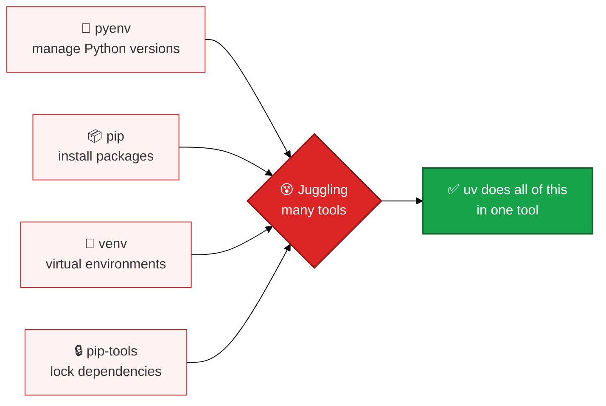
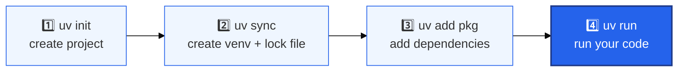

# 🚀 uv — A Beginner's Guide to Python's Fast Package & Project Manager

> uv is one tool that replaces many tools. It manages your Python version, virtual environment, dependencies, and lock file — all with simple commands. This guide walks you from "what is uv" to running your own project.

---

## 📚 Table of Contents

1. [🤔 What Is uv?](#-what-is-uv)
2. [⚙️ Installing uv](#️-installing-uv)
3. [✅ Verify the Installation](#-verify-the-installation)
4. [🏁 Getting Started with uv](#-getting-started-with-uv)
5. [💻 Simple Python Application](#-simple-python-application)
6. [📦 Python Packages / Dependencies](#-python-packages--dependencies)
7. [🏗️ Packaged Application](#️-packaged-application)
8. [🧰 Useful uv Commands](#-useful-uv-commands)
9. [📁 Project Structure](#-project-structure)
10. [📖 Resources](#-resources)

---

## 🤔 What Is uv?

**uv** is a fast, all-in-one tool that manages your entire Python project — from installing Python itself to installing packages and running your code.

### The problem it solves

Normally, Python developers juggle several separate tools:



uv replaces all of these with one fast, simple tool.

### What uv can do

- Download and pin a specific Python version
- Create and manage a virtual environment automatically
- Add, remove, and update dependencies
- Keep a lock file so installs are exactly reproducible
- Run scripts and tools without manually activating anything
- Build and publish your own packages

### Why use it?

- **Fast** — installs and resolves dependencies much quicker than older tools
- **Simple** — one command line tool instead of five
- **Reliable** — the lock file means your project installs the same way every time, on every machine

You mainly work with just two files:

| File | Purpose |
|---|---|
| `pyproject.toml` | What you **want** — your project's dependencies and settings |
| `uv.lock` | What you **got** — the exact versions uv resolved and installed |

<p align="right"><a href="#-table-of-contents">⬆ Back to top</a></p>

---

## ⚙️ Installing uv

Pick the method for your operating system.

### 🍎 macOS

```bash
brew install uv
```

Or with the install script:

```bash
curl -LsSf https://astral.sh/uv/install.sh | sh
```

### 🐧 Linux

```bash
curl -LsSf https://astral.sh/uv/install.sh | sh
```

If `uv` isn't found after installing, add it to your PATH:

```bash
export PATH="$HOME/.local/bin:$PATH"
```

### 💻 Windows

Open **PowerShell as Administrator** and run:

```powershell
powershell -ExecutionPolicy ByPass -c "irm https://astral.sh/uv/install.ps1 | iex"
```

### 🐍 Do I need Python installed first?

Not necessarily — uv can download and manage Python versions for you. But if you want Python installed the normal way too:

- **Windows:** Download from [python.org](https://www.python.org/downloads/windows/) and make sure you check **"Add Python to PATH"** during setup.
- **macOS:** `brew install python`
- **Linux:** `sudo apt install python3 python3-pip -y`

<p align="right"><a href="#-table-of-contents">⬆ Back to top</a></p>

---

## ✅ Verify the Installation

Check that uv installed correctly:

```bash
uv --version
```

You should see something like:

```
uv 0.x.x
```

You can also check your Python version:

```bash
python --version
```

<p align="right"><a href="#-table-of-contents">⬆ Back to top</a></p>

---

## 🏁 Getting Started with uv

Here's the typical flow when starting any uv project:



### Step 1 — Create a project

```bash
uv init my-project
cd my-project
```

This creates a starter folder with a `pyproject.toml`, a `main.py`, and a few config files — no manual setup needed.

### Step 2 — Pin a Python version (optional but recommended)

```bash
uv python pin 3.12
```

This makes sure everyone working on the project — and your CI pipeline — uses the exact same Python version.

### Step 3 — Create the environment

```bash
uv sync
```

This does two things:
- Creates a `.venv` folder (your virtual environment)
- Creates a `uv.lock` file (your exact dependency versions)

### Step 4 — Run your code

```bash
uv run python main.py
```

`uv run` automatically uses the project's virtual environment — you never need to manually activate it.

<p align="right"><a href="#-table-of-contents">⬆ Back to top</a></p>

---

## 💻 Simple Python Application

A **simple application** is just a plain project folder with scripts — no packaging setup needed. It's perfect for quick prototypes, small tools, or learning.

### Create it

```bash
uv init my-simple-app
cd my-simple-app
uv sync
```

### Edit `main.py`

```python
def main():
    print("Hello from my-simple-app!")

if __name__ == "__main__":
    main()
```

### Run it

```bash
uv run python main.py
```

Output:

```
Hello from my-simple-app!
```

### What each command did

| Command | What it does |
|---|---|
| `uv init my-simple-app` | Creates the project folder and starter files |
| `uv sync` | Creates the virtual environment and lock file |
| `uv run python main.py` | Runs your script inside the project's environment |

💡 You can also run it as a module: `uv run -m main`

<p align="right"><a href="#-table-of-contents">⬆ Back to top</a></p>

---

## 📦 Python Packages / Dependencies

### Adding a dependency

```bash
uv add requests
```

This does everything in one step:
- Adds `requests` to `pyproject.toml`
- Resolves the correct version
- Updates `uv.lock`
- Installs it into your `.venv`

### Adding a dev-only dependency

Tools like linters, formatters, or test runners don't need to ship with your app:

```bash
uv add --dev pytest ruff
```

### Removing a dependency

```bash
uv remove requests
```

### Making sure your environment matches the lock file exactly

```bash
uv sync --frozen
```

This is useful in CI or when sharing your project — it guarantees everyone gets the same versions.

### `pyproject.toml` vs `uv.lock` — in simple words

- **`pyproject.toml`** — the packages you *asked for* (e.g., "I need requests version 2 or higher")
- **`uv.lock`** — the exact versions that were *actually installed* (e.g., "requests 2.31.0")

Always commit both files to version control (like Git), so your whole team works with the same setup.

⚠️ **Common mistake:** don't edit `pyproject.toml` by hand and forget to update the lock file. Use `uv add` / `uv remove` instead — they keep both files in sync automatically.

<p align="right"><a href="#-table-of-contents">⬆ Back to top</a></p>

---

## 🏗️ Packaged Application

A **packaged application** is a project set up like a real, distributable Python package — with proper structure, versioning, and command-line entry points. Use this when your project will grow, be shared, or be installed elsewhere.

### Create it

```bash
uv init --package my-packaged-app
cd my-packaged-app
uv sync
```

This uses the **src layout** — your code lives inside a `src/` folder, separate from your project's config files. This keeps things clean and avoids import mistakes.

### How it runs

Packaged apps come with a ready-made command defined in `pyproject.toml`:

```toml
[project.scripts]
my-packaged-app = "my_packaged_app:main"
```

This means running:

```bash
uv run my-packaged-app
```

...will call the `main()` function inside your package.

### Simple app vs Packaged app

| | 📝 Simple App | 🏗️ Packaged App |
|---|---|---|
| Structure | Loose script folder | Organized `src/` layout |
| Best for | Prototypes, quick tools | Long-term, shareable projects |
| CLI command | Manual setup needed | Built-in via `[project.scripts]` |
| Publishing to PyPI | Not designed for it | Ready for it |

<p align="right"><a href="#-table-of-contents">⬆ Back to top</a></p>

---

## 🧰 Useful uv Commands

| Command | What It Does |
|---|---|
| `uv init <name>` | Create a new project |
| `uv init --package <name>` | Create a new packaged application |
| `uv python pin 3.12` | Lock the Python version for the project |
| `uv sync` | Create/update the virtual environment and lock file |
| `uv sync --frozen` | Install exactly what's in the lock file, no changes allowed |
| `uv add <package>` | Add a dependency |
| `uv add --dev <package>` | Add a dev-only dependency |
| `uv remove <package>` | Remove a dependency |
| `uv run <command>` | Run a command inside the project's environment |
| `uv run python file.py` | Run a Python file |
| `uv build` | Build your package (wheel + sdist) |
| `uv publish` | Publish your package to PyPI |
| `uv cache prune` | Clean up unused cache to save space |

<p align="right"><a href="#-table-of-contents">⬆ Back to top</a></p>

---

## 📁 Project Structure

A simple application looks like this:

```
my-simple-app/
├── .gitignore         # Ignore rules for Python projects
├── .python-version    # The pinned Python version
├── main.py            # Your starter script
├── pyproject.toml     # Project settings and dependencies
├── uv.lock            # Exact locked dependency versions
└── README.md          # Project notes
```

A packaged application adds a `src/` layout:

```
my-packaged-app/
├── .gitignore
├── .python-version
├── pyproject.toml
├── uv.lock
├── README.md
└── src/
    └── my_packaged_app/
        ├── __init__.py     # Marks this folder as a package
        └── main.py         # Your app's main logic
```

| File / Folder | Why It Matters |
|---|---|
| `pyproject.toml` | Declares your dependencies, Python version, and CLI commands |
| `uv.lock` | Guarantees the exact same install every time, on every machine |
| `.venv/` | The virtual environment uv creates for your project (auto-generated) |
| `.python-version` | Keeps everyone on the same Python version |
| `src/` | Keeps your actual code separate and cleanly importable (packaged apps) |

<p align="right"><a href="#-table-of-contents">⬆ Back to top</a></p>

---

## 📖 Resources

- [uv Official Documentation](https://docs.astral.sh/uv/)
- [uv — Running Scripts](https://docs.astral.sh/uv/guides/scripts/)
- [uv — Working on Projects](https://docs.astral.sh/uv/guides/projects/)
- [uv — CLI Reference](https://docs.astral.sh/uv/reference/cli/)
- [uv on GitHub](https://github.com/astral-sh/uv)

<p align="center"><strong>🚀 One tool. One workflow. Faster Python projects.</strong></p>