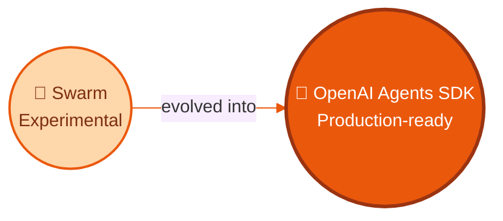
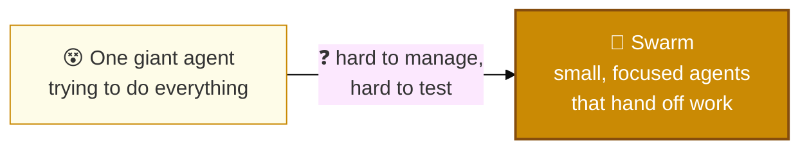
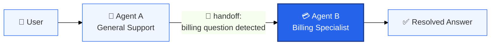
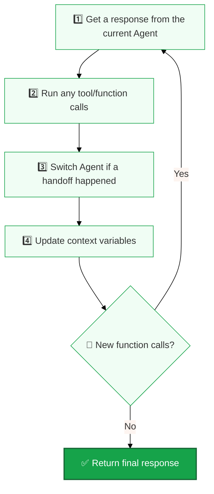
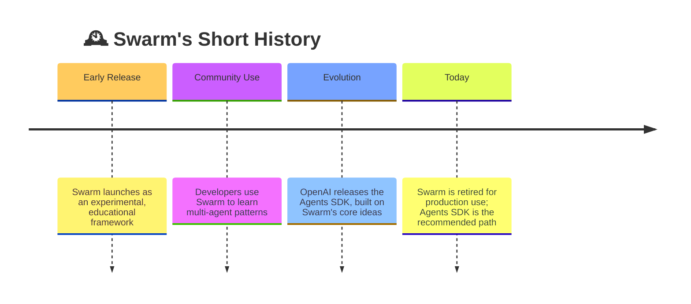

# 🐝 Swarm — OpenAI's Lightweight Multi-Agent Framework

> A small, simple, educational framework for coordinating multiple AI agents. Swarm taught the ideas — the **OpenAI Agents SDK** turned them into a production-ready tool.



---

## 📚 Table of Contents

1. [🐝 What Is Swarm?](#-what-is-swarm)
2. [🎯 Why Swarm Was Built](#-why-swarm-was-built)
3. [🧩 Core Ideas: Agents & Handoffs](#-core-ideas-agents--handoffs)
4. [🔄 How Swarm Runs a Conversation](#-how-swarm-runs-a-conversation)
5. [💻 Quick Example](#-quick-example)
6. [📜 From Swarm to the OpenAI Agents SDK](#-from-swarm-to-the-openai-agents-sdk)
7. [🏗️ Anthropic's Agent Patterns Inside the SDK](#️-anthropics-agent-patterns-inside-the-sdk)
8. [⚖️ Swarm vs OpenAI Agents SDK](#️-swarm-vs-openai-agents-sdk)
9. [📖 Resources](#-resources)

---

## 🐝 What Is Swarm?

Swarm is an **experimental, educational** framework from OpenAI for coordinating several AI agents at once. It's small on purpose — built to be lightweight, easy to test, and simple to understand, not to be a full production system.

📌 Swarm runs almost entirely on the client side and holds no memory between calls — just like the Chat Completions API it's built on.

---

## 🎯 Why Swarm Was Built

One agent with one giant prompt gets messy fast when it needs to handle many different jobs. Swarm exists to split that work across smaller, focused agents that can pass a conversation to each other.



---

## 🧩 Core Ideas: Agents & Handoffs

Swarm is built on just **two ideas** — that's the whole point.

| Concept | What It Means |
|---|---|
| 🤖 **Agent** | A focused unit with its own instructions and its own set of tools/functions. |
| 🔁 **Handoff** | A way for one agent to pass the conversation to another agent that's better suited for it. |



**Example:** A general support agent notices a billing question and hands the conversation to a billing agent — the user gets an answer from the right specialist, without starting over.

---

## 🔄 How Swarm Runs a Conversation

Every call to `client.run()` follows the same loop:



---

## 💻 Quick Example

```python
from swarm import Swarm, Agent

client = Swarm()

def transfer_to_agent_b():
    return agent_b

agent_a = Agent(
    name="Agent A",
    instructions="You are a helpful agent.",
    functions=[transfer_to_agent_b],
)

agent_b = Agent(
    name="Agent B",
    instructions="Only speak in Haikus.",
)

response = client.run(
    agent=agent_a,
    messages=[{"role": "user", "content": "I want to talk to agent B."}],
)

print(response.messages[-1]["content"])
```

**Install:**
```bash
pip install git+https://github.com/openai/swarm.git
```
📌 Requires Python 3.10+.

---

## 📜 From Swarm to the OpenAI Agents SDK

Swarm was always labeled **experimental** — a way for developers to learn multi-agent orchestration, not something to run in production. OpenAI later released the **Agents SDK**, built directly on Swarm's two core ideas (Agents and handoffs), but made **production-ready**: better tooling, active maintenance, and stronger support for real-world workloads.



⚠️ OpenAI's own guidance: migrate to the Agents SDK for anything beyond learning and prototyping.

---

## 🏗️ Anthropic's Agent Patterns Inside the SDK

The Agents SDK maps closely onto the agent design patterns Anthropic described in [*Building Effective Agents*](https://www.anthropic.com/engineering/building-effective-agents):

| Pattern | What It Does | How the SDK Supports It |
|---|---|---|
| 🔗 **Prompt Chaining** | Breaks a task into ordered steps | Agents run in a defined sequence |
| 🚦 **Routing** | Sends a task to the right specialist | The handoff mechanism |
| ⚡ **Parallelization** | Runs subtasks at the same time | Agents can operate concurrently |
| 🧭 **Orchestrator-Workers** | One agent delegates to several others | An orchestrator agent assigns work to worker agents |
| 📊 **Evaluator-Optimizer** | Improves output through feedback loops | Guardrails that check and refine agent behavior |

---

## ⚖️ Swarm vs OpenAI Agents SDK

| | 🐝 Swarm | 🚀 Agents SDK |
|---|---|---|
| Status | Experimental, educational | Production-ready |
| Maintenance | Not actively maintained | Actively maintained by OpenAI |
| Memory between calls | None (stateless) | Improved state handling |
| Best for | Learning multi-agent concepts | Real applications |
| Core ideas | Agents + Handoffs | Same ideas, expanded and hardened |

---

## 📖 Resources

- [Swarm on GitHub](https://github.com/openai/swarm)
- [Anthropic — Building Effective Agents](https://www.anthropic.com/engineering/building-effective-agents)

<p align="center"><strong>🐝 Swarm taught the pattern. 🚀 The Agents SDK made it production-ready.</strong></p>


