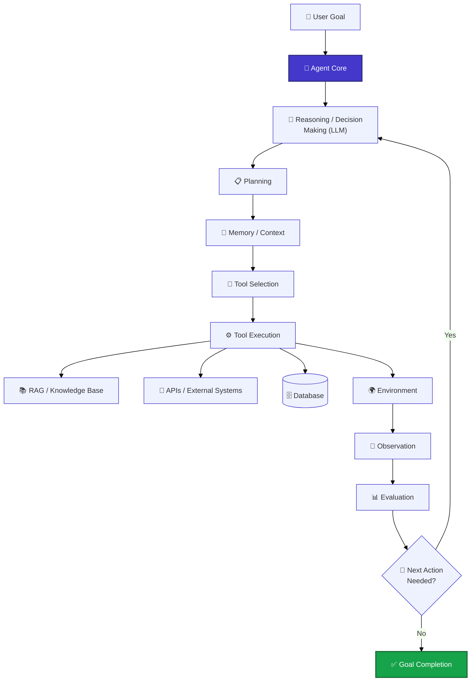
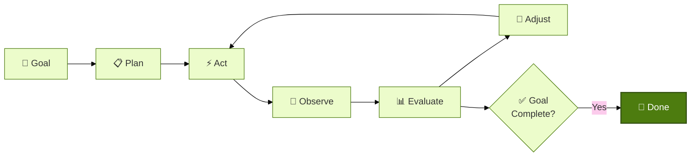
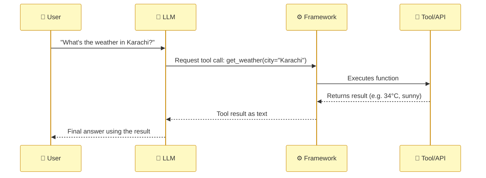
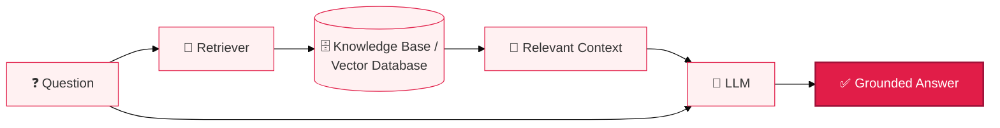
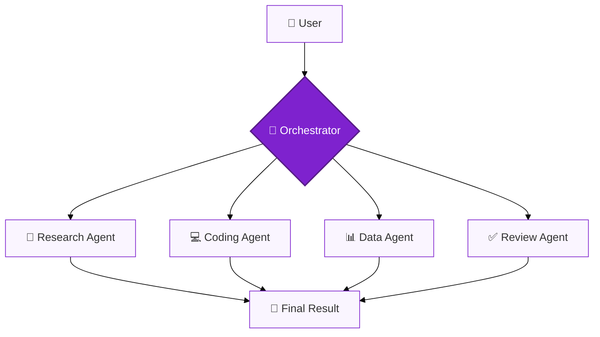
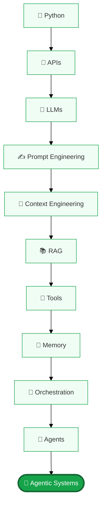

# 🚀 Agentic AI — A Complete, Beginner-Friendly Guide

> You've learned what AI is and how it evolved. Now let's go deep on the newest, most powerful stage: **Agentic AI** — systems that don't just answer, they *act*.

## 🎯 What You'll Learn Here

- What an **AI Agent** is, and what **Agentic AI** means as a broader paradigm
- How agents actually work under the hood (architecture, loop, components)
- Core building blocks: planning, reasoning, tool/function calling, memory, context
- Prompt engineering vs. context engineering vs. RAG
- Multi-agent systems, orchestration, and human-in-the-loop design
- Guardrails, evaluation, observability, and security
- The major protocols and frameworks (MCP, A2A, LangChain, LangGraph, CrewAI, AutoGen, Google ADK, OpenAI Agents SDK, n8n) and when to use each
- How everything stacks: Python → APIs → LLMs → Prompting → Context → RAG → Tools → Memory → Orchestration → Agents → Agentic Systems

---

## 📚 Table of Contents

1. [🤖 AI Agent vs Agentic AI](#1--ai-agent-vs-agentic-ai)
2. [🏗️ How Agents Work: Architecture](#2--how-agents-work-architecture)
3. [🎯 Goals & Autonomy](#3--goals--autonomy)
4. [📋 Planning & Reasoning](#4--planning--reasoning)
5. [🔧 Tool Calling & Function Calling](#5--tool-calling--function-calling)
6. [🧠 Memory & Context](#6--memory--context)
7. [✍️ Prompt Engineering vs Context Engineering](#7--️-prompt-engineering-vs-context-engineering)
8. [📚 RAG in Agentic Systems](#8--rag-in-agentic-systems)
9. [👥 Multi-Agent Systems & Orchestration](#9--multi-agent-systems--orchestration)
10. [🔄 Workflows vs Autonomous Agents](#10--workflows-vs-autonomous-agents)
11. [🙋 Human-in-the-Loop & Guardrails](#11--human-in-the-loop--guardrails)
12. [📊 Evaluation & Observability](#12--evaluation--observability)
13. [📡 Agent Communication: MCP & A2A](#13--agent-communication-mcp--a2a)
14. [🔌 APIs, Databases & Vector Databases](#14--apis-databases--vector-databases)
15. [🚀 Deployment, Security, Reliability & Cost](#15--deployment-security-reliability--cost)
16. [🧰 Technologies & Frameworks Compared](#16--technologies--frameworks-compared)
17. [🧱 The Full Agentic AI Stack](#17--the-full-agentic-ai-stack)
18. [🌍 Use Cases](#18--use-cases)
19. [❓ Quick Check — Test Yourself](#19--quick-check--test-yourself)
20. [🧭 Navigation](#20--navigation)

---

## 1. 🤖 AI Agent vs Agentic AI

**AI Agent** — one concrete system: a model (usually an LLM) plus tools, memory, and planning, working through a goal step by step.

**Agentic AI** — the broader *paradigm*: the design philosophy of building AI around autonomous or semi-autonomous, goal-directed, iterative behavior. An AI Agent is an *instance*; Agentic AI describes the *pattern* that instance follows.

> 💭 **Honesty note:** "Agentic AI" doesn't have one universally agreed technical definition industry-wide — this guide reflects how the term is most commonly used in 2026.

| Question | Answer |
|---|---|
| Is every AI Agent "Agentic AI"? | Not fully — a simple single-tool agent with little independent decision-making is only mildly agentic. It's a spectrum. |
| Is every LLM app Agentic AI? | No. A single-turn chatbot answering one question is a Generative AI/LLM application, not Agentic AI — it lacks iterative, goal-directed autonomy. |

### Traditional AI vs Generative AI vs AI Agent vs Agentic AI

| System | Input | Behavior | Autonomy | Tools | Example |
|---|---|---|---|---|---|
| Traditional AI (classifier) | Fixed input | One fixed-format output | None | No | Spam filter |
| Generative AI (single-turn) | A prompt | Generates one piece of content | None | Usually no | "Write me a poem" |
| AI Agent | A goal/task | Plans + calls tools across steps | Low–Medium | Yes | Books a restaurant reservation |
| Agentic AI | A complex, often long-running goal | Iteratively plans, acts, observes, adjusts — possibly with multiple agents | Medium–High, bounded by guardrails | Yes, extensively | Researches a topic, drafts a report, revises based on feedback |

---

## 2. 🏗️ How Agents Work: Architecture

### Core components
- **🧠 Model** — the reasoning engine interpreting goals and choosing actions
- **🎯 Goal** — the outcome the system is trying to achieve
- **📋 Planning** — breaking the goal into ordered steps
- **🔧 Tools** — external capabilities the agent can call (search, code execution, APIs, files)
- **🧠 Memory** — information kept within a task or across sessions
- **📚 RAG** — retrieval that grounds reasoning in accurate knowledge
- **👀 Observation** — interpreting a tool/environment result
- **🔄 Feedback loop** — deciding the next action from observations
- **🛡️ Guardrails** — permissions and monitoring that constrain behavior

📌 **Important:** the LLM itself does **not** execute tools. A surrounding agent/application framework runs the tool and returns the result to the model for its next reasoning step.

### The Agentic Loop

This loop is what separates Agentic AI from a single-turn chatbot: the system keeps checking its own work against the goal instead of producing one irreversible output.

---

## 3. 🎯 Goals & Autonomy

A **goal** is the outcome an agent is steering toward — it can be as small as "summarize this file" or as large as "manage my inbox." **Autonomy** is how much of the plan → act → observe loop the agent runs *without* asking a human first. Autonomy is usually dialed in on a spectrum, not all-or-nothing — a well-designed system chooses how much autonomy to grant based on how reversible and risky each action is.

---

## 4. 📋 Planning & Reasoning

- **Reasoning** — the model "thinking through" a problem, often by generating intermediate steps before committing to an action.
- **Planning** — turning a goal into an ordered sequence of steps, which may be revised as new information comes in (dynamic re-planning), rather than fixed upfront.

Common planning patterns: single linear plan, plan-and-execute (plan fully, then run it), and reactive loops (decide one step at a time based on the latest observation).

---

## 5. 🔧 Tool Calling & Function Calling

**Function calling / tool calling** is the mechanism that lets a model request that a specific external function run — with specific arguments — and receive the result back as text it can reason over.

Tools commonly include: web search, calculators, code execution, databases, file systems, and business-software APIs (calendars, CRMs, ticketing systems).

---

## 6. 🧠 Memory & Context

| Type | What it holds | Lifespan |
|---|---|---|
| **Short-term memory** | The current conversation/task | Within the active context window |
| **Long-term memory** | Facts, preferences, history | Persists across sessions |
| **External memory** | Structured storage (databases) | Queried on demand |
| **Retrieval-based memory** | Past info surfaced via RAG-style search | On demand, by relevance |

**Context** is everything the model actually sees at generation time: the system prompt, conversation history, retrieved documents, and tool results. The **context window** is the hard limit on how much of that it can consider at once — which is why memory systems exist: to decide what's worth keeping *in* that limited window.

---

## 7. ✍️ Prompt Engineering vs Context Engineering

- **Prompt engineering** — carefully wording the instructions given to a model in a single call, to get better, more reliable output.
- **Context engineering** — the broader discipline of deciding *what information* (memory, retrieved documents, tool outputs, past steps) gets assembled into the model's context window at each step of an agent's run, and in what order/format.

> 💡 Think of it this way: prompt engineering is about *how you ask*; context engineering is about *what the model even gets to see* before it answers. As agents get longer-running, context engineering matters more than prompt wording alone.

---

## 8. 📚 RAG in Agentic Systems

RAG (Retrieval-Augmented Generation) connects a model to an external knowledge source at query time, instead of relying only on memorized training data.

In an agent, RAG is usually just **one of the tools** available — the agent decides *when* retrieval is needed, rather than retrieval always running on every query.

---

## 9. 👥 Multi-Agent Systems & Orchestration

Some problems are cleaner to solve with several specialized agents than one generalist. An **orchestrator** (a coordinating agent or fixed workflow) routes work to the right specialist agent and merges results.

**Why multi-agent instead of one big agent?** Specialization reduces prompt complexity per agent, makes debugging easier, and allows parallel work — at the cost of added coordination overhead and cost.

---

## 10. 🔄 Workflows vs Autonomous Agents

| | **Workflow** | **Autonomous Agent** |
|---|---|---|
| Path | Fixed, predetermined sequence of steps | Model decides the next step dynamically |
| Predictability | High | Lower, but more flexible |
| Best for | Well-understood, repeatable processes | Open-ended, unpredictable tasks |
| Example | "Always: extract → validate → save" | "Figure out how to resolve this support ticket" |

Most production systems in 2026 are a **hybrid**: fixed workflow steps for the predictable parts, with an autonomous agent handling the parts that genuinely need judgment.

---

## 11. 🙋 Human-in-the-Loop & Guardrails

- **Human-in-the-loop (HITL)** — requiring human approval before high-stakes or irreversible actions (sending money, deleting data, publishing content).
- **Guardrails** — rules, permissions, and filters that constrain what an agent is allowed to do, regardless of what the model "wants" to do.

📌 Responsible agent deployment typically combines: **permission boundaries, HITL approval for high-stakes actions, tool restrictions, sandboxing, monitoring & logging, approval workflows,** and gradual, tested rollout.

---

## 12. 📊 Evaluation & Observability

- **Evaluation** — systematically testing whether an agent achieves goals correctly, safely, and consistently (not just "does it look right once").
- **Observability** — being able to see *why* an agent did what it did: logging each reasoning step, tool call, and observation so failures can be traced and debugged.

Without observability, a multi-step autonomous agent is close to a black box — which is exactly why it's called out as a distinct limitation of agentic systems, not an afterthought.

---

## 13. 📡 Agent Communication: MCP & A2A

| Protocol | What it standardizes | Analogy |
|---|---|---|
| **MCP (Model Context Protocol)** | How an agent connects to *tools and data sources* | A universal "USB port" between models and tools |
| **A2A (Agent-to-Agent)** | How separate *agents* discover and talk to each other | A common language between different agents/vendors |

**Why they matter:** before standard protocols, every agent needed a custom integration for every tool or every other agent. MCP and A2A exist so agents, tools, and other agents can interoperate without bespoke glue code for each pairing.

---

## 14. 🔌 APIs, Databases & Vector Databases

- **APIs** — the interfaces agents call to actually *do* things (send an email, query a system, fetch data).
- **Databases** — structured storage for facts, records, and application state.
- **Vector databases** — databases optimized to store **embeddings** and search by *meaning* (semantic search) rather than exact keyword match — the backbone of most RAG systems.

---

## 15. 🚀 Deployment, Security, Reliability & Cost

| Concern | Why it matters for agents specifically |
|---|---|
| **Deployment** | Agents often need sandboxed execution environments and staged rollouts (test → limited → full) |
| **Security** | Tool access = attack surface; prompt injection can trick an agent into misusing a tool |
| **Reliability** | Errors can compound across multi-step chains — one bad step can derail the whole run |
| **Cost** | Multiple model calls + tool calls per task add up quickly compared to a single-turn answer |
| **Latency** | Multi-step tasks are inherently slower than one-shot answers |

### ⚠️ Limitations of Agentic AI (worth remembering)
- Hallucinations can compound across steps
- Planning errors and tool misuse
- Agents can get stuck or go off-track
- Harder to audit long autonomous action chains
- Requires human oversight for consequential decisions

---

## 16. 🧰 Technologies & Frameworks Compared

| Framework/Tool | What it is | Solves | Best for | Watch out for |
|---|---|---|---|---|
| **OpenAI Agents SDK** | Lightweight SDK for building agents with tool use & handoffs | Simple, code-first agent building | Small to mid-size agent apps | Tied closely to OpenAI's ecosystem |
| **LangChain** | General-purpose framework for LLM apps (chains, tools, memory) | Fast prototyping of LLM-powered apps | Beginners wiring together LLMs + tools + memory | Can feel heavy/abstracted for very custom logic |
| **LangGraph** | Graph-based orchestration built on LangChain concepts | Complex, stateful, branching agent workflows | Multi-step agents needing explicit control flow | Steeper learning curve than plain LangChain |
| **Google ADK (Agent Development Kit)** | Framework for building & deploying agents on Google's stack | Structured agent development with native Google Cloud integration | Teams already on Google Cloud/Gemini | Best fit narrows outside the Google ecosystem |
| **CrewAI** | Framework for role-based multi-agent "crews" | Coordinating multiple specialized agents with defined roles | Multi-agent collaboration with minimal boilerplate | Less low-level control than LangGraph |
| **AutoGen** | Microsoft's multi-agent conversation framework | Agents that converse with each other to solve tasks | Research and complex multi-agent experimentation | Can require more tuning to keep conversations on-track |
| **MCP** | Open protocol for connecting agents to tools/data | Tool integration fragmentation | Any agent needing standardized tool/data access | Requires MCP-compatible servers on the tool side |
| **A2A** | Open protocol for agent-to-agent communication | Cross-vendor agent interoperability | Multi-agent systems spanning different frameworks/vendors | Still an emerging standard, adoption varies |
| **n8n** | Visual, low-code workflow/automation tool with agent nodes | Automating workflows without heavy coding | Teams wanting agentic automation with a visual builder | Less flexible than a full code-first framework for complex logic |

> 💡 **Rule of thumb:** start with the simplest option that solves your problem. A fixed workflow tool (like n8n) is often enough; reach for a full agent framework (LangGraph, CrewAI, AutoGen) only once you genuinely need dynamic, model-driven decision-making across many steps.

---

## 17. 🧱 The Full Agentic AI Stack

Each layer depends on the one below it: you need a language to build in, a way to call external systems, a reasoning engine, a way to instruct it well, a way to feed it the right information, a way to ground it in real knowledge, a way to let it act, a way to remember, a way to coordinate multiple steps or agents — and only then do you have a genuine agentic system.

---

## 18. 🌍 Use Cases

| Domain | Example |
|---|---|
| Software Development | Reads an issue, writes code, runs tests, opens a pull request |
| Research | Searches multiple sources and synthesizes a report |
| Customer Support | Looks up an order, checks policy, resolves a ticket |
| Business Automation | Processes invoices and updates accounting systems |
| Data Analysis | Cleans data, runs analysis, generates a chart |
| Personal Assistants | Manages a calendar, coordinates a meeting |
| Cybersecurity | Triages and investigates security alerts |

---

## 19. ❓ Quick Check — Test Yourself

<strong>Q1. What's the difference between an AI Agent and Agentic AI?</strong>

An AI Agent is one concrete system (model + tools + memory + planning). Agentic AI is the broader design paradigm — the pattern of autonomous, goal-directed, iterative behavior that such agents follow.

<strong>Q2. What does the LLM inside an agentic system NOT do directly?</strong>

It does not execute tools itself — a surrounding agent/application framework runs the tool and returns the result back to the model.

<strong>Q3. What's the difference between prompt engineering and context engineering?</strong>

Prompt engineering is about how you word a single instruction. Context engineering is the broader job of deciding what information (memory, retrieved docs, tool results) gets into the model's context window at each step.

<strong>Q4. What problem does MCP solve?</strong>

Before standard protocols, every agent needed custom integration code for every tool. MCP is an open protocol that standardizes how agents connect to tools and data sources.

<strong>Q5. What's the difference between MCP and A2A?</strong>

MCP standardizes how an agent connects to tools and data. A2A standardizes how separate agents discover and communicate with each other.

<strong>Q6. When should you reach for a full agent framework like LangGraph or CrewAI instead of a simple fixed workflow?</strong>

Only once the task genuinely needs dynamic, model-driven decision-making across many steps — a fixed workflow tool is often sufficient for predictable, repeatable processes.

<strong>Q7. Name three components of Agentic AI safety.</strong>

Any three of: permission boundaries, human-in-the-loop approval, tool restrictions, sandboxing, guardrails, monitoring & logging, approval workflows, safe/gradual deployment.

---

## 20. 🧭 Navigation

| | |
|---|---|
| ⬅️ Previous | [AI Introduction](../README.md) |
| 🏠 Main AI Introduction | [../README.md](../README.md) |
| ➡️ Next | [Future of AI & AI Careers](./future-and-carrers-of-ai/README.md) |

### 🚀 Explore the Future of AI & AI Careers
The next guide covers advanced and emerging AI concepts — multi-agent autonomy, AI infrastructure, AGI, superintelligence — plus a full breakdown of AI career paths and how to enter them.

👉 Continue to: [`./future-and-carrers-of-ai/README.md`](./future-and-carrers-of-ai/README.md)