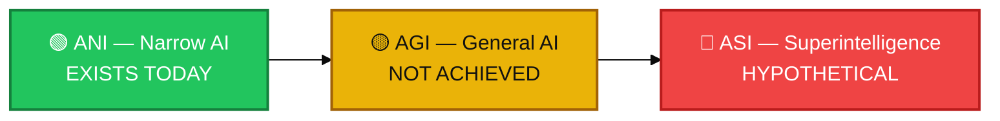
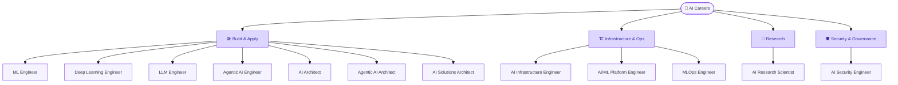
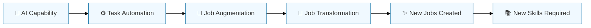

# 🔮 The Future of AI & AI Careers

> You now understand AI from the ground up and Agentic AI in depth. This final guide looks forward — advanced and emerging AI concepts, where the field may be heading, and how to build a career in it.

## 🎯 What You'll Learn Here

- Advanced and emerging AI concepts, clearly separated from **current tech** vs **active research** vs **theoretical future**
- How AI may keep evolving beyond Agentic AI, toward AGI and (hypothetically) superintelligence
- Major AI career paths, what each role actually does, and how to start
- Cross-cutting topics: ethics, governance, hardware, open-source vs closed AI, evaluation, and society

---

## 📚 Table of Contents

1. [🧭 Current vs Research vs Theoretical — Reading This Guide](#1--current-vs-research-vs-theoretical--reading-this-guide)
2. [🧬 Advanced & Emerging AI Concepts](#2--advanced--emerging-ai-concepts)
3. [🗺️ The Extended AI Evolution Path](#3--the-extended-ai-evolution-path)
4. [🧠 ANI vs AGI vs ASI](#4--ani-vs-agi-vs-asi)
5. [💼 AI Career Paths](#5--ai-career-paths)
6. [📊 Career Comparison Table](#6--career-comparison-table)
7. [🛡️ AI Ethics, Bias & Governance](#7--️-ai-ethics-bias--governance)
8. [💻 AI Hardware & Infrastructure](#8--ai-hardware--infrastructure)
9. [🔓 Open Source vs Closed AI](#9--open-source-vs-closed-ai)
10. [📊 AI Evaluation & Benchmarks](#10--ai-evaluation--benchmarks)
11. [🔧 Practical Skills for Beginners](#11--practical-skills-for-beginners)
12. [🌍 AI's Impact on Society & Jobs](#12--ais-impact-on-society--jobs)
13. [❓ Quick Check — Test Yourself](#13--quick-check--test-yourself)
14. [🧭 Navigation](#14--navigation)

---

## 1. 🧭 Current vs Research vs Theoretical — Reading This Guide

Because this section discusses the future, every concept below is tagged so you can tell fact from speculation at a glance:

| Tag | Meaning |
|---|---|
| 📌 Current | Deployed and in real use today |
| 🔬 Research | Active area of study, early/partial deployment |
| 💭 Theoretical | Discussed and debated, not achieved or agreed upon |

---

## 2. 🧬 Advanced & Emerging AI Concepts

| Concept | Status | What It Means |
|---|---|---|
| Advanced Generative AI | 📌 Current | Higher-fidelity, more controllable text/image/audio/video/code generation |
| Advanced AI Agents | 📌 Current | Agents with longer task horizons and more reliable tool use |
| Multi-Agent Systems | 📌 Current, 🔬 improving | Multiple specialized agents coordinating on complex work |
| Autonomous AI | 🔬 Research | Systems operating with progressively less human oversight in bounded domains |
| AI Infrastructure | 📌 Current | The compute, networking, and storage systems that train/serve models at scale |
| AI Engineering | 📌 Current | Building applications and systems on top of existing models |
| AI Architecture | 📌 Current | Designing how AI systems, data, and services fit together at an organizational level |
| AI Safety | 🔬 Research | Making systems reliable, aligned, and less likely to cause unintended harm as capability grows |
| AI Evaluation | 📌 Current, 🔬 evolving | Measuring what models can actually do reliably, not just on benchmarks |
| AI Governance | 📌 Current, 🔬 evolving | Policies, laws, and organizational rules for responsible AI use |
| AI Hardware | 📌 Current | Chips (GPUs, TPUs, custom accelerators) purpose-built for AI workloads |
| AI Robotics | 🔬 Research | Physical, embodied agentic systems operating in the real world |
| Multimodal AI | 📌 Current | Models understanding/generating across text, image, audio, video |
| World Models | 🔬 Research | Models that learn an internal simulation of how the world behaves, to plan and predict |
| AGI | 💭 Theoretical | Hypothetical AI with human-level ability across broad domains |
| Superintelligence (ASI) | 💭 Theoretical | Hypothetical AI exceeding human intelligence across virtually all domains |

---

## 3. 🗺️ The Extended AI Evolution Path

**Solid-color boxes** (AI → Agentic AI) are established, in-production technology. **Dashed boxes** (Autonomous Systems → AGI → Superintelligence) are progressively more speculative — later stages are not guaranteed outcomes, and long-range AI predictions have historically been unreliable in both directions.

| Stage | Status |
|---|---|
| AI → Agentic AI | 📌 Current, deployed technology |
| Autonomous Systems (minimal-oversight, real-world) | 🔬 Active research, partial/narrow deployments |
| AGI | 💭 Theoretical, no agreed definition or timeline |
| Superintelligence | 💭 Purely theoretical |

---

## 4. 🧠 ANI vs AGI vs ASI

| Level | Definition | Status |
|---|---|---|
| **ANI** (Narrow AI) | Performs specific, defined tasks well; doesn't generalize broadly | 📌 Describes virtually all AI today, including LLMs and agents |
| **AGI** (General AI) | Hypothetical human-level ability across a broad range of domains | 💭 Not achieved; no universally accepted definition or test; timelines heavily disputed |
| **ASI** (Superintelligence) | Hypothetical AI exceeding human intelligence across virtually all domains | 💭 Purely theoretical, discussed in research/policy/philosophy |

> 📌 It's important not to present AGI as already achieved, or ASI as imminent — both remain open, disputed topics among AI researchers.

---

## 5. 💼 AI Career Paths

### 🛠️ Build & Apply Roles

**ML Engineer** — builds and productionizes machine learning models. *Core skills:* Python, statistics, model training/evaluation. *Tech:* scikit-learn, PyTorch/TensorFlow. *Roadmap:* programming → statistics/ML fundamentals → build projects → deploy a model end-to-end.

**Deep Learning Engineer** — specializes in neural network architectures (vision, sequence models). *Core skills:* linear algebra, neural net design, GPU training. *Tech:* PyTorch, CUDA. *Relates to:* a specialization within ML Engineering.

**LLM Engineer** — builds applications on top of large language models (prompting, fine-tuning, evaluation). *Core skills:* prompt/context engineering, API integration, evaluation design. *Tech:* OpenAI/Anthropic APIs, vector databases. *Relates to:* the natural next step from ML Engineering toward application-layer AI.

**Agentic AI Engineer** — designs and builds autonomous agent systems: tool use, memory, multi-step workflows. *Core skills:* everything an LLM Engineer knows, plus orchestration and tool/function-calling design. *Tech:* LangGraph, CrewAI, MCP, AutoGen. *Relates to:* builds directly on LLM Engineering skills.

**AI Architect** — designs how AI systems fit into a broader technical/business architecture. *Core skills:* systems design, cross-team collaboration, cost/performance trade-offs. *Relates to:* senior-level role drawing on engineering + infrastructure knowledge.

**Agentic AI Architect** — specializes in designing multi-agent, tool-integrated systems at an organizational scale. *Core skills:* orchestration patterns, guardrail design, protocol standards (MCP/A2A). *Relates to:* AI Architect specialized for agentic systems specifically.

**AI Solutions Architect** — maps AI capabilities to real business problems and designs the implementation. *Core skills:* business analysis + technical AI knowledge. *Relates to:* bridges business stakeholders and engineering teams.

### 🏗️ Infrastructure & Operations Roles

**AI Infrastructure Engineer** — builds and maintains the compute/networking/storage systems AI training and serving depend on. *Core skills:* distributed systems, cloud platforms, GPU clusters.

**AI/ML Platform Engineer** — builds internal tools/platforms that let other engineers train, deploy, and monitor models efficiently. *Core skills:* platform engineering, CI/CD, DevOps for ML.

**MLOps Engineer** — automates and manages the ML model lifecycle (training, deployment, monitoring, retraining). *Core skills:* CI/CD, containerization, monitoring. *Relates to:* overlaps heavily with Platform Engineering.

### 🛡️ Security & Governance Roles

**AI Security Engineer** — protects AI systems against misuse, prompt injection, data leakage, and adversarial attacks. *Core skills:* application security + AI-specific threat models. *Relates to:* increasingly critical as agents get real-world tool access.

### 🔬 Research Roles

**AI Research Scientist** — advances the state of the art: new architectures, training methods, theoretical understanding. *Core skills:* strong math/ML theory, research methodology, publishing. *Relates to:* upstream of all applied roles — research breakthroughs eventually become the tools engineers use.

---

## 6. 📊 Career Comparison Table

| Role | Focus | Seniority Feel | Key Overlap With |
|---|---|---|---|
| ML Engineer | Model building & productionizing | Entry–Mid | DL Engineer, MLOps |
| Deep Learning Engineer | Neural network specialization | Mid | ML Engineer |
| LLM Engineer | Building on top of foundation models | Mid | Agentic AI Engineer |
| Agentic AI Engineer | Autonomous multi-step agent systems | Mid–Senior | LLM Engineer, AI Architect |
| AI Architect | System-level AI design | Senior | Agentic AI Architect, Solutions Architect |
| Agentic AI Architect | Multi-agent system design at scale | Senior | AI Architect |
| AI Solutions Architect | Business-to-technical bridge | Senior | AI Architect |
| AI Infrastructure Engineer | Compute/serving systems | Mid–Senior | Platform Engineer, MLOps |
| AI/ML Platform Engineer | Internal tooling for ML teams | Mid–Senior | MLOps, Infrastructure |
| MLOps Engineer | Model lifecycle automation | Mid | Platform Engineer |
| AI Security Engineer | Protecting AI systems | Mid–Senior | Agentic AI Engineer |
| AI Research Scientist | Advancing AI capability itself | Senior/PhD-track | All roles (upstream) |

---

## 7. 🛡️ AI Ethics, Bias & Governance

- **AI Ethics & Bias** — AI models can inherit and amplify biases present in their training data; responsible development involves actively testing for and mitigating this.
- **AI Governance & Regulation** — 🔬 the evolving mix of laws, industry standards, and internal company policy that shapes what AI systems are allowed to do, especially as autonomy increases. This area is actively developing worldwide and varies significantly by region.

---

## 8. 💻 AI Hardware & Infrastructure

Modern AI depends on specialized hardware: **GPUs** (originally for graphics, now the workhorse of AI training due to parallel processing), and increasingly **custom AI accelerators** (e.g., TPUs and other purpose-built chips) designed specifically for the matrix math neural networks need. Infrastructure engineering — networking huge clusters of this hardware together reliably — has become its own specialized discipline as model sizes have grown.

---

## 9. 🔓 Open Source vs Closed AI

| | Open-Source Models | Closed/Proprietary Models |
|---|---|---|
| Access | Weights downloadable, often self-hostable | Accessed via API only |
| Customization | High — can fine-tune, modify freely | Limited to provider's fine-tuning options |
| Transparency | Higher — architecture/weights inspectable | Lower — internals largely undisclosed |
| Typical trade-off | More control, more operational responsibility | Less control, less operational burden |

Neither approach is universally "better" — the right choice depends on the use case, required control, cost model, and compliance needs.

---

## 10. 📊 AI Evaluation & Benchmarks

Benchmarks (standardized tests measuring model capability on specific tasks) are useful for comparing models but have real limits: strong benchmark performance doesn't always translate to reliable real-world deployment. 📊 A well-documented trend in the field is a **widening gap between capability growth (as measured by benchmarks) and governance/safety readiness** — a good reminder to treat benchmark scores as one input, not the whole picture.

---

## 11. 🔧 Practical Skills for Beginners

A practical starting skill set, regardless of which AI career path you're aiming for:

1. **Programming fundamentals**, especially **Python**
2. **Basic statistics & linear algebra** (enough to understand how models learn)
3. **Working with APIs** (calling and integrating external services)
4. **Prompt engineering basics** (writing clear, effective instructions to a model)
5. **Git & version control**
6. **Reading documentation** for fast-moving frameworks (this field changes quickly)
7. **Building small end-to-end projects** — the fastest way to learn is to ship something small and complete

---

## 12. 🌍 AI's Impact on Society & Jobs

Historically, waves of automation have both eliminated and created jobs, transforming many roles more than eliminating them outright. Labor-market research increasingly tracks **Agentic AI** itself as an emerging in-demand skill category — a strong signal for where to focus if you're planning an AI career today.

**Society-wide, both sides are real:** AI brings personalization, accessibility gains, faster science, and new economic opportunity — alongside privacy concerns, labor-market disruption, misinformation risk, and the ongoing challenge of keeping governance in step with capability.

---

## 13. ❓ Quick Check — Test Yourself

<strong>Q1. What's the difference between AGI and ASI?</strong>

AGI (Artificial General Intelligence) is hypothetical AI with human-level ability across broad domains — not yet achieved, no agreed definition. ASI (Artificial Superintelligence) is hypothetical AI that would exceed human intelligence across virtually all domains — purely theoretical.

<strong>Q2. Is Agentic AI "current technology" or "theoretical future"?</strong>

Current technology — it's deployed today. Autonomous Systems, AGI, and Superintelligence are the more speculative stages further along the extended evolution path.

<strong>Q3. What's the difference between an Agentic AI Engineer and an Agentic AI Architect?</strong>

The Engineer builds the agent systems directly (tool use, memory, workflows). The Architect designs how multiple agentic systems fit together at an organizational scale, including orchestration patterns and guardrails.

<strong>Q4. Why doesn't strong benchmark performance guarantee reliable real-world deployment?</strong>

Because there's a documented, widening gap between capability growth (measured by benchmarks) and real-world governance/safety readiness — benchmarks are one useful input, not the full picture.

<strong>Q5. Name three practical beginner skills for entering an AI career.</strong>

Any three of: Python programming, basic statistics/linear algebra, working with APIs, prompt engineering basics, Git/version control, reading fast-moving documentation, building small end-to-end projects.

<strong>Q6. Will AI simply "replace" human jobs?</strong>

It's more nuanced — AI typically moves through task automation → job augmentation → job transformation → new jobs created → new skills required, rather than a single wholesale replacement.

---

## 14. 🧭 Navigation

| | |
|---|---|
| ⬅️ Previous | [Agentic AI Introduction](../README.md) |
| 🏠 Main AI Introduction | [../../README.md](../../README.md) |
| ➡️ Next | You've reached the end of this learning series 🎉 |