# 🤖 Artificial Intelligence

> A complete, beginner-friendly journey through the history, foundations, fields, technologies, and future of Artificial Intelligence — ending with a deep introduction to **Agentic AI**, and a full **review quiz** so you can test what you learned.


This README reads like a story, not a textbook. For **every major field**, you'll get four things in this order:

> **What is it? → Why does it exist (its purpose)? → How does it work (diagram)? → Where is it used?**

**Labels used throughout:**

| Label | Meaning |
|---|---|
| 📌 | Established fact |
| 📊 | Evidence / data |
| 🔬 | Active research area |
| 🔮 | Prediction (not guaranteed) |
| 💭 | Speculation / open debate |
| 🎯 | Purpose — the problem this field/technology exists to solve |

---

## 📚 Table of Contents

1. [🧠 What Is Artificial Intelligence?](#1--what-is-artificial-intelligence)
2. [🤔 Why Was AI Created?](#2--why-was-ai-created)
3. [📜 History of Artificial Intelligence](#3--history-of-artificial-intelligence)
4. [👨‍🔬 Who Introduced Artificial Intelligence?](#4--who-introduced-artificial-intelligence)
5. [🎓 Why 1956 Matters](#5--why-1956-matters)
6. [🌳 Major Fields of Artificial Intelligence](#6--major-fields-of-artificial-intelligence)
7. [🗺️ AI Field Map](#7--ai-field-map)
8. [🧩 AI Technology Layers](#8--ai-technology-layers)
9. [📊 AI vs ML vs DL vs GenAI vs LLM vs Agents](#9--ai-vs-ml-vs-dl-vs-genai-vs-llm-vs-agents)
10. [📈 Machine Learning](#10--machine-learning)
11. [🧬 Deep Learning & Neural Networks](#11--deep-learning--neural-networks)
12. [⚡ Transformers](#12--transformers)
13. [🏗️ Foundation Models](#13--foundation-models)
14. [✨ Generative AI](#14--generative-ai)
15. [💬 Large Language Models](#15--large-language-models)
16. [👁️ Computer Vision](#16--computer-vision)
17. [🗣️ Natural Language Processing](#17--natural-language-processing)
18. [🎙️ Speech & Audio AI](#18--speech--audio-ai)
19. [🎮 Reinforcement Learning](#19--reinforcement-learning)
20. [🦾 Robotics & Embodied AI](#20--robotics--embodied-ai)
21. [🌐 Multimodal AI](#21--multimodal-ai)
22. [📚 Retrieval-Augmented Generation (RAG)](#22--retrieval-augmented-generation-rag)
23. [🤖 AI Agents](#23--ai-agents)
24. [🚀 Agentic AI — Complete Introduction](#24--agentic-ai--complete-introduction)
25. [🌍 AI Applications](#25--ai-applications)
26. [✅ Benefits of AI](#26--benefits-of-ai)
27. [⚠️ Risks & Limitations](#27--risks--limitations)
28. [💼 AI & Jobs](#28--ai--jobs)
29. [🌎 How AI Is Changing the World](#29--how-ai-is-changing-the-world)
30. [📈 Current State of AI (2026)](#30--current-state-of-ai-2026)
31. [🔮 Future of AI](#31--future-of-ai)
32. [🧠 ANI vs AGI vs ASI](#32--ani-vs-agi-vs-asi)
33. [🗺️ AI Learning Direction](#33--ai-learning-direction)
34. [📚 Further Reading & References](#34--further-reading--references)
35. [❓ Review Questions — Test Yourself](#35--review-questions--test-yourself)

---

## 1. 🧠 What Is Artificial Intelligence?

### 🟢 Simple Definition
Artificial Intelligence (AI) is the science of building machines and software that can **perform tasks that normally require human intelligence** — recognizing images, understanding language, making decisions, or learning from experience.

### 🔵 Practical Definition
AI systems today take in data (text, images, numbers, sound), find patterns in it, and use those patterns to predict, generate, or act — often without being told the exact rule for every single situation.

### 🔬 Technical Definition
📌 Computer science defines AI as the study and construction of agents that perceive their environment and take actions to maximize the chance of achieving a goal. That involves several overlapping capabilities:

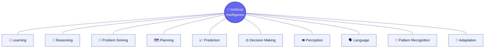

💭 There is **no single universally agreed definition** of "intelligence," and therefore no single agreed definition of "AI." The meaning has shifted over time — what counted as AI in the 1960s (simple rule-based programs) is often considered ordinary software today. This is informally called the **"AI effect"**: once a capability becomes common, people stop calling it AI.

### 📚 Learn More
- [Stanford CS221: Intro to AI (Lecture Notes)](https://stanford-cs221.github.io/) — free foundational course material.
- [Encyclopedia Britannica — Artificial Intelligence](https://www.britannica.com/technology/artificial-intelligence) — accessible overview for beginners.

---

## 2. 🤔 Why Was AI Created?

### 🎯 Purpose
AI research began because humans wanted to **automate tasks that seemed to require thinking** — not just physical labor, which earlier machines already automated.

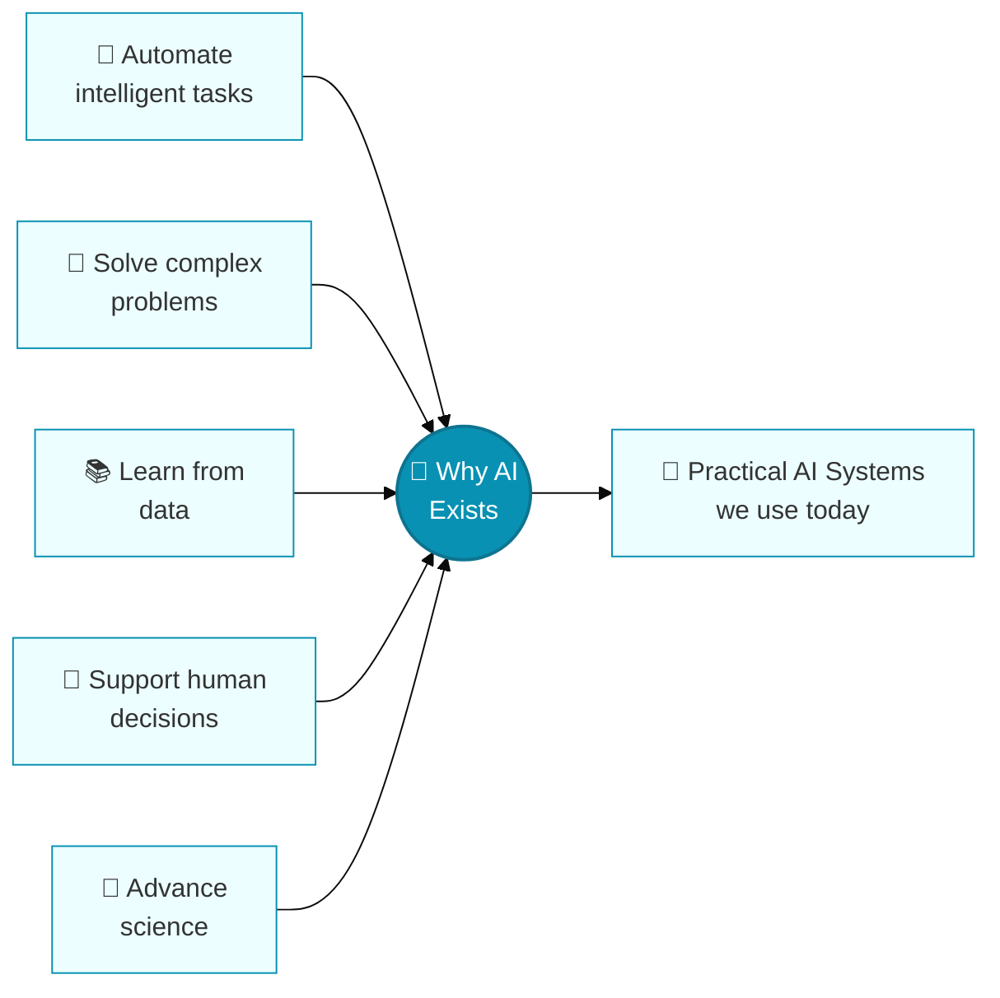

### Human Intelligence vs Artificial Intelligence

| Aspect | Human Intelligence | Artificial Intelligence |
|---|---|---|
| Origin | Biological, evolved over millions of years | Engineered, trained on data |
| Learning | Continuous, embodied, general | Task/data-driven, narrower (today) |
| Consciousness | Present (subjectively experienced) | 💭 Not established; open philosophical debate |
| Generalization | Broad, transferable across domains | Improving, but still often narrower than humans |
| Energy use | ~20 watts (the brain) | 📊 Large models require significant compute and energy |
| Speed at scale | Limited by biology | Can process huge datasets very quickly |

---

## 3. 📜 History of Artificial Intelligence

📌 AI did not appear suddenly in 1956. It rests on centuries of work in **philosophy, logic, mathematics, probability, statistics, computing, cybernetics, neuroscience, and information theory**.

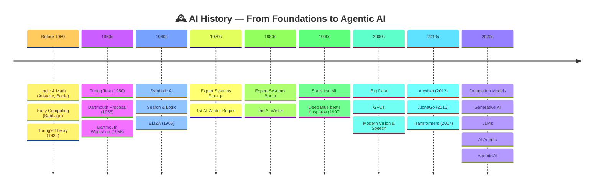

### Before 1950 — Foundations
- Formal logic (Aristotle), Boolean algebra (George Boole), and early mechanical computing concepts (Charles Babbage, Ada Lovelace).
- 📌 Alan Turing's 1936 concept of a universal computing machine laid theoretical groundwork for general-purpose computers.
- Warren McCulloch and Walter Pitts (1943) proposed an early mathematical model of a neuron — a precursor idea to today's neural networks.

### 1950s — The Field Is Named
- 📌 Alan Turing published *"Computing Machinery and Intelligence"* (1950), proposing the **Turing Test**: a way to evaluate whether a machine's conversation is indistinguishable from a human's.
- 📌 In 1955, John McCarthy, Marvin Minsky, Nathaniel Rochester, and Claude Shannon wrote a proposal for a summer workshop, coining the term **"Artificial Intelligence."**
- 📌 The **Dartmouth Summer Research Project (1956)** brought researchers together and is widely regarded as the formal founding event of AI as a research field.

### 1960s — Symbolic AI
- Research focused on **symbolic AI**: representing knowledge as symbols and manipulating them with logical rules.
- 📌 Joseph Weizenbaum built **ELIZA** (1966), an early natural-language program simulating a psychotherapist by pattern-matching text.

### 1970s — First Winter
- **Expert systems** (rule-based programs encoding human expert knowledge) began to emerge.
- 📌 Limited computing power and overpromised results led to reduced funding — the first **AI winter**.

### 1980s — Boom and Bust
- Expert systems became commercially popular, causing a short-lived boom, then a second **AI winter** as costs and unmet expectations piled up.

### 1990s — Statistical Turn
- Research shifted from hand-coded rules toward **statistical machine learning**.
- 📌 IBM's **Deep Blue** defeated world chess champion Garry Kasparov in 1997 — a search-based (not learning-based) landmark.

### 2000s — Data and Hardware
- The internet created huge datasets ("Big Data"), and **GPUs** turned out to be well-suited to the parallel math used in machine learning.

### 2010s — The Deep Learning Era
- 📌 **AlexNet** (2012) dramatically outperformed prior methods on ImageNet, triggering the modern deep learning boom.
- 📌 DeepMind's **AlphaGo** defeated a top human Go player in 2016.
- 📌 **"Attention Is All You Need"** (2017) introduced the **Transformer**, the backbone of nearly all modern large-scale AI.

### 2020s — Foundation Models and Beyond
- **Foundation models**, **Generative AI**, **LLMs**, **diffusion models**, **multimodal models**, **AI Agents**, and **Agentic AI** all matured in this decade.

### Why AI Winters Happened
📌 Both winters shared common causes: **overpromising results relative to real capabilities, insufficient compute/data for the ambitions of the time, and the resulting loss of funding** once expectations weren't met.

### 📚 Learn More
- [AI Winter — overview via Encyclopedia Britannica](https://www.britannica.com/technology/artificial-intelligence/AI-winter) 
- [Dartmouth Proposal, 1955 (original document, Stanford)](http://jmc.stanford.edu/articles/dartmouth/dartmouth.pdf)
- [Computing Machinery and Intelligence — Turing, 1950](https://academic.oup.com/mind/article/LIX/236/433/986238)

---

## 4. 👨‍🔬 Who Introduced Artificial Intelligence?

📌 No single person "invented" AI. It emerged from the combined work of mathematicians, logicians, and computer scientists.

| 👤 Person | 📅 Period | 🔬 Contribution | 💡 Why It Mattered |
|---|---|---|---|
| Alan Turing | 1930s–1950s | Theoretical computation; the Turing Test | Provided the theoretical foundation for computing and a way to evaluate machine intelligence |
| Warren McCulloch & Walter Pitts | 1943 | Mathematical model of a neuron | Early precursor to artificial neural networks |
| John McCarthy | 1955–1956 | Coined "Artificial Intelligence"; co-organized Dartmouth workshop; created Lisp | Helped formally establish AI as a research field |
| Marvin Minsky | 1950s–1980s | Co-organizer of Dartmouth workshop; symbolic AI pioneer | Shaped early AI research direction at MIT |
| Claude Shannon | 1940s–1950s | Founder of information theory; Dartmouth proposal co-author | Provided mathematical tools underlying computing and communication |
| Nathaniel Rochester | 1955–1956 | Dartmouth proposal co-author; early IBM computer architect | Bridged AI theory with practical computer engineering |
| Allen Newell & Herbert A. Simon | 1950s–1960s | Logic Theorist and General Problem Solver programs | Demonstrated machines performing symbolic reasoning |
| Arthur Samuel | 1950s | Coined "machine learning"; built a self-improving checkers program | Early demonstration of a program that learns from experience |
| Frank Rosenblatt | 1958 | Invented the Perceptron | Early trainable neural network model |
| Geoffrey Hinton, Yann LeCun, Yoshua Bengio | 1980s–2010s | Backpropagation, CNNs, deep learning research (2018 ACM A.M. Turing Award) | Their work underlies the modern deep learning revolution |

### 📚 Learn More
- [ACM A.M. Turing Award 2018 — Bengio, Hinton, LeCun](https://amturing.acm.org/byyear.cfm)
- [MIT CSAIL — History of AI at MIT](https://www.csail.mit.edu/)

---

## 5. 🎓 Why 1956 Matters

📌 In 1955, John McCarthy, Marvin Minsky, Nathaniel Rochester, and Claude Shannon authored a proposal for a summer research project at Dartmouth College — and this proposal **coined the term "Artificial Intelligence."** The workshop itself happened in the summer of **1956**.

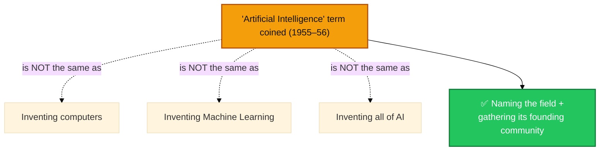

Computers already existed before 1956 (e.g., ENIAC, 1945). Learning-based methods (like Arthur Samuel's checkers program) were already underway. What Dartmouth did was **name the field and gather its early community** — which is why it's the founding milestone, not the sole point of invention.

### 📚 Learn More
- [Dartmouth Proposal — original PDF](http://jmc.stanford.edu/articles/dartmouth/dartmouth.pdf)

---

## 6. 🌳 Major Fields of Artificial Intelligence

This section maps the AI landscape — **not a course** on each subject. For every field you get: what it is, **🎯 why it exists**, and a real example.

### 🤖 Machine Learning
**What:** Programs that improve at a task by learning patterns from data instead of following hand-written rules.
**🎯 Purpose:** Hand-writing a rule for every possible situation is impossible (e.g., every way spam email can look) — ML exists so systems can learn the rules themselves from examples.
*Example: spam filters that learn from labeled emails.*

### 🧬 Deep Learning
**What:** A subset of ML using multi-layer neural networks to learn complex patterns directly from raw data.
**🎯 Purpose:** Traditional ML often needed humans to manually design "features" (e.g., what makes a cat a cat). Deep Learning exists to let the model discover those features automatically from raw pixels/audio/text.
*Example: face recognition in photo apps.*

### 🗣️ Natural Language Processing (NLP)
**What:** Enables computers to understand, interpret, and generate human language.
**🎯 Purpose:** Human language is ambiguous and unstructured — NLP exists to bridge the gap between how humans naturally communicate and how computers process structured data.
*Example: translation apps, chatbots.*

### 👁️ Computer Vision
**What:** Enables machines to interpret visual information from images or video.
**🎯 Purpose:** A huge amount of real-world information is visual — Computer Vision exists so machines can "see" and act on that information (safety, automation, accessibility).
*Example: self-driving car object detection.*

### 🎙️ Speech & Audio AI
**What:** Converts speech to text and text to speech, and understands audio more broadly.
**🎯 Purpose:** Voice is the most natural human interface — this field exists to let people interact with machines by talking, and to make audio content searchable/accessible.
*Example: voice assistants.*

### 🎮 Reinforcement Learning
**What:** Learning through trial and error by interacting with an environment and receiving rewards or penalties.
**🎯 Purpose:** For many problems (games, robotics, control) there's no labeled dataset of "correct answers" — RL exists to let a system discover good strategies purely through experience.
*Example: game-playing AI, robotic control.*

### 📐 Symbolic AI
**What:** Represents knowledge as explicit symbols and rules, manipulated through logic.
**🎯 Purpose:** Some problems (legal rules, math proofs) are naturally rule-based and need exact, explainable logic rather than statistical pattern-matching — symbolic AI exists for that precision.
*Example: theorem provers, early expert systems.*

### 🧩 Knowledge Representation
**What:** Techniques for encoding facts and relationships (e.g., knowledge graphs) so machines can reason over them.
**🎯 Purpose:** A model needs a structured way to *store* what it "knows" so it can be queried and reasoned over reliably — not just recalled statistically.
*Example: search engines' "knowledge panels."*

### ⚙️ Expert Systems
**What:** Rule-based programs emulating a human expert's decision-making in a narrow domain.
**🎯 Purpose:** Expert knowledge is scarce and expensive — expert systems exist to encode that expertise into software so it can scale beyond one human expert.
*Example: early medical diagnosis systems like MYCIN.*

### 🦾 Robotics
**What:** Combines AI, mechanical engineering, and control systems to build machines that sense and act in the physical world.
**🎯 Purpose:** Some intelligent tasks require a physical body, not just software — robotics exists to give AI the ability to move, manipulate, and act in the real world.
*Example: warehouse robots.*

### ✨ Generative AI
**What:** AI systems that create new content — text, images, audio, video, or code.
**🎯 Purpose:** Beyond classifying or predicting, there was demand for machines that could *produce* original content — generative AI exists to fill that creative/production gap.
*Example: AI image generators.*

### 🏗️ Foundation Models
**What:** Very large models pretrained on broad data, adaptable to many downstream tasks.
**🎯 Purpose:** Training a new model from scratch for every task is expensive and slow — foundation models exist so one broadly capable model can be reused and adapted for many purposes.
*Example: GPT-family and Claude-family models.*

### 💬 Large Language Models (LLMs)
**What:** Foundation models specialized in understanding and generating human language.
**🎯 Purpose:** LLMs exist to give machines fluent, flexible, general-purpose language ability — not tied to one narrow task like translation or summarization alone.
*Example: conversational AI assistants.*

### 🌐 Multimodal AI
**What:** Models that process and relate multiple types of data (text, images, audio, video) together.
**🎯 Purpose:** The real world isn't just text — multimodal AI exists so a system can connect what it "sees," "hears," and "reads" into one coherent understanding.
*Example: an AI that can describe an image in words.*

### 📚 Retrieval-Augmented Generation (RAG)
**What:** A technique connecting a language model to an external knowledge source at query time.
**🎯 Purpose:** LLMs have a fixed training cutoff and can't know everything — RAG exists so a model can pull in current, specific, or private information instead of guessing.
*Example: chatbots that cite live documents.*

### 🤖 AI Agents
**What:** Systems that use a model plus tools, memory, and planning to take actions toward a goal.
**🎯 Purpose:** A single answer isn't always enough — some tasks need multiple real-world steps (searching, comparing, booking) — AI Agents exist to carry a goal through to completion, not just describe how to do it.
*Example: an assistant that books a flight by searching, comparing, and confirming.*

### 🚀 Agentic AI
**What:** The broader paradigm of AI systems built around autonomous or semi-autonomous, goal-directed, iterative behavior — covered in full depth in [Section 24](#24--agentic-ai--complete-introduction).
**🎯 Purpose:** Businesses and individuals need entire *workflows* automated, not just single tasks — Agentic AI exists to handle long, multi-step, evolving goals with minimal hand-holding.

### 🔍 Explainable AI (XAI)
**What:** 🔬 Methods and research aimed at making AI decision processes understandable to humans.
**🎯 Purpose:** Many AI models are "black boxes" — XAI exists because trust, debugging, fairness, and regulation all require knowing *why* a model made a decision, not just *what* it decided.
*Example: highlighting which pixels influenced an image classification.*

### 🛡️ AI Safety
**What:** 🔬 The field concerned with making AI systems reliable, aligned with human intent, and less likely to cause unintended harm.
**🎯 Purpose:** As AI systems get more capable and autonomous, mistakes get more costly — AI Safety exists to keep systems predictable, controllable, and beneficial as capability grows.
*Example: guardrails preventing a chatbot from giving dangerous instructions.*

---

## 7. 🗺️ AI Field Map

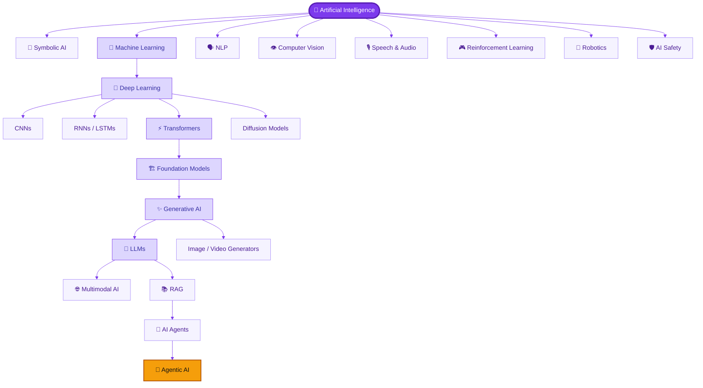

> **Note:** This is a **conceptual map**, not a strict hierarchy. Many fields overlap — for example, Robotics uses Computer Vision, Reinforcement Learning, *and* Agentic AI concepts simultaneously.

---

## 8. 🧩 AI Technology Layers

A simplified conceptual progression of how modern AI technologies build on one another — **not a strict technical hierarchy**, since some items are fields, some are architectures, some are techniques, and some are application patterns.

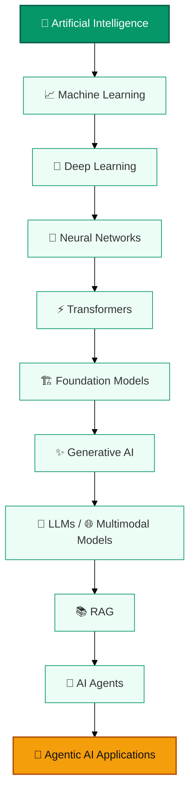

| Layer | What It Is |
|---|---|
| Artificial Intelligence | The broad field of building machines that perform intelligent tasks |
| Machine Learning | A major approach: learning patterns from data |
| Deep Learning | A ML approach using multi-layer neural networks |
| Neural Networks | The computational structure deep learning is built from |
| Transformers | A neural network architecture built around the "attention" mechanism |
| Foundation Models | Very large, broadly pretrained transformer-based models |
| Generative AI | A category of AI capable of generating new content |
| LLMs / Multimodal Models | Foundation models specialized in language and/or multiple modalities |
| RAG | A technique connecting models to external knowledge |
| AI Agents | Systems that use models + tools + memory to act toward goals |
| Agentic AI | The broader paradigm of autonomous, goal-directed AI systems |

---

## 9. 📊 AI vs ML vs DL vs GenAI vs LLM vs Agents

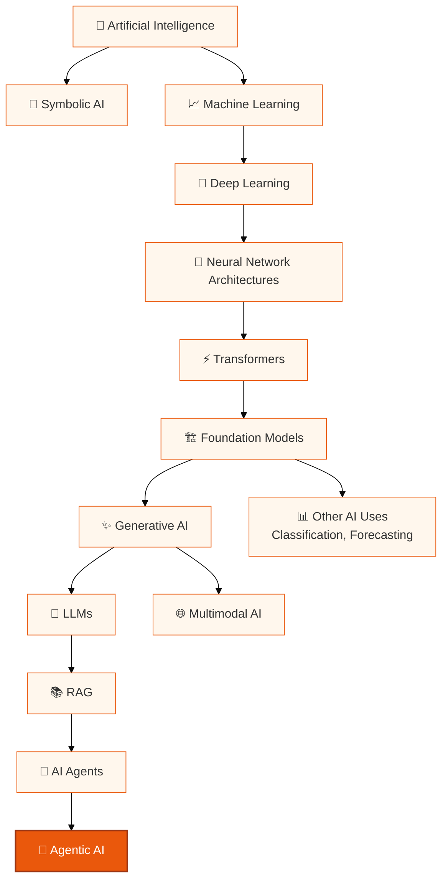

| Concept | What It Means | Example |
|---|---|---|
| AI | The broad science of building intelligent machines | A chess-playing program |
| Machine Learning | Systems that learn patterns from data | Email spam detection |
| Deep Learning | ML using multi-layer neural networks | Face recognition |
| Generative AI | AI that creates new content | AI-generated images |
| Foundation Models | Large, broadly pretrained models adaptable to many tasks | GPT-family, Claude-family |
| LLMs | Foundation models specialized in language | A chatbot writing an email |
| Multimodal AI | Models understanding/generating across data types | Describing a photo in words |
| RAG | Connecting a model to external knowledge at query time | A support bot citing a live manual |
| AI Agents | Model + tools + memory acting toward a goal | An assistant that books a trip |
| Agentic AI | Broader paradigm of autonomous, goal-driven AI systems | A multi-step research-and-report system |
| AGI | 💭 Hypothetical AI matching general human-level intelligence across domains | Not yet achieved |
| ASI | 💭 Hypothetical AI exceeding human intelligence across virtually all domains | Purely theoretical |

**In plain language:** AI is the broad field. Machine Learning is a major approach within AI. Deep Learning is a major approach within Machine Learning. Transformers are a neural-network architecture that became foundational to many modern systems. Generative AI creates content. LLMs are foundation models specialized in language. RAG connects models to external information. AI Agents combine models, tools, and memory to accomplish goals. Agentic AI is the broader paradigm of goal-directed, iterative, increasingly autonomous systems.

---

## 10. 📈 Machine Learning

### 🤖 What Is It?
Machine Learning (ML) is a way of building software that **learns from data** rather than being explicitly programmed with every rule.

### 🎯 Purpose
ML exists because **it's impossible to hand-write a rule for every real-world situation.** Instead of programming "if email contains X, Y, Z... mark as spam," you show the system thousands of labeled examples and let it *discover* the pattern itself.

### 🌍 Real-World Example
A streaming service learns from your watch history which shows to recommend — nobody manually coded a rule for every possible viewer preference.

### 🔄 How It Works

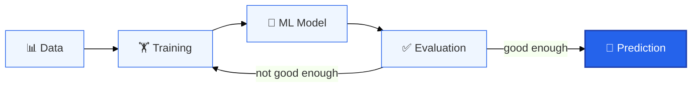

### Types of Machine Learning

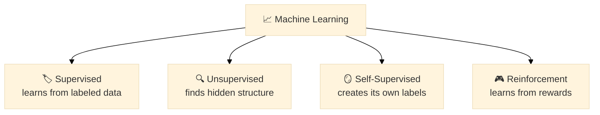

- **Supervised Learning** — learns from labeled examples (input → correct output). *Example: predicting house prices from labeled sale data.*
- **Unsupervised Learning** — finds structure in unlabeled data. *Example: grouping customers into segments.*
- **Self-Supervised Learning** — generates its own training signal from raw data (e.g., predicting a hidden word from context). This is the technique behind most modern LLM pretraining.
- **Reinforcement Learning** — learns by acting in an environment and receiving rewards/penalties. Covered in depth in [Section 19](#19--reinforcement-learning).

### Key Vocabulary
- **Dataset** — the collection of examples used to train and test a model
- **Model** — the trained mathematical function that makes predictions
- **Training** — the process of adjusting the model's parameters using data
- **Parameters** — the internal numeric values the model learns
- **Loss** — a measure of how wrong the model's predictions are
- **Evaluation** — testing model performance on data it hasn't seen
- **Generalization** — how well a model performs on new, unseen data

### 🔗 Relationship to AI
Machine Learning is the dominant modern approach within AI — nearly every technology covered later in this document (Deep Learning, Transformers, LLMs, Agents) is built on ML foundations.

### 📚 Learn More
- [Google's Machine Learning Crash Course (free)](https://developers.google.com/machine-learning/crash-course)
- [Andrew Ng's Machine Learning Specialization — Stanford/DeepLearning.AI (Coursera)](https://www.coursera.org/specializations/machine-learning-introduction)
- [Scikit-learn documentation & tutorials](https://scikit-learn.org/stable/tutorial/index.html)

---

## 11. 🧬 Deep Learning & Neural Networks

### 🤖 What Is It?
Deep Learning is a subset of Machine Learning that uses **neural networks with many layers** ("deep" refers to the number of layers) to automatically learn complex patterns directly from raw data.

### 🎯 Purpose
Older ML required humans to manually pick which "features" mattered (e.g., "edges" and "curves" for image recognition). Deep Learning exists so the **model discovers the useful features itself**, directly from raw pixels, audio, or text — which is why it scales so much better on complex, unstructured data.

### 🔬 How It Works
Data passes through the network (forward pass), producing an output; the error between the output and the correct answer is calculated (loss); and **backpropagation** adjusts the weights to reduce that error, layer by layer.

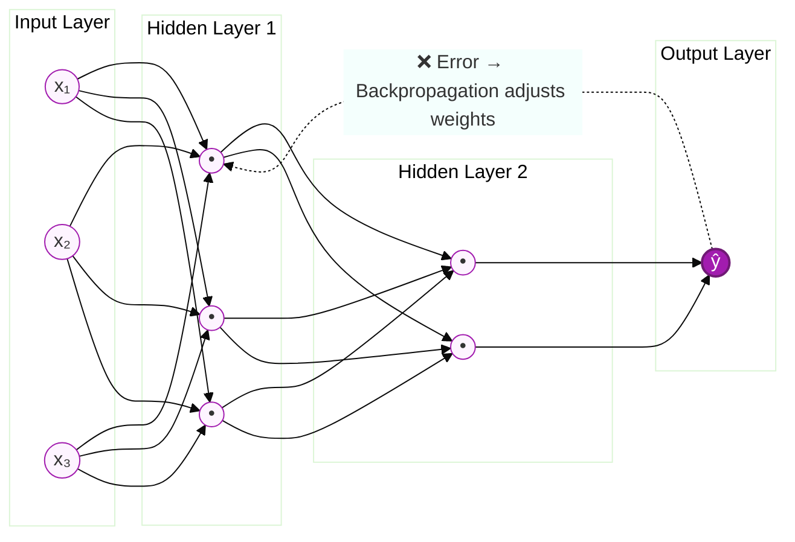

### Key Vocabulary
- **Layers** — stages of neurons that transform data step by step
- **Weights** — learned numeric values controlling connection strength
- **Bias** — an adjustable offset added to a neuron's calculation
- **Activation Function** — introduces non-linearity so the network can learn complex patterns (e.g., ReLU)
- **Backpropagation** — the algorithm used to update weights based on error

### Major Architectures
- **CNN (Convolutional Neural Network)** — specialized for grid-like data such as images
- **RNN / LSTM** — designed for sequential data such as text or time series
- **Transformer** — the architecture behind most modern large models (see [Section 12](#12--transformers))
- **Diffusion Models** — generate images/audio by learning to reverse a noise-adding process

### 🌍 Real-World Example
A CNN trained on millions of labeled photos can learn to recognize a cat in a picture it has never seen before, without a human ever defining what "whiskers" or "fur" mean mathematically.

### 🔗 Relationship to AI
Deep Learning is what made modern breakthroughs — from image recognition to LLMs — possible.

### 📚 Learn More
- [3Blue1Brown — Neural Networks (YouTube series, highly visual)](https://www.3blue1brown.com/topics/neural-networks)
- [Deep Learning Book — Goodfellow, Bengio, Courville (free online)](https://www.deeplearningbook.org/)
- [MIT 6.S191: Introduction to Deep Learning (free lectures)](http://introtodeeplearning.com/)

---

## 12. ⚡ Transformers

### 🤖 What Is It?
A Transformer is a neural network architecture, introduced in the 2017 paper **"Attention Is All You Need,"** that processes entire sequences of data at once using a mechanism called **attention**, rather than one element at a time like older RNNs.

### 🎯 Purpose
RNNs processed text word-by-word, which was slow and struggled with long-range relationships ("it" referring to something 20 words earlier). Transformers exist to let a model look at **every word in relation to every other word simultaneously** — making training much faster and relationships much easier to capture.

### 🔬 How It Works
- **Embeddings** — words (or image patches, audio segments) become numeric vectors capturing meaning
- **Positional Information** — since the whole sequence is processed at once, extra signals encode word order
- **Self-Attention** — each element "looks at" every other element, weighing relevance via **Query, Key, Value** vectors
- **Multi-Head Attention** — several attention mechanisms run in parallel, capturing different relationship types
- **Encoder / Decoder** — the encoder builds a rich internal representation of input; the decoder generates output

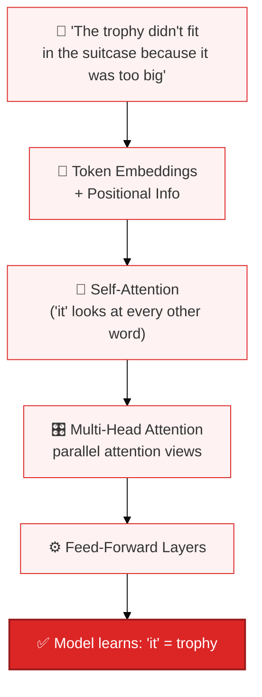

### 🔗 Relationship to AI
📌 The Transformer architecture became the foundation for nearly all major modern AI systems: LLMs, many image/video generators, multimodal models, and the models powering today's AI Agents.

### 📚 Learn More
- [Attention Is All You Need — original paper (arXiv)](https://arxiv.org/abs/1706.03762)
- [The Illustrated Transformer — Jay Alammar (visual explainer)](https://jalammar.github.io/illustrated-transformer/)
- [Hugging Face — NLP Course, Transformers chapter (free)](https://huggingface.co/learn/nlp-course/chapter1/1)

---

## 13. 🏗️ Foundation Models

### 🤖 What Is It?
A Foundation Model is a very large model trained on a broad range of data (often via self-supervised learning) that can then be **adapted to many different downstream tasks** instead of being built from scratch for each one.

### 🎯 Purpose
Training a huge model from zero for every single task (translation, summarization, coding) would be wildly expensive and slow. Foundation Models exist so organizations can train **one** broadly capable model once, then cheaply adapt it to many tasks.

### 🔄 How It Works

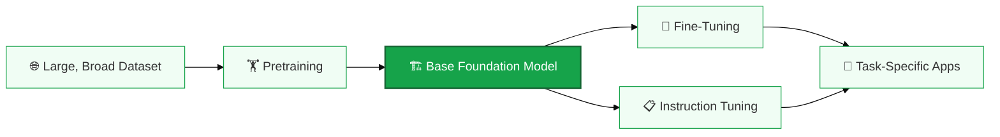

### Key Vocabulary
- **Pretraining** — initial large-scale training on broad data
- **Transfer Learning** — reusing a model trained on one task/domain as a starting point for another
- **Fine-Tuning** — further training on a smaller, specialized dataset
- **Instruction Tuning** — fine-tuning specifically to follow natural-language instructions well
- **Inference** — running the trained model to produce outputs on new inputs

### 🔗 Relationship to AI
Foundation Models are the base layer for Generative AI, LLMs, and Multimodal AI.

### 📚 Learn More
- [Stanford CRFM — On the Opportunities and Risks of Foundation Models (paper)](https://crfm.stanford.edu/report.html)

---

## 14. ✨ Generative AI

### 🤖 What Is It?
Generative AI refers to AI systems that **create new content** — text, images, audio, video, or code — rather than only classifying or predicting a label.

### 🎯 Purpose
Classic AI answered questions like "what is this?" (classification). Generative AI exists to answer a different question: **"can you make one?"** — filling the gap between analyzing existing content and producing original content.

### 🔬 Two Main Families
- **Autoregressive models** (mostly Transformer-based) generate step by step, predicting the next token based on everything generated so far — the basis for most text and code generation.
- **Diffusion models** generate content (especially images/video) by starting from random noise and gradually refining it into a coherent output.

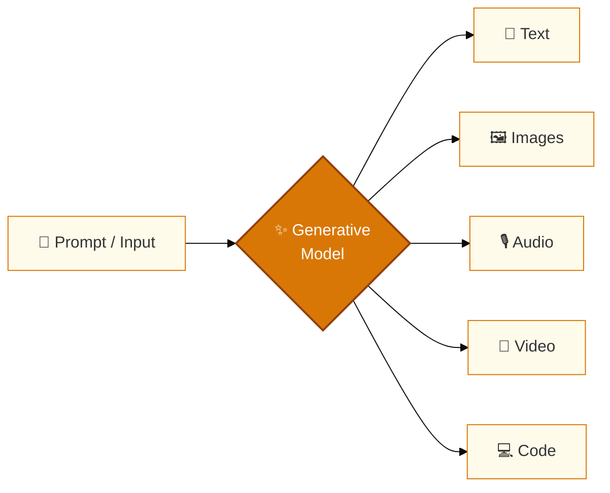

### 🔗 Relationship to AI
Generative AI sits on top of Foundation Models, and produced LLMs and modern image/video generators.

### 📚 Learn More
- [Google Research — Generative AI overview](https://research.google/research-areas/generative-ai/)
- [Hugging Face — Diffusion Models Course (free)](https://huggingface.co/learn/diffusion-course/unit0/1)

---

## 15. 💬 Large Language Models

### 🤖 What Is It?
A Large Language Model (LLM) is a foundation model specialized in understanding and generating human language, trained on massive amounts of text.

### 🎯 Purpose
LLMs exist to give machines **fluent, general-purpose** language ability — instead of a separate narrow model for translation, another for summarization, another for Q&A, one LLM can flexibly do all of them.

### 🔬 Technical Explanation
- **Tokens / Tokenization** — text is broken into small chunks (tokens) before processing
- **Embeddings** — tokens become numeric vectors carrying meaning
- **Parameters** — learned numeric values defining model behavior (millions to hundreds of billions)
- **Attention** — see [Section 12](#12--transformers)
- **Context Window** — the maximum amount of text the model can consider at once
- **Hallucinations** — 📌 a well-documented limitation where a model generates plausible-sounding but factually incorrect content


### 🔗 Relationship to AI
LLMs are the "reasoning engine" typically used inside AI Agents and Agentic AI systems.

### 📚 Learn More
- [Hugging Face NLP Course — free, hands-on](https://huggingface.co/learn/nlp-course)
- [Anthropic — What is a Large Language Model?](https://www.anthropic.com/news)
- [Andrej Karpathy — "Let's build GPT" (YouTube, code-along)](https://www.youtube.com/watch?v=kCc8FmEb1nY)

---

## 16. 👁️ Computer Vision

### 🤖 What Is It?
Computer Vision enables machines to interpret and understand visual data — images and video.

### 🎯 Purpose
A huge amount of the world's information is visual, not textual — Computer Vision exists so machines can extract meaning from that visual data for safety, automation, and accessibility.

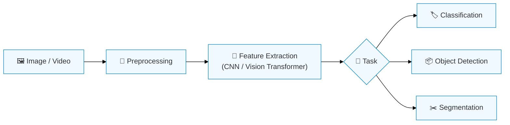

### 🌍 Real-World Example
A phone camera app detecting and focusing on faces in real time.

### 🔗 Relationship to AI
Computer Vision relies heavily on Deep Learning and feeds into Robotics, Multimodal AI, and medical imaging.

### 📚 Learn More
- [Stanford CS231n: CNNs for Visual Recognition (free notes)](https://cs231n.github.io/)
- [PyImageSearch — practical Computer Vision tutorials](https://pyimagesearch.com/)

---

## 17. 🗣️ Natural Language Processing

### 🤖 What Is It?
NLP enables computers to process, understand, and generate human language — written and spoken.

### 🎯 Purpose
Human language is messy, ambiguous, and context-dependent — NLP exists to translate that messiness into something a computer can reliably work with.

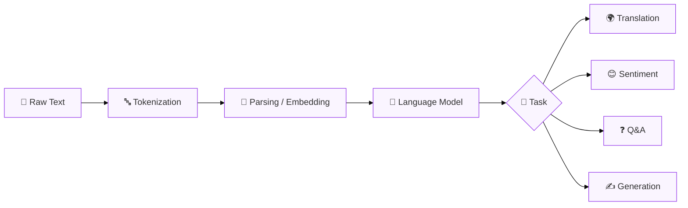

### 🔗 Relationship to AI
Modern NLP is now largely powered by LLMs built on the Transformer architecture.

### 📚 Learn More
- [Stanford CS224n: NLP with Deep Learning (free)](https://web.stanford.edu/class/cs224n/)

---

## 18. 🎙️ Speech & Audio AI

### 🤖 What Is It?
Covers converting speech to text (**Automatic Speech Recognition**) and text to speech (**Text-to-Speech**), plus broader audio understanding and generation.

### 🎯 Purpose
Voice is the most natural human interface — this field exists so people can interact with machines by talking instead of typing, and so spoken/audio content becomes searchable and accessible.

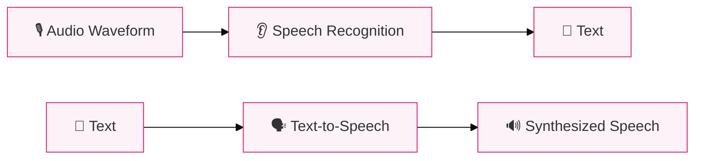

### 🔗 Relationship to AI
Speech and Audio AI increasingly use the same deep learning and Transformer techniques as text and vision.

### 📚 Learn More
- [OpenAI Whisper — open speech recognition model & paper](https://openai.com/research/whisper)

---

## 19. 🎮 Reinforcement Learning

### 🤖 What Is It?
**Reinforcement Learning (RL)** is a type of Machine Learning in which an **agent** learns by interacting with an **environment** and receiving **rewards or penalties** for its actions.

### 🎯 Purpose
Many real problems (games, robot control, resource allocation) don't come with a labeled "correct answer" dataset — RL exists so a system can discover good strategies purely through trial, error, and feedback, the way animals and humans learn.

### 🌍 Real-World Example
Think of training a dog: it doesn't read a rulebook — it tries actions, gets treats (rewards) for good ones, and gradually learns a strategy (policy) for behaving well.

### 🔄 How It Works

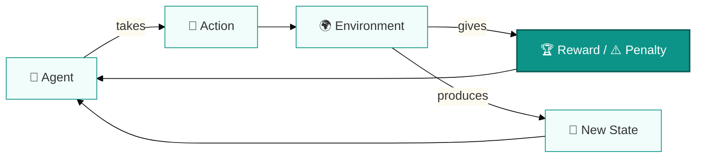

### Key Vocabulary
- **State** — the current situation the agent observes
- **Action** — a choice the agent can make
- **Reward** — feedback signal indicating how good/bad an action was
- **Policy** — the strategy the agent learns for choosing actions
- **Exploration vs Exploitation** — trying new actions vs using known good ones

### 🔗 Relationship to AI
RL was central to AlphaGo, is widely used in robotics, and is also used to align LLM behavior with human preferences (**reinforcement learning from human feedback**).

### 📚 Learn More
- [Reinforcement Learning: An Introduction — Sutton & Barto (free book)](http://incompleteideas.net/book/the-book-2nd.html)
- [Spinning Up in Deep RL — OpenAI (free)](https://spinningup.openai.com/)

---

## 20. 🦾 Robotics & Embodied AI

### 🤖 What Is It?
Robotics combines AI with mechanical engineering and control systems to build machines that sense and physically act in their environment.

### 🎯 Purpose
Some intelligent tasks (lifting, walking, assembling) simply require a physical body — robotics exists to extend AI's intelligence into the physical world, not just the digital one.


### 🔗 Relationship to AI
Robotics draws on Computer Vision, Reinforcement Learning, and increasingly Agentic AI concepts.

### 📚 Learn More
- [MIT Robotics — course & research resources](https://robotics.mit.edu/)

---

## 21. 🌐 Multimodal AI

### 🤖 What Is It?
Multimodal AI systems understand and/or generate across **multiple types of data at once**: 📝 text, 🖼️ images, 🎙️ audio, 🎥 video, and 💻 code.

### 🎯 Purpose
Real understanding rarely comes from just one type of data — Multimodal AI exists so a system can combine what it "reads," "sees," and "hears" into one coherent picture, closer to how humans actually perceive the world.

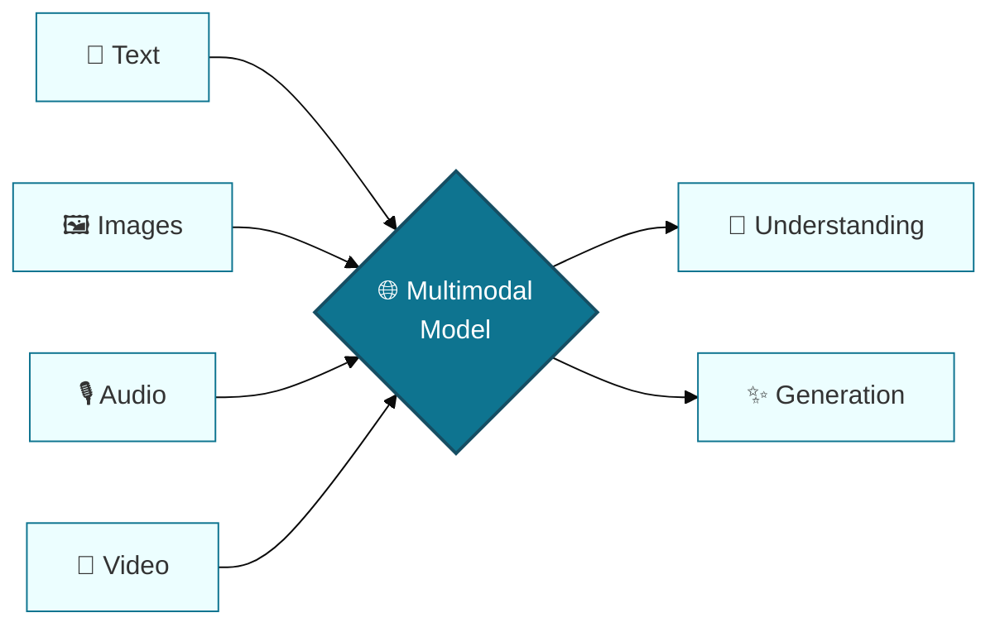

### 🔗 Relationship to AI
Multimodal AI extends LLMs beyond text, and it's an increasingly important input source for AI Agents.

### 📚 Learn More
- [Google DeepMind — Multimodal research](https://deepmind.google/research/)

---

## 22. 📚 Retrieval-Augmented Generation (RAG)

### 🤖 What Is It?
RAG connects a language model to an **external knowledge source** at query time, so the model grounds its answer in retrieved information instead of relying only on memorized training data.

### 🎯 Purpose
LLMs have a fixed training cutoff and limited memory of specifics — RAG exists to fix that by letting a system fetch **current, specific, or private information** on demand, reducing hallucinations.

```mermaid
%%{init: {'theme':'base', 'themeVariables': {'primaryColor':'#fff1f2','primaryBorderColor':'#e11d48'}}}%%
flowchart LR
    Q[❓ Question] --> R[🔎 Retriever]
    R --> KB[("🗄️ Knowledge Base /<br/>Vector Database")]
    KB --> CTX[📄 Relevant Context]
    CTX --> LLM2[🧠 LLM]
    Q --> LLM2
    LLM2 --> ANS[✅ Grounded Answer]
    style ANS fill:#e11d48,color:#fff,stroke:#9f1239,stroke-width:2px
```

### Key Vocabulary
- **Embeddings** — numeric representations of text used to measure similarity
- **Vector Database** — a database optimized for storing and searching embeddings
- **Semantic Search** — finding results based on meaning, not just exact keywords
- **Retrieval** — fetching the most relevant documents/passages
- **Context** — the retrieved information provided to the model alongside the question

### 🔗 Relationship to AI
RAG prepares the reader for AI Agents: an agent frequently uses RAG as one of its "tools."

### 📚 Learn More
- [Retrieval-Augmented Generation — original paper (arXiv, Meta AI)](https://arxiv.org/abs/2005.11401)
- [Pinecone — Learning Center on RAG (free guides)](https://www.pinecone.io/learn/retrieval-augmented-generation/)

---

## 23. 🤖 AI Agents

### 🤖 What Is It?
An **AI Agent** is a system that uses a model (often an LLM) together with **tools, memory, and planning** to pursue a goal through multiple steps — rather than just answering a single prompt once.

### 🎯 Purpose
Some tasks can't be solved with one answer — they need real action (searching, comparing, calling an API, confirming). AI Agents exist to carry a goal all the way to completion, not just describe how one might do it.

### Traditional AI vs AI Agent

```mermaid
%%{init: {'theme':'base', 'themeVariables': {'primaryColor':'#f5f5f5','primaryBorderColor':'#525252'}}}%%
flowchart LR
    subgraph Traditional["💬 Traditional AI"]
    U2[🧑 User] --> P2[Prompt] --> M2[Model] --> R2[Response]
    end
```

```mermaid
%%{init: {'theme':'base', 'themeVariables': {'primaryColor':'#fef9c3','primaryBorderColor':'#ca8a04'}}}%%
flowchart TD
    G[🎯 Goal] --> M3[🧠 Model]
    M3 --> PL[📋 Plan]
    PL --> TL[🔧 Tool Call]
    TL --> OB[👀 Observe Result]
    OB --> AC[⚡ Act]
    AC --> RPT{✅ Goal Achieved?}
    RPT -- No --> M3
    RPT -- Yes --> RES[🏁 Result]
    style RES fill:#ca8a04,color:#fff,stroke:#854d0e,stroke-width:2px
```

### Key Vocabulary
- **Goal** — the outcome the agent is trying to achieve
- **Tools** — external capabilities the agent can call (search, calculators, code execution, APIs)
- **Tool Calling** — the mechanism by which a model requests a tool be run and receives its output
- **Memory** — information the agent retains across steps or sessions
- **RAG** — often used by agents to retrieve relevant knowledge
- **Planning** — breaking a goal into a sequence of steps
- **Observation** — interpreting the result of an action or tool call
- **Feedback Loop** — using observations to decide the next action

### 🌍 Real-World Example
Instead of just answering "What's the weather this weekend?", an agent tasked with "plan my outdoor event" might check the weather, check a calendar, search for venues, and propose a schedule — using multiple tools across multiple steps.

### 🔗 Relationship to AI
AI Agents combine nearly everything covered so far, and are the direct predecessor to **Agentic AI**.

### 📚 Learn More
- [Anthropic — Building Effective Agents](https://www.anthropic.com/research/building-effective-agents)
- [LangChain — Agents documentation](https://python.langchain.com/docs/concepts/agents/)

---

## 24. 🚀 Agentic AI — Complete Introduction

> This is the **most comprehensive and important technical section** of this document. Everything above — AI, Machine Learning, Deep Learning, Transformers, Foundation Models, Generative AI, LLMs, Multimodal AI, RAG, and AI Agents — builds up to this point.

```mermaid
%%{init: {'theme':'base', 'themeVariables': {'primaryColor':'#fdf4ff','primaryBorderColor':'#a21caf'}}}%%
flowchart LR
    AI3[🤖 AI] --> ML3[📈 ML] --> DL3[🧬 DL] --> TR3[⚡ Transformers] --> FM3[🏗️ Foundation<br/>Models] --> GEN3[✨ Generative<br/>AI] --> LLM3[💬 LLMs] --> MM3[🌐 Multimodal] --> RAG3[📚 RAG] --> AG3[🤖 AI Agents] --> AGENTIC3([🚀 Agentic AI])
    style AGENTIC3 fill:#a21caf,color:#fff,stroke:#701a75,stroke-width:3px
```

### What Is Agentic AI?

**Agentic AI** is a broad term for AI systems designed to pursue goals through **autonomous or semi-autonomous planning, decision-making, tool use, environmental interaction, and iterative action** — rather than producing a single one-shot response.

### 🎯 Purpose
Businesses and individuals don't just need single answers — they need entire **workflows** completed: research → draft → revise → deliver; or issue → fix → test → ship. Agentic AI exists to handle these long, evolving, multi-step goals with minimal step-by-step hand-holding, while still allowing human oversight where it matters.

💭 **Important honesty note:** "Agentic AI" does **not** have one universally accepted, precise technical definition across the industry. What follows is a synthesis of how the term is most commonly used.

### 🟢 Simple Definition
Agentic AI is AI that doesn't just answer a question once — it can **take a goal, break it into steps, use tools, check its own progress, and keep working until the goal is done** (often with a human able to check in along the way).

### 🔵 Practical Definition
Agentic AI systems are built from an LLM (or several) that repeatedly reasons about a goal, decides what action to take next, calls tools or other systems, observes the results, and adjusts its plan — continuing this loop across many steps, sometimes involving multiple cooperating agents.

### 🔬 Technical Definition
📌 Agentic AI systems generally combine: a reasoning/generation model, explicit or implicit goal representation, a planning mechanism, memory, tool-calling interfaces, an environment to act within, an observation/evaluation step, and guardrails or human oversight.

### Why Did Agentic AI Emerge?

```mermaid
%%{init: {'theme':'base', 'themeVariables': {'primaryColor':'#fef3c7','primaryBorderColor':'#d97706'}}}%%
flowchart TD
    A1["🧠 LLMs became reliable<br/>at multi-step reasoning"] --> AG5((🚀 Agentic AI<br/>Emerges))
    A2["🔧 Reliable tool-calling<br/>interfaces developed"] --> AG5
    A3["📚 RAG grounded agents<br/>in real knowledge"] --> AG5
    A4["📏 Longer context windows<br/>tracked bigger tasks"] --> AG5
    A5["💼 Real demand to automate<br/>whole workflows"] --> AG5
    style AG5 fill:#d97706,color:#fff,stroke:#92400e,stroke-width:3px
```

### How Agentic AI Relates to Everything Before It

| Question | Answer |
|---|---|
| How is Agentic AI related to AI? | It is a paradigm *within* AI — a way of designing and deploying AI systems |
| How is Agentic AI related to Generative AI? | Agentic systems typically use generative models to reason, plan, and produce actions/content at each step |
| How is Agentic AI related to LLMs? | LLMs are usually the "brain" driving an agentic system's reasoning and decisions |
| How is Agentic AI related to AI Agents? | An AI Agent is an *instance* of a system; "Agentic AI" describes the broader design paradigm/behavior pattern such systems exhibit |
| Is every AI Agent "Agentic AI"? | Not necessarily — a very simple single-tool agent with no real autonomy is sometimes considered only mildly agentic; the term is used on a spectrum |
| Is every LLM application Agentic AI? | No — a single-turn chatbot answering one question is a Generative AI / LLM application, not Agentic AI, because it lacks iterative, goal-directed autonomy |

### Traditional AI vs Generative AI vs AI Agent vs Agentic AI

| System | Input | Behavior | Autonomy | Tools | Example |
|---|---|---|---|---|---|
| Traditional AI (classifier) | Fixed input (e.g., an image) | Produces one fixed-format output | None | No | Spam filter |
| Generative AI (single-turn) | A prompt | Generates one piece of content | None | Usually no | "Write me a poem" |
| AI Agent | A goal or task | Plans and calls tools across several steps | Low–Medium | Yes | An assistant that books a restaurant reservation |
| Agentic AI | A goal, often complex or long-running | Iteratively plans, acts, observes, and adjusts, potentially with multiple agents | Medium–High (bounded by guardrails) | Yes, extensively | A system that researches a topic, drafts a report, and revises it based on feedback |

### 🏗️ Agentic AI Architecture

```mermaid
%%{init: {'theme':'base', 'themeVariables': {'primaryColor':'#eef2ff','primaryBorderColor':'#4338ca'}}}%%
flowchart TD
    UG[🎯 User Goal] --> AGENT[🤖 Agent Core]
    AGENT --> REASON["🧠 Reasoning / Decision<br/>Making (LLM)"]
    REASON --> PLAN3[📋 Planning]
    PLAN3 --> MEM[🧠 Memory / Context]
    MEM --> TOOLSEL[🔧 Tool Selection]
    TOOLSEL --> TOOLEXEC[⚙️ Tool Execution]
    TOOLEXEC --> RAGSYS[📚 RAG / Knowledge Base]
    TOOLEXEC --> APIS[🔌 APIs / External Systems]
    TOOLEXEC --> DB[("🗄️ Database")]
    TOOLEXEC --> ENV2[🌍 Environment]
    ENV2 --> OBS[👀 Observation]
    OBS --> EVAL[📊 Evaluation]
    EVAL --> NEXT{🔁 Next Action<br/>Needed?}
    NEXT -- Yes --> REASON
    NEXT -- No --> DONE[✅ Goal Completion]
    style AGENT fill:#4338ca,color:#fff,stroke:#312e81,stroke-width:2px
    style DONE fill:#16a34a,color:#fff,stroke:#166534,stroke-width:2px
```

### 🧩 Core Components of Agentic AI

- **🧠 Model** — the reasoning/generation engine that interprets goals and decides on actions
- **🎯 Goal** — the outcome the system is trying to accomplish
- **📋 Planning** — decomposing the goal into an ordered sequence of steps
- **🔧 Tools** — external capabilities the agent can invoke (search, code execution, APIs, file systems)
- **🧠 Memory** — information retained within a task or across sessions
- **📚 RAG** — retrieval used to ground reasoning in accurate, current knowledge
- **👀 Observation** — interpreting the result returned by a tool or the environment
- **🔄 Feedback Loop** — using observations to decide what to do next
- **🌍 Environment** — the external system or world the agent operates within
- **🛡️ Guardrails** — permissions, restrictions, and monitoring that constrain agent behavior

### 🔄 The Agentic AI Loop

```mermaid
%%{init: {'theme':'base', 'themeVariables': {'primaryColor':'#ecfccb','primaryBorderColor':'#4d7c0f'}}}%%
flowchart LR
    GOAL2[🎯 Goal] --> PLAN4[📋 Plan]
    PLAN4 --> ACT3[⚡ Act]
    ACT3 --> OBS2[👀 Observe]
    OBS2 --> EVAL2[📊 Evaluate]
    EVAL2 --> ADJ[🔧 Adjust]
    ADJ --> ACT3
    EVAL2 --> COMPLETE{✅ Goal<br/>Complete?}
    COMPLETE -- Yes --> DONE2[🏁 Done]
    style DONE2 fill:#4d7c0f,color:#fff,stroke:#365314,stroke-width:2px
```

📌 This loop matters because it's what separates Agentic AI from a single-turn chatbot: the system keeps checking its own work against the goal and correcting course, rather than producing one irreversible output.

### 🔧 Tools in Agentic AI
Agents commonly use APIs, databases, search engines, calculators, code execution environments, file systems, and business software integrations. 📌 Importantly, **the underlying LLM does not directly execute tools itself** — a surrounding agent/application framework runs the tool and returns the result back to the model.

### 🧠 Memory in Agentic AI
- **Short-term memory / conversation context** — information within the current task's context window
- **Long-term memory** — information persisted across sessions
- **External memory** — structured storage like databases the agent can query
- **Retrieval-based memory** — using RAG-style retrieval to surface relevant past information on demand

### 📚 RAG + Agents Working Together

```mermaid
%%{init: {'theme':'base', 'themeVariables': {'primaryColor':'#fff1f2','primaryBorderColor':'#be123c'}}}%%
flowchart TD
    U3[🧑 User] --> AG2[🤖 Agent]
    AG2 --> UND2[🧠 Understand Goal]
    UND2 --> RET[📚 Retrieve Knowledge]
    RET --> USE[🔧 Use Tool]
    USE --> ANL[📊 Analyze Result]
    ANL --> ACT4[⚡ Take Action]
    ACT4 --> RES2[🏁 Return Result]
```

### 👥 Single Agent vs Multi-Agent Systems

```mermaid
%%{init: {'theme':'base', 'themeVariables': {'primaryColor':'#faf5ff','primaryBorderColor':'#7e22ce'}}}%%
flowchart TD
    USR[🧑 User] --> ORCH{🧭 Orchestrator}
    ORCH --> RA[🔎 Research Agent]
    ORCH --> CA[💻 Coding Agent]
    ORCH --> DA[📊 Data Agent]
    ORCH --> REV[✅ Review Agent]
    RA --> FIN[🏁 Final Result]
    CA --> FIN
    DA --> FIN
    REV --> FIN
    style ORCH fill:#7e22ce,color:#fff,stroke:#581c87,stroke-width:2px
```

### 🌍 Agentic AI Use Cases

| Domain | Example |
|---|---|
| Software Development | An agent that reads an issue, writes code, runs tests, and opens a pull request |
| Research | An agent that searches multiple sources and synthesizes a report |
| Customer Support | An agent that looks up an order, checks policy, and resolves a ticket |
| Business Automation | An agent that processes invoices and updates accounting systems |
| Data Analysis | An agent that cleans data, runs analysis, and generates a chart |
| Personal Assistants | An agent that manages a calendar and coordinates a meeting |
| Workflow Automation | An agent that routes approvals across departments |
| Cybersecurity | An agent that triages and investigates security alerts |
| Finance | An agent that reconciles transactions across accounts |
| Healthcare | An agent that assists with scheduling and documentation (with clinician oversight) |
| Education | An agent that generates and grades practice quizzes |
| Robotics | An agent that plans a multi-step physical task for a robot |

### ✅ Benefits of Agentic AI
- Automating multi-step tasks that previously required continuous human effort
- Reliable use of external tools and systems
- Goal-oriented workflows instead of single isolated responses
- Reduced manual, repetitive work
- Personalized, adaptive workflows
- Handling complex tasks that span multiple systems
- Integration with existing business and software systems

### ⚠️ Limitations of Agentic AI
- Hallucinations can compound across multiple steps
- Planning errors (choosing a poor sequence of actions)
- Tool errors or misuse
- Incorrect decisions based on faulty reasoning
- Unreliable autonomy — agents can get stuck or go off-track
- Security risks from tool access and permissions
- Cost — running many model calls and tool actions can be expensive
- Latency — multi-step tasks take longer than single-turn answers
- Monitoring challenges — harder to audit long autonomous action chains
- Requirement for human oversight in consequential decisions

### 🛡️ Agentic AI Safety
📌 Responsible deployment of agentic systems typically involves: **permission boundaries**, **human-in-the-loop** approval for high-stakes actions, **tool restrictions**, **sandboxing**, **guardrails**, **monitoring & logging**, **approval workflows**, and gradual, tested **safe deployment practices**.

### 🔮 Future of Agentic AI
- 🟢 **Likely** — continued improvement in tool-use reliability and longer autonomous task horizons
- 🟢 **Likely** — wider enterprise adoption of agentic workflows for coding, research, and operations
- 🟡 **Possible** — mainstream multi-agent systems coordinating complex, cross-domain work
- 🟡 **Possible** — increasingly capable personal AI assistants managing everyday digital tasks
- 🔴 **Speculative** — largely autonomous "AI scientists" independently running significant portions of the research process
- 🔴 **Speculative** — widespread embodied agentic robotics operating with minimal human oversight in unstructured environments

### 📚 Learn More
- [Anthropic — Building Effective Agents](https://www.anthropic.com/research/building-effective-agents)
- [Google — Agents whitepaper (via Kaggle/Google Cloud)](https://www.kaggle.com/whitepaper-agents)
- [Model Context Protocol (MCP) — open standard for agent-tool connections](https://modelcontextprotocol.io/)

---

## 25. 🌍 AI Applications

| Domain | Use Case | Example | Benefit | Risk |
|---|---|---|---|---|
| 🏥 Healthcare | Diagnostic support, medical imaging analysis | AI flagging anomalies in scans | Faster, more consistent detection | Errors in high-stakes decisions if unchecked |
| 🎓 Education | Personalized tutoring, automated grading | Adaptive practice quizzes | Tailored learning pace | Over-reliance reducing independent skill-building |
| 💻 Software Development | Code generation, debugging, code review | AI coding assistants and agents | Faster development cycles | Introducing subtle bugs or security flaws |
| 💰 Finance | Fraud detection, algorithmic trading, credit scoring | Real-time transaction anomaly detection | Faster fraud response | Bias in automated credit decisions |
| 🏭 Manufacturing | Predictive maintenance, quality inspection | Vision systems spotting defects | Reduced downtime and waste | Job displacement in inspection roles |
| 🦾 Robotics | Warehouse automation, industrial arms | Automated picking and packing | Higher throughput, safer environments | High deployment cost, safety risk if misconfigured |
| 🚗 Transportation | Driver-assistance, route optimization | Lane-keeping and collision-avoidance systems | Improved safety, efficiency | Full autonomy remains an unsolved challenge in many conditions |
| 🌾 Agriculture | Crop monitoring, yield prediction | Drone/satellite imagery analysis | More efficient resource use | Access gap between large and small farms |
| 🔬 Science | Simulation, hypothesis generation, data analysis | AI-assisted protein structure prediction | Accelerated discovery | Risk of over-trusting model outputs without validation |
| 💊 Drug Discovery | Molecule screening, protein modeling | AI-assisted candidate identification | Faster early-stage research | Long clinical validation still required |
| 🎮 Gaming | NPC behavior, procedural content | AI-driven opponent strategies | Richer, more dynamic gameplay | Potential for addictive design patterns |
| 🎬 Entertainment | Content recommendation, generative media | Personalized recommendation feeds | Improved content discovery | Filter bubbles, copyright concerns |
| 🛒 E-commerce | Recommendations, chat-based shopping assistants | Personalized product suggestions | Improved conversion, convenience | Manipulative "dark pattern" personalization |
| 🏢 Business | Document processing, forecasting, agent-driven operations | Automated report generation | Reduced manual workload | Overreliance without human review |
| ♿ Accessibility | Real-time captioning, screen-reading, voice control | Live speech-to-text captions | Greater independence for users with disabilities | Errors in critical accessibility tools can cause real harm |

---

## 26. ✅ Benefits of AI

- **Automation** of repetitive, tedious, or dangerous tasks
- **Productivity** gains across knowledge work and industry
- **Scientific discovery** acceleration (data analysis, simulation, hypothesis generation)
- **Healthcare** improvements in diagnostics and administrative efficiency
- **Education** personalization at scale
- **Accessibility** tools that help people with disabilities
- **Creativity** support through generative tools
- **Software development** acceleration through coding assistants and agents
- **Research** efficiency through faster literature review and synthesis
- **Business efficiency** through automation and analytics

---

## 27. ⚠️ Risks & Limitations

| Risk | Current or Future? |
|---|---|
| Hallucinations (confident but false outputs) | 📌 Current |
| Bias inherited from training data | 📌 Current |
| Misinformation and deepfakes | 📌 Current |
| Privacy concerns (data used for training/inference) | 📌 Current |
| Security vulnerabilities (prompt injection, model misuse) | 📌 Current |
| Fraud enabled by generative content | 📌 Current |
| Copyright and intellectual property disputes | 📌 Current |
| Over-reliance / skill atrophy | 📌 Current |
| Reliability gaps in high-stakes settings | 📌 Current |
| Energy and environmental cost of large-scale training/inference | 📌 Current, 📊 growing |
| Job displacement in some roles | 📌 Current, 🔮 likely to continue |
| Loss of meaningful human oversight in highly autonomous systems | 🔬 Emerging concern as Agentic AI scales |
| Existential-scale risk from highly advanced future systems | 💭 Actively debated, not settled |

---

## 28. 💼 AI & Jobs

**Will AI replace humans?** The honest answer is: it's more nuanced than a simple yes or no.

```mermaid
%%{init: {'theme':'base', 'themeVariables': {'primaryColor':'#f0f9ff','primaryBorderColor':'#0369a1'}}}%%
flowchart LR
    AI4[🤖 AI Capability] --> AUTO[⚙️ Task Automation]
    AUTO --> AUG[🤝 Job Augmentation]
    AUG --> TRANS2[🔄 Job Transformation]
    TRANS2 --> NEW[✨ New Jobs Created]
    NEW --> SKILLS[📚 New Skills Required]
```

📊 Historically, previous waves of automation both eliminated and created jobs, while transforming many roles rather than eliminating them outright. 📊 Labor-market research now tracks "Agentic AI" itself as an emerging in-demand skill category. 🔮 Widely expected effects include continued task-level automation and a growing demand for skills in working *with* AI systems.

### 📚 Learn More
- [World Economic Forum — Future of Jobs Report](https://www.weforum.org/publications/the-future-of-jobs-report-2025/)

---

## 29. 🌎 How AI Is Changing the World

| Impact Area | 🟢 Positive Impact | 🔴 Negative Impact |
|---|---|---|
| Individuals | Personalized tools, accessibility gains | Privacy concerns, over-reliance |
| Businesses | Efficiency, new products and services | Disruption of existing roles/business models |
| Education | Personalized learning support | Risk of reduced critical thinking if misused |
| Healthcare | Faster diagnostics, administrative relief | Risk if deployed without adequate validation |
| Science | Faster discovery cycles | Risk of over-trusting unverified model output |
| Software/Industry | Faster development and automation | New security and quality risks |
| Economy | New markets, productivity growth | Uneven distribution of gains, labor market disruption |
| Society | Broader access to information and tools | Misinformation, deepfakes, trust erosion |

---

## 30. 📈 Current State of AI (2026)

📊 According to the **Stanford HAI AI Index 2026** — one of the most widely cited, independent annual reports on the state of AI — several trends define where AI stands as of 2026:

- <cite index="4-1">Performance on the SWE-bench Verified coding benchmark rose from roughly 60% to nearly 100% within a single year, and organizational adoption of AI reached about 88%, with roughly four in five university students reporting they use generative AI for coursework.</cite>
- <cite index="2-1">Frontier models now meet or exceed human baselines on PhD-level science questions, multimodal reasoning tasks, and competition-level mathematics.</cite>
- <cite index="2-1">Generative AI reportedly reached roughly 53% population-level adoption within about three years of its emergence, a faster adoption curve than either the personal computer or the internet experienced.</cite>
- <cite index="2-1">More than 90% of notable frontier AI models released in 2025 came from private industry rather than academic research labs</cite> — 📌 a continuation of a longer-term shift of frontier AI development from academia toward industry.
- <cite index="9-1">Model performance leadership between the United States and China has traded back and forth multiple times since early 2025, with the performance gap between the top systems from each narrowing substantially by March 2026.</cite>
- <cite index="6-1">Global AI investment has grown sharply, and performance on very difficult expert-level benchmarks such as "Humanity's Last Exam" has climbed quickly — rising from single-digit accuracy for top models in 2025 to well over one-third accuracy by the time of the 2026 report, with the very best models later surpassing 50%.</cite>
- 📊 The 2026 report also documents a **widening gap between capability growth and governance/safety readiness**.
- <cite index="3-1">Labor-market analysis included in the 2026 Index specifically added "Agentic AI" as a new tracked skill cluster for the first time, reflecting rapid real-world growth in employer demand for agentic-AI-related skills such as AI Agents and agent-orchestration frameworks.</cite>

⚠️ *Note:* These figures come from a single annual report; AI figures change quickly, so always check the latest edition for current numbers.

### 📚 Learn More
- [Stanford HAI — AI Index Report](https://hai.stanford.edu/ai-index)

---

## 31. 🔮 Future of AI

### 2026–2030
- 🟢 Likely: continued rapid improvement in coding, reasoning, and agentic tool-use benchmarks
- 🟢 Likely: broader enterprise adoption of AI Agents and Agentic AI workflows
- 🟡 Possible: meaningful narrowing of the reliability gap between benchmark performance and real-world deployment
- 🟡 Possible: significant new AI safety regulation in major economies
- 🔴 Speculative: any single lab achieving a decisive, durable capability lead

### 2030–2040
- 🟡 Possible: substantially more capable multi-agent systems handling large parts of complex professional workflows
- 🟡 Possible: meaningful advances in embodied/robotic agentic AI in real-world, unstructured settings
- 🔴 Speculative: AI systems independently driving significant portions of scientific research
- 🔴 Speculative: achievement of broadly capable AGI-like systems

### 2040+
- 💭 Speculative / actively debated: highly autonomous, broadly general AI systems (AGI or beyond)
- 💭 Speculative: large-scale societal restructuring around pervasive AI infrastructure
- 💭 Speculative: any form of superintelligent systems (ASI)

📌 None of the above should be read as guaranteed outcomes — long-range AI predictions have historically been unreliable in both directions.

---

## 32. 🧠 ANI vs AGI vs ASI

```mermaid
%%{init: {'theme':'base', 'themeVariables': {'primaryColor':'#f0fdf4','primaryBorderColor':'#15803d'}}}%%
flowchart LR
    ANI["🟢 ANI — Narrow AI<br/>EXISTS TODAY"] --> AGI["🟡 AGI — General AI<br/>NOT ACHIEVED,<br/>NO CONSENSUS DEFINITION"]
    AGI --> ASI["🔴 ASI — Superintelligence<br/>PURELY HYPOTHETICAL"]
    style ANI fill:#22c55e,color:#fff,stroke:#15803d,stroke-width:2px
    style AGI fill:#eab308,color:#111,stroke:#a16207,stroke-width:2px
    style ASI fill:#ef4444,color:#fff,stroke:#b91c1c,stroke-width:2px
```

| Level | Definition | Status |
|---|---|---|
| **ANI** — Artificial Narrow Intelligence | AI that performs specific, defined tasks well but does not generalize broadly beyond its training | 📌 Exists today — describes virtually all current AI systems, including today's most advanced LLMs and agents |
| **AGI** — Artificial General Intelligence | Hypothetical AI with human-level ability to understand, learn, and apply knowledge across a broad range of domains | 💭 Not achieved; no universally accepted definition or agreed-upon test; timelines are heavily disputed |
| **ASI** — Artificial Superintelligence | Hypothetical AI that would exceed human intelligence across virtually all domains | 💭 Purely theoretical; discussed mainly in research, philosophy, and policy contexts |

📌 It is important not to present AGI as already achieved, or ASI as imminent — both remain open, disputed topics among AI researchers.

---

## 33. 🗺️ AI Learning Direction

A short, high-level path for someone who wants to learn AI concepts in order, ending at Agentic AI:

```mermaid
%%{init: {'theme':'base', 'themeVariables': {'primaryColor':'#eff6ff','primaryBorderColor':'#1d4ed8'}}}%%
flowchart LR
    P3[💻 Programming] --> PY[🐍 Python]
    PY --> FUND[📖 AI Fundamentals]
    FUND --> ML4[📈 Machine Learning]
    ML4 --> DL4[🧬 Deep Learning]
    DL4 --> GEN4[✨ Generative AI]
    GEN4 --> LLM4[💬 LLMs]
    LLM4 --> RAG4[📚 RAG]
    RAG4 --> AGENT4[🤖 AI Agents]
    AGENT4 --> AGENTIC4([🚀 Agentic AI])
    style AGENTIC4 fill:#1d4ed8,color:#fff,stroke:#1e3a8a,stroke-width:3px
```

1. **Programming** — general coding skills are the practical foundation for building anything in AI.
2. **Python** — the dominant language in the AI ecosystem due to its libraries and community.
3. **AI Fundamentals** — core concepts covered in this document.
4. **Machine Learning** — how models learn from data.
5. **Deep Learning** — neural networks, and how "deep" architectures learn complex patterns.
6. **Generative AI** — how models create new content instead of only predicting labels.
7. **LLMs** — language-specialized foundation models.
8. **RAG** — connecting models to external, current, or private knowledge.
9. **AI Agents** — combining models, tools, and memory to take multi-step actions.
10. **Agentic AI** — the full paradigm of autonomous, goal-directed AI systems — the destination of this learning path.

### 📚 Learn More
- [fast.ai — Practical Deep Learning for Coders (free)](https://course.fast.ai/)
- [freeCodeCamp — Python for Everybody](https://www.freecodecamp.org/learn/scientific-computing-with-python/)

---

## 34. 📚 Further Reading & References

### History & Foundations
- [Computing Machinery and Intelligence — Alan Turing, 1950 (Mind journal)](https://academic.oup.com/mind/article/LIX/236/433/986238) — The original paper proposing the Turing Test.
- [A Proposal for the Dartmouth Summer Research Project, 1955](http://jmc.stanford.edu/articles/dartmouth/dartmouth.pdf) — The document that coined the term "Artificial Intelligence."
- [ACM A.M. Turing Award — Deep Learning Pioneers (2018)](https://amturing.acm.org/award_winners/hinton_4791679.cfm)

### Core Technologies
- [Attention Is All You Need — Vaswani et al., 2017 (arXiv)](https://arxiv.org/abs/1706.03762) — The original Transformer paper.
- [ImageNet Classification with Deep CNNs — Krizhevsky, Sutskever, Hinton, 2012 (AlexNet)](https://papers.nips.cc/paper_files/paper/2012/hash/c399862d3b9d6b76c8436e924a68c45b-Abstract.html)
- [Mastering the Game of Go without Human Knowledge — AlphaGo Zero, Nature, 2017](https://www.nature.com/articles/nature24270)
- [BERT: Pre-training of Deep Bidirectional Transformers — Devlin et al., 2018 (arXiv)](https://arxiv.org/abs/1810.04805)
- [Retrieval-Augmented Generation — Lewis et al., 2020 (arXiv)](https://arxiv.org/abs/2005.11401)

### Free Courses & Structured Learning
- [Google Machine Learning Crash Course](https://developers.google.com/machine-learning/crash-course)
- [Andrew Ng — Machine Learning Specialization (Coursera)](https://www.coursera.org/specializations/machine-learning-introduction)
- [Stanford CS231n — Computer Vision](https://cs231n.github.io/)
- [Stanford CS224n — NLP with Deep Learning](https://web.stanford.edu/class/cs224n/)
- [Hugging Face NLP Course](https://huggingface.co/learn/nlp-course)
- [fast.ai — Practical Deep Learning](https://course.fast.ai/)
- [MIT 6.S191 — Introduction to Deep Learning](http://introtodeeplearning.com/)
- [Spinning Up in Deep RL — OpenAI](https://spinningup.openai.com/)

### Organizations & Ongoing Research
- [Stanford HAI — AI Index Report](https://hai.stanford.edu/ai-index) — The leading independent annual report on the state of AI.
- [arXiv.org — cs.AI](https://arxiv.org/list/cs.AI/recent) — Open repository of current AI research papers.
- [OpenAI Research](https://openai.com/research)
- [Google DeepMind Research](https://deepmind.google/research/)
- [Anthropic Research](https://www.anthropic.com/research)
- [Meta AI Research (FAIR)](https://ai.meta.com/research/)
- [NVIDIA Research](https://research.nvidia.com/)

### Policy & Society
- [OECD.AI Policy Observatory](https://oecd.ai/)
- [UNESCO — Artificial Intelligence](https://www.unesco.org/en/artificial-intelligence)

---

## 35. ❓ Review Questions — Test Yourself

Try answering each question yourself first, then click **"Show Answer"** to check. Questions follow the same order as the document, section by section.

<details>
<summary><strong>Q1. What is Artificial Intelligence, in one sentence?</strong></summary>

**Answer:** AI is the science of building machines/software that can perform tasks normally requiring human intelligence — like learning, reasoning, perceiving, and making decisions. (See [Section 1](#1--what-is-artificial-intelligence))
</details>

<details>
<summary><strong>Q2. Why did the "AI effect" make it hard to pin down what counts as AI?</strong></summary>

**Answer:** Because once a capability becomes common and well-understood (like a calculator or spell-checker), people stop calling it "AI" — the label keeps moving to whatever is newest and least understood.
</details>

<details>
<summary><strong>Q3. True or False: AI began in 1956.</strong></summary>

**Answer:** False. 1956 is when the *term* "Artificial Intelligence" was coined and the field was formally named at the Dartmouth workshop — but it built on centuries of prior work in logic, math, and computing. (See [Section 5](#5--why-1956-matters))
</details>

<details>
<summary><strong>Q4. What caused the AI winters of the 1970s and 1980s?</strong></summary>

**Answer:** Overpromising results relative to real capabilities, insufficient compute/data for the era's ambitions, and the resulting loss of funding once expectations weren't met. (See [Section 3](#3--history-of-artificial-intelligence))
</details>

<details>
<summary><strong>Q5. Who coined the term "Artificial Intelligence," and were they the sole inventor of AI?</strong></summary>

**Answer:** John McCarthy, Marvin Minsky, Nathaniel Rochester, and Claude Shannon coined the term in their 1955 Dartmouth proposal — but no single person "invented" all of AI; it emerged from many contributors over decades. (See [Section 4](#4--who-introduced-artificial-intelligence))
</details>

<details>
<summary><strong>Q6. What is the difference between Machine Learning and Deep Learning?</strong></summary>

**Answer:** Machine Learning is the broad approach of learning patterns from data. Deep Learning is a *subset* of ML that uses multi-layer neural networks to automatically learn features from raw data, instead of requiring humans to hand-design those features. (See [Sections 10](#10--machine-learning) & [11](#11--deep-learning--neural-networks))
</details>

<details>
<summary><strong>Q7. What problem does Reinforcement Learning solve that Supervised Learning can't easily solve?</strong></summary>

**Answer:** RL handles problems where there's no labeled "correct answer" dataset (like game strategies or robot control) — the system learns purely from trial, error, and reward/penalty feedback. (See [Section 19](#19--reinforcement-learning))
</details>

<details>
<summary><strong>Q8. Why were Transformers such a big deal compared to older RNNs?</strong></summary>

**Answer:** Transformers process an entire sequence at once using self-attention, letting the model relate every word to every other word directly — instead of processing one word at a time, which was slow and struggled with long-range relationships. (See [Section 12](#12--transformers))
</details>

<details>
<summary><strong>Q9. What is a Foundation Model, and why does it exist?</strong></summary>

**Answer:** A Foundation Model is a very large model pretrained on broad data that can be adapted to many downstream tasks. It exists so organizations don't need to train a brand-new model from scratch for every single task. (See [Section 13](#13--foundation-models))
</details>

<details>
<summary><strong>Q10. What's the difference between Generative AI and an LLM?</strong></summary>

**Answer:** Generative AI is the broad category of AI that creates new content (text, images, audio, video, code). An LLM is a *specific type* of Foundation Model within Generative AI that specializes in language. (See [Sections 14](#14--generative-ai) & [15](#15--large-language-models))
</details>

<details>
<summary><strong>Q11. What is a "hallucination" in the context of LLMs?</strong></summary>

**Answer:** A well-documented limitation where a model generates plausible-sounding but factually incorrect or fabricated content. (See [Section 15](#15--large-language-models))
</details>

<details>
<summary><strong>Q12. Why does RAG exist, and what problem does it solve?</strong></summary>

**Answer:** LLMs have a fixed training cutoff and can't know everything — RAG connects a model to an external knowledge source at query time so it can ground its answer in current, specific, or private information, reducing hallucinations. (See [Section 22](#22--retrieval-augmented-generation-rag))
</details>

<details>
<summary><strong>Q13. What's the key difference between an AI Agent and a regular chatbot?</strong></summary>

**Answer:** A regular chatbot answers a single prompt once. An AI Agent pursues a *goal* across multiple steps — planning, calling tools, observing results, and acting — until the goal is accomplished. (See [Section 23](#23--ai-agents))
</details>

<details>
<summary><strong>Q14. Is every AI Agent automatically "Agentic AI"? Why or why not?</strong></summary>

**Answer:** Not necessarily. "Agentic AI" describes a *spectrum* of autonomy — a very simple, single-tool agent with minimal independent decision-making is only mildly agentic, while systems with iterative planning, multi-step autonomy, and self-correction sit further along the spectrum. (See [Section 24](#24--agentic-ai--complete-introduction))
</details>

<details>
<summary><strong>Q15. What does the LLM inside an agentic system NOT do directly?</strong></summary>

**Answer:** The LLM does not directly execute tools itself — a surrounding agent/application framework runs the tool and returns the result back to the model for its next reasoning step. (See [Section 24](#24--agentic-ai--complete-introduction))
</details>

<details>
<summary><strong>Q16. Name three components of Agentic AI safety.</strong></summary>

**Answer:** Any three of: permission boundaries, human-in-the-loop approval, tool restrictions, sandboxing, guardrails, monitoring & logging, approval workflows, safe/gradual deployment. (See [Section 24](#24--agentic-ai--complete-introduction))
</details>

<details>
<summary><strong>Q17. What's the difference between ANI, AGI, and ASI?</strong></summary>

**Answer:** ANI (Narrow AI) performs specific tasks well and exists today. AGI (General AI) would match human-level ability across broad domains — it has not been achieved and has no agreed definition. ASI (Superintelligence) would exceed human intelligence across virtually all domains — it remains purely theoretical. (See [Section 32](#32--ani-vs-agi-vs-asi))
</details>

<details>
<summary><strong>Q18. Will AI simply "replace" human jobs?</strong></summary>

**Answer:** It's more nuanced — AI typically moves through task automation → job augmentation → job transformation → new jobs created → new skills required, rather than a single wholesale replacement. (See [Section 28](#28--ai--jobs))
</details>

<details>
<summary><strong>Q19. According to the Stanford AI Index 2026, roughly how fast did SWE-bench Verified coding performance improve in one year?</strong></summary>

**Answer:** It rose from roughly 60% to nearly 100% within a single year. (See [Section 30](#30--current-state-of-ai-2026))
</details>

<details>
<summary><strong>Q20. What is the correct high-level learning path to reach Agentic AI, according to this document?</strong></summary>

**Answer:** Programming → Python → AI Fundamentals → Machine Learning → Deep Learning → Generative AI → LLMs → RAG → AI Agents → Agentic AI. (See [Section 33](#33--ai-learning-direction))
</details>

---

## 🏁 Closing Note

This document walked through the full arc of Artificial Intelligence: **why it was created, how it evolved, what its major fields and technologies are (and *why* each one exists), how those technologies connect to one another, and where the field is heading** — arriving at **Agentic AI** as the natural culmination of everything before it: models that don't just answer, but reason, plan, use tools, remember, observe, and act toward a goal.

AI is a fast-moving field. Treat the historical sections as stable and the "current state" and "future" sections as a snapshot in time — always check primary sources like the Stanford AI Index for the latest data.