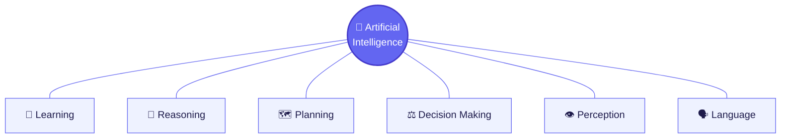
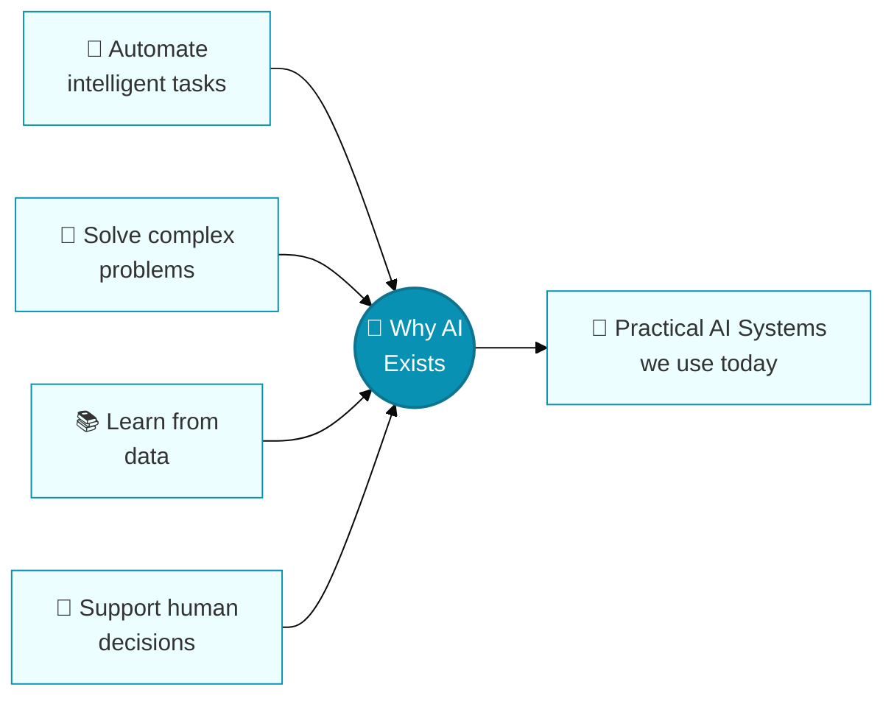
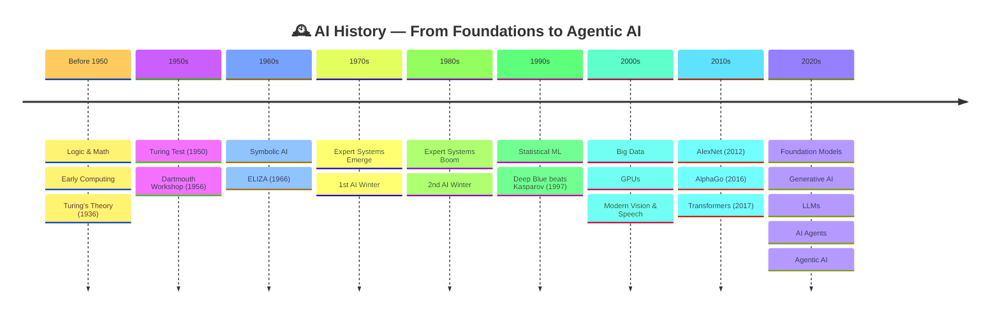
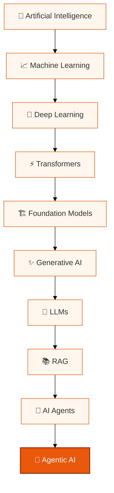

# 🤖 Artificial Intelligence — A Complete Beginner's Guide

> Start here with zero background and walk away understanding what AI actually is, why it was built, how it evolved step by step, and how that evolution leads all the way to **Agentic AI**.

## 🎯 What You'll Learn Here

By the end of this README you will be able to explain, in plain English:
- What AI actually is (and isn't)
- Why AI was invented in the first place
- Who coined the term, and when
- The major eras of AI history, and **why** each era gave way to the next
- How Symbolic AI → Machine Learning → Deep Learning → Generative AI → LLMs → AI Agents → Agentic AI connect
- The core vocabulary used across the rest of this guide series

This is **document 1 of 3** in a small learning series. It ends by pointing you toward the next one: a full introduction to Agentic AI.

---

## 📚 Table of Contents

1. [🧠 What Is Artificial Intelligence?](#1--what-is-artificial-intelligence)
2. [🤔 Why Was AI Created?](#2--why-was-ai-created)
3. [👨‍🔬 Who Coined the Term "AI"?](#3--who-coined-the-term-ai)
4. [📜 The History of AI — Era by Era](#4--the-history-of-ai--era-by-era)
5. [🧭 The Big Picture: Why AI Kept Evolving](#5--the-big-picture-why-ai-kept-evolving)
6. [🗺️ The Full AI Evolution Diagram](#6--the-full-ai-evolution-diagram)
7. [🌳 Major Fields of AI, Explained Simply](#7--major-fields-of-ai-explained-simply)
8. [📊 How AI, ML, DL, GenAI, LLMs, Agents & Agentic AI Relate](#8--how-ai-ml-dl-genai-llms-agents--agentic-ai-relate)
9. [📖 Core Vocabulary (Plain English)](#9--core-vocabulary-plain-english)
10. [🌍 Real-World Applications](#10--real-world-applications)
11. [✅ Benefits & ⚠️ Risks](#11--benefits--️-risks)
12. [🤖 Want to Learn More About Agentic AI?](#12--want-to-learn-more-about-agentic-ai)
13. [❓ Quick Check — Test Yourself](#13--quick-check--test-yourself)
14. [🧭 Navigation](#14--navigation)

---

## 1. 🧠 What Is Artificial Intelligence?

**Simple definition:** AI is the field of building machines and software that can do things which normally need human thinking — recognizing images, understanding language, making decisions, or learning from experience.

**Slightly more technical:** AI systems take in data, find patterns in it, and use those patterns to predict, generate, or act — often without being given an exact rule for every situation.

> 💭 **Honesty note:** There is no single, universally agreed definition of "intelligence," so there's no single agreed definition of "AI" either. What counted as AI in the 1960s (simple rule-based programs) is considered ordinary software today. This is called the **"AI effect"** — once a capability becomes normal, people stop calling it AI.

---

## 2. 🤔 Why Was AI Created?

Earlier machines automated **physical** labor (factories, engines). AI research began because people wanted to automate tasks that seemed to require **thinking** — not lifting.

| Aspect | Human Intelligence | Artificial Intelligence |
|---|---|---|
| Origin | Biological, evolved over millions of years | Engineered, trained on data |
| Learning | Continuous, embodied, general | Task/data-driven, still narrower today |
| Generalization | Broad, transferable | Improving, but usually narrower |
| Speed at scale | Limited by biology | Processes huge datasets quickly |

---

## 3. 👨‍🔬 Who Coined the Term "AI"?

No single person "invented" AI — it grew out of decades of work in logic, math, and computing. But the **term itself** has a clear origin:

📌 In **1955**, John McCarthy, Marvin Minsky, Nathaniel Rochester, and Claude Shannon wrote a proposal for a summer workshop — and that proposal is where the phrase **"Artificial Intelligence"** was coined. The workshop itself, the **Dartmouth Summer Research Project**, happened in **1956** and is treated as the field's founding event.

| 👤 Person | Contribution |
|---|---|
| Alan Turing | Theoretical computation; the Turing Test (1950) |
| John McCarthy | Coined "Artificial Intelligence"; created Lisp; co-organized Dartmouth |
| Marvin Minsky | Co-organizer of Dartmouth; symbolic AI pioneer |
| Claude Shannon | Founder of information theory; Dartmouth co-author |
| Nathaniel Rochester | Dartmouth co-author; early IBM computer architect |
| Arthur Samuel | Coined "machine learning"; built a self-learning checkers program |
| Frank Rosenblatt | Invented the Perceptron (1958), an early trainable neural network |
| Hinton, LeCun, Bengio | Backpropagation & deep learning research (2018 Turing Award) |

> ⚠️ Computers already existed before 1956 (ENIAC, 1945), and learning-based programs were already being built. Dartmouth didn't invent computers or machine learning — it **named the field and gathered its founding community.**

---

## 4. 📜 The History of AI — Era by Era

Each era below is written as **problem → response**, because that's the real story of AI: every major shift happened because the previous approach hit a wall.

### 🧩 Before 1950 — Foundations
No computers doing "AI" yet — just the theoretical groundwork: formal logic (Aristotle), Boolean algebra (Boole), and Alan Turing's 1936 idea of a universal computing machine. Warren McCulloch and Walter Pitts (1943) proposed a mathematical model of a neuron — an early ancestor of today's neural networks.

### 🏛️ 1950s — The Field Is Named
Turing published *"Computing Machinery and Intelligence"* (1950), proposing the Turing Test. In 1955–56, the Dartmouth proposal coined "Artificial Intelligence" and gathered the field's founders.

### 🧠 1960s — Symbolic AI
**Problem:** Machines had no way to "reason" at all. **Response:** Researchers represented knowledge as symbols and logical rules that a program could manipulate — this is **Symbolic AI**. Joseph Weizenbaum's **ELIZA** (1966) simulated a therapist through text pattern-matching.

### ❄️ 1970s — First AI Winter
**Problem:** Symbolic AI couldn't scale to messy, real-world problems, and computers were too weak. **Response (from the industry):** funding was cut — the first **AI winter**.

### 📈 1980s — Expert Systems, Then Second Winter
**Problem:** Businesses wanted to encode scarce human expertise into software. **Response:** **Expert systems** — rule-based programs modeling a specific expert's decisions — became commercially popular, then fell short of inflated promises, causing a second **AI winter**.

### 📊 1990s — The Statistical Turn
**Problem:** Hand-written rules couldn't cover every real-world case. **Response:** Research shifted toward **statistical Machine Learning** — systems that learn rules from data instead of being told them. IBM's **Deep Blue** beat Garry Kasparov in chess (1997) using search, not learning.

### 💾 2000s — Data and Hardware Catch Up
**Problem:** ML needed more data and more compute than was available. **Response:** The internet supplied huge datasets, and **GPUs** — built for graphics — turned out to be great at the parallel math ML needed.

### 🧬 2010s — The Deep Learning Era
**Problem:** Traditional ML still needed humans to hand-design "features" (what makes a cat look like a cat?). **Response:** **Deep Learning** — neural networks with many layers — learned those features automatically from raw data. **AlexNet** (2012) proved this at scale. **Transformers** (2017) then solved a further problem: older networks processed text one word at a time, which was slow and bad at long-range context.

### 🚀 2020s — Foundation Models and Beyond
**Problem:** Training a new model from scratch for every task was too expensive. **Response:** **Foundation Models** — one very large model, pretrained broadly, reused for many tasks. This enabled **Generative AI**, **LLMs**, **AI Agents**, and finally **Agentic AI** — systems that don't just answer once, but pursue a goal across many steps.

### 🧊 Why the AI Winters Happened
📌 Both winters shared the same root causes: **overpromising results relative to real capability, insufficient compute/data for the era's ambitions, and the funding cuts that followed** once expectations weren't met. This pattern is worth remembering — it's a useful lens for evaluating AI hype today.

---

## 5. 🧭 The Big Picture: Why AI Kept Evolving

Every stage in AI's history exists because the previous stage hit a specific, nameable wall:

| Stage | The Wall It Hit | What Solved It |
|---|---|---|
| Symbolic AI | Can't hand-write a rule for every real-world case | Machine Learning (learn rules from data) |
| Early ML | Needs humans to manually design features | Deep Learning (learns features automatically) |
| Early Deep Learning (RNNs) | Slow, struggles with long-range context in text | Transformers (attention processes everything at once) |
| One model per task | Expensive to train a new model per task | Foundation Models (one model, many tasks) |
| Models that only classify/predict | Can't *produce* new content | Generative AI |
| Generative AI in general | Needed a model specialized in fluent language | Large Language Models (LLMs) |
| LLMs with fixed training data | Don't know current/private information | RAG (Retrieval-Augmented Generation) |
| A single one-shot answer | Some tasks need multi-step real-world action | AI Agents |
| A single narrow agent workflow | Businesses need whole workflows automated | Agentic AI |

This table **is** the story of AI in one glance — and it's the reason the next section's diagram reads top to bottom as a chain of solved problems.

---

## 6. 🗺️ The Full AI Evolution Diagram

```mermaid
%%{init: {'theme':'base', 'themeVariables': {'primaryColor':'#f5f3ff','primaryBorderColor':'#7c3aed','lineColor':'#7c3aed','fontSize':'14px'}}}%%
flowchart TD
    A["🤖 AI<br/><i>The broad goal: machines that think</i>"]
    A -->|"❓ Problem: can't hand-write<br/>a rule for everything"| B["📈 Machine Learning<br/><i>Learn rules from data</i>"]
    B -->|"❓ Problem: humans must<br/>hand-design features"| C["🧬 Deep Learning<br/><i>Learn features automatically</i>"]
    C -->|"❓ Problem: RNNs are slow &<br/>lose long-range context"| D["⚡ Transformers<br/><i>Attention — see the whole sequence at once</i>"]
    D -->|"❓ Problem: training one model<br/>per task is too costly"| E["🏗️ Foundation Models<br/><i>One broad model, many tasks</i>"]
    E -->|"❓ Problem: models could only<br/>classify, not create"| F["✨ Generative AI<br/><i>Produce new text, images, audio, code</i>"]
    F -->|"❓ Problem: needed fluent,<br/>general-purpose language"| G["💬 Large Language Models<br/><i>Language-specialized foundation models</i>"]
    G -->|"❓ Problem: fixed training data,<br/>no live/private knowledge"| H["📚 RAG<br/><i>Ground answers in real, current info</i>"]
    H -->|"❓ Problem: one answer isn't<br/>always enough — need action"| I["🤖 AI Agents<br/><i>Model + tools + memory pursue a goal</i>"]
    I -->|"❓ Problem: whole workflows,<br/>not single tasks, need automating"| J(("🚀 Agentic AI<br/><i>Autonomous, goal-directed, iterative systems</i>"))

    style A fill:#7c3aed,color:#fff,stroke:#5b21b6,stroke-width:3px
    style J fill:#f59e0b,color:#111,stroke:#b45309,stroke-width:3px
    style B fill:#ddd6fe,color:#3730a3,stroke:#7c3aed
    style C fill:#ddd6fe,color:#3730a3,stroke:#7c3aed
    style D fill:#ddd6fe,color:#3730a3,stroke:#7c3aed
    style E fill:#ddd6fe,color:#3730a3,stroke:#7c3aed
    style F fill:#ddd6fe,color:#3730a3,stroke:#7c3aed
    style G fill:#ddd6fe,color:#3730a3,stroke:#7c3aed
    style H fill:#ddd6fe,color:#3730a3,stroke:#7c3aed
    style I fill:#ddd6fe,color:#3730a3,stroke:#7c3aed
```

> 💡 **How to read this diagram:** Follow the arrows top to bottom. Each arrow label is the *problem* that forced the next stage to be invented. This is deliberately drawn as a **chain of cause and effect**, not just a list of buzzwords — that's the whole point of this README.

**Using the diagram on GitHub/GitLab/most Markdown viewers:** Mermaid diagrams render natively and support pinch-to-zoom on mobile and scroll-to-zoom on desktop in most modern Markdown renderers (GitHub, VS Code, Obsidian). If your viewer doesn't render Mermaid, paste the code block into the [Mermaid Live Editor](https://mermaid.live) for a zoomable, pannable view with export options.

---

## 7. 🌳 Major Fields of AI, Explained Simply

| Field | What It Is | 🎯 Why It Exists |
|---|---|---|
| 📈 **Machine Learning** | Programs that improve by learning from data | You can't hand-write a rule for every situation |
| 🧬 **Deep Learning** | ML using many-layered neural networks | Lets the model discover features on its own |
| 🗣️ **NLP** | Understanding & generating human language | Human language is messy and ambiguous |
| 👁️ **Computer Vision** | Interpreting images/video | A huge share of real-world info is visual |
| 🎙️ **Speech & Audio AI** | Speech-to-text and text-to-speech | Voice is the most natural human interface |
| 🎮 **Reinforcement Learning** | Learning by trial, error, and reward | Many problems have no labeled "correct answer" |
| 🦾 **Robotics** | AI + physical machines | Some tasks need a physical body, not just software |
| ✨ **Generative AI** | Creates new content | Beyond classifying — the world wanted machines that *make* things |
| 🏗️ **Foundation Models** | Huge, broadly pretrained, reusable models | One model, many downstream tasks |
| 💬 **LLMs** | Foundation models specialized in language | Fluent, general-purpose language ability |
| 🌐 **Multimodal AI** | Understands text + image + audio + video together | Real understanding rarely comes from one data type |
| 📚 **RAG** | Connects a model to external knowledge | Fixes the "fixed training cutoff" problem |
| 🤖 **AI Agents** | Model + tools + memory, pursuing a goal | Some tasks need real multi-step action |
| 🚀 **Agentic AI** | The broader paradigm of autonomous, goal-driven systems | Whole workflows need automating, not single answers |
| 🔍 **Explainable AI (XAI)** | 🔬 Making AI decisions understandable | Trust, debugging, and regulation need "why," not just "what" |
| 🛡️ **AI Safety** | 🔬 Keeping AI reliable and aligned | More capable, autonomous systems make mistakes costlier |

---

## 8. 📊 How AI, ML, DL, GenAI, LLMs, Agents & Agentic AI Relate

**In one paragraph:** AI is the broad field. Machine Learning is a major approach within AI — learning from data. Deep Learning is a major approach within ML, using layered neural networks. Transformers are the architecture that made today's large models practical. Foundation Models are huge, reusable, pretrained models. Generative AI is what those models do when they create content. LLMs are Generative AI models specialized in language. RAG connects an LLM to outside knowledge. AI Agents combine a model with tools and memory to pursue a goal. **Agentic AI** is the broader design paradigm those agents belong to — systems that plan, act, observe, and keep going until a goal is met.

| Concept | One-line definition |
|---|---|
| AI | The broad science of building intelligent machines |
| Machine Learning | Systems that learn patterns from data |
| Deep Learning | ML using multi-layer neural networks |
| Generative AI | AI that creates new content |
| Foundation Models | Large, broadly pretrained, reusable models |
| LLMs | Foundation models specialized in language |
| RAG | Connecting a model to external knowledge at query time |
| AI Agents | Model + tools + memory, acting toward a goal |
| Agentic AI | The broader paradigm of autonomous, goal-driven AI systems |

---

## 9. 📖 Core Vocabulary (Plain English)

| Term | Plain-English meaning |
|---|---|
| **Dataset** | The examples used to train and test a model |
| **Model** | The trained "function" that makes predictions |
| **Training** | Adjusting a model using data until it gets better |
| **Parameters** | The internal numbers a model learns |
| **Inference** | Actually running a trained model to get an output |
| **Tokens** | Small chunks of text a language model processes |
| **Embeddings** | Numbers that represent meaning, so similar things end up "close together" |
| **Context window** | How much text a model can consider at once |
| **Hallucination** | When a model confidently states something false |
| **Fine-tuning** | Extra training on a smaller, specialized dataset |
| **Attention** | The mechanism letting a model relate every word to every other word |

---

## 10. 🌍 Real-World Applications

| Domain | Example | Benefit |
|---|---|---|
| 🏥 Healthcare | Flagging anomalies in medical scans | Faster, more consistent detection |
| 🎓 Education | Adaptive practice quizzes | Personalized learning pace |
| 💻 Software | AI coding assistants | Faster development |
| 💰 Finance | Real-time fraud detection | Faster fraud response |
| 🛒 E-commerce | Personalized recommendations | Better product discovery |
| ♿ Accessibility | Live captioning | Greater independence |
| 🏭 Manufacturing | Vision-based defect detection | Less downtime and waste |

---

## 11. ✅ Benefits & ⚠️ Risks

**✅ Benefits:** automating repetitive/dangerous work, productivity gains, faster scientific discovery, better diagnostics, personalized education, accessibility tools, creative support.

**⚠️ Risks:** hallucinations, bias inherited from training data, misinformation/deepfakes, privacy concerns, security issues (e.g. prompt injection), over-reliance, energy/environmental cost, and — as autonomy grows — the risk of reduced human oversight in highly agentic systems.

---

## 12. 🤖 Want to Learn More About Agentic AI?

**Agentic AI** is the newest and most powerful stage in the diagram above: AI systems that don't just answer a question once, but take a **goal**, break it into steps, use **tools**, check their own progress, and keep working until the goal is done — often with a human able to step in along the way. It matters because it's how AI moves from "giving advice" to "getting things done."

👉 **Continue to the full guide:** [`./Agentic-ai-intro/README.md`](./Agentic-ai-intro/README.md) — it covers AI Agent architecture, memory, tool calling, RAG, multi-agent systems, MCP, major frameworks (LangChain, LangGraph, CrewAI, AutoGen, Google ADK, OpenAI Agents SDK, and more), and a full roadmap.

---

## 13. ❓ Quick Check — Test Yourself

Click a question to reveal the answer.

<strong>Q1. What is Artificial Intelligence, in one sentence?</strong>

AI is the science of building machines/software that can perform tasks normally requiring human intelligence — learning, reasoning, perceiving, and deciding.

<strong>Q2. True or False: AI began in 1956.</strong>

False. 1956 is when the *term* "Artificial Intelligence" was formally used and the field was named at the Dartmouth workshop — but it built on decades of prior work in logic, math, and computing.

<strong>Q3. What caused the AI winters of the 1970s and 1980s?</strong>

Overpromising results relative to real capabilities, insufficient compute/data for the era's ambitions, and the funding cuts that followed once expectations weren't met.

<strong>Q4. What's the difference between Machine Learning and Deep Learning?</strong>

Machine Learning is the broad approach of learning patterns from data. Deep Learning is a *subset* of ML that uses multi-layer neural networks to automatically learn features from raw data, instead of requiring humans to hand-design those features.

<strong>Q5. Why do Transformers matter so much?</strong>

They process a whole sequence at once using self-attention, letting the model relate every word to every other word directly — instead of one word at a time, which was slow and lost long-range context.

<strong>Q6. What problem does RAG solve?</strong>

LLMs have a fixed training cutoff and can't know everything — RAG connects a model to external knowledge at query time so it can ground its answer in current, specific, or private information.

<strong>Q7. What's the key difference between an AI Agent and a regular chatbot?</strong>

A regular chatbot answers a single prompt once. An AI Agent pursues a *goal* across multiple steps — planning, calling tools, observing results, and acting — until the goal is accomplished.

<strong>Q8. In one sentence, what is Agentic AI?</strong>

Agentic AI is the broader design paradigm for AI systems that plan, act, observe results, and iterate autonomously (with guardrails) toward a goal, rather than producing one single response.

---

## 14. 🧭 Navigation

| | |
|---|---|
| 🏠 You are here | **AI Introduction** (this file) |
| ➡️ Next | [Agentic AI Introduction](./Agentic-ai-intro/README.md) |