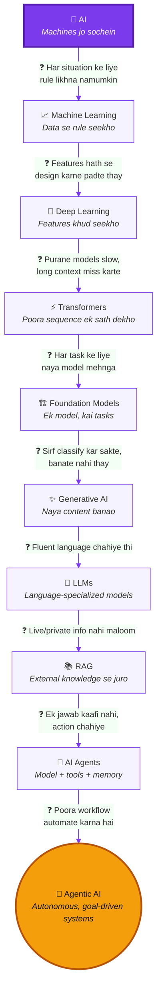
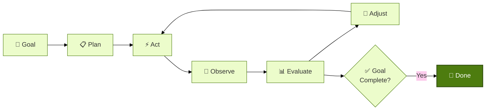
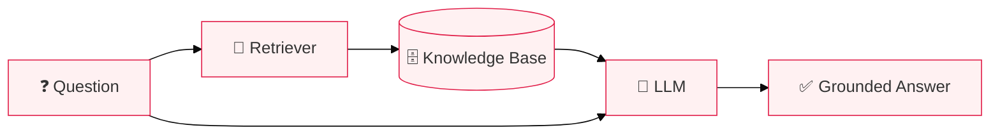

# 🤖 Artificial Intelligence to Agentic AI — Complete Beginner's Guide

> AI kya hai, kaise evolve hui, Agentic AI kya hai, aur future/careers kya hain — sab ek hi jagah, simple aur short andaaz mein.

## 🎯 Is README Mein Kya Milega

- AI kya hai, kyun bani, kis ne naam diya
- AI history — era by era, short mein
- AI → ML → DL → GenAI → LLM → Agents → Agentic AI evolution (diagram ke sath)
- Agentic AI ke core concepts (memory, tools, RAG, multi-agent, frameworks)
- Future of AI (AGI/ASI) aur AI careers
- Aakhir mein — **click-to-reveal Q&A** taake khud ko test kar sako
- Har section ke end pe **"Read More"** links agar deep dive karna ho

---

## 📚 Table of Contents

1. [🧠 AI Kya Hai?](#1--ai-kya-hai)
2. [🤔 AI Kyun Bani?](#2--ai-kyun-bani)
3. [👨‍🔬 Naam Kis Ne Diya?](#3--naam-kis-ne-diya)
4. [📜 AI History — Short Mein](#4--ai-history--short-mein)
5. [🗺️ AI Evolution Diagram](#5--️-ai-evolution-diagram)
6. [🌳 AI Ke Major Fields](#6--ai-ke-major-fields)
7. [🤖 AI Agent Kya Hai?](#7--ai-agent-kya-hai)
8. [🚀 Agentic AI Kya Hai?](#8--agentic-ai-kya-hai)
9. [🏗️ Agent Kaise Kaam Karta Hai](#9--️-agent-kaise-kaam-karta-hai)
10. [🧠 Memory, Tools, RAG & Context](#10--memory-tools-rag--context)
11. [👥 Multi-Agent Systems & Frameworks](#11--multi-agent-systems--frameworks)
12. [🔮 Future of AI (AGI/ASI)](#12--future-of-ai-agiasi)
13. [💼 AI Careers](#13--ai-careers)
14. [📖 Poore Guide Ke Liye Extra Resources](#14--poore-guide-ke-liye-extra-resources)
15. [❓ Khud Ko Test Karo](#15--khud-ko-test-karo)

---

## 1. 🧠 AI Kya Hai?

AI (Artificial Intelligence) wo software/machines banane ka science hai jo woh kaam kar saken jo normally **insaani soch** maangte hain — jaise seekhna, samajhna, decide karna, ya kisi image/awaaz ko pehchanna.

> 💭 Koi ek fix definition nahi hai — jo kaam kal "AI" lagta tha, aaj normal software lagta hai. Isse **"AI effect"** kehte hain.

**📖 Read More:** [Britannica — Artificial Intelligence](https://www.britannica.com/technology/artificial-intelligence)

---

## 2. 🤔 AI Kyun Bani?

Purani machines sirf **physical** kaam automate karti thi (factories, engines). AI isliye banayi gayi taake **sochne wale** kaam bhi automate ho saken — jaise pattern dhoondna, decision lena, ya data se seekhna.

**📖 Read More:** [Stanford CS221 — Intro to AI](https://stanford-cs221.github.io/)

---

## 3. 👨‍🔬 Naam Kis Ne Diya?

Koi ek insaan ne AI "invent" nahi ki. Lekin term **"Artificial Intelligence"** 1955 mein John McCarthy, Marvin Minsky, Nathaniel Rochester aur Claude Shannon ne apne **Dartmouth proposal** mein coin kiya. 1956 ka **Dartmouth Workshop** field ka founding event mana jata hai.

> ⚠️ Computers pehle se exist karte thay (ENIAC, 1945). Dartmouth ne bas field ko **naam diya aur founders ko ikattha kiya.**

**📖 Read More:** [Dartmouth Proposal, 1955 — original PDF](http://jmc.stanford.edu/articles/dartmouth/dartmouth.pdf)

---

## 4. 📜 AI History — Short Mein

| Era | Kya Hua |
|---|---|
| Before 1950 | Logic, math, Turing ki theory — foundation banti hai |
| 1950s | Turing Test (1950), Dartmouth Workshop (1956) — field ka naam pehli baar aata hai |
| 1960s | **Symbolic AI** — rules aur logic se knowledge represent karna (e.g. ELIZA, 1966) |
| 1970s | Symbolic AI real-world mein scale nahi hui → funding cut → **1st AI Winter** |
| 1980s | Expert Systems boom, phir overpromise → **2nd AI Winter** |
| 1990s | Statistical **Machine Learning** shuru hoti hai (rules ki jagah data se seekhna) |
| 2000s | Internet ka Big Data + GPUs se ML fast hoti hai |
| 2010s | **Deep Learning** (AlexNet 2012), **Transformers** (2017) — attention mechanism aata hai |
| 2020s | Foundation Models, Generative AI, LLMs, AI Agents, **Agentic AI** |

📌 **Dono AI winters ki wajah:** overpromise + kam compute/data + funding cut jab expectations poori na hui.

**📖 Read More:** [Stanford HAI — AI Index Report](https://hai.stanford.edu/ai-index) · [Attention Is All You Need (Transformer paper)](https://arxiv.org/abs/1706.03762)

---

## 5. 🗺️ AI Evolution Diagram

Har stage isliye bani kyunki pichli stage ek problem pe atak gayi thi:

> 💡 Agar Mermaid render na ho to code [mermaid.live](https://mermaid.live) mein paste karo — zoom/pan support ke sath.

**In short:** AI broad field hai → ML data se seekhta hai → DL neural networks se features khud nikaalta hai → GenAI naya content banata hai → LLM language mein expert hai → RAG live info deta hai → AI Agent action leta hai → Agentic AI poora workflow autonomously chalata hai.

**📖 Read More:** [The Illustrated Transformer](https://jalammar.github.io/illustrated-transformer/)

---

## 6. 🌳 AI Ke Major Fields

| Field | Simple Matlab |
|---|---|
| 📈 Machine Learning | Data se seekhna |
| 🧬 Deep Learning | Layers wale neural networks se seekhna |
| 🗣️ NLP | Insaani language samajhna/banana |
| 👁️ Computer Vision | Images/video samajhna |
| 🎙️ Speech AI | Awaaz ko text aur text ko awaaz banana |
| 🎮 Reinforcement Learning | Trial-error aur reward se seekhna |
| 🦾 Robotics | AI + physical machine |
| ✨ Generative AI | Naya content banana |
| 💬 LLMs | Language mein expert bade models |
| 📚 RAG | Model ko live/external info dena |
| 🤖 AI Agents | Model + tools + memory se goal poora karna |
| 🚀 Agentic AI | Autonomous, multi-step, goal-driven systems |

**📖 Read More:** [Hugging Face NLP Course (free)](https://huggingface.co/learn/nlp-course)

---

## 7. 🤖 AI Agent Kya Hai?

Ek **AI Agent** ek system hai jo LLM + tools + memory + planning use karke ek **goal** ko multiple steps mein poora karta hai — sirf ek dafa jawab dene ke bajaye.

| | Normal Chatbot | AI Agent |
|---|---|---|
| Kaam | Ek prompt ka ek jawab | Goal ko steps mein poora karta hai |
| Tools | Nahi | Haan (search, code, APIs) |
| Autonomy | Nahi | Low–Medium |

**📖 Read More:** [Anthropic — Building Effective Agents](https://www.anthropic.com/research/building-effective-agents)

---

## 8. 🚀 Agentic AI Kya Hai?

**Agentic AI** ek broader paradigm hai — AI systems jo **plan** karte hain, **act** karte hain, apna **result observe** karte hain, aur goal poora hone tak **iterate** karte rehte hain (guardrails ke sath).

> 💭 Iski koi ek universally-agreed definition nahi hai — ye industry mein sabse zyada aam samjhi jaane wali definition hai.

**AI Agent vs Agentic AI:** AI Agent ek concrete system hai; Agentic AI us system ke **design pattern/paradigm** ko describe karta hai.

**📖 Read More:** [Google — Agents Whitepaper](https://www.kaggle.com/whitepaper-agents) · [Model Context Protocol (MCP)](https://modelcontextprotocol.io/)

---

## 9. 🏗️ Agent Kaise Kaam Karta Hai

📌 **Important:** LLM khud tool run nahi karta — ek surrounding framework tool chalata hai aur result LLM ko wapas deta hai agle step ke liye.

**Core parts:** Goal, Planning, Tools, Memory, Observation, Feedback Loop, Guardrails.

---

## 10. 🧠 Memory, Tools, RAG & Context

| Concept | Simple Matlab |
|---|---|
| **Tool/Function Calling** | Model kisi function ko args ke sath call karne ki request karta hai |
| **Short-term Memory** | Current conversation/task ki info |
| **Long-term Memory** | Sessions ke across yaad rehne wali info |
| **Context Window** | Model ek waqt mein kitna text dekh sakta hai |
| **Prompt Engineering** | Ek call ke instructions ko achi tarah likhna |
| **Context Engineering** | Har step pe model ko *sahi* info dena (memory + retrieval + tool results) |
| **RAG** | Model ko external/live knowledge base se jodna, taake hallucination kam ho |

**📖 Read More:** [RAG — original paper](https://arxiv.org/abs/2005.11401) · [Pinecone — RAG Learning Center](https://www.pinecone.io/learn/retrieval-augmented-generation/)

---

## 11. 👥 Multi-Agent Systems & Frameworks

Bade tasks ke liye ek **orchestrator** multiple specialized agents ko coordinate karta hai (research agent, coding agent, review agent, etc.).

| Framework | Kis Liye |
|---|---|
| **LangChain** | LLM apps fast prototype karne ke liye |
| **LangGraph** | Complex, branching agent workflows |
| **CrewAI** | Role-based multi-agent teams |
| **AutoGen** | Agents jo aapas mein "baat karke" task solve karein |
| **Google ADK / OpenAI Agents SDK** | Provider-specific agent building |
| **MCP** | Agent ko tools/data se jodne ka open standard |
| **A2A** | Alag agents ko ek dusre se baat karne ka standard |
| **n8n** | Low-code visual automation |

> 💡 Simple fixed workflow (jaise n8n) se shuru karo — full agent framework tab lo jab dynamic, model-driven decisions chahiye ho.

**📖 Read More:** [LangChain — Agents Docs](https://python.langchain.com/docs/concepts/agents/)

---

## 12. 🔮 Future of AI (AGI/ASI)

| Level | Status |
|---|---|
| **ANI** (Narrow AI) | 📌 Aaj ka har AI system — LLMs, agents sab isi mein aate hain |
| **AGI** (General AI) | 💭 Insaan jaisi general ability — abhi tak achieve nahi hui, koi agreed definition nahi |
| **ASI** (Superintelligence) | 💭 Sirf theoretical — insaan se zyada intelligent har domain mein |

📌 AGI ko "already achieved" ya ASI ko "imminent" samajhna ghalat hoga — dono abhi tak open debate hain.

**📖 Read More:** [Stanford HAI — AI Index](https://hai.stanford.edu/ai-index)

---

## 13. 💼 AI Careers

| Role | Kya Karte Hain |
|---|---|
| **ML Engineer** | Models banate/deploy karte hain |
| **LLM Engineer** | LLMs par apps banate hain (prompting, evaluation) |
| **Agentic AI Engineer** | Autonomous agents design/build karte hain (tools, memory, orchestration) |
| **AI Architect** | Poore system ka design plan karte hain |
| **AI Infrastructure/MLOps Engineer** | Training/serving ke compute systems sambhalte hain |
| **AI Security Engineer** | Agents ko misuse/prompt-injection se bachate hain |
| **AI Research Scientist** | Naye architectures aur methods par research karte hain |

**Shuru karne ke liye skills:** Python, basic statistics, APIs use karna, prompt engineering, Git, chhote end-to-end projects banana.

**📖 Read More:** [World Economic Forum — Future of Jobs Report](https://www.weforum.org/publications/the-future-of-jobs-report-2025/)

---

## 14. 📖 Poore Guide Ke Liye Extra Resources

Agar kisi bhi topic ko **deeply** parhna ho, ye best free resources hain:

| Topic | Resource |
|---|---|
| AI Fundamentals | [Stanford CS221](https://stanford-cs221.github.io/) |
| Machine Learning | [Google ML Crash Course](https://developers.google.com/machine-learning/crash-course) · [Andrew Ng — Coursera](https://www.coursera.org/specializations/machine-learning-introduction) |
| Deep Learning | [3Blue1Brown — Neural Networks](https://www.3blue1brown.com/topics/neural-networks) · [Deep Learning Book (free)](https://www.deeplearningbook.org/) |
| Transformers | [Illustrated Transformer](https://jalammar.github.io/illustrated-transformer/) · [Attention Is All You Need](https://arxiv.org/abs/1706.03762) |
| NLP | [Stanford CS224n](https://web.stanford.edu/class/cs224n/) · [Hugging Face NLP Course](https://huggingface.co/learn/nlp-course) |
| Computer Vision | [Stanford CS231n](https://cs231n.github.io/) |
| Reinforcement Learning | [Sutton & Barto (free book)](http://incompleteideas.net/book/the-book-2nd.html) · [Spinning Up — OpenAI](https://spinningup.openai.com/) |
| RAG | [Original Paper](https://arxiv.org/abs/2005.11401) · [Pinecone Learning Center](https://www.pinecone.io/learn/retrieval-augmented-generation/) |
| AI Agents & Agentic AI | [Anthropic — Building Effective Agents](https://www.anthropic.com/research/building-effective-agents) · [MCP Docs](https://modelcontextprotocol.io/) |
| Frameworks | [LangChain Docs](https://python.langchain.com/docs/concepts/agents/) |
| Current State of AI | [Stanford HAI AI Index](https://hai.stanford.edu/ai-index) |
| Careers | [WEF Future of Jobs Report](https://www.weforum.org/publications/the-future-of-jobs-report-2025/) |

---

## 15. ❓ Khud Ko Test Karo

Sawal pe click karo, jawab open hoga.

<strong>Q1. AI ek line mein kya hai?</strong>

AI wo science hai jo machines banati hai jo learning, reasoning, perceiving aur decision-making jaise insaani kaam kar saken.

<strong>Q2. True/False: AI 1956 mein shuru hui.</strong>

False. 1956 mein sirf term "Artificial Intelligence" coin hua aur field ko naam mila — kaam decades pehle se ho raha tha.

<strong>Q3. Machine Learning aur Deep Learning mein farq?</strong>

ML data se patterns seekhta hai. Deep Learning ML ka hi subset hai jo multi-layer neural networks se features khud seekhta hai, insaan ko hath se design nahi karna padta.

<strong>Q4. Transformers itne important kyun hain?</strong>

Ye poore sequence ko ek sath process karte hain (self-attention se), isliye purane RNNs se fast hain aur long-range context achi tarah samajhte hain.

<strong>Q5. RAG kis problem ko solve karta hai?</strong>

LLMs ka training data fix hota hai — RAG model ko external/live knowledge se jodta hai taake wo current ya private info bhi use kar sake.

<strong>Q6. Normal chatbot aur AI Agent mein farq?</strong>

Chatbot ek prompt ka ek jawab deta hai. AI Agent ek goal ko multiple steps mein — planning, tools, observation ke sath — poora karta hai.

<strong>Q7. Agentic AI mein LLM khud tool execute karta hai?</strong>

Nahi. Ek surrounding framework tool run karta hai aur result LLM ko wapas deta hai agle reasoning step ke liye.

<strong>Q8. MCP aur A2A mein farq?</strong>

MCP agent ko tools/data se connect karne ka standard hai. A2A alag-alag agents ko aapas mein communicate karne ka standard hai.

<strong>Q9. AGI aur ASI mein farq?</strong>

AGI hypothetical AI hai jo insaan jaisi general ability rakhe (abhi achieve nahi hui). ASI hypothetical AI hai jo har domain mein insaan se zyada intelligent ho (purely theoretical).

<strong>Q10. AI career shuru karne ke liye 3 basic skills batao.</strong>

Koi bhi 3: Python, basic statistics, APIs use karna, prompt engineering, Git, chhote projects banana.

---

Made with ❤️ as a simple, beginner-friendly AI → Agentic AI learning guide.
