# 🤖 OpenAI Agents SDK — The Complete Guide

### From "What is an agent?" to "Which framework should I actually use?" — a guide for total beginners and experienced engineers alike


> 💡 **How to read this guide:** Every important concept has three layers — a **one-line simple explanation**, a **real-world analogy**, and a **technical diagram**. Beginners can stop at layer one or two. Engineers can go straight to the diagrams and tables. Nobody gets left behind.

---

## 📚 Table of Contents

- [0. TL;DR — 60-Second Overview](#0-tldr--60-second-overview)
- [1. What Is the OpenAI Agents SDK?](#1-what-is-the-openai-agents-sdk)
- [2. Who Created It & Why](#2-who-created-it--why)
- [3. History: How We Got Here](#3-history-how-we-got-here)
- [4. The Problem It Solves](#4-the-problem-it-solves)
- [5. Where It Sits in the AI Stack](#5-where-it-sits-in-the-ai-stack)
- [6. Core Concepts (Explained Simply)](#6-core-concepts-explained-simply)
- [7. The Agent Lifecycle](#7-the-agent-lifecycle)
- [8. Single-Agent vs. Multi-Agent Design](#8-single-agent-vs-multi-agent-design)
- [9. Benefits](#9-benefits)
- [10. Limitations & Disadvantages](#10-limitations--disadvantages)
- [11. When to Use It (and When Not To)](#11-when-to-use-it-and-when-not-to)
- [12. The Other Frameworks — Explained Simply](#12-the-other-frameworks--explained-simply)
- [13. The Big Comparison (One Glance = Full Understanding)](#13-the-big-comparison-one-glance--full-understanding)
- [14. Which Framework Should You Learn?](#14-which-framework-should-you-learn)
- [15. Recommended Learning Path](#15-recommended-learning-path)
- [16. Key Takeaways](#16-key-takeaways)
- [17. Further Reading](#17-further-reading)

---

## 0. TL;DR — 60-Second Overview

> 🟢 **If you read nothing else, read this.**

Imagine you hire a **smart new employee** (the AI model). By itself, this employee can only talk — answer questions, write text. That's a plain LLM.

Now give that employee:
- A **job description** → *Instructions*
- **Access to tools** (phone, calculator, computer) → *Tools*
- **Coworkers to pass tricky cases to** → *Handoffs*
- **A supervisor who double-checks risky decisions** → *Guardrails / Human-in-the-loop*
- **A notebook to remember the conversation** → *Sessions*
- **A CCTV camera recording everything they did** → *Tracing*

That employee is now an **Agent**. The **OpenAI Agents SDK** is simply the toolkit that gives an AI model all of these things, so you don't have to build them yourself from scratch.

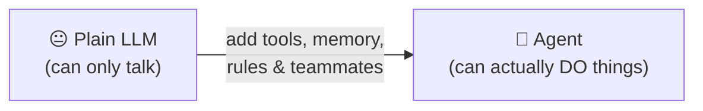

---

## 1. What Is the OpenAI Agents SDK?

### 🟢 In Simple Words
It's a **free, open-source toolbox (in Python)** that helps developers build AI systems that don't just *chat* — they *take action*, use tools, work with other AI agents, and can be safely trusted in real products.

### 🧠 Real-World Analogy
Think of building an AI agent like building a **call-center employee from scratch**. Without a framework, you'd have to personally design their training manual, their phone system, their escalation process, their supervisor-approval process, and their performance-review logs — all from zero. The Agents SDK hands you all of this **pre-built**, so you just plug in the specifics.

### 📖 Technical Definition
The **OpenAI Agents SDK** is an open-source Python framework for building **agentic AI applications** and **multi-agent workflows**. It exposes a small, composable set of primitives that let an AI model:

| Capability | Plain-English Meaning |
|---|---|
| 🧭 Follow instructions | It knows its job and stays in its lane |
| 🛠️ Use tools | It can call real functions, APIs, databases |
| 📦 Produce structured results | Its answers come back in a predictable format (not random text) |
| 🤝 Delegate work | It can pass a task to a more specialized agent |
| 🛡️ Validate input/output | It checks things before/after acting, to avoid mistakes |
| 💬 Maintain state | It remembers the conversation so far |
| 🔍 Be observed | Every step it takes is logged, so you can debug it |
| 🧑‍⚖️ Loop in humans | It pauses and asks a human before doing something risky |

OpenAI calls it a **lightweight, production-ready** framework — the official upgrade to its earlier experimental project, **Swarm**. It's built to work great with OpenAI models, but it isn't locked to them — other providers are supported too.

### 🧠 The Core Shift — Chatbot vs. Agent

A normal chatbot is a **straight line**: you ask, it answers, done.

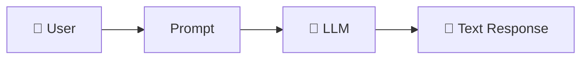

An **agent** is a **decision-making loop** — it can stop, think, use a tool, ask a friend (another agent), check a rule, and only then respond:

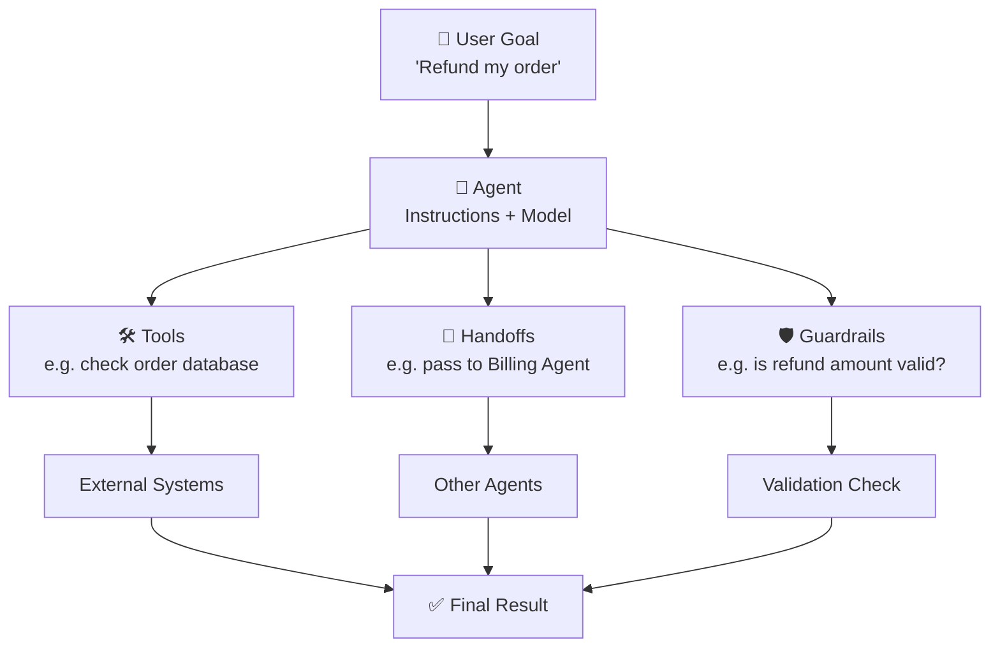

> **The key idea:** the AI model is no longer *just* generating text. It's now the "brain" inside a bigger software system that decides *when* to act and *how* the work should flow — just like a smart employee deciding when to escalate a customer complaint.

---

## 2. Who Created It & Why

### 🟢 In Simple Words
**OpenAI** built it, and released it for free, because developers kept building the *same boring plumbing* (tool-calling, memory, safety checks) over and over again for every single agent project. OpenAI decided to build that plumbing once, properly, so everyone could reuse it.

| | |
|---|---|
| **Creator / Organization** | OpenAI |
| **Project Name** | OpenAI Agents SDK |
| **Public Launch Date** | March 11, 2025 |
| **Earlier Version** | OpenAI Swarm (an experimental, "just for learning" project) |
| **Launched Together With** | The Responses API + built-in agent tools |

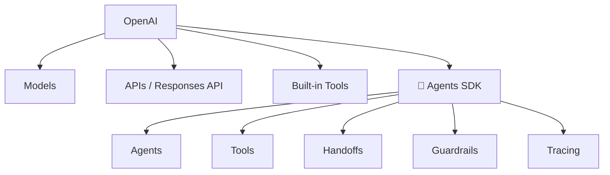

**Why did they build it?** Because developers trying to build real, production agents were stuck: too much manual prompt-tweaking, too much custom orchestration code, and almost no visibility into *what the agent was actually doing* when something went wrong.

---

## 3. History: How We Got Here

### 🟢 In Simple Words
AI agents didn't appear overnight — they evolved in stages, like a video game character leveling up.

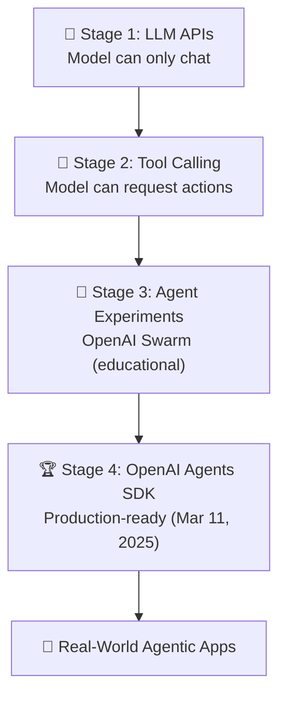

| Stage | What Changed |
|---|---|
| **1. LLM APIs** | You send a prompt, get back text. Nothing else. Everything else was custom-built. |
| **2. Tool Calling** | Models learned to say "I need to call this function" — connecting them to real software. |
| **3. Swarm (experimental)** | OpenAI's first attempt at lightweight multi-agent patterns: agents, handoffs, functions. Meant for learning, not production. |
| **4. Agents SDK (production)** | The mature version of Swarm — adds **guardrails** (safety checks) and **tracing** (debugging visibility) on top. |

> This is a simplified conceptual timeline — not every project in history literally passed through all four stages.

---

## 4. The Problem It Solves

### 🟢 In Simple Words
Without a framework, building an agent means building **10 different systems yourself** before you even get to the interesting part (making the agent smart). The SDK gives you those 10 systems pre-built.

**Without the SDK — everything is your responsibility:**

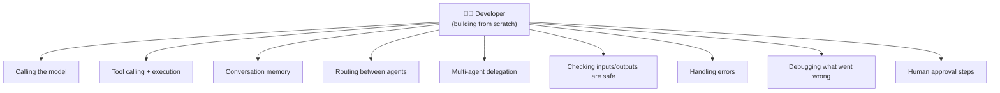

**With the SDK — it's already built, you just configure it:**

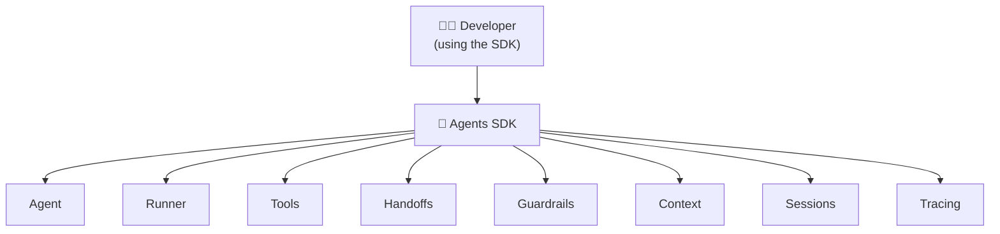

**Bottom line:** less time reinventing plumbing, more time making your agent actually good at its job.

---

## 5. Where It Sits in the AI Stack

### 🟢 In Simple Words
The SDK is **not** the AI itself. It's the "management layer" that sits *above* the AI model and *organizes* how it's used — like a project manager coordinating a talented but unsupervised employee.

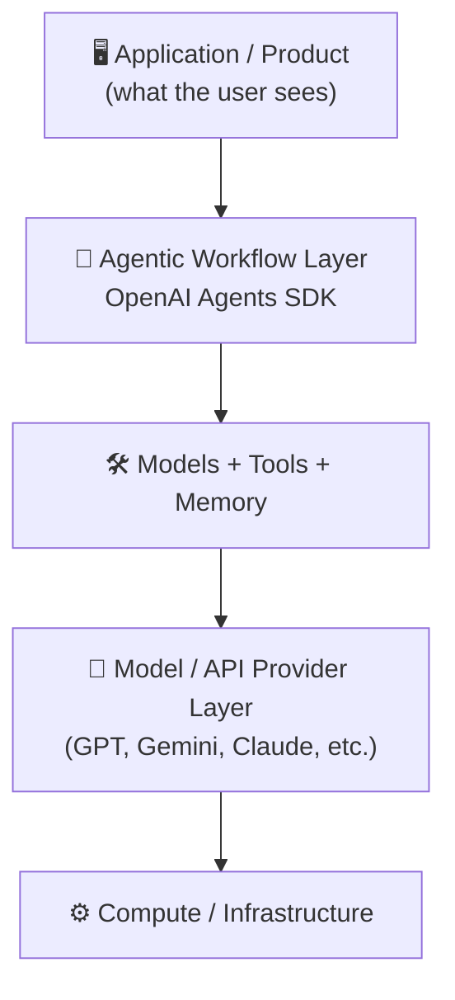

---

## 6. Core Concepts (Explained Simply)

### 🗺️ The Big Picture First

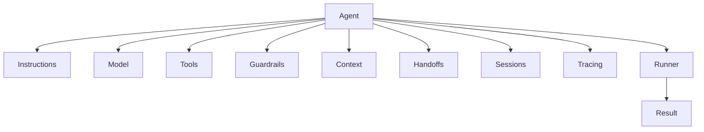

Now let's go through each piece — one at a time, in plain English first.

---

### 🧩 Agent
> 🟢 **Simple:** An Agent is "a configured AI employee" — a model + a job description + permissions.

**Analogy:** Same AI model (say GPT), but two different agents: one configured as a "friendly support rep," another as a "strict fraud reviewer." Same brain, different job.

**Formula:** `Agent = Model + Instructions + Tools + Rules + Behavior`

---

### ▶️ Runner
> 🟢 **Simple:** The Runner is the "engine" that actually drives the agent — it takes your input, runs the agent, and keeps going (calling tools, doing handoffs) until there's a final answer.

**Analogy:** If the Agent is the employee, the Runner is the **office** — it's what actually puts the employee to work, hands them tasks, and keeps the workday running until the task is done.

> `Agent` = the *job description*. `Runner` = the *workday that actually happens*.

---

### 📝 Instructions
> 🟢 **Simple:** Plain-language rules that tell the agent how to behave — its "personality + job rules."

```text
You are a Python tutor.
Explain programming concepts clearly.
Use simple examples.
Do not assume the student already understands advanced terminology.
```

> ⚠️ **Common beginner mix-up:** Instructions ≠ Tools. Instructions shape *how* the agent behaves. Tools give it *the actual ability to act*. A very polite agent with no tools still can't check a database — it can only talk politely about not being able to.

---

### 🛠️ Tools
> 🟢 **Simple:** Tools are how an agent moves from "just talking" to "actually doing." A calculator, a search engine, a database, a custom Python function — anything real it's allowed to use.

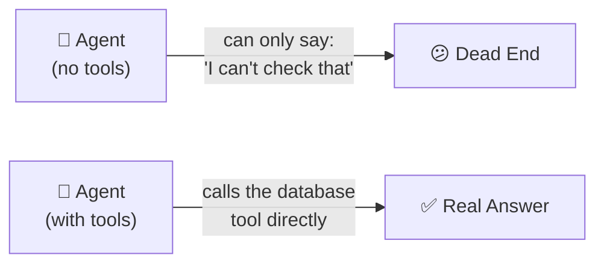

---

### ⚙️ Function Tools
> 🟢 **Simple:** A Function Tool is just your own normal Python function, wrapped up so the agent is *allowed to call it*.

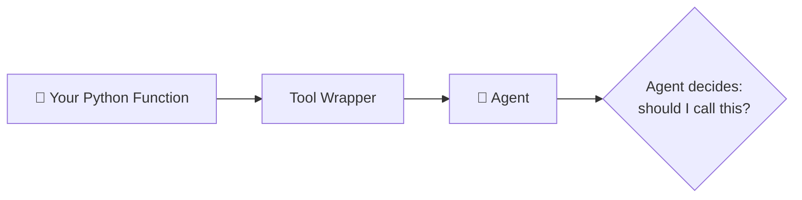

> ⚠️ **Important clarification for beginners:** the AI model does **not** magically run code on its own computer. It just *requests* a function call. **Your application** is the one that actually executes the function and sends the result back. Think of the model as saying "please press this button for me" — it can't press the button itself.

---

### 🔀 Handoffs
> 🟢 **Simple:** One agent says "this isn't my job" and **fully passes** the task to a more specialized agent — like a call-center rep transferring your call to a specialist.

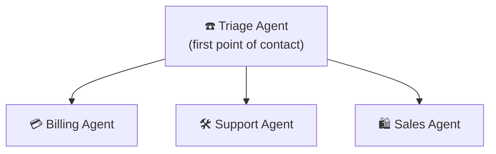

**Example flow:**
`User: "I was charged twice"` → Triage Agent hears "charged" → hands off completely to → Billing Agent → investigates → replies.

---

### 🧰 Agents as Tools
> 🟢 **Simple:** Instead of *fully transferring* the task (like a Handoff), the main agent stays in charge and just **asks another agent for help**, like a manager asking a specialist for a quick opinion, then continuing the meeting themselves.

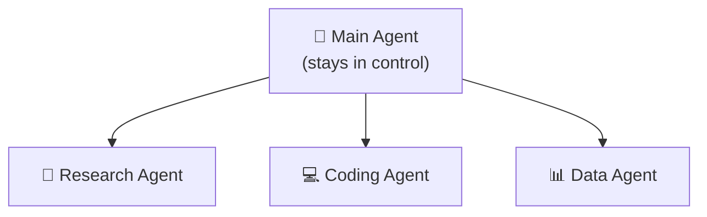

| | Handoff | Agent as Tool |
|---|---|---|
| Who's in charge after? | The *new* agent | The *original* agent |
| Analogy | Transferring a phone call | Asking a colleague a quick question |

---

### 🛡️ Guardrails
> 🟢 **Simple:** Safety checks that run *before* the agent acts and *after* it responds — like a spell-checker plus a security guard combined.

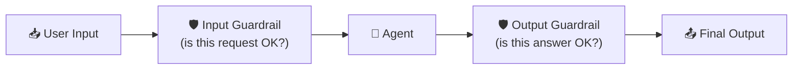

> ⚠️ Guardrails are **one safety layer**, not a magic shield. A well-designed agent uses guardrails *together with* human review, good instructions, and limited tool permissions.

---

### 🌐 Context
> 🟢 **Simple:** Extra background information the agent (or your app) has access to during a run — like a customer's account details sitting on the desk while the agent works.

| Type | What It Means |
|---|---|
| **Model Context** | Information actually *shown to the AI model* |
| **Application Context** | Data your app/tools can see — but is **not automatically** shown to the model |

> ⚠️ Just because data is "in context" for your app doesn't mean the AI model sees it. You choose what actually gets sent to the model.

---

### 💾 Sessions & Conversation History
> 🟢 **Simple:** Sessions are the agent's "short-term memory" for a conversation — it remembers what you said 3 messages ago.

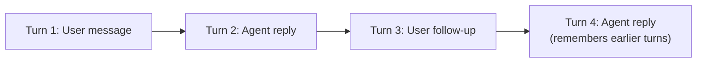

> This is just **stored conversation data** — not a claim that the AI has real, human-like memory or consciousness.

---

### 🔍 Tracing & Observability
> 🟢 **Simple:** A step-by-step recording of everything the agent did — like a flight recorder ("black box") for your AI system.

**Without tracing, you only see:**
```
Final Answer ✅ (but no idea how it got there)
```

**With tracing, you see the whole journey:**

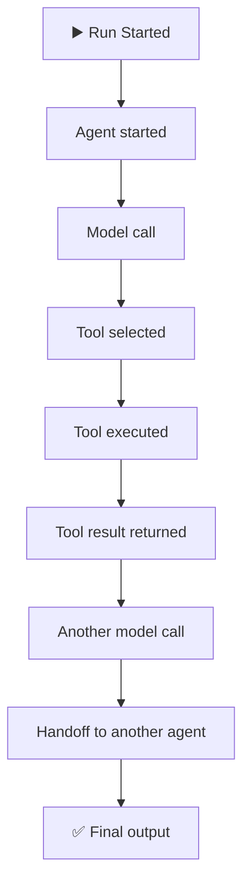

> This matters a lot because agents usually fail **in the middle** of a task, not at the very end — tracing is how you find *where* it went wrong.

---

### 🧑‍⚖️ Human in the Loop (HITL)
> 🟢 **Simple:** For risky actions, the agent **pauses and asks a human** before doing anything — like an intern who must get manager sign-off before issuing a refund.

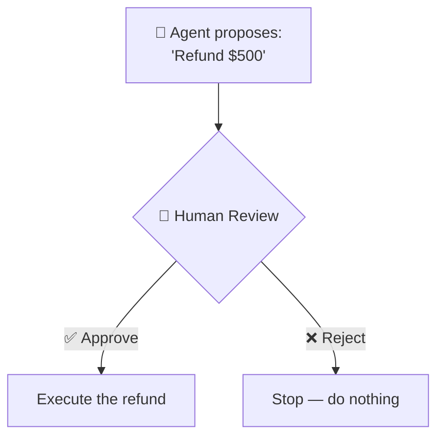

---

### 📦 Structured Outputs
> 🟢 **Simple:** Instead of a messy paragraph, the agent returns **clean, predictable data** your code can actually use.

```json
{
  "customer": "Ali",
  "priority": "high",
  "category": "billing"
}
```

**Why it matters:** if your app expects `"priority": "high"` and instead gets a paragraph of text, your code breaks. Structured output guarantees the shape stays consistent.

---

### 🔌 Models & Providers
> 🟢 **Simple:** The SDK is not "married" to one AI model. You can swap the model powering your agent without rebuilding your whole app.

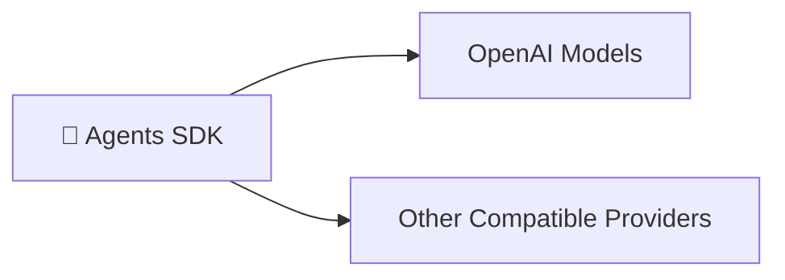

---

### 🔗 MCP & External Tools
> 🟢 **Simple:** MCP (**Model Context Protocol**) is like a **universal power socket** — instead of building a custom wire for every tool, tools that "speak MCP" plug into any agent that also "speaks MCP."

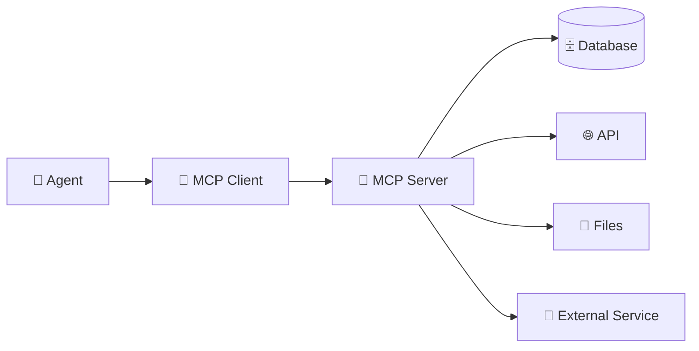

> `Agents SDK` = the framework that builds the agent. `MCP` = the plug standard that connects the agent to outside tools. They **work together**, not against each other.

---

## 7. The Agent Lifecycle

### 🟢 In Simple Words
This is "what actually happens, step by step" from the moment a user makes a request to the moment they get an answer.

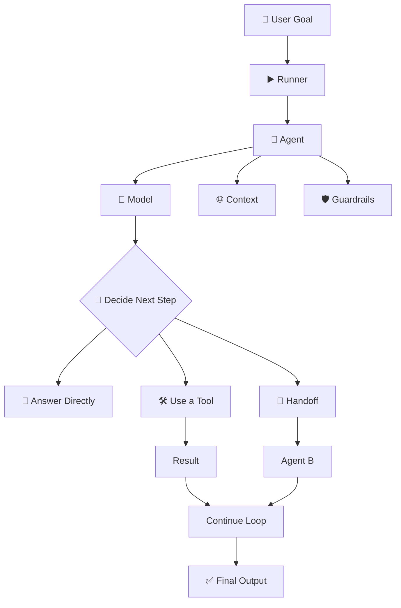

---

## 8. Single-Agent vs. Multi-Agent Design

### 🟢 In Simple Words
Sometimes one smart employee is enough. Sometimes you need a whole team. More agents = more capability, but also more cost, more delay, and more places things can break.

### Single Agent — "One employee, many tools"
```mermaid
flowchart LR
    U["👤 User"] --> A["🤖 Agent"]
    A --> T1["🛠️ Tool A"]
    A --> T2["🛠️ Tool B"]
    A --> T3["🛠️ Tool C"]
    A --> R["✅ Result"]
```
Good for most well-defined tasks. **Start here by default.**

### Multi-Agent — "A team with a manager"
```mermaid
flowchart TD
    U["👤 User"] --> O["👔 Orchestrator"]
    O --> R1["🔬 Research Agent"]
    O --> C1["💻 Coding Agent"]
    O --> Rv["🔍 Review Agent"]
    R1 --> Res["✅ Result"]
    C1 --> Res
    Rv --> Res
```

⚠️ **Golden rule:** More agents is not automatically better. Each new agent adds delay, cost (more model calls), and more places where things can go wrong. Only split into multiple agents when specialization genuinely earns its cost — e.g., a legal-review agent that needs very different instructions than a customer-chat agent.

### The Agentic Loop — "How an agent actually thinks"
```mermaid
flowchart TD
    G["🎯 Goal"] --> U1["🧠 Understand"] --> P["📝 Plan"] --> CA["✅ Choose Action"] --> UT["🛠️ Use Tool / Delegate"] --> OR["👀 Observe Result"] --> EV{"🤔 Evaluate:<br/>Is this done?"}
    EV -->|Not yet| CA
    EV -->|Yes| FR["🏁 Final Result"]
```

---

## 9. Benefits

| # | Benefit | In Plain Words |
|---|---|---|
| 1 | 🧱 **Less custom orchestration** | You're not rebuilding the same plumbing every project |
| 2 | 🎯 **Simple core abstractions** | Small number of concepts — easy to actually learn |
| 3 | 🛠️ **Real tool use** | Agents can genuinely *do* things, not just describe them |
| 4 | 🤝 **Multi-agent support** | Built-in patterns for teamwork between agents |
| 5 | 🛡️ **Built-in guardrails** | Safety isn't bolted on afterward — it's part of the design |
| 6 | 🔍 **Observability** | You can actually see what your agent is doing |
| 7 | 🧑‍⚖️ **Human oversight** | Risky actions can require sign-off |
| 8 | 🌍 **Open source** | Free, inspectable, and extendable by anyone |
| 9 | 🔌 **Provider flexibility** | Not locked into one AI company |

---

## 10. Limitations & Disadvantages

> 🟢 **In Simple Words:** The SDK makes building agents *easier* — it doesn't make the underlying AI *perfect*. All the usual AI weaknesses still apply.

| # | Limitation | In Plain Words |
|---|---|---|
| 1 | 🧠 **Model dependency** | A weak model = a weak agent, no matter how good the framework is |
| 2 | 🎭 **Hallucination risk** | The agent can confidently act on a wrong assumption |
| 3 | 🎯 **Tool misuse** | It might pick the wrong tool or use it incorrectly |
| 4 | 💰 **Cost** | Every extra step = another paid model call |
| 5 | 🐢 **Latency** | Tools, retries, and handoffs all add waiting time |
| 6 | 🐞 **Harder to debug** | AI behavior isn't 100% predictable like normal code |
| 7 | 🔓 **Security exposure** | Giving an agent tool access means giving it real-world power — that's risky if misused |
| 8 | 🧩 **Context complexity** | Long conversations need careful memory management |
| 9 | ❓ **Sometimes unnecessary** | A simple script often beats a fancy "autonomous agent" |

> **Rule of thumb:** Don't build an agent just because it's trendy. Build one when the task genuinely needs adaptive, tool-using, multi-step decision-making.

---

## 11. When to Use It (and When Not To)

```mermaid
flowchart TD
    Q{"🤔 Is the task simple<br/>and predictable, or<br/>complex and adaptive?"}
    Q -->|"Simple / always<br/>the same steps"| S["✅ Just write a normal function<br/>(no agent needed)"]
    Q -->|"Complex / needs<br/>judgment & flexibility"| A["✅ Use the Agentic Architecture<br/>(OpenAI Agents SDK)"]
```

| ✅ Good Fits | 🚫 Poor Fits |
|---|---|
| Customer support with varied queries | A task that's always the exact same steps |
| Research assistants | You only need one single LLM call |
| Coding agents | The workflow never changes |
| Multi-step business automation | No external tools are needed at all |
| Anything needing tracing/guardrails/structured output | Orchestration overhead outweighs the benefit |

---

## 12. The Other Frameworks — Explained Simply

> 🟢 **Quick mental model before we start:** think of these six frameworks as six different **toolkits for building a "team of AI workers."** They all solve a similar problem but were built by different companies, with different philosophies, for different comfort levels.

| Framework | Built By | One-Line Simple Explanation |
|---|---|---|
| **OpenAI Agents SDK** | OpenAI | The "starter kit" — simple, clean, gets you moving fast |
| **Google ADK** | Google | The "enterprise kit" — built for serious deployment, especially on Google Cloud |
| **AutoGen** | Microsoft Research | The "research kit" — pioneered multi-agent chat, now in maintenance mode |
| **CrewAI** | CrewAI | The "team-roleplay kit" — agents act like a team with job titles |
| **LangChain** | LangChain | The "mega toolbox" — huge library of integrations, not agent-only |
| **LangGraph** | LangChain | The "engineer's kit" — full manual control over every step |

---

### 12.1 🔵 Google ADK

> 🟢 **Simple:** If OpenAI's SDK is a starter kit, Google ADK is the **professional construction kit** — more structure, strong evaluation tools, and deep integration with Google Cloud.

**Definition:** An open-source, **code-first** framework for building, evaluating, and deploying agents and multi-agent systems. Announced **April 9, 2025** at Google Cloud Next. Optimized for Gemini and Vertex AI, but designed to stay model-agnostic.

```mermaid
flowchart TD
    Dev["👨‍💻 Developer"] --> ADK["🔵 Google ADK"]
    ADK --> Agents
    ADK --> Tools
    ADK --> Workflows
    ADK --> MultiAgent["Multi-Agent"]
    ADK --> Eval["📊 Evaluation"]
    ADK --> Deploy["🚀 Deployment"]
```

**Best for:** Teams already using Google Cloud / Gemini / Vertex AI who want strong built-in evaluation and a clear deployment path.

---

### 12.2 🟣 AutoGen

> 🟢 **Simple:** AutoGen was one of the **first popular frameworks where multiple AI agents literally "chat" with each other** to solve a task. It's now in maintenance mode — think of it as a respected pioneer that's since retired.

**Definition:** Microsoft's open-source multi-agent framework, released **September 2023**. Known for conversational multi-agent patterns and research into agent-to-agent and agent-to-human collaboration.

⚠️ **Current status:** repository is now **community-maintained**. Microsoft points new projects toward its newer **Agent Framework**.

**Best for:** Existing AutoGen projects, or academic/research settings exploring multi-agent conversation patterns.

---

### 12.3 🟢 CrewAI

> 🟢 **Simple:** CrewAI makes AI agents behave like **a real office team** — a Researcher, a Writer, a Reviewer — each with a defined role, working together on one goal.

**Definition:** A framework built around **"crews"** of specialized, role-based agents collaborating on shared tasks.

```mermaid
flowchart TD
    Crew["👥 Crew"] --> Researcher["🔬 Researcher"]
    Crew --> Writer["✍️ Writer"]
    Crew --> Reviewer["🔍 Reviewer"]
    Researcher --> Output["📄 Output"]
    Writer --> Output
    Reviewer --> Output
```

**Core building blocks:** Agents, Tasks, Crews, Processes, Flows, Memory, Knowledge, Guardrails, HITL.

**Best for:** Business-style workflows that map naturally to "job roles" — content pipelines, research-to-report generation, structured team simulations.

---

### 12.4 🟡 LangChain

> 🟢 **Simple:** LangChain is less "an agent framework" and more "a giant Lego set" for anything LLM-related — prompts, memory, retrieval, integrations, and yes, agents too.

**Definition:** A broad framework/ecosystem (started **October 2022**) for building LLM-powered applications — models, prompts, tools, retrieval, agents, and a massive integration catalog.

```mermaid
flowchart TD
    LC["🟡 LangChain"] --> Models
    LC --> Prompts
    LC --> Tools2["Tools"]
    LC --> Retrieval
    LC --> AgentsLC["Agents"]
    LC --> Integrations["🔌 Huge Integration Library"]
```

**Best for:** Apps that need deep integration coverage (vector databases, document loaders, retrievers) more than they need pure agent orchestration.

---

### 12.5 🔴 LangGraph

> 🟢 **Simple:** LangGraph is for when you want **total control** — you draw the exact flowchart of what your agent can do, step by step, like wiring an electrical circuit by hand.

**Definition:** A **low-level orchestration runtime** for building long-running, stateful agent applications using explicit state and graph-based control flow. Works independently of LangChain.

```mermaid
flowchart TD
    S["▶️ START"] --> Ag["🤖 Agent"]
    Ag --> TA["🛠️ Tool A"]
    Ag --> TB["🛠️ Tool B"]
    TA --> Ev{"Evaluate"}
    TB --> Ev
    Ev -->|Continue| Ag
    Ev -->|Done| E["🏁 END"]
```

**Best for:** Complex, long-running, stateful workflows needing precise control over every single transition — durable execution, deep human-in-the-loop, exact graph modeling.

---

## 13. The Big Comparison (One Glance = Full Understanding)

### 🟢 Step 1 — The "Which One Fits My Personality?" Table

| If you want... | Pick this |
|---|---|
| 🚀 The fastest way to get started, simple and clean | **OpenAI Agents SDK** |
| 🏢 Enterprise-grade deployment on Google Cloud | **Google ADK** |
| 👥 Agents that feel like a role-based office team | **CrewAI** |
| 🔬 Academic/research multi-agent chat experiments | **AutoGen** (maintenance mode) |
| 🧰 A massive toolbox of integrations, not just agents | **LangChain** |
| 🎛️ Full manual control over every step of a complex flow | **LangGraph** |

### 🟢 Step 2 — The Master Comparison Table

| Framework | Built By | Difficulty | Best Metaphor | Multi-Agent | Deep State Control | Best For |
|---|---|:---:|---|:---:|:---:|---|
| **OpenAI Agents SDK** | OpenAI | 🟢 Easy | The starter kit | ✅ | 🟡 Moderate | Clean, fast, simple agent orchestration |
| **Google ADK** | Google | 🟡 Medium | The enterprise kit | ✅ | ✅ | Google Cloud deployment + evaluation |
| **AutoGen** | Microsoft | 🟡 Medium | The pioneer (retired) | ✅ | ✅ | Legacy/research multi-agent chat |
| **CrewAI** | CrewAI | 🟢 Easy | The office team | ✅ | 🟡 Moderate | Role-based business workflows |
| **LangChain** | LangChain | 🟡 Medium | The mega toolbox | ✅ (via ecosystem) | 🟡 Moderate | Huge integration coverage |
| **LangGraph** | LangChain | 🔴 Hard | The engineer's kit | ✅ | ✅✅ Full control | Complex, long-running stateful flows |

> Legend: 🟢 Beginner-friendly · 🟡 Some learning curve · 🔴 Steeper learning curve

### 🟢 Step 3 — Four Key Match-Ups (Side by Side)

**OpenAI Agents SDK vs. Google ADK**
| | OpenAI Agents SDK | Google ADK |
|---|---|---|
| Feels like | A clean starter kit | A professional deployment platform |
| Best ecosystem fit | OpenAI | Google Cloud / Gemini |
| Evaluation tools | Basic, via ecosystem | Strong, built-in |
| **Pick this if...** | You want to move fast and stay simple | You're already deep in Google Cloud |

**OpenAI Agents SDK vs. CrewAI**
| | OpenAI Agents SDK | CrewAI |
|---|---|---|
| Feels like | Flexible building blocks | A pre-defined office team |
| Handoff style | Explicit, code-level | Role/task-driven collaboration |
| **Pick this if...** | You want custom control | Your task naturally maps to "job roles" |

**OpenAI Agents SDK vs. LangChain**
| | OpenAI Agents SDK | LangChain |
|---|---|---|
| Scope | Narrow — just agent orchestration | Broad — the whole LLM-app ecosystem |
| **Pick this if...** | You only need to build agents | You also need heavy retrieval/integrations |

**OpenAI Agents SDK vs. LangGraph** *(the most important comparison)*
| | OpenAI Agents SDK | LangGraph |
|---|---|---|
| Feels like | "Here are simple building blocks" | "Here is full manual control of the state machine" |
| Learning curve | 🟢 Easier | 🔴 Steeper |
| Control level | High | Very high |
| **Pick this if...** | You want to ship something *quickly* | You need to control *every single detail* of a complex flow |

---

## 14. Which Framework Should You Learn?

```mermaid
flowchart TD
    Start{"🤔 What matters<br/>most to you?"}
    Start -->|"Simplicity, fast start"| SDK["✅ OpenAI Agents SDK"]
    Start -->|"Google Cloud / Gemini"| ADK["✅ Google ADK"]
    Start -->|"Role-based team simulation"| Crew["✅ CrewAI"]
    Start -->|"Legacy research code"| AG["✅ AutoGen"]
    Start -->|"Huge integration coverage"| LC["✅ LangChain"]
    Start -->|"Total control, complex flows"| LG["✅ LangGraph"]
```

> **There is no single "best" framework** — only the one that best matches your project's complexity, your team's comfort level, and your deployment target.

---

## 15. Recommended Learning Path

```mermaid
flowchart TD
    P["🐍 Python"] --> AP["Async Python"]
    AP --> API["REST APIs"]
    API --> LLM["LLM Fundamentals"]
    LLM --> OA["OpenAI API / Responses concepts"]
    OA --> TC["Tool Calling"]
    TC --> SDK["🧰 OpenAI Agents SDK"]
    SDK --> AR["Agent + Runner"]
    AR --> FT["Function Tools"]
    FT --> HO["Handoffs"]
    HO --> AT["Agents as Tools"]
    AT --> CS["Context + Sessions"]
    CS --> GR["Guardrails"]
    GR --> TR["Tracing"]
    TR --> MCP["MCP"]
    MCP --> MA["Multi-Agent Systems"]
    MA --> Prod["🚀 Production Agentic AI"]
```

| Level | What to Learn |
|---|---|
| 🟢 **Beginner** | Agent · Instructions · Models · Runner · Basic tool calling · Function tools · Environment variables · Basic outputs |
| 🟡 **Intermediate** | Handoffs · Agents as tools · Context · Structured outputs · Guardrails · Sessions · Error handling · Tracing |
| 🔴 **Advanced** | Multi-agent architectures · Human-in-the-loop · MCP · Complex tool ecosystems · Stateful workflows · Evaluation · Observability · Security · Deployment |

---

## 16. Key Takeaways

```mermaid
flowchart BT
    L["🧠 LLMs"] --> TC["🛠️ Tool Calling"] --> AG["🤖 Agents"] --> MA["👥 Multi-Agent Systems"] --> AAI["🚀 Agentic AI"]
```

1. 🧠 An LLM generates text; an **agentic application** wraps that model with real capabilities and decision-making logic.
2. 🛠️ **Tools** are what let an agent actually *do things*, not just describe them.
3. 🤝 **Handoffs** and **agent-as-tool** patterns are the building blocks of true multi-agent teamwork.
4. 🛡️ **Guardrails, human approval, and observability** aren't optional extras — they're what makes an agent trustworthy in production.
5. 📚 **Frameworks come and go; concepts stay.** Learn agents, tools, state, delegation, and validation — the APIs will keep changing around them.

### 🏁 Final Word

The OpenAI Agents SDK is **not** an LLM, not a replacement for Python, not a database, not RAG, and not MCP. It's an **orchestration framework** — a way to combine models, instructions, tools, handoffs, guardrails, context, sessions, and observability into one working agentic application.

```text
Agent + Instructions + Model + Tools + Handoffs + Guardrails + Context + Runner + Observability
= 🚀 A Real Agentic Application
```

---

## 17. Further Reading

**OpenAI Agents SDK**
- [Official Documentation](https://openai.github.io/openai-agents-python/)
- [Quickstart Guide](https://openai.github.io/openai-agents-python/quickstart/)
- [GitHub Repository](https://github.com/openai/openai-agents-python)
- [Original Announcement (Mar 11, 2025)](https://openai.com/index/new-tools-for-building-agents/)

**Google ADK**
- [Documentation](https://google.github.io/adk-docs/)
- [Announcement](https://developers.googleblog.com/en/agent-development-kit-easy-to-build-multi-agent-applications/)

**AutoGen**
- [Documentation](https://microsoft.github.io/autogen/)
- [GitHub Repository](https://github.com/microsoft/autogen)

**CrewAI**
- [Documentation](https://docs.crewai.com/)
- [GitHub Repository](https://github.com/crewAIInc/crewAI)

**LangChain**
- [Documentation](https://python.langchain.com/)

**LangGraph**
- [Documentation](https://langchain-ai.github.io/langgraph/)

---

> 📌 **Learning Principle:** Learn the concepts first, then the SDK APIs. Framework APIs change; the underlying ideas of models, tools, state, orchestration, delegation, validation, and observability are far more durable.
