# 🤖 OpenAI Agents SDK — The Complete Guide

### A deep, practical introduction to building agentic AI systems — with a full comparison to Google ADK, AutoGen, CrewAI, LangChain, and LangGraph


> **Learn the architecture, not just the API.** Frameworks change fast — the underlying ideas of agents, tools, state, delegation, and observability don't. This guide is built to teach you both.

---

## 📚 Table of Contents

- [1. What Is the OpenAI Agents SDK?](#1-what-is-the-openai-agents-sdk)
- [2. Who Created It & Why](#2-who-created-it--why)
- [3. History: How We Got Here](#3-history-how-we-got-here)
- [4. The Problem It Solves](#4-the-problem-it-solves)
- [5. Where It Sits in the AI Stack](#5-where-it-sits-in-the-ai-stack)
- [6. Core Concepts](#6-core-concepts)
- [7. The Agent Lifecycle](#7-the-agent-lifecycle)
- [8. Single-Agent vs. Multi-Agent Design](#8-single-agent-vs-multi-agent-design)
- [9. Benefits](#9-benefits)
- [10. Limitations & Disadvantages](#10-limitations--disadvantages)
- [11. When to Use It (and When Not To)](#11-when-to-use-it-and-when-not-to)
- [12. The Other Frameworks](#12-the-other-frameworks)
  - [12.1 Google ADK](#121-google-adk)
  - [12.2 AutoGen](#122-autogen)
  - [12.3 CrewAI](#123-crewai)
  - [12.4 LangChain](#124-langchain)
  - [12.5 LangGraph](#125-langgraph)
- [13. Head-to-Head Comparison](#13-head-to-head-comparison)
- [14. Which Framework Should You Learn?](#14-which-framework-should-you-learn)
- [15. Recommended Learning Path](#15-recommended-learning-path)
- [16. Key Takeaways](#16-key-takeaways)
- [17. Further Reading](#17-further-reading)

---

## 1. What Is the OpenAI Agents SDK?

The **OpenAI Agents SDK** is an open-source Python framework for building **agentic AI applications** and **multi-agent workflows**.

Rather than giving developers dozens of abstractions, it exposes a small, composable set of primitives that let an AI model:

| Capability | Description |
|---|---|
| 🧭 Follow instructions | Behave according to a defined role and goal |
| 🛠️ Use tools | Call functions, APIs, and external systems |
| 📦 Produce structured results | Return typed, predictable outputs |
| 🤝 Delegate work | Hand off tasks to other specialized agents |
| 🛡️ Validate input/output | Enforce guardrails and safety checks |
| 💬 Maintain state | Track conversation history across turns |
| 🔍 Be observed | Emit traces for debugging and monitoring |
| 🧑‍⚖️ Loop in humans | Pause for approval on sensitive actions |

OpenAI positions it as a **lightweight, production-oriented framework** — the deliberate successor to its earlier experimental project, **Swarm**. It's built around the OpenAI Responses API but is designed to be **model-agnostic**, supporting other providers as well.

### 🧠 The Core Shift

A traditional LLM app is a straight line:

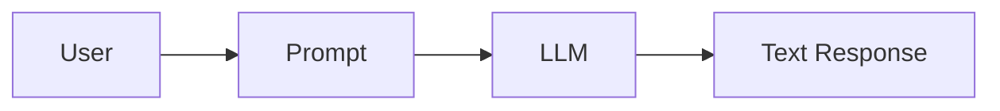

An **agentic** application looks more like a system with branching decisions:

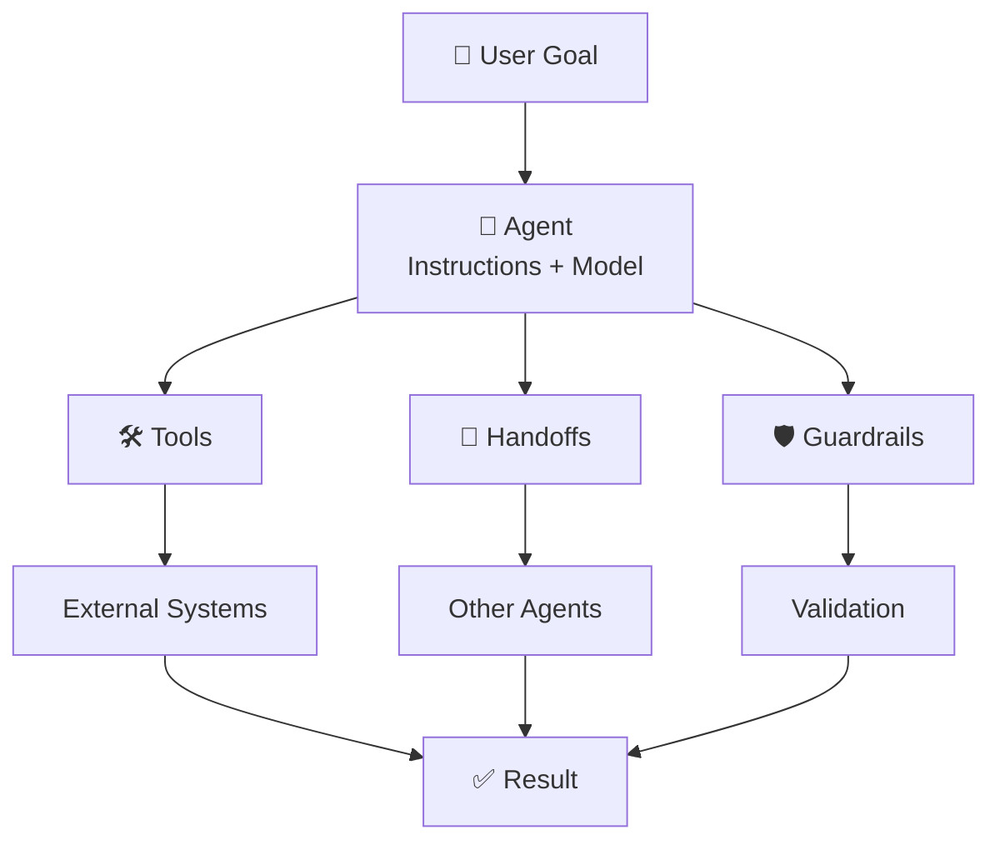

**The key idea:** the model stops being just a text generator. It becomes one component in a software system that decides *when* to act and *how* work should flow.

---

## 2. Who Created It & Why

| | |
|---|---|
| **Creator / Organization** | OpenAI |
| **Project** | OpenAI Agents SDK |
| **Public Launch** | March 11, 2025 |
| **Predecessor** | OpenAI Swarm (experimental) |
| **Companion Release** | Responses API + built-in agent tools |

It's not the work of a single individual — it's an OpenAI engineering/research product released as part of a broader agent platform, alongside the **Responses API**.

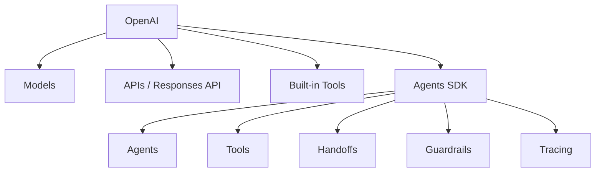

**Why build it?** OpenAI found that developers building production agents were stuck reinventing the same infrastructure — heavy prompt iteration, custom orchestration, and little built-in visibility into what an agent was actually doing at runtime.

---

## 3. History: How We Got Here

The SDK is the product of a multi-year evolution in how developers build with LLMs:

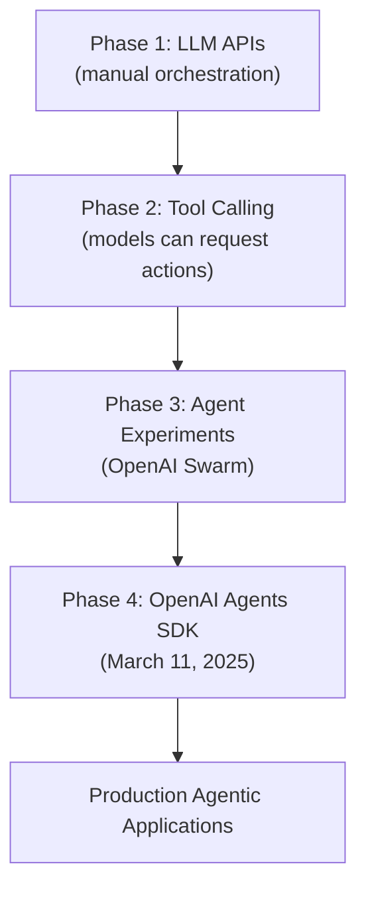

- **Phase 1 — LLM APIs:** Applications called a model and got back text. All orchestration was custom-built.
- **Phase 2 — Tool Calling:** Models gained the ability to request structured function calls, connecting them to real systems.
- **Phase 3 — Swarm:** OpenAI released *Swarm*, an experimental, educational framework exploring lightweight multi-agent patterns — agents, handoffs, and functions.
- **Phase 4 — Agents SDK:** Announced March 11, 2025, as the **production-oriented evolution** of Swarm, explicitly adding **guardrails** and **tracing/observability** on top of agents and handoffs.

> This is a conceptual timeline, not a claim that every AI project historically passed through each stage.

---

## 4. The Problem It Solves

Building an agent *from scratch* means implementing, yourself:

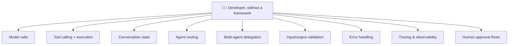

The Agents SDK packages these recurring patterns into reusable, composable primitives:

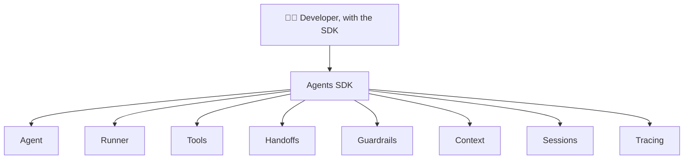

Net effect: **less boilerplate infrastructure, more time spent on actual agent behavior and business logic.**

---

## 5. Where It Sits in the AI Stack

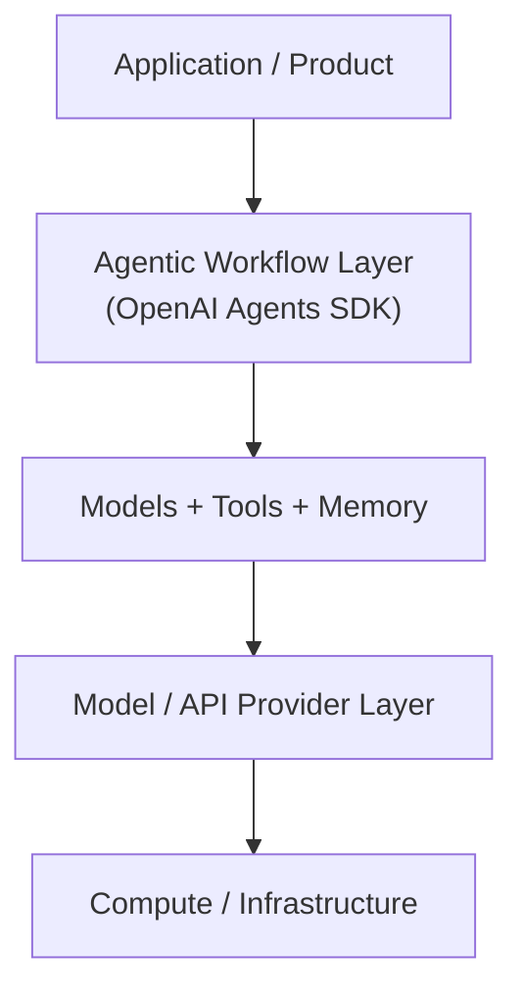

The SDK **is not a model.** It's an orchestration and application layer that sits *around* models and tools — coordinating how they're used, in what order, and with what safeguards.

---

## 6. Core Concepts

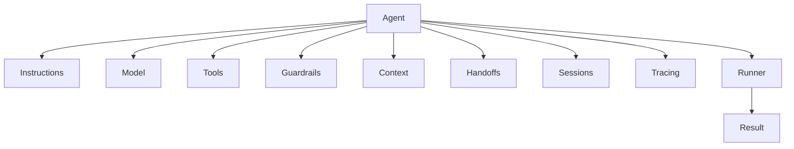

### 🧩 Agent
The central primitive: an **LLM configured with instructions, a model, and optional capabilities** (tools, guardrails, handoffs).

> **Mental model:** `Agent = Model + Instructions + Capabilities + Behavior`

### ▶️ Runner
The **runtime** that actually executes an agent workflow — sending input to the model, handling tool calls and handoffs, and looping until a final result is produced.

> `Agent` = what the system is configured to do. `Runner` = what actually executes it.

### 📝 Instructions
Plain-language rules that shape agent behavior:

```text
You are a Python tutor.
Explain programming concepts clearly.
Use simple examples.
Do not assume the student already understands advanced terminology.
```

> `Instructions` → how the agent should behave. `Tools` → what the agent can actually do. These are not interchangeable.

### 🛠️ Tools
Give an agent access to **external capabilities** — a calculator, database, search engine, API, file system, or custom function. Without tools, an agent can only generate text; with tools, it can *act*.

### ⚙️ Function Tools
Expose a normal Python function to an agent as a callable tool:

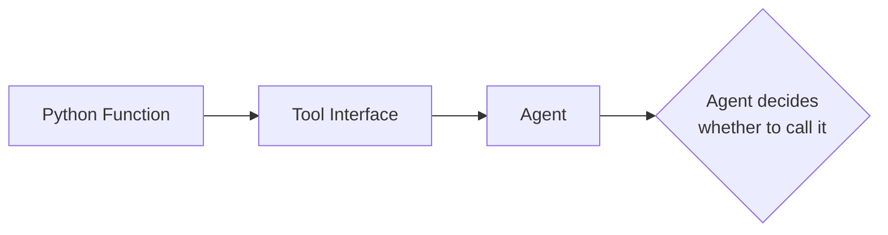

> **Important:** the model doesn't execute arbitrary code itself. Your application receives the model's *tool request*, runs the permitted function, and returns the result into the workflow.

### 🔀 Handoffs
Let one agent **transfer full control** of a task to another, more specialized agent:

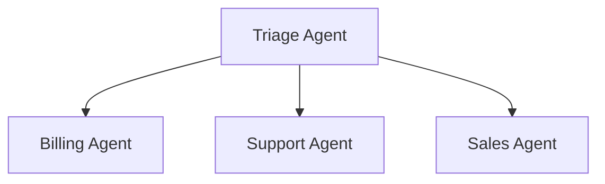

*Example:* "I was charged twice" → Triage Agent → Billing Agent → investigates → responds.

### 🧰 Agents as Tools
A different pattern: one agent calls *another agent* as a tool, while staying in control of the overall task.

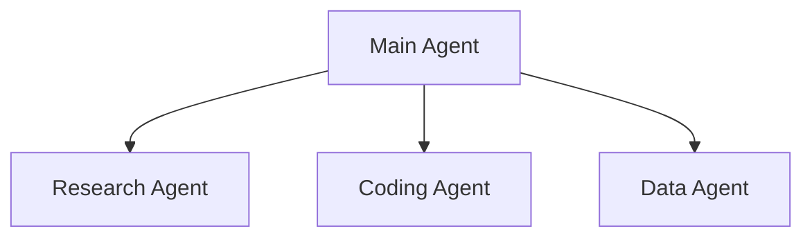

| Pattern | Main Idea |
|---|---|
| **Handoff** | Transfer control entirely |
| **Agent as Tool** | Delegate a subtask; main agent stays in charge |

### 🛡️ Guardrails
Validation and safety mechanisms that check **inputs, outputs, or behavior**:

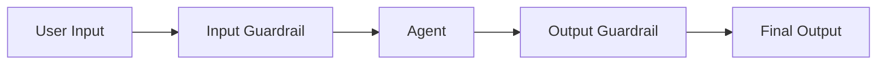

Guardrails don't make an agent inherently safe on their own — they're **one layer** in a larger safety architecture (validating input, blocking unsafe requests, enforcing business rules, rejecting malformed output).

### 🌐 Context
Information available to the agent *during execution* — user data, app state, database clients, config, dependencies.

| Type | Meaning |
|---|---|
| **Model Context** | Information actually sent to the LLM |
| **Application Context** | Runtime data available to your app/tools, not automatically sent to the model |

> Don't assume every piece of application context reaches the model — that mapping is explicit, not automatic.

### 💾 Sessions & Conversation History
Sessions let an application track multi-turn conversation state across a run — this is **state management**, not a claim that the LLM has persistent, human-like memory.

### 🔍 Tracing & Observability
Records what actually happened during a run so developers can debug it — not just the final answer, but every intermediate step:

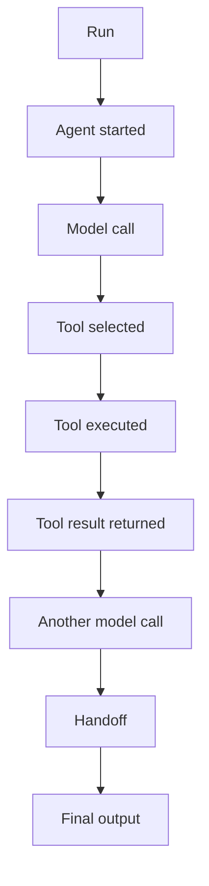

This matters because agent systems frequently fail in the *middle* of a workflow, not just at the final step.

### 🧑‍⚖️ Human in the Loop (HITL)
A human can inspect, approve, reject, or modify an agent's proposed action before execution — critical for high-impact or irreversible operations (refunds, deletions, financial transactions).

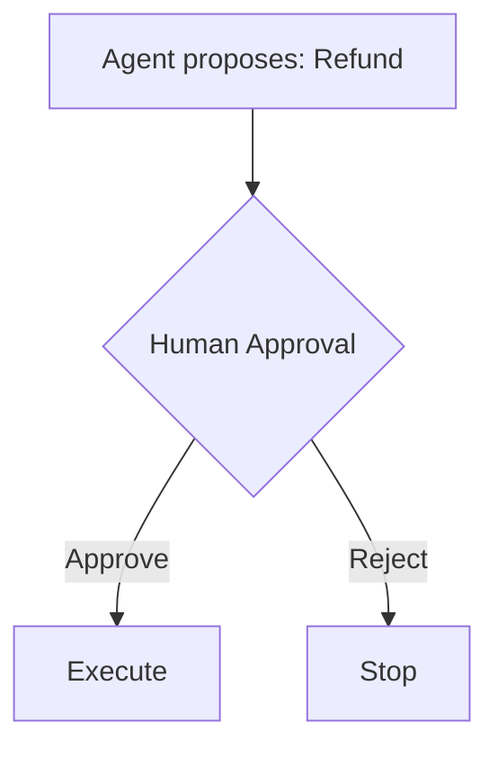

### 📦 Structured Outputs
Instead of free-form text, an agent can return typed, predictable data:

```json
{
  "customer": "Ali",
  "priority": "high",
  "category": "billing"
}
```

Essential when the agent's output feeds directly into other software.

### 🔌 Models & Providers
The SDK is provider-agnostic by design — it separates *agent architecture* from the *specific model* powering it, supporting OpenAI models as well as other compatible providers.

### 🔗 MCP & External Tools
The **Model Context Protocol (MCP)** is a separate, open standard for connecting AI systems to external tools and data sources.

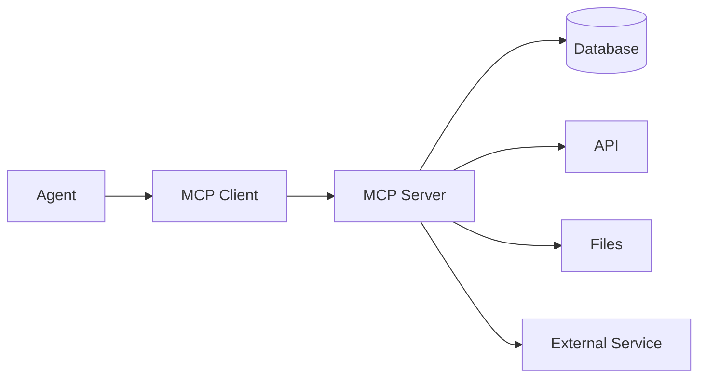

> `Agents SDK` = orchestration framework. `MCP` = protocol for connecting to tools/context. They're complementary, not competing.

---

## 7. The Agent Lifecycle


---

## 8. Single-Agent vs. Multi-Agent Design

### Single Agent
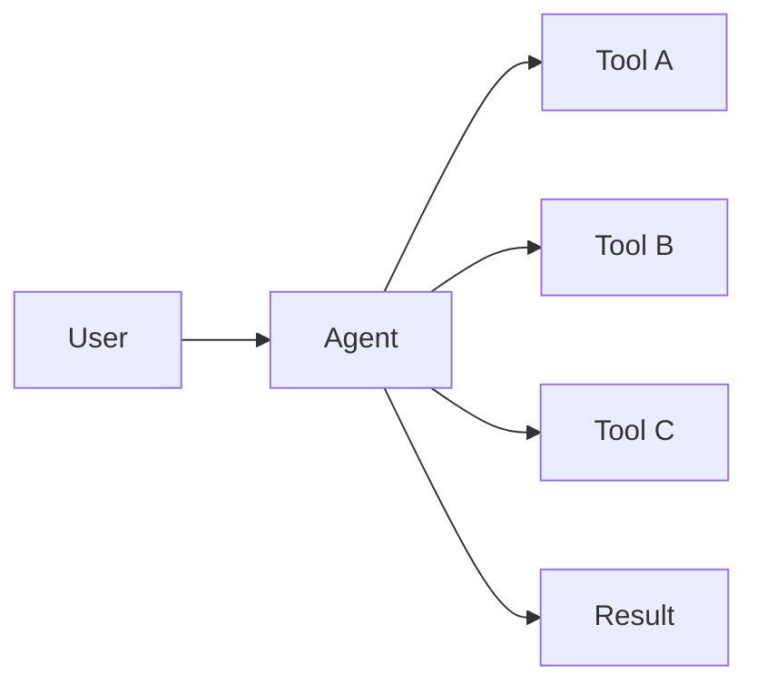
Sufficient for most well-scoped tasks.

### Multi-Agent
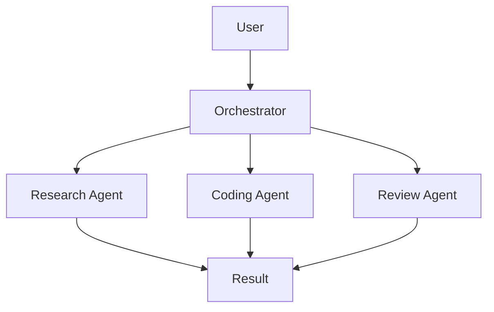

⚠️ **More agents ≠ automatically better.** Each additional agent adds latency, token cost, complexity, and new failure points. Reach for multi-agent design only when specialization or task decomposition genuinely earns its cost.

### The Agentic Loop
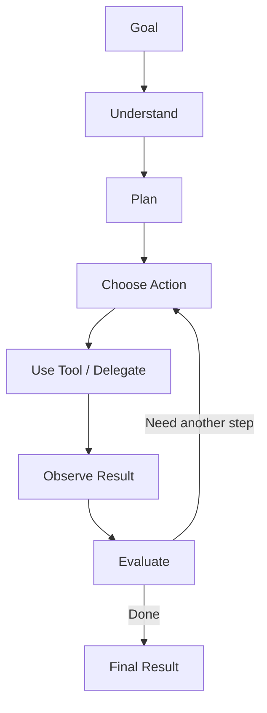

---

## 9. Benefits

| # | Benefit | Why It Matters |
|---|---|---|
| 1 | **Less custom orchestration** | Reusable primitives replace bespoke infrastructure |
| 2 | **Simple core abstractions** | Small, learnable surface area |
| 3 | **Real tool use** | Agents connect to genuine external capabilities |
| 4 | **Multi-agent support** | Handoffs and agent-as-tool patterns enable specialization |
| 5 | **Built-in guardrails** | Validation is a first-class concept, not an afterthought |
| 6 | **Observability** | Tracing exposes what happens inside a run |
| 7 | **Human oversight** | HITL supported for sensitive actions |
| 8 | **Open source** | Fully inspectable and extensible |
| 9 | **Provider flexibility** | Not locked to a single model provider |

---

## 10. Limitations & Disadvantages

No framework escapes the underlying limits of LLM-based systems:

| # | Limitation | Detail |
|---|---|---|
| 1 | **Model dependency** | Agent quality is capped by the underlying model's capability |
| 2 | **Hallucination risk** | Agents can act on incorrect assumptions |
| 3 | **Tool misuse** | Wrong tool choice or malformed arguments |
| 4 | **Cost** | Multi-step workflows multiply model calls |
| 5 | **Latency** | Tool calls, retries, and handoffs add delay |
| 6 | **Debugging difficulty** | Probabilistic behavior is harder to debug than deterministic code |
| 7 | **Security exposure** | Tools grant real-world capability to an imperfect decision-maker |
| 8 | **Context complexity** | Long workflows demand careful state/context management |
| 9 | **Not always necessary** | A deterministic function often beats an "autonomous" agent |

> **Rule of thumb:** Don't use an agent just because you can. Use one when adaptive decision-making adds *real* value.

---

## 11. When to Use It (and When Not To)

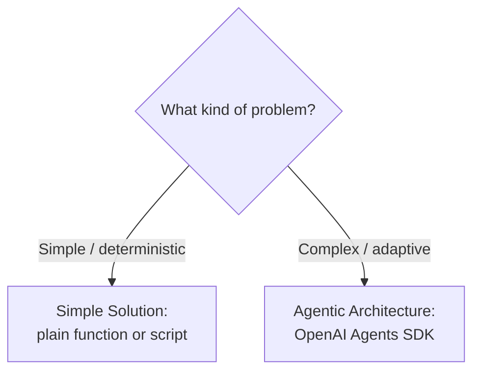

**✅ Good fits:** customer support agents, research assistants, coding agents, tool-using assistants, multi-agent pipelines, business process automation, data-analysis agents, personal assistants, anything needing structured outputs, tracing, or guardrails.

**🚫 Poor fits:** the task is a single deterministic function; the workflow never changes; you only need one LLM call; tools aren't required; the orchestration overhead outweighs the benefit.

---

## 12. The Other Frameworks

| Framework | Organization | Main Focus |
|---|---|---|
| **OpenAI Agents SDK** | OpenAI | Lightweight agent & multi-agent orchestration |
| **Google ADK** | Google | Code-first agent & multi-agent development |
| **AutoGen** | Microsoft Research | Multi-agent applications & research (now in maintenance mode) |
| **CrewAI** | CrewAI | Role-based collaborative agents & workflows |
| **LangChain** | LangChain | LLM application building blocks & integrations |
| **LangGraph** | LangChain | Low-level, stateful agent orchestration |

### 12.1 Google ADK

**Google Agent Development Kit** is an open-source, code-first framework for building, evaluating, and deploying agents and multi-agent systems. Announced **April 9, 2025** at Google Cloud Next, it's optimized for Gemini and Vertex AI while being designed to remain model-agnostic.

```mermaid
flowchart TD
    Dev[Developer] --> ADK[Google ADK]
    ADK --> Agents
    ADK --> Tools
    ADK --> Workflows
    ADK --> MultiAgent[Multi-Agent]
    ADK --> Eval[Evaluation]
    ADK --> Deploy[Deployment]
```

**Best fit:** teams wanting strong code-first control, especially inside the Google/Gemini/Vertex AI ecosystem, with built-in evaluation tooling.

### 12.2 AutoGen

Microsoft's open-source framework for AI agents and multi-agent applications, released publicly in **September 2023**. It pioneered conversational multi-agent patterns and research into agent-to-agent and agent-to-human collaboration.

⚠️ **Current status:** the AutoGen repository is now in **maintenance mode**, community-managed. Microsoft has named its **Agent Framework** as the successor for new projects.

**Historically strong at:** multi-agent conversation, collaborative agents, HITL workflows, research-grade experimentation.

**Best fit today:** existing AutoGen codebases, or research contexts — new Microsoft-oriented builds should evaluate Microsoft Agent Framework first.

### 12.3 CrewAI

A framework built around **teams ("crews") of specialized agents** collaborating on shared goals.

```mermaid
flowchart TD
    Crew --> Researcher
    Crew --> Writer
    Crew --> Reviewer
    Researcher --> Output
    Writer --> Output
    Reviewer --> Output
```

**Core concepts:** Agents, Tasks, Crews, Processes, Flows, Memory, Knowledge, Guardrails, HITL.

**Best fit:** role-based, business-process-style automation — content pipelines, research-to-report workflows, structured team simulations.

### 12.4 LangChain

A broad framework/ecosystem (started **October 2022**) for building LLM-powered applications: models, prompts, tools, retrieval, agents, middleware, and a large integration catalog.

```mermaid
flowchart TD
    LC[LangChain] --> Models
    LC --> Prompts
    LC --> Tools2[Tools]
    LC --> Retrieval
    LC --> AgentsLC[Agents]
    LC --> Integrations
```

**Best fit:** applications that need deep integration coverage (vector stores, retrievers, document loaders) more than they need agent orchestration specifically — LangChain is broader than an "agent framework."

### 12.5 LangGraph

A **low-level orchestration runtime** for building long-running, stateful agent applications, centered on explicit state and graph-based control flow. Can be used independently of LangChain.

```mermaid
flowchart TD
    S[START] --> Ag[Agent]
    Ag --> TA[Tool A]
    Ag --> TB[Tool B]
    TA --> Ev[Evaluate]
    TB --> Ev
    Ev -->|Continue| Ag
    Ev -->|Done| E[END]
```

**Best fit:** complex, long-running, stateful workflows requiring fine-grained control over every transition — durable execution, deep HITL, and precise graph modeling.

---

## 13. Head-to-Head Comparison

### Overview Matrix

| Framework | Main Purpose | Abstraction Style | Multi-Agent | Stateful Workflows | Provider Flexibility | Known Best For |
|---|---|---|---|---|---|---|
| **OpenAI Agents SDK** | Agent orchestration | Lightweight | ✅ | ✅ (via sessions) | ✅ | Simple primitives, tools, handoffs, tracing |
| **Google ADK** | Agent development & deployment | Code-first | ✅ | ✅ | ✅ | Google/Gemini ecosystem + deployment |
| **AutoGen** | Multi-agent applications | Conversational / modular | ✅ | ✅ | ✅ | Multi-agent research (now maintenance mode) |
| **CrewAI** | Collaborative agents | Higher-level | ✅ | ✅ | ✅ | Crews, roles, tasks, flows |
| **LangChain** | LLM applications | Component ecosystem | ✅ (via ecosystem) | ✅ | ✅ | Integrations & app-building blocks |
| **LangGraph** | Agent orchestration | Low-level | ✅ | ✅ (core focus) | ✅ | Stateful graphs, fine-grained control |

> These are architectural tendencies, not fixed capability ceilings — every framework evolves quickly. Always check current docs before committing.

### 🆚 OpenAI Agents SDK vs. Google ADK

| | OpenAI Agents SDK | Google ADK |
|---|---|---|
| Philosophy | Lightweight primitives | Code-first toolkit |
| Ecosystem | OpenAI | Google Cloud / Gemini |
| Evaluation | Supported via ecosystem | Built into the ADK workflow |
| Deployment | Flexible | Strong Google Cloud path |
| **Best for** | Lightweight agent orchestration | Controlled, end-to-end agent development |

### 🆚 OpenAI Agents SDK vs. CrewAI

| | OpenAI Agents SDK | CrewAI |
|---|---|---|
| Core philosophy | Lightweight primitives | Collaborative agent teams |
| Agent roles | Flexible | Strong role/task concept |
| Handoffs | Strong native concept | Expressed via collaboration/workflows |
| **Best for** | Custom agent systems | Role-based business automation |

### 🆚 OpenAI Agents SDK vs. LangChain

LangChain and the Agents SDK aren't the same *kind* of tool:

```mermaid
flowchart LR
    subgraph LangChain
    L1[Models] 
    L2[Prompts]
    L3[Tools]
    L4[Retrieval]
    L5[Agents]
    L6[Integrations]
    end
    subgraph OpenAI Agents SDK
    O1[Agents]
    O2[Tools]
    O3[Handoffs]
    O4[Guardrails]
    O5[Sessions]
    O6[Tracing]
    end
```

**LangChain** is a broad LLM-application ecosystem. **The Agents SDK** is narrowly focused on agent orchestration with a small set of dedicated primitives.

### 🆚 OpenAI Agents SDK vs. LangGraph

The most instructive comparison in the whole landscape:

| | OpenAI Agents SDK | LangGraph |
|---|---|---|
| Abstraction | Lightweight agent primitives | Low-level graph/runtime |
| Learning curve | Generally simpler | Generally more architectural |
| Control | High | Very high |
| Stateful workflows | Supported | Core, central focus |
| Human-in-the-loop | Supported | Core capability |
| **Best for** | Straightforward agent orchestration | Complex, stateful workflows |

> **Mental model:** OpenAI Agents SDK says *"Here are simple building blocks for agents."* LangGraph says *"Here is low-level control over your agent's entire state machine."*

---

## 14. Which Framework Should You Learn?

```mermaid
flowchart TD
    Start{What's your priority?}
    Start -->|Simplicity + fast start| SDK[OpenAI Agents SDK]
    Start -->|Google Cloud / Gemini ecosystem| ADK[Google ADK]
    Start -->|Role-based team simulation| Crew[CrewAI]
    Start -->|Maintaining legacy multi-agent research code| AG[AutoGen]
    Start -->|Broad integrations / RAG-heavy apps| LC[LangChain]
    Start -->|Full control over complex stateful graphs| LG[LangGraph]
```

There is **no universal "best" framework.** The right choice depends on project complexity, model provider, required control, state-management needs, multi-agent requirements, deployment target, team expertise, and observability/ecosystem requirements.

---

## 15. Recommended Learning Path

```mermaid
flowchart TD
    P[Python] --> AP[Async Python]
    AP --> API[REST APIs]
    API --> LLM[LLM Fundamentals]
    LLM --> OA[OpenAI API / Responses concepts]
    OA --> TC[Tool Calling]
    TC --> SDK[OpenAI Agents SDK]
    SDK --> AR[Agent + Runner]
    AR --> FT[Function Tools]
    FT --> HO[Handoffs]
    HO --> AT[Agents as Tools]
    AT --> CS[Context + Sessions]
    CS --> GR[Guardrails]
    GR --> TR[Tracing]
    TR --> MCP[MCP]
    MCP --> MA[Multi-Agent Systems]
    MA --> Prod[Production Agentic AI]
```

### By Skill Level

**🟢 Beginner:** Agent · Instructions · Models · Runner · Basic tool calling · Function tools · Environment variables · Basic outputs

**🟡 Intermediate:** Handoffs · Agents as tools · Context · Structured outputs · Guardrails · Sessions · Error handling · Tracing

**🔴 Advanced:** Multi-agent architectures · Human-in-the-loop · MCP · Complex tool ecosystems · Stateful workflows · Evaluation · Observability · Security · Deployment · Provider configuration

---

## 16. Key Takeaways

```mermaid
flowchart BT
    L[LLMs] --> TC[Tool Calling] --> AG[Agents] --> MA[Multi-Agent Systems] --> AAI[Agentic AI]
```

1. An LLM generates model outputs; an **agentic application** surrounds the model with software capabilities and control logic.
2. **Tools** give agents the ability to interact with real, external systems.
3. **Handoffs** and **agent-as-tool** patterns are what make multi-agent architectures possible.
4. **Guardrails, human approval, and observability** are non-negotiable for production reliability — not optional extras.
5. **Frameworks are tools, not the architecture itself.** Learn the underlying agent concepts first; APIs will keep changing.

### 🏁 Final Word

The OpenAI Agents SDK is **not** an LLM, a Python replacement, a database, RAG, or MCP. It's an **agent orchestration framework** — a way to combine models, instructions, tools, handoffs, guardrails, context, sessions, and observability into one coherent agentic application.

```text
Agent + Instructions + Model + Tools + Handoffs + Guardrails + Context + Runner + Observability = Agentic Application
```

---

## 17. Further Reading

**OpenAI Agents SDK**
- [Official Documentation](https://openai.github.io/openai-agents-python/)
- [Quickstart Guide](https://openai.github.io/openai-agents-python/quickstart/)
- [GitHub Repository](https://github.com/openai/openai-agents-python)
- [Original Announcement (Mar 11, 2025)](https://openai.com/index/new-tools-for-building-agents/)

**Google ADK**
- [Documentation](https://google.github.io/adk-docs/)
- [Announcement](https://developers.googleblog.com/en/agent-development-kit-easy-to-build-multi-agent-applications/)

**AutoGen**
- [Documentation](https://microsoft.github.io/autogen/)
- [GitHub Repository](https://github.com/microsoft/autogen)

**CrewAI**
- [Documentation](https://docs.crewai.com/)
- [GitHub Repository](https://github.com/crewAIInc/crewAI)

**LangChain**
- [Documentation](https://python.langchain.com/)

**LangGraph**
- [Documentation](https://langchain-ai.github.io/langgraph/)

---

> 📌 **Learning Principle:** Learn the concepts first, then the SDK APIs. Framework APIs change; the underlying ideas of models, tools, state, orchestration, delegation, validation, and observability are far more durable.
